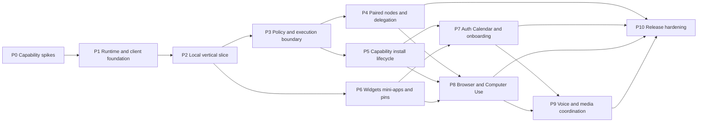

# Implementation Plan v2 — Desktop + Headless Runtime Foundation

**Ngày:** 16/09/2026 · **Release mục tiêu:** v0.2 foundation beta.
**Đây là kế hoạch**, chưa có app, provider smoke, signing, VPS deployment hoặc benchmark nào được xác nhận trong bộ tài liệu.

## 1. Nguyên tắc triển khai

Đọc [scope-lock.md](scope-lock.md) trước. Không áp dụng các cấm đoán v1 như không VPS, không custom widgets hoặc không auto-install. Giữ những invariants về authority, permissions, secrets, task/session và effect reconciliation.

Ưu tiên vertical slices chạy thật. Spike những rủi ro đắt tiền ngay đầu: Pi lifecycle, cross-node delivery, custom UI isolation, OAuth deployment, browser/macOS driver permissions và voice. Không dựng tất cả màn hình trước rồi ghép daemon sau.

Không fork Pi, không viết lại browser/OS engine, không phát minh crypto/NAT, không microservice hóa từng module. Đặt contracts có schema, fake adapters/test fixtures và live-provider gates tách nhau. Không tự động gọi SaaS thật trong mọi PR.

## 2. Milestones và dependencies

P4/P5/P6 có thể song song sau shared contracts. Một schema owner/review path cho interface chung; không để nhiều coding agents thay contracts bất tương thích. Security/recovery tests bắt đầu từ P1, không dồn hết P10.

| Phase | Demo cần có trước khi qua gate |
|---|---|
| P0 | Lifecycle + node retry + iframe action + auth + automation + voice spikes có evidence |
| P1 | Runtime boot trên Mac/Linux, desktop/web attach, state survive restart |
| P2 | Text → Pi task → evidence → result surface → action round-trip |
| P3 | Approval/resource isolation/unknown effects đúng, không giả sandbox |
| P4 | Desktop/home + hai VPS làm bounded subtasks, disconnect/retry không chạy trùng |
| P5 | Tự tìm gói thiếu → consent → install/test → activate → resume task đúng một lần |
| P6 | Agent-defined actions, custom note app, pin/restore, no duplicate media |
| P7 | Guided/quick-play + Google Calendar thật + auth failure recovery |
| P8 | Browser task + macOS native task + Linux virtual desktop có takeover/stop |
| P9 | Live voice trong khi task/mini-app đang chạy, interruption đúng semantics |
| P10 | Signed desktop, clean VPS setup, backup/upgrade/failure/security report |

## 3. P0 — Compatibility and risk spikes

Deliverables: `docs/research/compatibility-lock.md`, dependency/license inventory, tested versions/platforms/providers, redacted event fixtures, gate log và short ADRs. Versions **pin theo môi trường thực**, không dùng tên model/API method từ trí nhớ.

### P0.1 Pi, packs và Chord

Test SDK custom ResourceLoader, app-owned sessions, custom tool registration, active tools, subscribe/abort/steer, command-context resource reload, rebind and successor session. Test failed extension initialization, shutdown/dispose, no duplicate listeners, default discovery disabled.

Thử Chord facets phía sau `FacetHost` để xác nhận bundle/replace/dispose; ghi decision adopt/reject based actual complexity/compatibility. Chord không là bắt buộc; app contracts giữ nguyên. Native code isolation phải test riêng, không lấy `node:vm` làm proof.

### P0.2 Platform, packaging và transport

Electron+helper trên Mac, Node native SQLite/runtime trên Linux x64 và arm64 nếu platform claim có arm64. Nonroot OCI và optional native bundle. Two runtimes send duplicate commands over TLS, kill before/after ack. Test socket/web auth boundaries. Không cần complete product UI.

### P0.3 Widget/mini-app/pin

Một catalog chart/form và một isolated note widget; MCP App fixture nhận props/call host tool; attempted host storage/secret read fail. Pin/move preserving state; same player fixture not start twice. Camera/mic permissions feature-detect trên browser/Electron, no pretend fallback.

### P0.4 Auth

Google OAuth desktop system browser flow và server registered HTTPS callback path, real app identity/account được cho phép. Denied/partial/expired handling. Xác minh credential custody, supported registration scopes và redirect constraints. Nếu thiếu client credentials/verification, mark blocked; do not fake connected.

### P0.5 Browser/computer

Playwright DOM/screenshot on macOS/Linux; install binary on-demand test; Peekaboo candidate native driver via signed/packaged launch context; Linux virtual display. Deny OS permissions, revoked permission, emergency stop, target change. Không thay native desktop proof bằng browser screenshot.

### P0.6 Voice

GPT-Live real account với backend fake long task; actual events, barge-in, correction, mute/end, reconnect. Giữ permanent key ngoài renderer, test voice does not restart when worker replaced. Live access unavailable là blocker/ADR change, không âm thầm đổi thành STT+TTS rồi giữ tên live conversation.

**P0 gate:** each required risk has pass/blocked/fail + reproducible evidence. Stop production commitment to exact dependency until its spike passes; scope change phải ADR, không quietly remove requirement.

## 4. P1 — Portable runtime/client foundation

| WP | Implementation | Acceptance |
|---|---|---|
| P1.1 | Monorepo/contracts, typed command/event envelopes | Runtime validation, version rejection, fixture schemas |
| P1.2 | SQLite repos/migrations/outbox/inbox/blob refs | Commit-before-ack, duplicate command outcome, consistent backup fixture |
| P1.3 | Headless runtime/node identity | Boots no Electron/display/global Pi; auth required |
| P1.4 | React conversation client + Electron main/preload | Same components web/desktop, no generic privileged bridge |
| P1.5 | Local socket + HTTPS/WSS adapters | Origin/CSRF/auth safeguards, reconnect snapshot/cursor |
| P1.6 | Server distro skeleton | Core OCI nonroot + native service packaging tests, private binding |

Gate: text command durable, renderer/client restart recovers, node DB has one writer, no public unauth listener. CI cannot leak real secrets in build output.

## 5. P2 — End-to-end local product slice

Conductor with bounded tools; app-owned Pi worker session; task/run IDs/revisions; project metadata registry; simple read-only file question then controlled fixture code task; result with artifact/evidence; one button agent defines to inspect artifact or ask a follow-up.

User can ask “đến đâu rồi?” without new worker. Success only after verifier. Evidence unavailable means unknown/failed/not-verified, not polished success card. Timeline virtualization/streaming, accessibility and latency instrumentation start here.

Gate: fake-provider E2E + real certified text-provider smoke. Restart Pi/renderer preserves authoritative task; no context leak from arbitrary project-local extension discovery.

## 6. P3 — Policy and execution boundary

| WP | Implementation | Acceptance |
|---|---|---|
| P3.1 | Identity/resource grants and host approval surface | Model cannot approve; payload/version/account/node bound |
| P3.2 | Vault + secure input channel | Long-lived credentials absent from model/transcript/ordinary renderer |
| P3.3 | Files/worktrees/resource leases | Dirty baseline preserved, common Git lock, canonical path/symlink checks |
| P3.4 | Execution supervisor | Container/service profiles, minimal env, no Docker socket in untrusted tool |
| P3.5 | Effects/reconciliation | Timeout after external effect → unknown, never blind retry |
| P3.6 | Cancellation | Stop local executor, confirm child/tool outcome, no fake rollback |

Gate: adversarial manifest/instructions/widget payload cannot broaden rights. Explicit trusted-host native extension route remains labeled risk; isolation claims match tested boundary.

## 7. P4 — Node pairing and collaboration

Pair invite/identity verification, scoped grants, revoke/rotation. Capability advertisements authenticated and versioned. Home/child-task ownership, inbox/outbox dedup, source event sequences, status/input/approval round trips. Blob transfer with digest/scope/quotas; node-qualified workspace IDs.

Golden demo: desktop web/Electron client attaches home VPS A; A delegates build to B, asks read-only action on paired desktop. Each node uses own resources/credentials. Close desktop UI; jobs continue. Drop connection after external fixture effect; no duplicate rerun. Distinguish private-network adapter reachability from app pairing.

Gate: local + two genuinely independent Linux runtimes/VPS, at least one realistic TLS/private-network deployment; no auth bypass just because IP is private. No automatic failover of unknown write task. One conversation home authority always.

## 8. P5 — Chat-driven install and lifecycle

### Work packages

- Capability registry/lazy schema discovery with separate installed/auth/health states.
- Candidate research adapters: trusted first, public docs/registry source attribution; deterministic compatibility and policy checks.
- InstallPlan immutable digest/source/version/dependency/node/grants/estimated resources.
- Quarantine download, staged build/test isolation, failure/cancellation and trust-mode selection.
- FacetHost generations: UI-only refresh, tool service restart, Pi resource refresh/new worker only when needed.
- Continuations/multi-task dependency fan-in, no duplicate plan/install/resume.
- Disable/uninstall/revoke semantics, historical widget fallback and state migration.

Golden demo: user task needs missing fixture pack → source-backed proposal → user accepts → staged install → tests → active capabilities → same task proceeds once. Repeat with load failure → old generation remains; voice/UI remain available.

Gate: package URL/digest changed invalidates approval; install scripts cannot run in credential-rich host; raw package readme cannot self-authorize. No treating downloaded as ready.

## 9. P6 — Rich widgets, custom apps, agent actions and pins

Implement definition registry, instance/snapshot/pin storage, built-in catalog wrappers from widgets spec, action proposal compiler, server authoritative bindings, workflow bounds, semantic view for agent/voice.

Two render paths: trusted catalog and isolated mini-app/MCP Apps adapter. User can generate composition; advanced custom note package generated in isolated workspace, preview/test/approve then install. Code never evaluated in privileged chat origin.

Pin shelf is optional and compact. One active media owner per instance, snapshot fallback in timeline, no autoplay/camera on restore. Per-widget drafts/conflicts/version migrations, visible refresh policy, accessibility, quotas, independent error boundaries.

Gate: all catalog **families** have a functional fixture, rich note/editor real state, representative media/call SDK contract fixture clearly synthetic, actual MCP App action round-trip. UI contract supports vendor examples without claiming real accounts installed. Destructive/cross-node actions reauthorize current binding.

## 10. P7 — Integrations, Google Calendar, onboarding

Auth supervisor native/server/OAuth/MCP/API-key flow; secure host fields; namespace/endpoint/audience validation; scope and actual account probes; reauth/revoke. First-party Calendar adapter with read agenda, selected calendars, event preview/create/edit, concurrency and unknown-effects handling; read refresh before optional push.

Onboarding deterministic checkpoints and two paths: quick sample play with visible demo label; goal-based 1–3 suggestions and just-in-time provider/permissions. Share install/auth state machines, not separate onboarding-only implementation.

Golden demo J2 uses real Google account with authorized test calendar; no writes in unrelated personal calendars. J1 needs no provider key for sample only. User rejects a scope/install, resumes later and still sees consistent state.

Gate: app/client identity real, consumer route and self-host route explicitly documented; API disabled/Workspace admin denied handled honestly. Private Calendar needs OAuth, not bare API key. Auth screens open supported browser, not forced iframe.

## 11. P8 — Browser and Computer Use

Browser pack Playwright primitives, managed profile, DOM-first and screenshot fallback, artifact inspection, approved downloads, takeover and stop. MCP alternative compatibility proof. Pi remains planner, no hidden nested uncontrolled agent.

macOS pack native driver with stable target/observation contract, Accessibility/capture setup in OS, foreground-input lease, local stop and revocation. Linux pack optional virtual desktop image + preview/takeover + isolation. Explicit target-node choice, no cross-platform app assumptions.

Gate: all three functional examples (browser, Mac native, Linux desktop) run on actual target environments. Prompt-injection/submit-timeout/stale-target tests; no auto completing consent/2FA/CAPTCHA. Screenshots retention/security tested, user can disable capture independently of executing ordinary API/code tasks.

## 12. P9 — Voice & media coordination

Finish GPT-Live adapter, transcript/delegation correlation, source roles, correction vs barge-in vs cancel, partial-playout awareness, session reconnect/context hydrate and text fallback.

Semantic actions focus a pinned widget or selected event identically to click. Music/video call/assistant microphone ownership modeled; no call audio copied to model without explicit feature and consent. Short-lived SDK token exception goes through isolated auth bridge, never props/history.

Gate: real audio setups, VN/English code-switch, interruption while remote build running, widget mutation approval remains enforced, Pi reload does not disconnect voice, mute/end visibly and actually stop capture/playback as intended.

## 13. P10 — Production-shaped beta hardening

Failure injection across GUI/main/runtime/worker/peer/tool/iframe and all critical ack boundaries. SQLite backup/restore, quota exhaustion, expired credentials, package rollback/state schema mismatch, network partition, device sleep and SDK outages.

Mac signing/notarization/clean install + runtime bundled, Linux OCI/native service install/upgrade/uninstall. Exact release artifacts/checksums and supported OS/architecture matrix. Artifact names/URLs become real only at release; no fake one-command installer link in docs.

Security suite: auth origin/sender, SSRF/redirect, tokens audience, package supply chain, native code isolation, custom iframe escape attempts, forged approvals, cross-node grant narrowing, event replay and prompt injection. Resource/performance soak including heavy pinned apps + two workers + voice.

**Gate v0.2:** V01–V18 and J1–J6 trace to passing evidence; blocked integration/platform/provider not marked supported. Known limitations precise. Scope is bigger than v1 by user request; split delivery internally, do not call an incomplete checkpoint the entire release.

## 14. Feature traceability

| Scope ID | Phase | Proof |
|---|---|---|
| V01 | P1,P2,P6,P9 | Same chat UI/commands across desktop/web/voice |
| V02 | P0,P1,P10 | Mac helper + Linux headless OCI/native clean install |
| V03 | P2,P3,P4 | Tasks/sessions/concurrency/recovery |
| V04 | P4 | Pair/revoke local+2 peers |
| V05 | P4,P10 | Delegation/retry/status/artifacts/partition |
| V06 | P2,P3,P4 | Node-qualified roots/paths/leases |
| V07 | P0,P5 | Multi-facet capability discovery and manifests |
| V08 | P5 | Install/test/activate/reload/resume |
| V09 | P3,P7 | Vault + actual OAuth/MCP/API-key readiness |
| V10 | P7 | Live Calendar read/create/edit verified |
| V11 | P6 | Rich catalog family component tests |
| V12 | P6,P5 | Custom package + MCP App sandbox conformance |
| V13 | P6,P9 | Pin persistence/no duplicate media |
| V14 | P8 | Managed browser end-to-end |
| V15 | P8 | Native Mac + Linux virtual display |
| V16 | P7 | Quick play + guided setup + personalization undo |
| V17 | P0,P9 | Live voice/correction/shared widgets |
| V18 | P3,P10 | Security/backups/upgrade/release evidence |

## 15. Acceptance matrix

| ID | Scenario | Expected result |
|---|---|---|
| T01 | Retry user command after lost ack | Same logical task/outcome |
| T02 | Retry peer delegation after lost accepted | Receiver does not spawn duplicate |
| T03 | Replayed/out-of-order peer event | Dedup/source-order handling, no false timeline state |
| T04 | Two homes try writes to same conversation | Unauthorized second authority rejected |
| T05 | Node timeout after external submit | Unknown/reconcile, not rerun elsewhere |
| T06 | Paired node key revoked | New delegation/action rejected |
| T07 | A→B→C transitive trust attempt | No rights without explicit grants |
| T08 | Private network but missing app auth | Reject |
| T09 | Wrong node-qualified resource | Reject before effect |
| T10 | Unapproved artifact/source transfer | Reject and explain scope |
| T11 | Peer schema/version unsupported | Negotiate supported subset or unavailable |
| T12 | Desktop closes while jobs on server | Jobs continue within granted budget |
| T13 | Home offline, executor needs approval | Wait; no self-approval |
| T14 | Same writer/worktree requested twice | Lease serializes writes |
| T15 | Git common-ref change | Repo lock/precondition checks |
| T16 | Dirty user working tree | No reset/stash overwrite |
| T17 | Session file exists but worker dead | Not reported running |
| T18 | Pi idle with tests failed | Task not succeeded |
| T19 | Ambiguous project/alias | One clarification before write |
| T20 | Missing capability already being installed | Join one install plan, no duplicate prompt/install |
| T21 | Package source/version/digest changes | Prior consent invalid |
| T22 | Malicious dependency lifecycle script | No execution in credential-rich host |
| T23 | Invalid OS/arch native extension | Blocked, not ready |
| T24 | UI-only package update | Pi/voice not restarted |
| T25 | Pi reload repeated | No stale handlers/duplicate listeners |
| T26 | Package activation fails | Prior generation survives; task pending |
| T27 | Original task changed during install | Resume current intent only after revalidation |
| T28 | Native extension asks global secret access | Refuse or explicit trusted-host risk path; not false sandbox |
| T29 | Tool discovered but auth missing | Setup required, not connected |
| T30 | OAuth denied/partial/expired | Correct state, no fake access |
| T31 | Callback after setup cancelled | No unrequested activation |
| T32 | Google desktop OAuth embedded | Use system-browser route |
| T33 | VPS callback incorrectly points laptop loopback | Validation catches deployment mismatch |
| T34 | API key in ordinary chat/form attempt | Secure route, redact and avoid persistence where possible |
| T35 | MCP wrong token audience/redirect | Reject, no token pass-through |
| T36 | Calendar cached/offline | Last-updated visible, no live claim |
| T37 | Calendar edit stale ETag/version | Conflict resolution, preserve draft |
| T38 | Calendar create timeout | Inspect before duplicate creation |
| T39 | Agent-generated valid new action | Binds discovered capability without handcoded button business logic |
| T40 | Agent action references nonexistent tool | Reject or propose install, never execute imaginary tool |
| T41 | Widget forged permission/card | Cannot create host authorization |
| T42 | Widget account/node changed | Rebind and invalidate obsolete consent |
| T43 | Double-click action | One accepted logical effect |
| T44 | Invalid/partial/oversized widget spec | Fallback, chat remains usable |
| T45 | Custom iframe reads host storage | Blocked by isolation |
| T46 | User writes custom note widget | Build/preview/approve/install and persistent draft work |
| T47 | Pin widget while inline mounted | One logical/live instance |
| T48 | Restart pinned media/call | No auto-play/join/mic |
| T49 | Unpin note | Remove pin, preserve note data |
| T50 | Pack disabled but history/pin persists | Safe snapshot and unavailable action |
| T51 | Widget state migration fails | Recover old state/snapshot, no lost draft |
| T52 | Offscreen widget infinite background polling | Rate/visibility/grant budget enforcement |
| T53 | Browser stale locator/observation | Re-observe, not random click |
| T54 | Browser page prompt injection | Does not alter rights/consent or secrets scope |
| T55 | Browser submit timeout | Unknown outcome, no blind second submit |
| T56 | Browser human login takeover | Agent input/capture paused according to secret flow |
| T57 | Mac capture/input permission denied/revoked | Accurate unavailable state, no bypass |
| T58 | Native foreground window/DPI changes | Target validation before input |
| T59 | Local emergency stop during remote input | Stop wins; stale lease cannot act |
| T60 | Linux headless node without desktop pack | No native desktop claim, guided optional install |
| T61 | Virtual desktop access without session auth | Reject stream/input |
| T62 | Quick play without provider credentials | Clearly sample; no fake AI/account data |
| T63 | Guided onboarding skipped/restarted | Resume relevant state, no forced reinstall |
| T64 | “Nói ngắn thôi” during voice | Audio changes; job not cancelled |
| T65 | Speech correction mid-sentence | One intended task/revision, not two effects |
| T66 | Voice and click edit same widget | Same semantic action state |
| T67 | Call/music/assistant compete for mic | Explicit media focus, no hidden capture |
| T68 | Mute/end voice | Actual transport/capture stopped as promised |
| T69 | DB backup restore + package version drift | Migrate/reconcile or block, not silent corruption |
| T70 | Disk/budget/CPU limit reached | Stop new work safely, explain actual status |
| T71 | Credentials copied between nodes implicitly | Prohibited; connection owner preserved |
| T72 | Real vendor SDK unavailable/policy blocked | Functional fallback or unsupported, not fixture passed as integration |

Các tests không chứng minh an toàn tuyệt đối; chúng là release acceptance và regression boundaries có thể kiểm chứng.

## 16. Quality targets — chưa phải số đo

| Metric | Initial target / condition |
|---|---|
| Local durable command ack | p95 ≤200 ms trên benchmark fixture machine |
| Warm chat reopen | p95 ≤1 s cho snapshot metadata, visible messages virtualized |
| Cold start composer usable | p95 ≤5 s, không chờ mọi provider probe |
| Local filter/view response | p95 ≤150 ms với bounded dataset |
| Ordinary widget render usable | p95 ≤500 ms excluding external media/maps network |
| Native/remote stop | Local stop path không phụ thuộc model/network; đo detection→suppression riêng |
| Voice barge-in | Target local playback stop ≤150 ms sau detected onset; không gộp detection latency |
| Voice reply | p50 ≤1 s/p95 ≤2 s ở test network profile; measured contentful audio, không sound cue |
| Reconnect | Target ready ≤3 s sau transport stable cho bounded backlog; không promise across partitions |
| Duplicate/wrong-target/forged approval | 0 trong conformance/negative fixture suite |

Ghi hardware, provider, account/model, RTT/loss và dataset, không công bố con số như đảm bảo trên mọi VPS. Correctness/consent gates cao hơn latency đẹp.

## 17. CI và bàn giao

Unit/property: state transitions, permissions intersection, action binding, lease epochs, transforms, config precedence. Contract: Pi/current model events, MCP tools/auth/apps, NodeLink, widget/facet SDK. Integration: DB fault points, fake external effects, socket/WSS reconnect, package generations. E2E: J1–J6. Live: explicit budget/account/consent only.

PR impact mapping: shared contracts chạy all consumers; policy/storage chạy recovery/security; UI SDK chạy sandbox/widget suite; driver thay đổi chạy platform lane. Full integration/release suite không được skip chỉ vì patch ít dòng ở shared schema.

Coding-agent handoff: bắt đầu P0, ghi evidence thật, không tự cài provider/extension vào tài khoản production khi chỉ được giao viết code. Một work package một patch reviewable. Mỗi PR ghi scope IDs, changed contracts, migrations, tests/results, remaining blockers. Không khai completed bằng screenshot/demo mock hoặc lệnh chưa chạy.

Deliverable release: exact artifacts, license/SBOM, signatures, reproducible install/restore guide, supported capability/platform matrix, known limitations và gate log. Nếu không có credentials/signing/hardware, ghi blocked chính xác; không bịa pass.
