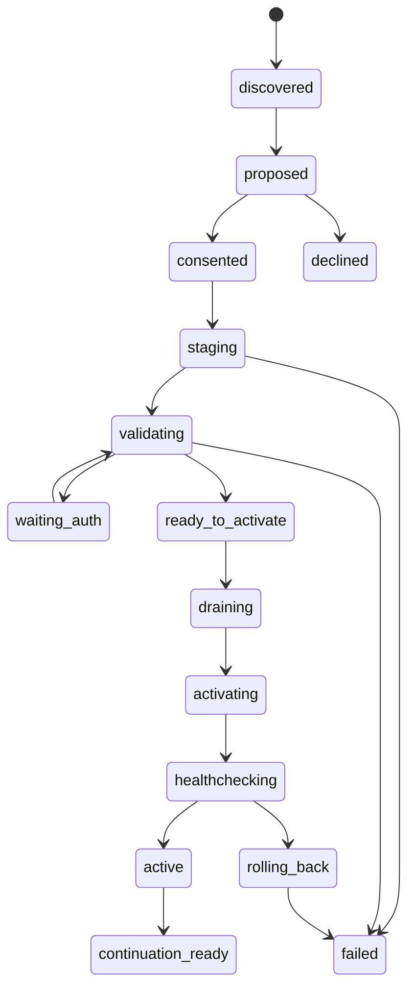

# Conversational Integrations, Installation & Onboarding

> English (default) · [Tiếng Việt](integration-onboarding.vi.md)

**Baseline:** v2, 16/09/2026. Goal: the user hands over a task; the system handles capability discovery, setup and lifecycle behind the scenes, with consent asked at the right moment.

## 1. Do not make the user distinguish between API, MCP and Pi extension

The user says “show me this week's calendar”, not “install MCP server X with transport Y”. The app turns the request into the capabilities it needs, finds the available implementations, proposes the best-fitting option and explains the points the user actually has to decide: account, data, permissions, cost, which machine runs it.

Resolution order:

1. A capability that is already installed, authenticated, has sufficient scope and is healthy.
2. A verified first-party integration recipe/adapter or official provider.
3. A trusted ecosystem/curated registry, supported MCP/Pi package.
4. Public research from docs/registry/repo; compare source, permissions, compatibility, auth burden, maintenance, license and cost.
5. No suitable package: propose building a tested adapter from verified documentation, or a browser/computer fallback with consent.

There is no rigid rule that an API is always better than MCP or that MCP is always better than an extension. Choose the simplest implementation that needs the fewest permissions and can be verified for the task. An MCP server wrapper can be useful, but adds no value if a native adapter already does the job correctly with fewer dependencies.

Names/package READMEs from search are untrusted; do not copy a curl/npm command before resolving its source, version, integrity and dependencies. An MCP registry verifying a namespace does not mean every server has been audited for safety [R09, R30].

## 2. Core capability graph

```text
User goal
  -> required semantic capabilities
  -> candidate implementations
  -> target node / platform compatibility
  -> package facets and transitive dependencies
  -> external connection + exact account/scopes
  -> grants + runtime configuration
  -> readiness probe
  -> continuation of original task
```

The app stores `CapabilityRequirement`, `InstallPlan`, `ConnectionPlan` and `TaskContinuation` with IDs/revisions. The conductor contributes reasoning/chooses the candidate; the supervisor checks state and transitions. Progress must not exist only in the model's reply.

## 3. Extension installation flow



A package that needs no auth skips waiting_auth. The lifecycle supports cancel in nonterminal states; after external writes/dependency effects it must reconcile, and must not pretend an uninstall reverses everything. Several tasks that need the same package use a shared install plan + multiple waiting continuations; do not ask the same question or install the same package several times.

### 3.1 The proposal the user sees

Example UI copy (hypothetical, not a real package):

> “To do this, I need to add a calendar tool. It will run on your VPS and only read the calendar of the account you choose. It cannot create or edit events. The Google connection will open in your browser. Install and connect?”

The summary is short; a “Details” button in the same chat shows the source, publisher, exact version/digest, dependencies, target node, filesystem/network/native code permissions, data sent out, and cost/download size when applicable. Do not invent a size or claim it is free if it has not been measured/verified.

Consent signs the plan digest. If the source/version/permissions/node change, it must be re-reviewed. If the user declines, the task does not keep nagging with retries; propose an alternative with clear limits.

### 3.2 Staging

The artifact is downloaded to a quarantine/staging directory. Resolve the dependency lock, checksum/signature when available, license/platform/build requirements. Downloading a dependency is different from running lifecycle scripts; by default, do not run scripts outside permitted isolation. Signatures/scans give provenance/risk signals; they do not prove something is harmless.

Build/test that needs code execution runs in a container/VM/build service with minimal network/filesystem grants. It does not inherit provider keys, the user's SSH agent, npm auth, git creds or app config. No privileged container, host root mounts, Docker socket pass-through.

A native Pi package has full process capability; the app must classify it:

- **Data/skill/theme:** declarative resource validation; instructions remain untrusted content and do not escalate privileges.
- **API/MCP tool service:** runs as an isolated service with brokered connection/data refs.
- **Native Pi executable:** trusted-host mode with a clear warning, or **sandbox the whole worker**. Do not load it into the conductor/daemon because the package says it is “safe”.

On macOS, where no Linux container engine/VM is available out of the box, the flow lets the user install a runner after consent or pick a paired Linux node. Do not pass off process isolation/node:vm as a sandbox; if no suitable isolation exists, stop installing untrusted native code or let the owner explicitly choose trusted-host with the real risk scope [R01–R05, R27].

### 3.3 Validation

Manifest/schema/entrypoints, license and binary availability; dependency graph; no unexpected privileged imports; startup/health with fixture; UI conformance; supported Pi API lifecycle; cancellation/dispose; settings/resource limits; network scopes. An integration read probe does not create real data on its own to “test”.

A successful tool registration does not mean an API call succeeds. An HTTP 200 from a health endpoint does not mean the calendar read permission is correct. Probe by the specific capability and the account the user chose.

### 3.4 Activation & resume

A package generation is an immutable snapshot. Before activating:

1. Persist the task continuation: original request, current revision, expected next step, workspace/resource refs, completed effects, required capability and verification criteria.
2. Stop new dispatch that uses the affected facet; wait for a safe tool boundary. UI/voice/unaffected workers do not stop.
3. Effects that are in an unknown state must be reconciled first; do not kill the process and then immediately rerun the continuation.
4. Commit the active generation registry; start/reload exactly the right tool/worker/renderer facet.
5. Rebind lifecycle/listeners, validate the capability schema/tool set, healthcheck.
6. If it fails, restore the previous active generation and compatible state; keep the task waiting with the error. Rolling back code does not mean undoing external effects or an arbitrary irreversible schema migration.
7. Resume the exact task revision once. If the source/arguments changed from the original intent, ask about that changed part first.

Do not restart all of Pi on every node just to add a calendar widget.

## 4. Pi reload: mapping that matches the real API

| Change | App strategy |
|---|---|
| UI-only widget | Reload the isolated app/catalog generation, keep instance state; do not reload Pi |
| Tool service/API connection | Update the capability registry + active schemas when supported; usually no full restart |
| Skill/prompt/theme resource | Resource refresh at a command/idle boundary through a tested adapter |
| Native Pi extension/module | Prefer a new worker generation + handoff/session reattach at a safe boundary |
| Runtime/core package | Signed app/runtime update + drain; not installed like an ordinary extension |

Pi currently has `ctx.reload()` in the **command context**; the tool context does not have this method directly. Reload does not terminate the old handler frame on its own: official guidance is to return right after the await; the app does not keep operating on a stale context. `registerTool` can be dynamic and `setActiveTools` limits schemas, so not every change needs a reload [R03].

SDK internals can change. P0 pins an exact version/commit and tests the lifecycle; this documentation does not offer a fake `pi.reloadEverything()` call for Codex to use. `PiAdapter.refreshResources` is an **app-owned interface** with an implementation per verified version.

## 5. Connection & auth supervisor

```text
unconfigured → proposal → awaiting_user_consent
  → authorizing → verifying_account_and_scopes → probing_capability → connected
                                     ↘ denied / partial / expired / failed
connected → needs_reauth / degraded / revoked
```

Store `connectionRef`, provider, actual account ID, resource selections, granted scopes, credential owner node, status, expires/refresh metadata and last successful capability probes. The model only sees safe metadata and opaque refs.

### 5.1 Auth paths

- Native OAuth: system browser with PKCE and the correct registered redirect; transaction nonce/state, timeout, cancel handling.
- Server OAuth: registered HTTPS callback, code exchange/vault on the appropriate server, browser origin/session binding.
- Device authorization: only when the provider/client/use case actually supports it; not a universal fallback.
- API key: host-owned secure field, masked entry, encrypted transport directly to the vault node; only the connectionRef/status enters the chat.
- MCP OAuth: capability-negotiated protected-resource metadata/authorization requirements; do not assume every server has DCR/auto-client registration. Validate the token audience; do not pass an upstream token through to another server [R08–R09].

**Conversation-led does not mean embedding all of auth in the conversation.** Google installed-app OAuth requires a supported external browser flow; embedded user agents may be rejected [R18]. The app explains briefly, opens the right place, receives the callback and then continues the chat automatically.

The native Google flow must not be assumed to support incremental authorization the way the web flow does. Start read-only if that is enough; when a new permission is needed, the adapter performs authorization/reauthorization correctly for the client type and verifies the actual returned scopes; do not assume the union is granted automatically. A user may grant only some of the scopes [R18–R20].

### 5.2 Desktop ↔ server callback traps

A loopback redirect in the laptop's browser does not point to the VPS on its own. A headless deployment must use a supported server callback, or a desktop-owned integration that is then invoked remotely on the node holding the credential. Do not instruct the user to copy an OOB auth code, which is no longer supported, and do not work around policies with computer tools.

Provider-bound credentials/private keys may not be exportable. Do not relocate tokens arbitrarily to “sync nodes”. The user chooses the node that owns the connection in the guided flow; remote tasks call the capability on that node. Moving it requires reauth/migration done correctly for the provider and with user consent.

### 5.3 Secure UI and approval

CredentialRequest is a separate host-owned surface, not a model-supplied form. Field values do not go into the transcript, analytics, error dumps, LLM tools or session JSONL. Password/OAuth user authentication is entered in the provider UI; the app does not need to know the password.

The model must not choose an arbitrary token endpoint/base URL that could exfiltrate a key. Endpoint discovery must verify provider/resource identity, allowed schemes/redirects, TLS and no credential forwarding to an unapproved origin.

## 6. Reference journey: Google Calendar

A direct API connector is chosen as the first-party reference so it does not depend on an unverified community MCP server. The app still discovers/installs an MCP/Pi alternative when it is genuinely suitable. This is a product decision, not a claim that Google has no MCP.

1. User: “Show me this week's calendar.”
2. The resolver identifies the calendar.read requirement and looks for an existing connection first.
3. If there is none, propose the connector + read permission + credential node; an already installed package may be reused.
4. OAuth via a supported browser flow; the product/operator needs a registered OAuth client, enabled APIs and verification where applicable. The agent does not make the registration/app review requirement disappear on its own.
5. Verify the account, returned scopes and calendar list; the user chooses a calendar if ambiguous.
6. Read the actual time range in the user's timezone; render the agenda/week with source and freshness.
7. “Pin it”: create a pin for the instance; propose on-open refresh, optional standing read refresh budget.
8. “Move this event to tomorrow afternoon”: resolve the event, timezone, conflicts; draft a preview; request additional auth if needed; **explicit mutation confirmation** in the reference beta.
9. Execute with concurrency/version handling when the API supports it; verify the result. A timeout does not blindly repeat create/update.
10. Token expired/revoked → preserve the widget snapshot/drafts, guide the reconnect in the chat.

### Refresh semantics

By default, refresh when the user opens/requests. When pinned and visible, the user can grant a bounded read subscription; the backend uses polling/backoff or incremental sync as appropriate. Google push setup needs a reachable HTTPS receiver and channel lifecycle; it is an optional connector enhancement, and does not promise that every local client receives instant push [R21].

An offline agenda has lastUpdated. Do not let a cached calendar look like live data. Date-only, DST, recurring instances/cancelled events and timezone are contract tests, not handled with string replace.

### Consumer setup vs self-host setup

The consumer app should have a prepared OAuth application identity so the user only has to sign in. A self-hosting operator gets a BYO OAuth client wizard as the advanced route. Missing vendor app approval/client credentials is a release blocker for the seamless live journey; do not shift that burden onto every user while still advertising zero setup.

## 7. Very short onboarding, with depth when needed

Onboarding is a **scripted state machine**, not a greeting prompt for the model to improvise as it pleases. The LLM helps with phrasing and understanding the goal; the supervisor holds the state, prerequisites, consent and progress.

### 7.1 A single entry

> “What would you like to use me for first, or would you like to try it out a bit?”

Two choices: **Try it now** and **Set up for my work**. Do not ask about model provider/session/root directory/MCP before the user understands what the app can help with. Suggestion chips are optional input; the chat still accepts free-form sentences.

### 7.2 Quick play

No provider credentials: scripted sample dataset + rich widgets + local note + pin demo. Label it **Sample data / interactive demo**; do not pretend a live agent has read mail/understood every sentence.

The user can change a chart, work a checklist and make real pins within the local sample scope. Do not download a browser engine, request full disk access or install ten packages on your own. When the user wants a real AI task, switch to guided provider setup while keeping context. If a managed trial exists, offer it only after the business model/account budget actually exists; do not write unlimited free usage into the spec.

### 7.3 Needs-based guided setup

One goal question, one small proposal. Example:

| Need | First proposal | Ask more only when needed |
|---|---|---|
| Working with code | Text provider + chosen project root | Browser driver when UI testing is needed; git/service auth when the task requires it |
| Calendar/notes | Calendar connector or local notes | Write scopes, Notion integration after user request |
| Research/data | Web read/search adapter + Data Canvas | API credentials if the search provider requires them; no browser input granted by default |
| Work on a VPS | Pair runtime + workspace limits | Driver/server packages per concrete task |
| Voice-first | Voice provider + mic access | No camera/screen recording |

At most 1–3 related proposals per turn; explain the benefits, permissions and optional costs. If one does not fit, drop it; do not force a checklist to be completed. A partial setup is still usable for the functions that are ready.

### 7.4 Script contracts

`SetupRecipe`: goal tags, required capabilities, node constraints, prerequisite probes, approved copy templates, steps, cancellation/recovery, expected healthchecks. A third party may provide a recipe but cannot modify core consent on its own or hide requested scopes.

Persist a checkpoint per user/node/connection/plan. A restart or closed browser can resume; do not request OAuth again because a callback was forgotten. A late callback belonging to a cancelled setup transaction does not activate a grant on its own.

## 8. Pi-like personalization

Small, scoped, composable resources: user preferences, aliases, skills, recipes, packages, widget templates, pinned instances and theme tokens. Good defaults; advanced configuration is discovered through chat.

A direct user statement such as “reply briefly” or “use repo X when I say website” is consent for that specific change; the app reports it and offers undo. Do not infer additional sensitive memory or a silent behavioral profile. Configuration is tied to source/scope/revision; project instructions cannot raise the security ceiling.

Example: “Create a button on the calendar to find a free 30-minute slot” → the agent adds an action-intent or bounded tool workflow, previews it, and the user confirms when needed. No need to modify the core app or open a visual workflow editor.

“Install this tool on every machine” does not mean copying secrets: create a multi-node install plan, with separate node prerequisites, health and grant; auth/account binding is a separate decision.

## 9. Required UX infrastructure

An install/auth task has one system card updated in place, not a spam of 30 messages. States include needs decision, downloading, verifying, needs sign-in, ready, blocked. The user can ask for details at any time.

There is back/skip/cancel, clear resume, and the input draft is kept. Native OS/security surfaces are a reasonable exception to chat-first; do not make users install an app through conversation before a binary exists.

Core does not show “connected” when only auth succeeded but the capability probe failed. The user can say “remove this connection”, “show which apps have permission to read my calendar”, “revoke VPS B's permissions”; a completed action has a verified state.

## 10. Core acceptance

Missing capability recognized → proposed exact source/version/node → explicit consent → staged validated install → correct auth → runtime facet activation → original task resumed once. Also test declined consent, partial scopes, denied OAuth, API disabled, unavailable registry, mismatched architecture, failed load, reload listener duplication, credential leak, expired invite and widget surviving reload.

A successful onboarding must lead to a **useful verified outcome**, not just “installed 5 extensions”. Metrics: completion of first meaningful task, abandonment point, permission comprehension, setup retries, recovery success; do not optimize for the number of permissions the user clicks to approve.
