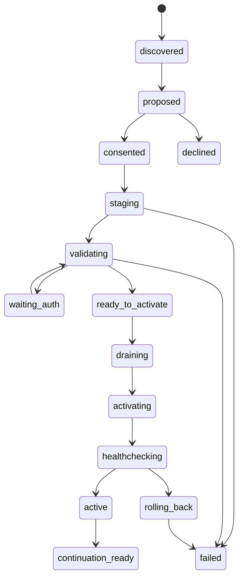

# Conversational Integrations, Installation & Onboarding

**Baseline:** v2, 16/09/2026. Goal: người dùng giao việc; hệ thống xử lý capability discovery, setup và lifecycle ở phía sau, với consent đúng lúc.

## 1. Không bắt user phân biệt API, MCP và Pi extension

User nói “xem lịch tuần này”, không “cài MCP server X với transport Y”. App chuyển yêu cầu thành capability cần thiết, tìm những implementation khả dụng, đề xuất phương án phù hợp nhất và giải thích những điểm user thật sự cần quyết định: tài khoản, dữ liệu, quyền, chi phí, máy nào chạy.

Resolution thứ tự:

1. Capability đã installed, authenticated, có scope đủ và healthy.
2. Integration recipe/adapter first-party hoặc provider chính thức đã kiểm chứng.
3. Trusted ecosystem/curated registry, supported MCP/Pi package.
4. Public research từ docs/registry/repo; so sánh nguồn, permissions, compatibility, auth burden, maintenance, license và cost.
5. Không có package phù hợp: đề xuất build adapter có test từ tài liệu xác minh hoặc fallback browser/computer có consent.

Không cứng nhắc API luôn tốt hơn MCP hoặc MCP luôn tốt hơn extension. Chọn implementation đơn giản, ít quyền và có thể xác minh cho tác vụ. Một MCP server wrapper có thể hữu ích nhưng không thêm giá trị nếu native adapter đã làm đúng việc với ít dependency hơn.

Tên/package README từ search là untrusted; không copy một lệnh curl/npm mà chưa resolve source, version, integrity và dependencies. MCP registry xác minh namespace không đồng nghĩa audit an toàn mọi server [R09, R30].

## 2. Core capability graph

```text
User goal
  -> required semantic capabilities
  -> candidate implementations
  -> target node / platform compatibility
  -> package facets and transitive dependencies
  -> external connection + exact account/scopes
  -> grants + runtime configuration
  -> readiness probe
  -> continuation of original task
```

App lưu `CapabilityRequirement`, `InstallPlan`, `ConnectionPlan` và `TaskContinuation` có IDs/revisions. Conductor góp lý do/chọn candidate; supervisor kiểm tra trạng thái và transitions. Không để tiến độ chỉ tồn tại trong câu trả lời của model.

## 3. Flow cài extension



Một package không cần auth bỏ qua waiting_auth. Lifecycle hỗ trợ cancel ở nonterminal; sau external writes/dependency effects phải reconcile, không giả uninstall đảo ngược mọi thứ. Nhiều tasks cần cùng package dùng shared install plan + multiple waiting continuations; không hỏi cùng câu và cài cùng gói nhiều lần.

### 3.1 Proposal user thấy

Ví dụ UI copy (giả định, không package thật):

> “Để làm việc này, tui cần thêm công cụ lịch. Nó sẽ chạy trên VPS của anh, chỉ đọc lịch của tài khoản anh chọn. Chưa được tạo hoặc sửa sự kiện. Kết nối Google sẽ mở trong trình duyệt. Cài và kết nối chứ?”

Summary ngắn; nút “Chi tiết” trong cùng chat hiển thị nguồn, publisher, exact version/digest, dependencies, target node, quyền filesystem/network/native code, dữ liệu gửi đi và chi phí/download khi có. Không bịa dung lượng hoặc miễn phí nếu chưa đo/verify.

Consent ký vào plan digest. Source/version/permissions/node thay đổi thì phải re-review. User từ chối thì task không retry nag liên tục; đề xuất cách khác có giới hạn rõ.

### 3.2 Staging

Artifact tải về quarantine/staging directory. Resolve dependency lock, checksum/signature khi có, license/platform/build requirements. Download dependency khác với chạy lifecycle scripts; mặc định không chạy script ngoài isolation được phép. Chữ ký/scan cho tín hiệu provenance/risk, không chứng minh vô hại.

Build/test cần code execution thực hiện trong container/VM/build service với network/filesystem grants tối thiểu. Không thừa kế provider keys, user SSH agent, npm auth, git creds hoặc app config. No privileged container, host root mounts, Docker socket pass-through.

Native Pi package có full process capability; app phải phân loại:

- **Data/skill/theme:** declarative resource validation, instructions vẫn là untrusted content và không nâng quyền.
- **API/MCP tool service:** chạy isolation service với brokered connection/data refs.
- **Native Pi executable:** trusted-host mode có warning rõ hoặc **sandbox toàn bộ worker**. Không load vào conductor/daemon vì package nói “an toàn”.

Trên macOS không có Linux container engine/VM sẵn, flow cho cài runner sau consent hoặc chọn paired Linux node. Không giả process isolation/node:vm thành sandbox; nếu không có isolation phù hợp, dừng cài untrusted native code hoặc để owner explicit chọn trusted-host với phạm vi rủi ro thật [R01–R05, R27].

### 3.3 Validation

Manifest/schema/entrypoints, license và binary availability; dependency graph; no unexpected privileged imports; startup/health with fixture; UI conformance; supported Pi API lifecycle; cancellation/dispose; settings/resource limits; network scopes. Integration read probe không tự tạo dữ liệu thật để “test”.

Đăng ký tool thành công không đồng nghĩa API call thành công. HTTP 200 của health endpoint không đồng nghĩa quyền đọc calendar đúng. Probe theo capability cụ thể và account được user chọn.

### 3.4 Activation & resume

Generation của package là immutable snapshot. Trước activate:

1. Persist task continuation: original request, current revision, expected next step, workspace/resource refs, completed effects, required capability và verification criteria.
2. Ngừng dispatch mới dùng facet bị ảnh hưởng; chờ tool boundary an toàn. UI/voice/unaffected workers không dừng.
3. Những effects đang unknown phải reconcile trước; không kill process rồi lập tức rerun continuation.
4. Commit active generation registry; start/reload đúng tool/worker/renderer facet.
5. Rebind lifecycle/listeners, validate capability schema/tool set, healthcheck.
6. Nếu failed, restore previous active generation và state tương thích; giữ task waiting với lỗi. Rollback code không đồng nghĩa undo external effects hoặc arbitrary irreversible schema migration.
7. Resume đúng task revision một lần. Có source/arguments đổi từ original intent thì hỏi trước phần thay đổi đó.

Không restart toàn bộ Pi trên tất cả nodes chỉ để thêm một calendar widget.

## 4. Pi reload: mapping đúng với API thực

| Thay đổi | Chiến lược app |
|---|---|
| Widget UI-only | Reload isolated app/catalog generation, giữ instance state; không reload Pi |
| Tool service/API connection | Update capability registry + active schemas khi supported; thường không full restart |
| Skill/prompt/theme resource | Resource refresh ở command/idle boundary qua adapter đã test |
| Native Pi extension/module | Prefer new worker generation + handoff/session reattach ở safe boundary |
| Runtime/core package | Signed app/runtime update + drain; không cài như ordinary extension |

Pi hiện có `ctx.reload()` trong **command context**; tool context không có method này trực tiếp. Reload không tự terminate old handler frame: official guidance return ngay sau await; app không tiếp tục thao tác dùng stale context. `registerTool` có thể dynamic và `setActiveTools` giới hạn schemas, nên không cần reload cho mọi thay đổi [R03].

SDK internals có thể đổi. P0 pin exact version/commit và test lifecycle; documentation này không đưa lời gọi giả `pi.reloadEverything()` cho Codex dùng. `PiAdapter.refreshResources` là **app-owned interface** có implementation theo version đã xác minh.

## 5. Connection & auth supervisor

```text
unconfigured → proposal → awaiting_user_consent
  → authorizing → verifying_account_and_scopes → probing_capability → connected
                                     ↘ denied / partial / expired / failed
connected → needs_reauth / degraded / revoked
```

Store `connectionRef`, provider, actual account ID, resource selections, granted scopes, credential owner node, status, expires/refresh metadata và last successful capability probes. Model chỉ thấy safe metadata và opaque refs.

### 5.1 Auth paths

- OAuth native: system browser với PKCE và đúng registered redirect; transaction nonce/state, timeout, cancel handling.
- OAuth server: callback HTTPS đã đăng ký, code exchange/vault ở appropriate server, browser origin/session binding.
- Device authorization: chỉ khi provider/client/use case thực hỗ trợ; không fallback universal.
- API key: host-owned secure field, masked entry, encrypted transport trực tiếp tới vault node; chỉ connectionRef/status vào chat.
- MCP OAuth: capability-negotiated protected-resource metadata/authorization requirements; không giả mọi server có DCR/auto-client registration. Validate token audience; không pass-through upstream token sang server khác [R08–R09].

**Conversation-led không đồng nghĩa nhúng toàn bộ auth trong conversation.** Google installed-app OAuth yêu cầu supported external browser flow; embedded user agents có thể bị từ chối [R18]. App giải thích ngắn, mở đúng nơi, nhận callback rồi tiếp tục chat tự động.

Native Google flow không được giả hỗ trợ incremental authorization giống web flow. Bắt đầu read-only nếu đủ; khi cần quyền mới, adapter thực hiện authorization/reauthorization đúng client type, verify actual returned scopes; không giả union được grant tự động. Một user có thể chỉ cấp một phần scopes [R18–R20].

### 5.2 Desktop ↔ server callback traps

Loopback redirect trên browser của laptop không tự trỏ tới VPS. Headless deployment phải dùng supported server callback hoặc desktop-owned integration rồi remote invoke trên node giữ credential. Không hướng dẫn copy auth code OOB đã bị bỏ hỗ trợ, không tự workaround policies bằng computer tools.

Provider-bound credentials/private keys có thể không exportable. Không relocate token tùy ý để “sync nodes”. User chọn node sở hữu connection trong guided flow; remote tasks gọi capability ở node đó. Muốn chuyển phải reauth/migration đúng provider và user consent.

### 5.3 Secure UI và approval

CredentialRequest là host-owned surface riêng, không model-supplied form. Field value không đi vào transcript, analytics, error dumps, LLM tools hoặc session JSONL. Password/OAuth user authentication nhập ở provider UI, app không cần biết password.

Model không được chọn token endpoint/base URL tùy ý để exfiltrate key. Endpoint discovery phải verify provider/resource identity, allowed schemes/redirects, TLS và no credential forwarding to unapproved origin.

## 6. Reference journey: Google Calendar

Chọn connector API trực tiếp làm first-party reference để không phụ thuộc một MCP community server chưa xác minh. App vẫn discover/cài MCP/Pi alternative khi thật sự phù hợp. Đây là product decision, không claim Google không có MCP.

1. User: “Cho tui xem lịch tuần này.”
2. Resolver nhận calendar.read requirement, tìm connection existing trước.
3. Nếu chưa có, propose connector + quyền đọc + credential node; có thể reuse package already installed.
4. OAuth via supported browser flow; product/operator cần registered OAuth client, enabled APIs và verification khi applicable. Agent không tự làm biến mất yêu cầu đăng ký/app review.
5. Verify account, returned scopes và calendar list; user chọn calendar nếu ambiguous.
6. Read actual time range theo timezone user; render agenda/week with source and freshness.
7. “Ghim lại”: tạo pin cho instance; đề xuất on-open refresh, optional standing read refresh budget.
8. “Dời sự kiện này sang chiều mai”: resolve event, timezone, conflicts; draft preview; request additional auth if needed; **explicit mutation confirmation** trong reference beta.
9. Execute với concurrency/version handling khi API hỗ trợ; verify result. Timeout không blindly repeat create/update.
10. Token expired/revoked → preserve widget snapshot/drafts, guide reconnect trong chat.

### Refresh semantics

Default refresh khi user mở/request. Khi pinned và visible, user có thể cấp bounded read subscription; backend dùng polling/backoff hoặc incremental sync phù hợp. Google push setup cần reachable HTTPS receiver và channel lifecycle; là optional connector enhancement, không promise mọi local client nhận instant push [R21].

Offline agenda có lastUpdated. Không để calendar đang cached trông như dữ liệu live. Date-only, DST, recurring instances/cancelled events và timezone là contract tests, không xử lý bằng string replace.

### Consumer setup vs self-host setup

Bản app cho consumer nên có OAuth application identity đã chuẩn bị để user chỉ sign in. Operator self-host có BYO OAuth client wizard như advanced route. Chưa có vendor app approval/client credentials là release blocker cho seamless live journey, không chuyển gánh nặng đó cho tất cả user mà vẫn quảng cáo zero setup.

## 7. Onboarding cực ngắn nhưng có chiều sâu khi cần

Onboarding là **state machine có kịch bản**, không phải một prompt chào hỏi để model tự bịa tùy hứng. LLM hỗ trợ diễn đạt và hiểu mục tiêu; supervisor giữ state, prerequisites, consent và progress.

### 7.1 Entry duy nhất

> “Anh muốn dùng tui để làm việc gì trước, hay thử chơi một chút?”

Hai choices: **Thử ngay** và **Thiết lập cho việc của tôi**. Không hỏi model provider/session/root directory/MCP trước khi user hiểu app giúp được gì. Gợi ý chips là optional input, chat vẫn nhận câu tự do.

### 7.2 Quick play

Không provider credentials: scripted sample dataset + rich widgets + note local + pin demo. Label **Dữ liệu mẫu / demo tương tác**, không giả live agent đã đọc mail/đã hiểu mọi câu.

User được đổi chart, thao tác checklist và pin thật trong local sample scope. Không tự tải browser engine, xin full disk access hoặc cài mười packages. Khi muốn task AI thực, chuyển guided provider setup giữ context. Nếu có managed trial thì chỉ offer sau khi business model/account budget thực sự tồn tại; không ghi miễn phí vô hạn trong spec.

### 7.3 Needs-based guided setup

Một câu hỏi mục tiêu, một proposal nhỏ. Ví dụ:

| Nhu cầu | Đề xuất đầu tiên | Chỉ hỏi thêm khi cần |
|---|---|---|
| Làm việc với code | Text provider + project root được chọn | Browser driver khi cần test UI; git/service auth khi task yêu cầu |
| Lịch/ghi chú | Calendar connector hoặc local notes | Write scopes, Notion integration sau user request |
| Research/dữ liệu | Web read/search adapter + Data Canvas | API credentials nếu search provider đòi; không cấp browser input mặc định |
| Công việc trên VPS | Pair runtime + giới hạn workspace | Driver/server packages theo concrete task |
| Voice-first | Provider voice + mic access | Không camera/screen recording |

Max 1–3 đề xuất liên quan ở một lượt; giải thích lợi ích, quyền và optional costs. Một không phù hợp thì bỏ, không ép hoàn thành checklist. Setup partial vẫn usable cho chức năng đã ready.

### 7.4 Script contracts

`SetupRecipe`: goal tags, required capabilities, node constraints, prerequisite probes, approved copy templates, steps, cancellation/recovery, expected healthchecks. Third party có thể cung cấp recipe nhưng không tự sửa core consent hoặc giấu requested scopes.

Persist checkpoint per user/node/connection/plan. Restart hoặc đóng browser có thể resume; không request lại OAuth vì quên callback. Callback đến muộn thuộc setup transaction đã cancelled không tự activate grant.

## 8. Personalization giống Pi

Tài nguyên nhỏ, có scope và composable: user preferences, aliases, skills, recipes, packages, widget templates, pinned instances và theme tokens. Defaults tốt, cấu hình nâng cao discover bằng chat.

User trực tiếp “trả lời ngắn”, “dùng repo X khi nói website” là consent cho thay đổi cụ thể đó; app báo và có undo. Không infer thêm sensitive memory hay silent behavioral profile. Cấu hình gắn source/scope/revision; project instructions không thể mở rộng security ceiling.

Ví dụ: “Tạo nút trên calendar để tìm giờ trống 30 phút” → agent thêm action-intent hoặc bounded tool workflow, preview, user confirm khi cần. Không cần sửa core app hoặc mở visual workflow editor.

“Cài tool này cho mọi máy” không đồng nghĩa copy secrets: lập multi-node install plan, riêng node prerequisites, health và grant; auth/account binding là quyết định riêng.

## 9. Hạ tầng UX bắt buộc

Một install/auth task có một system card cập nhật tại chỗ, không spam 30 messages. Trạng thái gồm cần quyết định, đang tải, đang xác minh, cần đăng nhập, sẵn sàng, blocked. User có thể hỏi chi tiết bất kỳ lúc nào.

Có back/skip/cancel, clear resume, giữ input draft. Native OS/security surfaces là ngoại lệ hợp lý của chat-first; không bắt người dùng cài app bằng hội thoại trước khi có binary.

Core không hiện “connected” khi chỉ auth thành công nhưng capability probe fail. User có thể nói “gỡ kết nối này”, “xem app nào đang có quyền đọc lịch”, “thu hồi quyền của VPS B”; action hoàn thành có verified state.

## 10. Acceptance trọng tâm

Missing capability recognized → proposed exact source/version/node → explicit consent → staged validated install → correct auth → runtime facet activation → original task resumed once. Test cả declined consent, partial scopes, denied OAuth, API disabled, unavailable registry, mismatched architecture, failed load, reload listener duplication, credential leak, expired invite và widget surviving reload.

Một successful onboarding phải dẫn tới một **useful verified outcome**, không chỉ “đã cài 5 extensions”. Metrics: completion of first meaningful task, abandonment point, permission comprehension, setup retries, recovery success; không tối ưu số permissions user bấm đồng ý.
