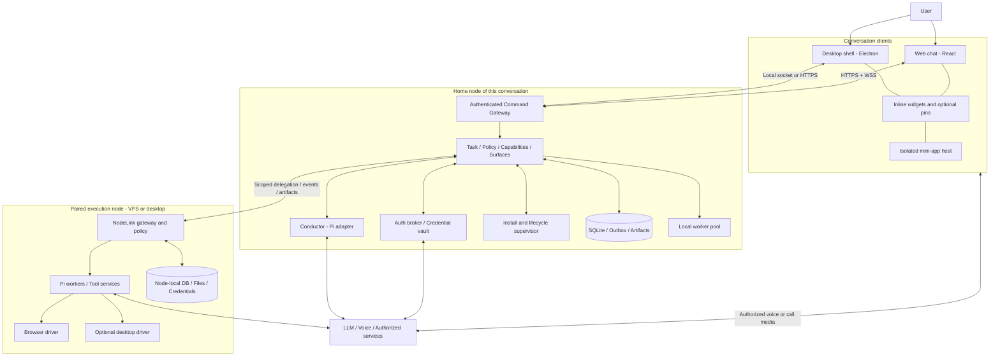
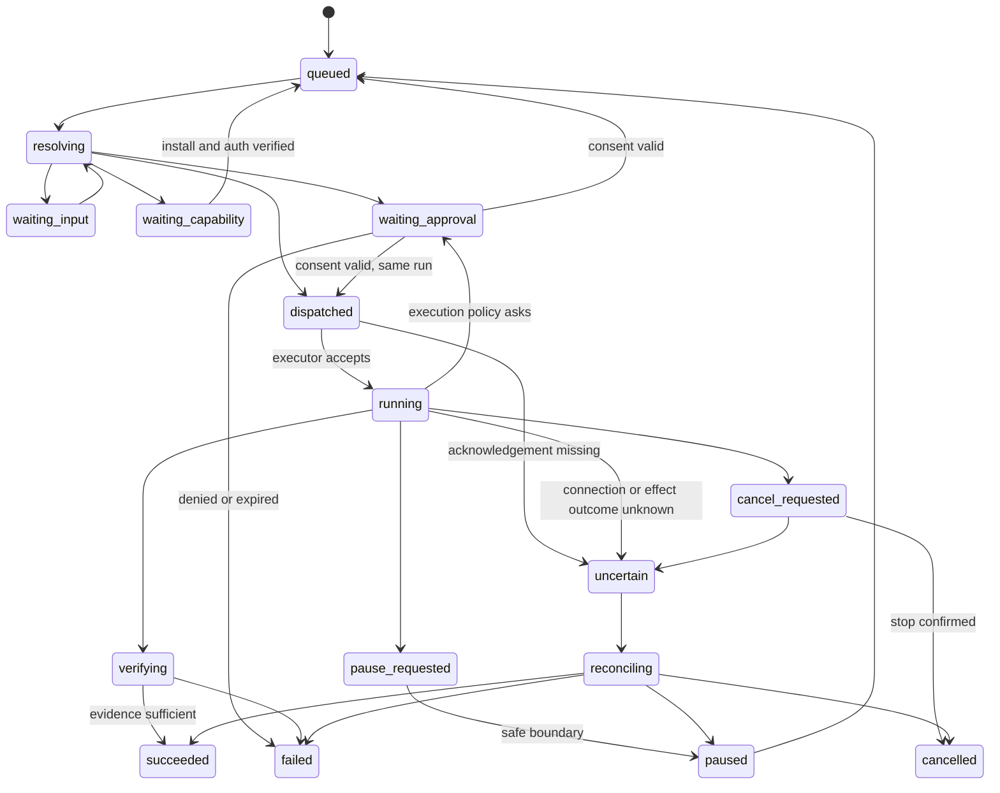

# System Architecture v2 — Conversation Platform

> English (default) · [Tiếng Việt](system-architecture.vi.md)

**Date:** 16/09/2026, updated 19/09/2026 · **Status:** design; the implemented parts live in `apps/` and `packages/` of this repo, and the code is the source of truth for behavior — this document holds the boundaries, decisions and where each part lives. Latest overview diagram: [system-architecture.png](system-architecture.png); when the text and the diagram differ, the diagram wins and the text must be fixed to match.
**Scope:** [scope-lock.md](scope-lock.md). All APIs/types named `agent.*`, NodeLink and CapabilityPack below are proposed app contracts, not official Pi/MCP APIs.

## 1. Core architecture change

There is no longer a "desktop app with a helper, and later we move the helper to a server" design. The product is a **portable runtime with many conversation clients** from the start. Desktop is a distribution made of runtime + Electron shell; server is the same runtime without Electron, with an optional web client. Running two nodes does not require a cloud account with the app developer.

The core does not try to turn the whole network into one computer with a shared filesystem and database. Each node has its own identity, permissions, credentials and resources. Seamlessness lives in communication, delegation and presentation; not in hiding every difference or copying secrets around automatically.

## 2. Overview diagram



Media arrows do not mean every widget may connect to every provider on its own. Network/media grants, SDK tokens, user gesture and device permissions are all checked. The diagram shows functional boundaries; do not deploy each box as a microservice.

## 3. Chosen stack

| Layer | Decision | Rationale / boundary |
|---|---|---|
| Shared UI | React + TypeScript + Vite | Same conversation components for desktop and web; no Node dependency in the renderer |
| Desktop | Thin Electron main/preload | OS dialogs, notifications, Keychain, local driver consent; no scheduler |
| Runtime | Node.js LTS, TypeScript | Fits the Pi SDK and tool ecosystem; versions pinned at the compatibility gate |
| Agent | Pi SDK only through `pi-adapter` | Do not fork the agent loop; the app manages its own tasks and resources [R01–R04] |
| API | Small HTTP framework with schemas + WebSocket | JSON over HTTPS, typed contracts; Fastify is the proposed default implementation |
| Local transport | Authenticated Unix socket | No public listener by default on desktop; bridged into the same command handlers |
| Persistence | SQLite WAL per node + durable outbox/inbox | One runtime writer per DB; no remote/shared filesystem for live SQLite |
| Blobs | Local content store with metadata/digest | Transfers are scoped, quota-limited, with retention; object storage adapter later |
| Contracts | Runtime schema validation + generated types | JSON Schema/Zod adapter; version negotiation, not TypeScript alone |
| Built-in widgets | Trusted React catalog, lazy chunks | Chart/table/form/map/calendar/editor… from descriptors with schemas |
| Mini-apps | Isolated origins/iframes, MCP Apps host adapter | Custom UI does not live in the privileged renderer; host-mediated actions [R06–R08] |
| Execution | Child processes + OS isolation when needed | A separate process is not a sandbox; untrusted tool services run in a suitable container/VM |
| Linux delivery | Non-root OCI image + optional native bundle/service | Runtime needs no display; browser/virtual desktop are separate images |
| Voice | Gemini Live (`gemini-3.8-live`) behind a node-side WebSocket proxy | The browser holds no provider credential, not even a short-lived token; [ADR-001](research/adr-001-gemini-live-provider.md) replaces the blueprint's GPT-Live choice [R29] |
| Connectivity | Reachable HTTPS or private-network adapter | Tailscale is one option that already has NAT traversal; not required for local use [R28] |

Do not rewrite the whole runtime in Go/Rust just because there is a VPS: the portability requirement is met through the headless boundary, packaging and OS adapters. A native helper is used only when OS APIs are truly needed, not as a second rewrite of Pi.

### 3.1 Pi Chord: experiment, do not lock in the dependency blindly

Chord in the Pi ecosystem has plugin facets and service/state/lifecycle primitives worth trying for PackHost. But it does not replace the app's NodeLink, auth, effect ledger or protocol replay. The current documentation does not specify an application wire envelope; do not treat the planned symmetric RPC as already available. P0 tries Chord behind a `FacetHost` interface; keep a minimal independent implementation if compatibility is not reached. `node:vm` is not a security sandbox [R05, R27].

## 4. Three planes of operation

**Control plane:** commands, task revisions, approvals, capability discovery, install state, pin metadata. Durable, small, authenticated.

**Execution plane:** Pi worker, tool service, browser profile, OS driver, builds and API effects. Lives on the chosen node, with lease, cancel and budgets.

**Media/data plane:** live audio, video calls, desktop frames, large file blobs. Uses a suitable transport; does not pour raw media into SQLite/event replay or the conductor context. State holds media session references, not individual frames.

A remote task does not mean audio has to route through every VPS. The client can set up a transport to the provider after the auth broker of the relevant node issues a temporary credential of the right kind.

## 5. Entities and ownership

| Entity | Meaning | Authority |
|---|---|---|
| Owner / Principal | User, client, peer node or extension identity | Auth/policy of the node receiving the request |
| Node | One runtime installation, with a key identity and capability inventory | The node itself |
| Conversation | Timeline the user interacts with | One home node at a time |
| Task | User goal, revisions, outcomes | The node that created the task; a child task on an execution node has lineage |
| Run | A specific attempt on a task revision | Execution node |
| Pi session | Agent context and session history | One worker owner; never on several nodes at once |
| Resource | Workspace, file, browser profile, desktop, integration account | The node holding the resource |
| Delegation | Scope of work and capabilities delegated | Sender grant + receiver policy, intersected |
| Surface snapshot | UI response at a point in time | Home conversation store |
| Widget instance | Mini-app with persistent state, actions, connections | One instance owner node; user/account scoped |
| Pin | Instance reference and display preference | Home conversation/client preference |
| Connection | Authorized external account, scopes, health | The node holding the credentials and adapter |
| Capability install | Package/artifact versions, facets, granted resources | The node that installed the package |
| Effect | An effect that is prepared/submitted/confirmed or unknown | The execution node performing the effect |
| Artifact | Blob/dataset/evidence metadata | The creating node; copies carry lineage/digest |

Tasks, sessions, widgets and connections have different lifecycles. A completed task does not delete a Spotify player or a note. A session reload is not a command to re-run an action on a widget.

## 6. Process and distribution model

### Desktop distribution

- The Electron renderer runs sandboxed, `nodeIntegration: false`, `contextIsolation: true`, with CSP and IPC sender validation. Main exposes only typed methods, no generic shell/IPC [R26].
- The runtime helper is a separate program that can attach/reconnect. Closing the window keeps the runtime if the user chose keep-running; quitting the runtime is different from closing the UI.
- The macOS integration helper handles OS permissions, the capture/input driver and the credential store. The driver keeps a stable identity/signature across releases so TCC can be tested.
- A user can use the desktop as a thin client to a server without enabling local code execution.

### Server distribution

- The core OCI image contains only the runtime/web static assets/required dependencies. The browser engine and virtual desktop are optional images/profiles.
- Runs as non-root; separate writable volume; health/readiness; restart policy. The Docker socket is not mounted into worker/tool containers.
- A native Linux tarball with a bundled runtime + service unit is the alternative path for operators who do not use Docker. Minimal service account, explicit project roots and a separate data directory.
- Raw Pi RPC, CDP, VNC or dev servers are never exposed to the Internet. Public exposure is only the gateway, with TLS/auth/rate limits.
- HTTPS for the web UI is mandatory for browser features that require a secure context. Local loopback development is different from a production deployment.

Deploy examples in the implementation plan are templates that need a real release artifact substituted in; do not invent a registry image or a domain that supposedly exists.

## 7. Core services and PackHost

```text
Command Gateway
  -> Authenticate principal + validate schema/version
  -> Resolve conversation/task/widget/resource
  -> Deterministic handler OR conductor intent resolution
  -> Current-policy evaluation + required consent
  -> Durable transaction/outbox
  -> Local executor OR scoped NodeLink delegation
  -> Verify outcome / reconcile unknown effects
  -> Persist event + update conversation/widget/voice summary
```

The core holds the invariants that extensions may not replace: identity, permission, secret custody, task/effect state, resource locks, package generation activation, surface action ownership, install consent, budgets and emergency stop.

A pack contributes tools, instructions, presenters, custom widgets, drivers, auth/setup descriptors and onboarding recipes. A pack may not create its own scheduler, global conversation store or hidden root account.

### 7.1 Capability registry

Each capability has a stable ID, package/version, execution node, input/output schema, resource kinds, compatibility, auth readiness, invocation route, cancellation, effect category and UI affordances. `installed`, `loaded`, `authenticated`, `authorized`, `healthy` are separate states.

By default the conductor sees only the capability summary and the short list of read-only tools the node registers for Main Pi (`apps/runtime/src/node-tools.ts`); only when it picks a capability are the related schema/skill loaded. Do not dump every MCP tool into every model turn. Pi's dynamic tool activation can be used through the adapter where appropriate [R03].

The conductor must not have a tool that accepts consent on its own, reads secret values or patches core policy. Tool discovery metadata and externally supplied MCP descriptions are still untrusted input.

### 7.2 Memory & Search: a shared service, and Jev as the decision layer

Memory & Search is a **shared service inside the runtime process**; it survives a Pi swap and does not live in a worker. Following the diagram, it has five layers: semantic retrieval (sqlite-vec, exact KNN), lexical retrieval (SQLite FTS5, BM25), structured filters (tasks, projects, source refs, time, principal), local embeddings (quantized E5-small ONNX), and rank + verify (RRF, branches, live status). The corpus is the Knowledge & History Store: the `messages`/summaries tables in SQLite and the workers' Pi JSONL sessions, both redacted before they are persisted.

**Jev (TypeSafe System One) is the decision layer placed after retrieval.** It does not search, does not generate content and does not grant permissions. Two paths use it:

```text
Path A — runtime dispatch:
  Main Pi needs to hand off work → Session Manager lists running runtimes/workers
  → structured filters (node, capability, lease, live status) → ≤N candidates
  → Jev Choice: "which candidate best fits this intent?" (+ option none)
  → host verify: lease still alive, grant sufficient, revision matches → dispatch or ask the user

Path B — finding an old session/context:
  Main Pi/Context Builder has a query → temporal parser + FTS5 + KNN (when available)
  → RRF merge → top-K candidates (snippet + provenance)
  → Jev Choice: "which result matches what the user meant?" / Noul: "need to ask again?"
  → host verify → put into context or return a clarifying question
```

```text
Path C — finding a project/folder to open a pi session (Workspace & Project Finder):
  User: "add a new skill to the agentkit project"
  → Finder looks up the **project index cache** (SQLite): repos/folders already scanned within approved roots,
    with name, path, git remote, markers (.git, package.json, README, CLAUDE.md), mtime, last-used
  → cache miss/stale → bounded scan (approved roots, depth/ignore rules, incremental by mtime)
  → lexical + structured (name, alias, remote, recent-use) → ≤K candidates
  → Jev Choice: "which project?" (+ none) → host verify: path exists, is within approved roots, not leased
  → create WorkerBrief { goal, projectRoots:[path] } → start pi session + initial prompt
  → 0 candidates: ask the user to pick a folder; uncertain: one clarifying question (T19), no guessing
```

Following the diagram, the Finder is a control extension of Main Pi. The default root is **the user's home directory**, because the app is aimed at many kinds of work (documents, photos, writing projects, not just code); the system ignore list is mandatory, and the user adjusts roots/ignore through chat. The cache is a per-node `project_index` table, refreshed incrementally when the app opens and when the user mentions a folder that is not in the cache; it never scans outside the roots, never follows symlinks outside, never descends into an already recognized project, and never reads file contents to index them (metadata and markers only). Recent use and user-set aliases are stronger ranking signals than a similar name.

Mandatory constraints for this layer:

- Jev sees only **sanitized state**: the intent, and each candidate as a short description with an opaque id (no raw rows, no secrets, no full transcript). The state is an object with named fields and a size limit; local-only mode turns off external calls entirely.
- Jev's output is an **enum over the candidates the host supplied**, always including `none`. The host validates `choice ∈ candidates`, applies confidence/margin thresholds, then **re-verifies live status and authorization** before acting. Confidence is not authority.
- Jev **does not decide side effects**. On path A, Jev picks the target; dispatch still goes through the command gateway, lease/epoch fencing and consent like any other delegation. On path B, Jev picks context; there is no effect.
- Retrieval has to be right first. Jev only adds value when retrieval returns 2–K close results; with 0 or 1 result, Jev is not called. If plain FTS/RRF is already good enough on the real corpus (measured by calibration), the Jev layer is turned off by config, not by removing code.
- Fallback when Jev is absent/uncertain/timed out: plain RRF ranking; if still ambiguous, main Pi asks the user again. A fallback result is never returned as if Jev had chosen it.
- Jev has its own deadline (proposed ≤2 s within a total of ≤2.5 s for search); 429/529/timeout is `unavailable` with a reason, no retry storm.
- Telemetry: request id, the model id actually returned, duration, tokens, the chosen enum, fallback reason. No body, no prompt, no headers.

The three paths A/B/C share one adapter, one confidence policy and one fallback chain: Jev absent/uncertain → plain ranking → one clarifying question. The decision layer now has five call sites, differing only in the candidate set the host has already filtered — two more call sites, `guard.operation` and `route.model`, are described in §7.4 and §7.6 along with their implementation status by phase:

| Path | Question | Owning code |
|---|---|---|
| A — runtime dispatch | which worker/instance for this intent? | `decideRuntimeTarget` |
| B — finding an old session/context | which result is right, or should we ask again? | `decideSearchResult` (+ Noul) |
| C — finding a project/folder | which folder? | `decideProject` |
| D — rich widget | which template/section for this surface? | `selectTemplate`, `selectSections` |
| E — message arriving mid-run | steer, interrupt or background? | `decideTurnAction` |

A, B, C and E live in `apps/runtime/src/jev-decider.ts`; D in `apps/runtime/src/jev-selector.ts`, with the same adapter and the same policy. E is a decision rather than a rule because the three answers cannot stand in for each other: steer changes the work in progress, interrupt throws it away, background spends an extra call on work the user may not have meant to split off. When not confident enough, E leans toward `interrupt` — the recoverable direction, rather than the silent one. Configuration and operation: [mini-app/jev-configuration.md](mini-app/jev-configuration.md).

**Measured status (2026-09-17).** The structure above is in the repo, and the three numbers that drive the configuration were measured rather than guessed:

| Layer | Status | Measurement / reason |
|---|---|---|
| Lexical (FTS5 + BM25) | **Default in use** | 96.8% on the labelled corpus (Phase 8) |
| Jev for search | Off by config, code intact | Live calibration `jev-1.13.0`: `rank` 31/34 vs `jev` 31/34 — if it is not better, it does not get an extra call on every search |
| Semantic (sqlite-vec + E5-small) and RRF | Implemented, **off by default** | Hybrid 31/34 at cosine ceiling 0.1 but 25/34 at ceiling ≥0.2: KNN always returns the nearest neighbour, so "no answer" questions get a near-miss result |

The deadline in the constraints list above is now an enforced constant: 2 s for one decision, 2.5 s total for the search path (`SEARCH_DECISION_TIMEOUT_MS`, `SEARCH_TOTAL_BUDGET_MS`), and on expiry the plain ranking is returned with a reason rather than pretending Jev chose. The `sqlite-vec` extension was probed on both platforms the repo runs on: `v0.1.9` on darwin arm64 (dev machine) and linux x64 (CI), with create/insert/KNN all working. On path C, the "which folder?" question can now be answered by a path the user types: the path is read from the original sentence (before redaction, because the redactor replaces paths with a placeholder), a named folder must still be inside an approved root, and the most recently used folder is **asked about** instead of opened automatically.

### 7.3 Pi runtime: Main Pi, control extensions and workers

The diagram separates "Pi Runtime — MAIN SESSION" from "Other pi Workers". This section does not replace the diagram — it only adds where things live in the code and the boundaries a diagram cannot show, so wherever the diagram describes something differently, the diagram still wins.

**SDK seam.** `packages/pi-adapter` is the only package that imports the Pi SDK. Everything else depends on the `PiAdapter` interface (`packages/pi-adapter/src/types.ts`), so a breaking change in the SDK is an adapter change, not a core refactor. Two implementations: `RealPiAdapter` (typed against the SDK's declarations) and `FakePiAdapter` (in-process, deterministic, for tests and CI — this is what lets the whole application run without a provider account). The lifecycle steps the SDK can actually perform are recorded in [research/compatibility-lock.md](research/compatibility-lock.md), generated by `packages/pi-adapter/src/probe-cli.ts`; that file records the measured environment, so it is not edited by hand.

**Main Pi and control extensions.** Main Pi is the main session of the conversation; the control extensions below are node code, living in `apps/runtime` rather than in a worker — that is exactly what lets them survive a Pi swap.

| On the diagram | Owning code | Boundary kept |
|---|---|---|
| Task planning | conductor in `packages/core`, `apps/runtime/src/runtime-candidates.ts` | picks node/worker by resource locality, grant and a live lease, not by idle CPU |
| Session Manager | `apps/runtime/src/session-store.ts` (list/resume), `session-search.ts` (search) | listing sessions does not read transcript content |
| Process Controller | `apps/runtime/src/model-turn.ts`, `background-sessions.ts`, `work-supervisor.ts` | turn control (`running`/`interrupt`/`steer`) lives on the turn object itself, not in a side map; every other background job goes through a single supervisor |
| Workspace & Project Finder | `apps/runtime/src/project-finder.ts` | metadata and markers only; does not read file contents to index |

**Tools Main Pi sees.** The node publishes its tools **at boot** (`apps/runtime/src/tool-catalogue.ts`), not built on demand: a list that exists only inside a closure is something nothing can assert against. Read-only tools granted to Main Pi are in `apps/runtime/src/node-tools.ts`; Pi's built-in tools are listed separately. Do not dump every MCP tool into every model turn (§7.1).

**Worker.** One worker pi session per project, with its own brief (`WorkerBrief`: goal, approved `projectRoots`, capability refs, tool set, model). The tool set must be registered when the session is created: the SDK fixes it at that moment, and a tool added later both slips past the allowlist and does not appear in the system prompt. Pi runs inside the runtime process; the runtime spawns processes in only three places: `apps/runtime/src/run-command.ts` (model commands), `terminal-sessions.ts` (shell) and `worker-process.ts` (task worker). Whether a spawn needs someone's approval is decided by `ExecutionPolicy` (§7.4): the default is `guarded`, which means nobody is asked and the host preflight still enforces containment.

**Process management: one supervisor for all running work.** The user talks to only one Clark, so the node has no process list for them to manage; instead, all background work — background requests, `run_command` commands, task workers and terminals — registers with the same `WorkSupervisor` (`apps/runtime/src/work-supervisor.ts`, built in `bootstrap/work-bootstrap.ts`). Each job has its own `workId`, even two background jobs in the same conversation, so stopping one job does not stop the other by mistake. The same stop path serves the button in the process panel (`POST /work/:id/cancel`), Main Pi's `list_work` / `stop_work` tools (`work-tools.ts`), `POST /stop` and shutdown; terminals are listed but the agent cannot close them — the shell belongs to the user.

- **Limits.** At most 3 background jobs run at once (Settings → Control picks 1/3/5, preference `execution.backgroundLimit`, re-read each time a job is accepted), with a queue of at most 10; when full, the request is declined in words that say which jobs are running, rather than queued without limit — and the main turn that is answering is not interrupted. Raising the limit in Settings starts waiting jobs immediately; removing a job from the queue tells the conversation that nothing has run yet. Each background job has a 20-minute deadline (`CC_BACKGROUND_MAX_MS`); on expiry it is recorded as `failed`, not `stopped`. Task workers keep the dispatcher's pool of 2 and queue of 10. The conversation's main turn never counts toward the limit.
- **Stopping by process group.** Every child runs in its own process group (`detached`); stopping sends SIGTERM to the whole group, waits 1.5 seconds, then SIGKILL (`apps/runtime/src/process-tree.ts`; Windows uses `taskkill /T /F`), so a command's descendants do not survive after the command is stopped — even when the shell has exited but `sleep 60 &` still holds the pipe. Once the child has exited, only the group is signalled, never a bare pid (the pid may have been reassigned); pid ≤ 1 is refused. A worker killed by a signal has its state settled through the state machine like any other refusal, rather than leaving the task stuck at `running`.
- **Task budget.** `budget.maxWallClockMs` stops the worker through exactly the stop path above and reports that the budget ran out rather than "you stopped it"; `budget.maxTokens` is checked after the worker reports usage — the tokens are already spent, so this is refusing to accept the result, not prevention. `budget.maxDelegationDepth` is not enforced yet: no field records a task's own delegation depth.
- **Child env.** Terminals keep the inherited environment except for what the node itself injected (variables loaded from `.env`, provider keys, secrets the broker serves from the environment); `run_command` receives only a fixed allowlist (`COMMAND_ENV_ALLOWLIST`) plus exactly the secrets the broker grants to that command. Filtering is by the variable's *origin*, not by who opened the child, because the model can type into a shell the user opened (`apps/runtime/src/child-env.ts`).
- **Journal and recovery after restart.** Each job is recorded in the `work_runs` table (migration 24) along with the node's boot id, pid/pgid, the pid's start time from `/proc` and the machine's `boot_id`. On the next boot (`work-recovery.ts`), each unfinished job is reported once into the conversation that requested it; a leftover process is stopped only when both the start time and the machine boot match, so a pid the kernel has reassigned to another process is never touched. A read-only background job is re-run **once** if the policy is Autonomous, the job is less than 24 hours old and has never been re-run; every other case asks. A command with effects is never re-run automatically — its result is reported as unverified; a task that was executing moves to `uncertain` through the normal state machine. Finished rows are kept for 7 days.
- **Shutdown.** From the moment SIGINT/SIGTERM is received, the node accepts no new background jobs, commands or tasks. It then goes through exactly the emergency stop above, then `drain`s the supervisor (background jobs become `interrupted` in memory, but the journal row is *kept open* and nothing is reported into the conversation — that open row is exactly what the next boot reads in order to report), and only then closes sessions, sockets and the DB. The total time is capped at 5 seconds; a second signal exits immediately. On a hard exit (the 5-second cap or a second signal), SIGKILL is sent synchronously to the group of every still-running command and worker before `process.exit`, because the second-step timer never runs in a process that has exited.

**Session file.** Transcripts are JSONL under `<dataDir>/sessions`; if `sessionDir` is not configured, sessions are in-memory and there is nothing to search. The adapter reports the path through `onSessionFile`, and the node checks it is inside the session directory before registering it for indexing. Resume goes through `checkResumable` first: a row still in the DB whose file is gone is an error that gets returned, not a broken open deep inside the SDK.

### 7.4 Autonomy: execution policy, host preflight, guardrail and secret broker

**Status (2026-09-19):** P1–P8 and governance are fully implemented. Preflight is in `apps/runtime/src/preflight.ts`, the guardrail in `jev-decider.guardOperation`, the secret broker in `apps/runtime/src/secret-broker.ts`, the audit trail in `packages/storage/src/audit.ts` (table `audit_log`). This section does not replace the diagram — the diagram is still correct at the level of functional boundaries; what follows records where things live in the code and the boundaries a diagram cannot show.

The philosophy changes from "model proposes → user approves → host runs" to "user gives intent → agent acts on its own → host bounds → Jev judges → evidence reports". What keeps it controllable is not a permission dialog, but bounded execution, explicit resource ownership, secret isolation, Jev policy, evidence, emergency stop and an audit trail.

Mandatory order for an effect:

```text
intent (Pi tool / action)
  → Host Preflight        deterministic, no model call
  → Jev Guardrail         policy judgment, may only narrow
  → Execution Broker      runs immediately; approval is no longer the default
  → Secret Broker         injected just-in-time
  → evidence + audit
```

**Host Preflight is a hard invariant, not policy.** It runs before any model decision and cannot be overridden: the tool/action schema, the capability exists and is installed, the resource exists and is owned, budgets (timeout, output cap, number of targets), and the secret boundary. **Containment by resource ownership** belongs to this layer: every effect — a command's cwd, a write path, a tool's target — must fall within a resource the conversation/node owns; anything outside is rejected right at preflight.

**Jev is a policy judgment layer, not a security boundary.** It returns `allow` / `deny` / `constrain` / `clarify`, and **may only narrow** an operation that preflight has already determined to be technically valid. It does not grant permissions, does not widen scope and does not read secret values. `clarify` is not asking for permission: it is a clarifying question between several equally valid possibilities ("which project should be deleted?"), going through the Interaction Manager (§7.5), not "do you allow this?".

The state sent to Jev follows the same sanitizing constraints as §7.2. For a command, the state is `effect`, `commandClass`, `cwdScope`, `executable`, `recursive`, `estimatedTargets` — not the raw command, raw output or secrets. When some commands truly require seeing the command text, a redacted and bounded version is sent.

**`ExecutionPolicy` replaces the approval boolean.** `auto` | `guarded` | `confirm` | `deny`, default `guarded`: the user is not asked, and Jev may block or constrain. `confirm` reproduces the current approval behavior exactly and exists as a policy mode — the approval infrastructure is not removed. When Jev is unavailable, the default is allow (fail-open) and the user can change this in settings, but fail-open only drops the judgment layer: preflight and containment remain in force.

**Secret Broker.** Credentials are no longer a KV the model can read. Secret metadata (name, description, kind, backend, allowed_consumers, injection_policy) lives in the DB; the value lives in a backend (`os-keychain`, `encrypted-file`, `environment`, `external-vault`), and this goal implements the abstraction with the current store as the first backend, with the keychain adapter later. The agent only receives metadata. A value is resolved only at the boundary of one invocation, in one of four exposure modes: `tool-only` (default), `process-env`, `http-header`, and `agent-context` (only when explicitly specified, never the default). The secret lives in the lexical scope of that invocation and is never written to the transcript, model context or continuation. `request_secret` is a host tool the agent uses to ask for a missing secret: if the host sees it already exists it returns `available`, otherwise it opens a credential card.

**Stop and audit trail.** Two controls remain, and neither is new in the interface: `POST /stop` stops the whole process group of every running child (commands, task workers, terminals), interrupts running turns, then cancels all background work through the work supervisor (§7.3) — including jobs still in the queue. A stopped command is recorded as `stopped`, not `failed`, because those are two different events, and an audit trail that cannot tell them apart will mislead whoever reads it later. Every effect goes through `appendAuditEvent`: commands (the guarded path and the confirm path), each use of a secret (by **name** and consumer, never by value), and each stop. The table is append-only, never updated or deleted, and deliberately shallow — an audit trail containing arguments, output or transcripts would be a second copy of exactly the things the rest of this design keeps in one place.

**Terminal: the second effect path for commands.** Commands the agent types into a terminal (`terminal_open` / `terminal_run` in `apps/runtime/src/terminal-tools.ts`) go through exactly the order above — preflight, execution policy, guardrail — with the cwd being the directory the shell is currently in, as reported back by the prompt through OSC 133, not the directory at open time. The only difference is what *ask* means: the command is pre-filled on the prompt and not run; the user pressing Enter is the confirmation. Commands containing control characters are rejected before preflight, because a tab or ^U in the line editor makes the line that runs differ from the line that was checked; a line the user is in the middle of typing is never overwritten. The OSC 133 markers carry a per-terminal secret, held in a shell variable rather than in the environment, so a command's output cannot fake the start/end points or the exit code. Audit is recorded when the command is actually typed. Stop and the close button send SIGHUP then SIGKILL to the terminal's whole session (`apps/runtime/src/terminal-sessions.ts`). What the user types themselves is their own action and does not go through policy.

### 7.5 Interaction Manager: one primitive for every question from the host

Approvals, clarifying questions and credential requests are the same kind of thing: the host is waiting for the user, and Pi must not hold a provider call open while waiting. `PendingInteraction` is the shared abstraction:

```ts
type PendingInteraction =
  | ApprovalInteraction
  | QuestionInteraction
  | CredentialInteraction;
```

The Interaction Manager owns `create()` / `answer()` / `cancel()` / `expire()` / `pendingForConversation()`. Text UI, voice and widgets all operate on the same interaction and call the same endpoint — there are no two code paths for the same answer.

`ask_user_question` is a host tool with four voice-first kinds: `confirm`, `single-choice`, `multi-choice`, `text`. The host generates the voice prompt from the structured options, so the agent does not have to maintain two versions. This tool **ends the current turn** and then settles: the answer is persisted, appended to the conversation as a message the user sees, and a new Pi turn is opened. Input is never awaited inside tool execution.

The boundary to keep: `ask_user_question` is not used to ask for secrets. The answer goes into the conversation and the model can read it, so the host deterministically refuses when a question asks for a secret and points to `request_secret`. Voice understands every kind of pending interaction, not only approval cards: `answerFromUtterance` matches the spoken words to the labels the card offered, then answers through exactly one path (`answerQuestionForNode`) that a click also uses.

### 7.5.1 Inbox: work awaiting the user, and notifications

The inbox (`apps/runtime/src/inbox.ts`, `routes/inbox.ts`) gathers two things with different authority into one place to read:

- **Pending work** — commands needing approval, package permissions requested, approvals a running task raised, open
  questions — **is not stored**. Each read derives it again from the `approvals` table, cards in `messages` and
  `pendingForConversation`, so the inbox cannot say something is still pending after it has been decided or has
  expired. Commands and package permissions have a card and are decided through
  `POST /conversations/:id/approvals/:aid/decide` and the package-permission route the card uses. An approval a
  running task raised through the execution-policy gate (`apps/runtime/src/task-dispatch.ts`, §7.4) has no card — a
  worker process cannot write one — so it has its own route, `POST /tasks/:taskId/approvals/:approvalId/decide`
  (`decideTaskApprovalForNode`): a grant does not only record the decision, it moves the task from
  `waiting_approval` (task state machine, §9) back to `dispatched` and runs that capability again right away, this
  time let through by `approvalAuthorizes` instead of asking again; a denial (`run.approval_denied`) or an expiry
  nobody decided (`run.approval_expired`, applied when a decision lands late or by the expiry sweep) moves the task
  to `failed` — there is no resume path left, so leaving it parked forever would be a lie. The gate does not fail
  the task when it asks — it used to, which cut off any resume because `failed` is terminal — it parks the task in
  `waiting_approval` with `run.needs_approval`, the same way `resolve.need_approval` parks a task before dispatch, and
  creates the approval only once the park actually succeeded. The policy is always consulted first: a stored grant
  only lets the gate skip *asking again* when the policy says `ask`, never past a `deny` or a `prohibition`. The
  approval just granted rides with the re-dispatch it unlocks (`authorizedByApprovalId`), so queue latency does not
  turn a grant into a new question; `dispatch()` returns whether the node took the job, so the route does not say
  "running again" when the node refused. The route checks the task is still `waiting_approval` **before** writing
  the decision (`TASK_NOT_WAITING`, `TASK_NOT_FOUND`), the inbox only surfaces an approval whose task is still
  waiting, and cancelling a task that is waiting for approval retires that approval. The card route
  (`/conversations/:id/approvals/:aid/decide`) refuses an approval that belongs to a task (`APPROVAL_FORGED`) and
  requires the card to be in that same conversation for a grant and a denial alike. An approval's description and
  the park message are readable Vietnamese taken from the capability's `summary`, never a capability ref, approval
  id or digest. Cards and questions are looked up in the 2000 most recent messages (by `rowid`, because
  `created_at` has no index); the decision route reads the same end of the conversation (`latestMessages`), so an
  item the inbox surfaces is always one the route can find. Cards older than that window are not surfaced, and
  their approvals still expire by TTL.
- **Notices** — background job results, worker dispatches, approvals/questions that expired unanswered,
  Pi/package/widget updates; later messages from other nodes — are events that have already happened, **stored** in
  the `notifications` table (migration 26). Producers call `recordNodeNotice` / `tryRecordNodeNotice`
  (`apps/runtime/src/notices.ts`); recording a notice never breaks the work that produced it.
  Writes are idempotent on `(principal, dedupKey)` — the same event sent again (a retry, or via NodeLink) does not
  become two rows — text is redacted and truncated, and the table cleans itself up: each principal keeps at most 200
  **undismissed** notices (oldest first out), while dismissed notices are deleted only after 30 days, so dismissing
  does not push an unread notice out. A dispatched background task records one notice per task when it finishes
  (`workerSettledNotice`, key `worker:<taskId>`). `originNodeId` is reserved for notices coming from other nodes.
  - **Expired approvals/questions.** An approval or question that expires without a decision drops out of the
    pending list silently — right for the list, but someone who was not looking at that moment would never find
    out. `apps/runtime/src/expiry-notices.ts` sweeps periodically (an unref'd interval, started in `wireRuntime`,
    stopped when the node closes) for approvals still `pending` past `expires_at` and questions still `waiting` past
    their deadline (reusing the existing `expireQuestions`, itself idempotent), and records exactly one notice for
    each (`dedupKey: expired:<id>`) pointing back to its conversation. Questions are only considered within the
    sweep's recent-message window, so a card weeks old is not closed or announced the first time a sweep runs over
    it; the notice is recorded *before* the question is closed, so a failed close does not lose the notice. An
    expired task approval also moves its task to `failed` (`run.approval_expired`). A capability approval (package
    install, no task, no card) has no conversation to point to and is not swept — the same reason it is not offered
    as pending work before it expires.
  - **Update checks** (`apps/runtime/src/update-checks.ts`) are a periodic job, started from
    `bootstrap/runtime-bootstrap.ts` on an `unref()` timer (it does not keep the process alive) and stopped when the
    node closes. It compares the version of installed packages/widgets (`listInstalledPackages`, `packages/core`)
    with the available directory index (`readDirectoryIndex`, the same resolver the installer uses — no second
    resolver), and the Pi SDK version (`sdkVersion()`, `packages/pi-adapter`) with the npm registry through a `fetch`
    with a timeout. A directory often lists several versions of the same package: every entry for that package is
    filtered through the same preflight the installer runs (`entryFitsHost` for host API/platform, plus a non-empty
    digest), then the highest remaining version wins — it never offers a version the install would refuse. Version
    comparison is strict semver: a side that does not parse is never considered newer, prereleases compare per
    identifier, and a stable install is never offered a prerelease; the version npm returns must also pass
    `semverSchema`. `stop()` also aborts a fetch in flight (`AbortController`), so a check stopped midway ends
    silently like an offline one instead of recording a notice after the node closed. A network failure or a
    registry that does not answer **creates no error notice** — it stays silent and retries on the next run —
    because an offline node is a normal state, not an incident. The `dedupKey` is
    `update:<npm|git|local>:<packageId>@<newVersion>` (package/widget) or `update:pi:<package name>@<newVersion>`
    (Pi SDK), so a later check does not create a second row for the same version while the earlier row still exists
    (a dismissed notice is cleaned up after 30 days, and the same version may then be announced again); a newer
    version still gets its own row. The text states the current → new version and the risk lane
    (`trusted-native`/`isolated-ui`/`service`/`declarative`, named the same way as the marketplace — AGENTS.md treats
    mixing the two namings as the mistake to avoid). The inbox does not draw an "Update" button yet: the real update
    route goes through an install/rollback lifecycle that is not wired to this notice.
  - A `git`-sourced package is compared only on the `version` field its directory entry declares, so it cannot
    detect a new commit whose publisher did not bump the version — there is no way to know a git ref has a newer
    version short of cloning it, and this module does not pretend to.

Routes: `GET /inbox`, `GET /inbox/summary` (two numbers for the header badge), `POST /inbox/read` (`noticeIds` or all),
`POST /inbox/notices/:id/dismiss`. The contract is in `packages/contracts/src/inbox.ts`. UI in DESIGN.md §6.7; opened with
the `inbox.open` intent (text, voice, `control_app`). The agent reads the same data through the read-only tool `read_inbox`
(`apps/runtime/src/read-inbox-tool.ts`): it does not mark anything as read (the user has not seen it yet) and cannot decide anything
(the model is not the user).

**Out-of-app notifications** are the client's job, not the node's. `use-inbox-notifications.ts` polls `GET /inbox`
and the `inbox.notifications` preference (`packages/contracts/src/preferences.ts`; a stored value missing a field is
merged over the defaults), while the decision *whether to notify* lives in the pure module `inbox-notify-decide.ts`:
only when the tab is hidden, the window has lost focus or it is in orb/compact mode; by group and quiet hours; the
first poll only remembers, it does not notify a backlog. The content is only a redacted, length-capped title/body —
never a command line, capability ref or internal id. On desktop the renderer calls `desktop:notify`; the main process
keeps a reference to each `Notification` still on screen, and on click restores the shell window from orb/compact,
focuses it and sends `desktop:notificationClicked` **only to the shell window** (never to a detached widget window);
preload returns a function that unsubscribes that listener. In the browser, the Web Notification API is used only
once the user has turned it on in Settings → Control and the browser granted permission; each notification carries
the item's id as its `tag`, so several tabs do not stack copies. The poll still reads `GET /inbox` when no channel
can deliver, so the set of seen ids stays current: turning notifications on midway neither floods a backlog nor
swallows an item that just arrived. The "other devices" group stays off with a reason until NodeLink pairing exists.

The `notifications` table is not NodeLink's `inbox` in §10: the latter is a command queue between nodes, the former is
what the user is told.

### 7.6 Model Registry: many model profiles, and switching models is a new generation

`/model` is currently a single preference (`key: "model"`, scope `node`). The target is a per-user registry: many profiles, each with its own alias, provider, modelId, enabled, roles (foreground/background/coding/research/fast/long-context), priority and budget. The catalogue is not copied — `provider/modelId` is always re-validated against Pi's catalogue through `packages/pi-adapter` (`validateProfileAgainstCatalogue`). The pool is stored in preferences (`model-pool`), with no new table.

Pi resolves the model when the session is created, so the model-switch shortcut **does not mutate the live session**: `POST /model-pool/cycle` writes the preferred model, and `apps/runtime/src/model-turn.ts` creates a new generation with `handoff()` at a turn boundary — as soon as the session is idle, and after the running turn because `turnFor` only runs when a turn starts. One conversation holds several generations with different models; durable memory lives outside Pi, so it is unaffected.

Foreground respects the model the user chose. Background workers go through a deterministic filter first (`apps/runtime/src/model-router.ts`: enabled, credential, provider health, sufficient context, tool calling, budget, role), then Jev `route.model` (`decideModelRoute`) chooses within the remaining set; the host re-verifies the profile before creating the session. `role` is considered in two passes: a profile that declares exactly that role wins when there is one, and when none declares it, capability decides — refusing to run background work for a reason that shows up nowhere on screen would take away a core feature. Fallback when Jev is absent: backgroundDefault → foreground → first eligible. A dead router does not fail the task, and the worker runs the node's configured model if no profile qualifies.

## 8. Task/session routing

Routing: explicit reference → aliases/project registry → recent tasks/instance focus → state/resource verification → answer/status/resume/new task/clarify/delegate. When the "recent tasks/instance focus" or "delegate" step still has several close candidates, the Jev decision layer (§7.2) chooses within the filtered set; verification is still the next step and the final deciding step.

Node placement considers resource locality, allowed operations, connected credentials, OS/driver capability, active leases and user preference. It does not just pick the node with idle CPU. "Fix the application on this machine" must not send the repo to a VPS just because the network is fast.

Worker context consists of a bounded task brief, approved skills, selected project context and resource references. Conductor context consists of relevant history, user preferences, task summaries and semantic widget state. Do not upload all transcripts, DOM, datasets or screenshots by habit.

Pi sessions belong to an app-managed resource tree. If a successor session is needed after an install/model/context change, keep the task identity and hand off with evidence; do not resume the old tool stream as a new command. A JSONL file does not prove a worker is alive.

## 9. Task/effect lifecycle



The diagram shows the main paths; the implementation must have a complete reducer/transition table: every nonterminal accepts cancel, resolving failures do not hang forever, and a terminal state only creates a new run with clear lineage. `waiting_capability` keeps the continuation; it does not hold a worker continuously or repeat install prompts on its own.

An idle worker, an LLM ending its turn or a closed socket is not success. An outcome has evidence: exit status, file/diff version, API receipt/read-after-write, observed browser state; if there is no test count, do not invent a test count.

Effect ledger per executor: `prepared → submitted → confirmed | failed | unknown`. External side effects are not atomic with the DB. Duplicate commands use durable idempotency keys; when an external API does not support dedup, a timeout must be reconciled, with no promise of exactly-once.

### Leases

One writer per worktree or approved folder; Git operations that touch shared refs need a repo-common lock. The browser profile and the foreground desktop have their own input leases; voice and video have media-focus coordination. Lease/epoch fencing blocks stale brokered actions; it does not retroactively block a shell script that was granted broad OS permissions. Do not advertise a distributed lease as a sandbox. Expired leases are released periodically every 60 seconds (`apps/runtime/src/lease-sweeper.ts`, `sweepExpiredLeases`) and not only when someone contends for the same resource, so an uncontended resource is not read as "held" forever. Epoch fencing at the effect's `prepared → submitted` step is not wired yet, because no code performs that transition yet.

## 10. Storage

Each node: SQLite WAL with migrations; app events/outbox/inbox; native Pi session history (JSONL), a separate logical authority but indexed into Memory & Search (§7.2); a blob store with quotas. Do not try to commit atomically together with Pi JSONL; run markers and reconciliation connect the two.

The outbox to peers has backoff and dead-lettering (migration 25, `packages/storage/src/repositories/outbox.ts`): a failed send schedules the next attempt on a doubling schedule starting from 5 seconds, capped at 15 minutes; after 12 attempts the message is marked dead-letter and kept with the last error reason (with bearer tokens and credentials in URLs masked) for the operator to inspect, rather than being resent forever. Cancelling a task running on another node puts a `cancel.request` into this same outbox (`cancelTask` in `packages/core/src/task-service.ts`); the task stays in `cancel_requested` until the executor reports back. **Not yet in place:** a periodic outbox delivery loop in production (`deliverPending` is currently called only in tests), and the receiving side does not yet stop the worker on receiving `cancel.request` — the receiving node does not yet create tasks from `delegate`, so cross-node execution does not actually run yet and there is nothing to stop.

Memory & Search holds two corpora with two different authorities: the `messages` table is the source of truth for the timeline, while a worker's JSONL transcript is what the worker actually did. Both feed the same service but are not synchronized in both directions: one `session_files` row per transcript, an ingest cursor that only moves forward, and redaction running at a boundary the adapter chooses (end of a turn, when nothing is still being written) before content enters the index. The concrete set of tables is owned by `packages/storage/src/migrate.ts`; do not copy it here.

Two things are deliberately **not** durable, and the reason is part of the design: the background session list lives in memory (`apps/runtime/src/background-sessions.ts`), because a session that outlives the process that spawned it is a session nobody can reach — what is durable is the `work_runs` journal (§7.3), enough for the next boot to report and handle unfinished work, not to reattach the session — and that list is bounded at both ends (entries finished more than 10 minutes ago are dropped, at most 20 finished entries are kept, running entries are never dropped), because background results live in the conversation, so an unbounded list would only re-answer questions that already have answers; and Jev telemetry is capped at 200 lines in memory and not written to the DB.

When a new session is created for a conversation that already has a thread, the first turn is primed with a brief of the 12 most recent messages, each line truncated (`apps/runtime/src/model-turn.ts`). That is how the model is placed into the ongoing thread, not a copy of the conversation: a brief that grows with the conversation is no longer a brief.

Table groups: principals/nodes/grants; conversations/messages; tasks/runs/delegations; commands/events/outbox/inbox; notifications (§7.5.1); resources/leases; effects/approvals; packages/install_plans/generations; connections/auth_transactions; widget_instances/snapshots/pins/action_bindings; datasets/artifacts; preferences/onboarding_checkpoints/usage.

Secrets are stored behind a vault abstraction: macOS Keychain or a server secret store/encrypted-at-rest storage with the key kept outside the DB backup. Secret metadata — name, description, kind, backend, allowed_consumers, injection_policy — lives in the DB; the value lives in the backend and is resolved only at the boundary of one invocation, never entering the model's context (§7.4). File permissions do not replace encryption; container env is not a solution that avoids every leak either. The bootstrap/recovery key and the backup procedure must be tested; do not generate a key and store it next to a plaintext DB and call that full security.

**`memory_records` is not a second search index.** It holds the sentences the agent chose to keep, along with the conversation where each sentence was learned. Deleting a memory deletes the **injection path** into later turns — the brief is re-read from the DB on every turn rather than cached in the process — but the user's original message is still in `messages` and still visible in the conversation. This is why it is not hidden memory: what is remembered can always be read and deleted in the Memory tab, and what gets deleted is only the path by which it returns to the prompt. For the same reason, the suggestion path does not read `history_embeddings` and does not call a model: a suggestion must be a reading of what the user can also read.

**Attachment blobs share the node's blob store** (`dataDir/blobs`, content-addressed, `mode: 0o600`), not a second store. The `attachments` table records which principal attached which file to which conversation and is where quota is counted; bytes are never addressed by a path in the prompt — the prompt carries only an opaque `att_…`, and the content is read through a host tool with **no** path parameter. A file deleted from the DB may still have bytes on disk until the next cleanup, so "deleted from the app" does not mean "deleted from disk".

Raw audio/video is not stored by default. Screenshots have short retention and contain sensitive data; granting capture permission does not mean they are kept forever or sent to every model. Data the user deletes from the app is not automatically deleted from third-party providers that already received it.

## 11. Unified UI/action path

Message blocks: text, surface snapshot, widget-instance reference, artifact. Built-ins and custom apps use one action host. The agent chooses props and defines actions from discovered capabilities or agent intents; the implementation does not limit each button to a fixed business handler written in advance by the app.

Action definitions are compiled into server-owned bindings that check schema/permissions/node/account/revisions. A widget cannot call an arbitrary tool just by name; the host reauthorizes the invocation. Voice has a semantic view of the focused instance and goes through the same path.

Details on pin/live vs snapshot, the custom app sandbox and the action schema are in [widgets-and-extensions.md](widgets-and-extensions.md).

## 12. Voice/media

Voice runs on Gemini Live (`gemini-3.8-live`) behind a node-side WebSocket proxy, not as a dependency in the core state model; [ADR-001](research/adr-001-gemini-live-provider.md) replaces the blueprint's GPT-Live choice. Client mic/playback ↔ node ↔ provider; the runtime holds the durable intent and the trusted control path. Transcript fragments/delegation need correlation/dedup; a correction changes the task revision; barge-in only yields the audio, it does not cancel the job [R29].

A call widget, a music widget and the assistant voice must not silently compete for the microphone/speaker. `MediaFocusService` shows who is using the mic/camera; duck/pause follows only rules the user has accepted. Audio in a Zoom call is not automatically sent to the voice model "for convenient analysis". Mute/end have a local host control that does not depend on a remote node or model.

Ending voice does not stop pinned read subscriptions or jobs. Reloading Pi does not restart WebRTC. When a worker/node loses the network, the UI lets text/local actions continue but does not pretend a remote tool is still running.

## 13. Security baseline

1. Remote endpoints are authenticated; app grants are limited even when the transport is private. Principal identity comes from the transport, not filled in by the model.
2. Models/websites/package READMEs/MCP descriptions/screenshots can never grant permissions, change an OAuth endpoint or approve on their own.
3. Arbitrary native Pi extensions have process permissions. Untrusted executables are not loaded into the privileged daemon/conductor; use an isolated service/worker or clearly state the trusted-host risk [R01–R04].
4. Custom widget code does not run in the privileged app origin. Sandbox, strict bridge, CSP, resource budgets, permission prompts owned by the host.
5. Host-owned consent/credential surfaces are not freely built by extensions. The UI has an origin/account/node badge that is not inside an iframe the vendor controls.
6. Long-lived secrets are not sent to the renderer/model. A frontend SDK sometimes needs a short-lived/scoped token: it is issued only through a dedicated trusted auth bridge to the exact isolated origin, never into widget JSON/history.
7. Browser/computer control does not perform OS consent, OAuth authorization, CAPTCHA or 2FA on its own. Human takeover is a real state.
8. Install approvals include the package digest, dependency plan, target node and grants. A security scan/verified signature does not prove the code is safe.
9. HTTP fetch/auth discovery limits redirects/private destinations/credential forwarding; a user URL is not permission to access the internal network.
10. Emergency stop on the machine being controlled takes priority over remote commands. Revocation blocks future operations; it does not promise to roll back effects that already happened.
11. Autonomous by default does not remove approval from the architecture: containment by resource ownership and budgets lives in host preflight and no model can override it, while Jev may only narrow. When Jev is absent, fail-open drops the judgment layer, not preflight. Secret values never enter the transcript, model context or continuation; `agent-context` exposure must be explicitly specified.

## 14. Proposed monorepo

```text
apps/
  desktop/                 # Electron main/preload + client bootstrap
  web/                     # Same conversation UI without Electron
  runtime/                 # Headless node, composition root, lifecycle
  worker/                  # App-managed Pi run host
packages/
  contracts/               # Versions, commands, events, capabilities, UI
  conversation-client/     # Timeline, composer, pins, accessible system UI
  core/                    # Task/effect/policy/install state machines
  storage/                 # Node-local DB/outbox/inbox/migrations
  pi-adapter/              # Only package importing Pi SDK internals
  node-link/               # Authenticated peer protocol, replay, grants
  capability-host/         # Discovery, FacetHost, generations
  integration-sdk/         # Auth, connector, setup descriptors
  widget-sdk/              # Props/actions/state/semantic contracts
  widget-host/             # Built-ins and isolated mini-app bridge
  mcp-adapters/            # Tools/auth and MCP Apps host support
  host-adapters/           # macOS/Linux/web OS and vault capabilities
  execution-supervisor/    # Process/container/virtual desktop adapters
  voice-adapters/          # Gemini Live first behind a node-side proxy, provider-neutral internal events
packs/
  project-work/
  data-canvas/
  browser-playwright/
  computer-macos/
  computer-linux-desktop/
  google-calendar/
examples/
  note-widget/
  media-widget-contract/
  mcp-app-fixture/
```

The directories do not force dozens of services. Start the core modules in one runtime process; tools/native extensions/isolated widgets go in the appropriate process and origin. Do not create abstractions beyond the contracts already needed for the journeys in scope.

## 15. Mandatory invariants for implementation

- A conversation has one home authority; a run has one execution owner.
- Retrying the same command does not create a second logical task; an unknown external effect is not replayed automatically.
- A pack update/reload does not change permissions, silently change an action target or lose a continuation.
- A pin does not turn on a task/camera/music/subscription without permission.
- A credential binding must show node + account; refresh tokens are not replicated automatically.
- Every supported claim has version/platform/account evidence; blocked does not become pass.
- The UI does not make the user learn the distributed topology to ask for status, but always shows the target when an action matters.

Implementation details: [distributed-runtime.md](distributed-runtime.md), [integration-onboarding.md](integration-onboarding.md), [browser-computer-use.md](browser-computer-use.md), [implementation-plan.md](implementation-plan.md).
