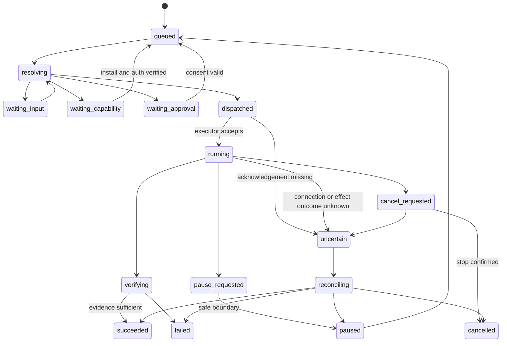

# System Architecture v2 — Conversation Platform

**Ngày:** 16/09/2026, cập nhật 19/09/2026 · **Trạng thái:** thiết kế; phần đã implement nằm trong `apps/` và `packages/` của repo này, và code là nguồn sự thật cho hành vi — tài liệu này giữ ranh giới, quyết định và nơi cư trú của từng phần. Sơ đồ tổng quan mới nhất: [system-architecture.png](system-architecture.png); khi văn bản và sơ đồ khác nhau, sơ đồ thắng và văn bản phải được sửa theo.
**Phạm vi:** [scope-lock.md](scope-lock.md). Tất cả API/types có tên `agent.*`, NodeLink và CapabilityPack bên dưới là contract đề xuất của app, không phải API chính thức của Pi/MCP.

## 1. Thay đổi kiến trúc cốt lõi

Không còn thiết kế “desktop app có một helper, sau này đưa helper lên server”. Sản phẩm là **portable runtime với nhiều conversation clients** ngay từ đầu. Desktop là một distribution gồm runtime + Electron shell; server là cùng runtime không Electron, có web client tùy chọn. Chạy hai node không bắt buộc một cloud account của nhà phát triển app.

Core không cố biến toàn bộ mạng thành một máy tính có filesystem và database chung. Mỗi node có danh tính, quyền, credentials và tài nguyên riêng. Sự liền mạch nằm ở giao tiếp, delegation và presentation; không nằm ở việc giấu mọi sự khác biệt hay tự copy secrets.

## 2. Sơ đồ tổng quan


Media arrows không có nghĩa mọi widget được tự kết nối mọi provider. Network/media grants, SDK tokens, user gesture và quyền thiết bị đều được kiểm tra. Sơ đồ là biên chức năng; không triển khai mỗi box thành microservice.

## 3. Stack đã chọn

| Lớp | Quyết định | Căn cứ / ranh giới |
|---|---|---|
| UI chung | React + TypeScript + Vite | Cùng conversation components cho desktop và web; không phụ thuộc Node trong renderer |
| Desktop | Electron main/preload mỏng | OS dialogs, notifications, Keychain, local driver consent; không chứa scheduler |
| Runtime | Node.js LTS, TypeScript | Phù hợp Pi SDK và tool ecosystem; pin versions ở compatibility gate |
| Agent | Pi SDK qua duy nhất `pi-adapter` | Không fork agent loop; app quản lý tasks và resources riêng [R01–R04] |
| API | HTTP framework nhỏ hỗ trợ schemas + WebSocket | JSON over HTTPS, typed contracts; Fastify là implementation mặc định đề xuất |
| Local transport | Authenticated Unix socket | Không public listener mặc định trên desktop; có bridge vào cùng command handlers |
| Persistence | SQLite WAL per node + durable outbox/inbox | Mỗi DB một runtime writer; không remote/shared filesystem cho live SQLite |
| Blobs | Local content store với metadata/digest | Transfer có scope, hạn mức, retention; object storage adapter về sau |
| Contracts | Runtime schema validation + generated types | JSON Schema/Zod adapter; version negotiation, không chỉ TypeScript |
| Built-in widgets | Trusted React catalog, lazy chunks | Chart/table/form/map/calendar/editor… từ descriptors có schema |
| Mini-apps | Isolated origins/iframes, MCP Apps host adapter | UI tùy biến không ở privileged renderer; host-mediated actions [R06–R08] |
| Execution | Child processes + OS isolation khi cần | Process riêng không phải sandbox; untrusted tool services chạy container/VM phù hợp |
| Linux delivery | Non-root OCI image + optional native bundle/service | Runtime không yêu cầu display; browser/virtual desktop tách images |
| Voice | Gemini Live (`gemini-3.8-live`) sau proxy WebSocket phía node | Browser không giữ credential provider, kể cả token ngắn hạn; [ADR-001](research/adr-001-gemini-live-provider.md) thay lựa chọn GPT-Live của blueprint [R29] |
| Connectivity | Reachable HTTPS hoặc private-network adapter | Tailscale là một lựa chọn đã có NAT traversal; không bắt buộc để dùng local [R28] |

Không đổi toàn bộ runtime sang Go/Rust chỉ vì có VPS: yêu cầu portability được giải quyết bằng headless boundary, packaging và OS adapters. Native helper chỉ dùng khi thực sự cần OS APIs, không là lần viết lại Pi thứ hai.

### 3.1 Pi Chord: thử nghiệm, không khóa dependency mù quáng

Chord trong ecosystem Pi có plugin facets, service/state/lifecycle primitives hữu ích để thử cho PackHost. Nhưng nó không thay thế NodeLink, auth, effect ledger hoặc protocol replay của app. Tài liệu hiện tại không quy định application wire envelope; không coi phần planned symmetric RPC là đã có. P0 thử Chord phía sau interface `FacetHost`; giữ implementation độc lập tối thiểu nếu compatibility chưa đạt. `node:vm` không phải sandbox bảo mật [R05, R27].

## 4. Ba mặt hoạt động

**Control plane:** commands, task revisions, approvals, capability discovery, install state, pin metadata. Durable, nhỏ, authenticated.

**Execution plane:** Pi worker, tool service, browser profile, OS driver, builds và API effects. Nằm ở node được chọn, có lease, cancel và budgets.

**Media/data plane:** audio live, video call, desktop frames, file blobs lớn. Dùng transport thích hợp, không đổ raw media vào SQLite/event replay hoặc conductor context. State có media session references, không phải từng frame.

Một remote task không có nghĩa audio phải đi vòng qua tất cả VPS. Client có thể thiết lập transport tới provider sau khi auth broker của node liên quan cấp credential tạm đúng loại.

## 5. Các entity và quyền sở hữu

| Entity | Ý nghĩa | Authority |
|---|---|---|
| Owner / Principal | Người dùng, client, node peer hoặc extension identity | Auth/policy của node nhận request |
| Node | Một runtime installation, có key identity và capability inventory | Chính node đó |
| Conversation | Timeline người dùng tương tác | Một home node tại một thời điểm |
| Task | Mục tiêu người dùng, revision, outcomes | Node tạo task; child task ở execution node có lineage |
| Run | Attempt cụ thể trên task revision | Execution node |
| Pi session | Agent context và session history | Một worker owner; không đồng thời ở nhiều nodes |
| Resource | Workspace, file, browser profile, desktop, integration account | Node nắm resource |
| Delegation | Phạm vi công việc và capabilities được ủy quyền | Sender grant + receiver policy, dùng phép giao |
| Surface snapshot | Response UI ở một thời điểm | Home conversation store |
| Widget instance | Mini-app có persistent state, actions, connections | Một instance owner node; user/account scoped |
| Pin | Tham chiếu instance và preference hiển thị | Home conversation/client preference |
| Connection | Authorized external account, scopes, health | Node giữ credentials và adapter |
| Capability install | Package/artifact versions, facets, granted resources | Node cài package |
| Effect | Tác động đã chuẩn bị/gửi/xác nhận hoặc chưa rõ | Execution node thực hiện effect |
| Artifact | Blob/dataset/evidence metadata | Node tạo; bản copy có lineage/digest |

Task, session, widget và connection có vòng đời khác nhau. Task hoàn thành không làm Spotify player hay note bị xóa. Session reload không là lệnh chạy lại action trên widget.

## 6. Process và distribution model

### Desktop distribution

- Electron renderer chạy sandboxed, `nodeIntegration: false`, `contextIsolation: true`, CSP và IPC sender validation. Main chỉ expose typed methods, không generic shell/IPC [R26].
- Runtime helper là chương trình riêng, attach/reconnect được. Đóng window giữ runtime nếu người dùng chọn keep-running; quit runtime khác với đóng UI.
- macOS integration helper thực hiện OS permissions, capture/input driver, credential store. Driver giữ identity/signature ổn định qua release để kiểm thử TCC.
- User có thể dùng desktop như thin client tới server mà không mở local code execution.

### Server distribution

- OCI image core chỉ chứa runtime/web static assets/required dependencies. Browser engine và virtual desktop là optional images/profiles.
- Chạy non-root; writable volume riêng; health/readiness; restart policy. Không mount Docker socket vào worker/tool container.
- Native Linux tarball với runtime bundled + service unit là đường khác cho operator không dùng Docker. Service account tối thiểu, explicit project roots và separate data directory.
- Không mở raw Pi RPC, CDP, VNC hay dev server ra Internet. Public exposure chỉ gateway đã có TLS/auth/rate limits.
- Web UI HTTPS là bắt buộc cho browser features yêu cầu secure context. Local loopback development khác production deployment.

Examples deploy trong implementation plan là templates cần substitute release artifact thực; không bịa registry image hoặc domain đã tồn tại.

## 7. Core services và PackHost

```text
Command Gateway
  -> Authenticate principal + validate schema/version
  -> Resolve conversation/task/widget/resource
  -> Deterministic handler OR conductor intent resolution
  -> Current-policy evaluation + required consent
  -> Durable transaction/outbox
  -> Local executor OR scoped NodeLink delegation
  -> Verify outcome / reconcile unknown effects
  -> Persist event + update conversation/widget/voice summary
```

Core giữ những bất biến mà extension không được thay: identity, permission, secret custody, task/effect state, resource locks, package generation activation, surface action ownership, install consent, budgets và emergency stop.

Pack đóng góp tools, instructions, presenters, custom widgets, drivers, auth/setup descriptors và onboarding recipes. Một pack không được tạo scheduler, global conversation store hoặc hidden root account riêng.

### 7.1 Capability registry

Mỗi capability có stable ID, package/version, execution node, input/output schema, resource kinds, compatibility, auth readiness, invocation route, cancellation, effect category và UI affordances. `installed`, `loaded`, `authenticated`, `authorized`, `healthy` là các trạng thái riêng.

Conductor mặc định chỉ thấy capability summary và danh sách tool chỉ-đọc ngắn mà node đăng ký cho Main Pi (`apps/runtime/src/node-tools.ts`); khi chọn một capability mới nạp schema/skill liên quan. Không dump toàn bộ MCP tools vào mọi lượt model. Dynamic tool activation của Pi có thể được dùng qua adapter khi phù hợp [R03].

Conductor không được có tool tự accept consent, đọc secret values hoặc patch core policy. Tool discovery metadata và mô tả MCP do bên ngoài cung cấp vẫn là untrusted input.

### 7.2 Memory & Search: shared service, và Jev là lớp quyết định

Memory & Search là **service dùng chung trong runtime process**, sống qua Pi swap và không nằm trong worker. Nó gồm năm lớp theo sơ đồ: semantic retrieval (sqlite-vec, exact KNN), lexical retrieval (SQLite FTS5, BM25), structured filters (tasks, projects, source refs, thời gian, principal), local embeddings (E5-small quantized ONNX), và rank + verify (RRF, branches, live status). Corpus là Knowledge & History Store: bảng `messages`/summaries trong SQLite và Pi JSONL session của worker, đều đã qua redaction trước khi persist.

**Jev (TypeSafe System One) là lớp quyết định đặt sau retrieval.** Nó không tìm kiếm, không sinh nội dung và không cấp quyền. Hai đường dùng:

```text
Đường A — điều phối runtime:
  Main Pi cần giao việc → Session Manager liệt kê running runtimes/workers
  → structured filters (node, capability, lease, live status) → ≤N candidates
  → Jev Choice: "candidate nào phù hợp nhất cho intent này?" (+ option none)
  → host verify: lease còn sống, grant đủ, revision khớp → dispatch hoặc hỏi user

Đường B — tìm lại session/ngữ cảnh cũ:
  Main Pi/Context Builder có query → temporal parser + FTS5 + KNN (khi có)
  → RRF hợp nhất → top-K candidates (snippet + provenance)
  → Jev Choice: "kết quả nào đúng ý người dùng?" / Noul: "cần hỏi lại?"
  → host verify → đưa vào context hoặc trả câu hỏi làm rõ
```

```text
Đường C — tìm project/thư mục để mở pi session (Workspace & Project Finder):
  User: "thêm skill mới cho dự án agentkit đi"
  → Finder tra **project index cache** (SQLite): repos/folders đã quét trong approved roots,
    có tên, path, git remote, markers (.git, package.json, README, CLAUDE.md), mtime, last-used
  → cache miss/stale → quét bounded (approved roots, depth/ignore rules, incremental theo mtime)
  → lexical + structured (tên, alias, remote, recent-use) → ≤K candidates
  → Jev Choice: "project nào?" (+ none) → host verify: path tồn tại, thuộc approved roots, không leased
  → tạo WorkerBrief { goal, projectRoots:[path] } → start pi session + initial prompt
  → 0 candidate: hỏi user chọn thư mục; uncertain: một câu hỏi làm rõ (T19), không đoán
```

Finder là control extension của Main Pi theo sơ đồ. Root mặc định là **thư mục home của user**, vì app hướng đa tác vụ (tài liệu, ảnh, dự án viết, không chỉ code); ignore list hệ thống là bắt buộc và người dùng chỉnh roots/ignore qua chat. Cache là bảng `project_index` per node, làm mới incremental khi mở app và khi user nhắc tới thư mục không có trong cache; không quét ngoài roots, không theo symlink ra ngoài, không descend vào trong một project đã nhận diện, không đọc nội dung file để index (chỉ metadata và markers). Recent-use và alias do user đặt là tín hiệu xếp hạng mạnh hơn tên gần giống.

Ràng buộc bắt buộc cho lớp này:

- Jev chỉ thấy **state đã sanitize**: intent, và mỗi candidate là một mô tả ngắn có id opaque (không raw rows, không secret, không full transcript). State là object có tên trường, giới hạn kích thước; local-only mode tắt hẳn call ngoài.
- Output của Jev là **enum trong candidates host cung cấp**, luôn có `none`. Host validate `choice ∈ candidates`, áp ngưỡng confidence/margin, rồi **verify lại live status và authorization** trước khi hành động. Confidence không phải authority.
- Jev **không quyết định side effect**. Với đường A, Jev chọn target; dispatch vẫn đi qua command gateway, lease/epoch fencing và consent như mọi delegation khác. Với đường B, Jev chọn context; không có effect.
- Retrieval phải đúng trước. Jev chỉ có giá trị khi retrieval trả 2–K kết quả gần nhau; 0 hoặc 1 kết quả thì không gọi Jev. Nếu FTS/RRF thuần đã đủ tốt trên corpus thật (đo bằng calibration), lớp Jev được tắt bằng config, không gỡ code.
- Fallback khi Jev vắng/uncertain/timeout: rank thuần từ RRF; nếu vẫn mơ hồ, main Pi hỏi lại người dùng. Không trả kết quả fallback như thể Jev đã chọn.
- Deadline riêng cho Jev (đề xuất ≤2 s trong tổng ≤2.5 s cho search); 429/529/timeout là `unavailable` có reason, không retry storm.
- Telemetry: request id, model id thực tế trả về, duration, tokens, enum đã chọn, reason fallback. Không body, không prompt, không header.

Ba đường A/B/C dùng chung một adapter, một policy confidence và một fallback chain: Jev vắng/uncertain → rank thuần → một câu hỏi làm rõ. Lớp quyết định nay có năm chỗ dùng, khác nhau chỉ ở tập candidate mà host đã lọc trước — hai chỗ dùng nữa, `guard.operation` và `route.model`, được mô tả ở §7.4 và §7.6 kèm trạng thái implementation theo phase:

| Đường | Câu hỏi | Code sở hữu |
|---|---|---|
| A — điều phối runtime | worker/instance nào cho intent này? | `decideRuntimeTarget` |
| B — tìm lại session/ngữ cảnh | kết quả nào đúng ý, hay phải hỏi lại? | `decideSearchResult` (+ Noul) |
| C — tìm project/thư mục | thư mục nào? | `decideProject` |
| D — rich widget | template/section nào cho surface này? | `selectTemplate`, `selectSections` |
| E — tin đến khi đang chạy | steer, interrupt hay background? | `decideTurnAction` |

A, B, C và E nằm ở `apps/runtime/src/jev-decider.ts`; D ở `apps/runtime/src/jev-selector.ts`, cùng adapter và cùng policy. E là một quyết định chứ không phải một quy tắc vì ba câu trả lời không thay thế được cho nhau: steer đổi việc đang làm, interrupt vứt nó đi, background tiêu thêm một call cho việc người dùng có thể không định tách ra. Khi không đủ chắc, E nghiêng về `interrupt` — hướng lấy lại được, thay vì hướng im lặng. Cấu hình và vận hành: [mini-app/jev-configuration.md](mini-app/jev-configuration.md).

**Trạng thái đo được (2026-09-17).** Cấu trúc trên đã có trong repo, và ba con số quyết định cấu hình đã đo thay vì suy đoán:

| Lớp | Trạng thái | Số đo / lý do |
|---|---|---|
| Lexical (FTS5 + BM25) | **Mặc định đang dùng** | 96,8% trên corpus nhãn (Phase 8) |
| Jev cho search | Tắt bằng config, code còn nguyên | Calibration live `jev-1.13.0`: `rank` 31/34 vs `jev` 31/34 — không hơn thì không trả thêm một call mỗi lần search |
| Semantic (sqlite-vec + E5-small) và RRF | Triển khai xong, **tắt mặc định** | Hybrid 31/34 ở ceiling cosine 0,1 nhưng 25/34 khi ceiling ≥0,2: KNN luôn trả hàng xóm gần nhất nên câu hỏi "không có đáp án" bị trả về kết quả gần đúng |

Deadline trong bảng ràng buộc ở trên nay là hằng số được enforce: 2 s cho một quyết định, tổng 2,5 s cho đường search (`SEARCH_DECISION_TIMEOUT_MS`, `SEARCH_TOTAL_BUDGET_MS`), và hết hạn thì trả về rank thuần kèm reason chứ không giả vờ Jev đã chọn. Extension `sqlite-vec` được probe trên cả hai platform repo chạy: `v0.1.9` trên darwin arm64 (máy dev) và linux x64 (CI), với create/insert/KNN đều chạy. Ở đường C, câu hỏi "thư mục nào?" nay trả lời được bằng path người dùng gõ: path đọc từ câu gốc (trước redaction vì redactor thay path bằng placeholder), thư mục được nêu tên vẫn phải nằm trong approved root, và thư mục dùng gần nhất được **hỏi** thay vì tự mở.

### 7.3 Pi runtime: Main Pi, control extension và worker

Sơ đồ tách "Pi Runtime — MAIN SESSION" khỏi "Other pi Workers". Mục này không thay sơ đồ — nó chỉ bổ sung nơi cư trú trong code và những ranh giới mà một sơ đồ không hiển thị được, nên chỗ nào sơ đồ mô tả khác thì sơ đồ vẫn thắng.

**Seam SDK.** `packages/pi-adapter` là package duy nhất import SDK Pi. Mọi phần khác phụ thuộc interface `PiAdapter` (`packages/pi-adapter/src/types.ts`), nên một breaking change của SDK là thay đổi adapter chứ không phải refactor core. Hai implementation: `RealPiAdapter` (typed theo declaration của SDK) và `FakePiAdapter` (in-process, tất định, cho test và CI — đây là thứ cho phép chạy cả ứng dụng mà không cần provider account). Các bước lifecycle mà SDK thực sự làm được ghi ở [research/compatibility-lock.md](research/compatibility-lock.md), sinh bởi `packages/pi-adapter/src/probe-cli.ts`; file đó ghi môi trường đã đo nên không sửa tay.

**Main Pi và control extension.** Main Pi là session chính của hội thoại; các control extension dưới đây là code của node, sống trong `apps/runtime` chứ không trong worker — đó chính là điều kiện để chúng sống qua một lần Pi swap.

| Trên sơ đồ | Code sở hữu | Ranh giới giữ nguyên |
|---|---|---|
| Task planning | conductor trong `packages/core`, `apps/runtime/src/runtime-candidates.ts` | chọn node/worker theo resource locality, grant và lease còn sống, không theo CPU rảnh |
| Session Manager | `apps/runtime/src/session-store.ts` (list/resume), `session-search.ts` (search) | liệt kê session không đọc nội dung transcript |
| Process Controller | `apps/runtime/src/model-turn.ts`, `background-sessions.ts`, `work-supervisor.ts` | turn control (`running`/`interrupt`/`steer`) nằm trên chính object turn, không ở map bên cạnh; mọi việc chạy nền khác đi qua một supervisor duy nhất |
| Workspace & Project Finder | `apps/runtime/src/project-finder.ts` | chỉ metadata và marker; không đọc nội dung file để index |

**Tool Main Pi thấy.** Node công bố tool của mình **lúc boot** (`apps/runtime/src/tool-catalogue.ts`), không dựng theo yêu cầu: một danh sách chỉ tồn tại trong closure thì không có gì khẳng định được nó. Tool chỉ-đọc cấp cho Main Pi ở `apps/runtime/src/node-tools.ts`; tool built-in của Pi được liệt kê riêng. Không dump toàn bộ MCP tools vào mọi lượt model (§7.1).

**Worker.** Mỗi project một worker pi session với brief riêng (`WorkerBrief`: goal, `projectRoots` đã được duyệt, capability refs, tool set, model). Tool set phải đăng ký lúc tạo session: SDK cố định nó tại thời điểm đó, và một tool thêm sau vừa lọt allowlist vừa không xuất hiện trong system prompt. Pi chạy trong process của runtime; runtime chỉ spawn process ở ba chỗ: `apps/runtime/src/run-command.ts` (lệnh của model), `terminal-sessions.ts` (shell) và `worker-process.ts` (task worker). Một lần spawn có cần người duyệt hay không do `ExecutionPolicy` quyết định (§7.4): mặc định là `guarded`, nghĩa là không hỏi ai và preflight của host vẫn giữ containment.

**Quản lý tiến trình: một supervisor cho mọi việc đang chạy.** Người dùng chỉ nói chuyện với một Clark, nên node không có danh sách process để họ quản lý; thay vào đó mọi việc chạy nền — việc nền (background request), lệnh `run_command`, task worker và terminal — đăng ký với cùng một `WorkSupervisor` (`apps/runtime/src/work-supervisor.ts`, dựng ở `bootstrap/work-bootstrap.ts`). Mỗi việc có một `workId` riêng, kể cả hai việc nền trong cùng một hội thoại, nên dừng một việc không dừng nhầm việc kia. Cùng một đường dừng phục vụ nút trong panel tiến trình (`POST /work/:id/cancel`), tool `list_work` / `stop_work` của Main Pi (`work-tools.ts`), `POST /stop` và shutdown; terminal được liệt kê nhưng agent không đóng được — shell là của người dùng.

- **Giới hạn.** Việc nền chạy tối đa 3 cùng lúc (Settings → Control chọn 1/3/5, preference `execution.backgroundLimit`, đọc lại ở mỗi lần nhận việc), hàng chờ tối đa 10; đầy thì từ chối bằng lời và nói việc nào đang chạy, không xếp hàng vô hạn — và không ngắt lượt chính đang trả lời. Nâng giới hạn trong Settings thì việc đang chờ được chạy ngay; bỏ một việc khỏi hàng chờ thì hội thoại được báo là chưa có gì chạy. Mỗi việc nền có deadline 20 phút (`CC_BACKGROUND_MAX_MS`); hết giờ ghi là `failed`, không phải `stopped`. Task worker giữ pool 2 và hàng chờ 10 của dispatcher. Lượt chính của hội thoại không bao giờ bị tính vào giới hạn.
- **Dừng theo process group.** Mọi child chạy trong process group riêng (`detached`); dừng là SIGTERM cho cả group, chờ 1,5 giây, rồi SIGKILL (`apps/runtime/src/process-tree.ts`; Windows dùng `taskkill /T /F`), nên con cháu của một lệnh không sống sót sau khi lệnh bị dừng — kể cả khi shell đã thoát mà `sleep 60 &` vẫn giữ pipe. Sau khi child đã thoát, chỉ group được gửi tín hiệu, không bao giờ pid trần (pid có thể đã được cấp lại); pid ≤ 1 bị từ chối. Worker bị giết bằng tín hiệu được chốt trạng thái qua state machine như mọi lần từ chối khác, không để task treo ở `running`.
- **Budget của task.** `budget.maxWallClockMs` dừng worker bằng đúng đường dừng trên và báo là hết budget chứ không phải "bạn đã dừng"; `budget.maxTokens` được kiểm sau khi worker báo usage — token đã tiêu rồi, nên đây là từ chối nhận kết quả, không phải ngăn chặn. `budget.maxDelegationDepth` chưa được thực thi: chưa có trường nào ghi độ sâu uỷ quyền của chính một task.
- **Env của child.** Terminal giữ environment vốn có trừ những gì node tự đưa vào (biến do `.env` nạp, provider key, secret mà broker phục vụ từ environment); `run_command` chỉ nhận allowlist cố định (`COMMAND_ENV_ALLOWLIST`) cộng đúng secret broker cấp cho lệnh đó. Lọc theo *nguồn gốc* biến chứ không theo ai mở child, vì model gõ được vào shell người dùng mở (`apps/runtime/src/child-env.ts`).
- **Journal và phục hồi sau restart.** Mỗi việc được ghi vào bảng `work_runs` (migration 24) cùng boot id của node, pid/pgid, start time của pid trong `/proc` và `boot_id` của máy. Lần boot sau (`work-recovery.ts`) báo mỗi việc dở dang một lần vào đúng hội thoại đã yêu cầu nó; chỉ dừng process còn sót khi cả start time lẫn boot của máy khớp, nên pid đã được kernel cấp lại cho process khác không bao giờ bị đụng. Việc nền chỉ-đọc được chạy lại **một lần** nếu policy là Autonomous, việc còn dưới 24 giờ và chưa từng chạy lại; mọi trường hợp khác thì hỏi. Lệnh có effect không bao giờ tự chạy lại — kết quả được báo là chưa kiểm chứng; task đang thực thi chuyển sang `uncertain` qua state machine thông thường. Row đã kết thúc giữ 7 ngày.
- **Shutdown.** Từ lúc nhận SIGINT/SIGTERM, node không nhận việc nền, lệnh hay task mới. Sau đó đi qua đúng emergency stop ở trên, rồi `drain` supervisor (việc nền thành `interrupted` trong bộ nhớ nhưng row journal được *giữ mở* và không báo gì vào hội thoại — chính row mở đó là thứ lần boot sau đọc để báo), rồi mới đóng session, socket và DB. Tổng thời gian có trần 5 giây; tín hiệu thứ hai thoát ngay. Khi thoát cứng (trần 5 giây hoặc tín hiệu thứ hai), SIGKILL được gửi đồng bộ tới group của mọi lệnh và worker còn sống trước `process.exit`, vì timer của bước hai không bao giờ chạy trong process đã thoát.

**Session file.** Transcript là JSONL dưới `<dataDir>/sessions`; không cấu hình `sessionDir` thì session là in-memory và không có gì để search. Adapter báo đường dẫn qua `onSessionFile`, node kiểm tra nó nằm trong thư mục session rồi mới đăng ký index. Resume đi qua `checkResumable` trước: một row còn trong DB mà file đã mất là lỗi được trả về, không phải một lần mở hỏng sâu trong SDK.

### 7.4 Autonomy: execution policy, host preflight, guardrail và secret broker

**Trạng thái (2026-09-19):** đã triển khai trọn P1–P8 và governance. Preflight ở `apps/runtime/src/preflight.ts`, guardrail ở `jev-decider.guardOperation`, secret broker ở `apps/runtime/src/secret-broker.ts`, hồ sơ vết ở `packages/storage/src/audit.ts` (bảng `audit_log`). Mục này không thay sơ đồ — sơ đồ vẫn đúng ở mức biên chức năng; phần dưới ghi nơi cư trú trong code và những ranh giới mà một sơ đồ không hiển thị được.

Triết lý đổi từ “model đề xuất → user duyệt → host chạy” sang “user cho intent → agent tự hành động → host giới hạn → Jev phán đoán → evidence báo cáo”. Thứ giữ nó kiểm soát được không phải hộp thoại xin phép, mà là bounded execution, resource ownership tường minh, secret isolation, Jev policy, evidence, emergency stop và audit trail.

Thứ tự bắt buộc của một effect:

```text
intent (Pi tool / action)
  → Host Preflight        deterministic, không gọi model
  → Jev Guardrail         policy judgment, chỉ được thu hẹp
  → Execution Broker      chạy ngay; approval không còn là mặc định
  → Secret Broker         inject just-in-time
  → evidence + audit
```

**Host Preflight là invariant cứng, không phải policy.** Nó chạy trước mọi quyết định của model và không bị ghi đè: schema của tool/action, capability có thật và đã cài, resource có thật và thuộc quyền sở hữu, budget (timeout, output cap, số target), và ranh giới secret. **Containment theo resource ownership** thuộc tầng này: mọi effect — cwd của command, đường dẫn ghi, target của tool — phải nằm trong resource mà conversation/node sở hữu; ra ngoài bị từ chối ngay ở preflight.

**Jev là policy judgment layer, không phải security boundary.** Nó trả `allow` / `deny` / `constrain` / `clarify`, và **chỉ có quyền thu hẹp** một operation mà preflight đã xác định là technically valid. Nó không cấp quyền, không mở rộng scope, không đọc secret value. `clarify` không phải xin phép: đó là câu hỏi làm rõ giữa nhiều khả năng đều hợp lệ (“xoá project nào?”), đi qua Interaction Manager (§7.5), không phải “bạn có cho phép không?”.

State gửi cho Jev tuân cùng ràng buộc sanitize ở §7.2. Với command, state là `effect`, `commandClass`, `cwdScope`, `executable`, `recursive`, `estimatedTargets` — không phải raw command, raw output hay secret. Khi một số command buộc phải xem đúng command text thì gửi bản redacted và bounded.

**`ExecutionPolicy` thay cho boolean approval.** `auto` | `guarded` | `confirm` | `deny`, mặc định `guarded`: không hỏi user, Jev được phép block hoặc constrain. `confirm` tái tạo đúng hành vi approval hiện tại và tồn tại như một policy mode — approval infrastructure không bị xoá. Khi Jev không khả dụng, mặc định là allow (fail-open) và user đổi được trong settings, nhưng fail-open chỉ bỏ lớp judgment: preflight và containment vẫn hiệu lực.

**Secret Broker.** Credential không còn là một KV mà model đọc được. Metadata của secret (name, description, kind, backend, allowed_consumers, injection_policy) nằm trong DB; value nằm ở backend (`os-keychain`, `encrypted-file`, `environment`, `external-vault`) và goal này implement abstraction với store hiện tại là backend đầu tiên, keychain adapter để sau. Agent chỉ nhận metadata. Value chỉ được resolve ở boundary của một invocation, theo bốn exposure mode: `tool-only` (mặc định), `process-env`, `http-header`, và `agent-context` (chỉ khi được chỉ định tường minh, không bao giờ là default). Secret sống trong lexical scope của invocation đó và không được ghi vào transcript, model context hay continuation. `request_secret` là host tool để agent xin một secret đang thiếu: host thấy đã có thì trả `available`, chưa có thì mở credential-card.

**Stop và audit trail.** Hai control còn lại, và cả hai đều không mới về giao diện: `POST /stop` dừng cả process group của mọi child đang chạy (lệnh, task worker, terminal), ngắt các turn đang chạy, rồi huỷ mọi việc nền qua work supervisor (§7.3) — kể cả việc còn trong hàng chờ. Command bị dừng được ghi nhận là `stopped` chứ không phải `failed`, vì đó là hai sự việc khác nhau và một hồ sơ vết không phân biệt được thì sẽ đánh lừa người đọc sau. Mọi effect đi qua `appendAuditEvent`: command (đường guarded và đường confirm), mỗi lần dùng secret (theo **tên** và consumer, không bao giờ theo giá trị), và mỗi lần stop. Bảng chỉ ghi thêm, không sửa không xoá, và cố tình nông — một hồ sơ vết chứa đối số, output hay transcript sẽ là bản sao thứ hai của đúng những thứ phần còn lại của thiết kế này giữ ở một chỗ.

**Terminal: đường effect thứ hai cho command.** Agent gõ lệnh vào terminal (`terminal_open` / `terminal_run` trong `apps/runtime/src/terminal-tools.ts`) đi qua đúng thứ tự trên — preflight, execution policy, guardrail — với cwd là thư mục shell đang đứng do prompt báo lại qua OSC 133, không phải thư mục lúc mở. Khác biệt duy nhất là nghĩa của *ask*: lệnh được điền sẵn trên prompt và không chạy; người dùng nhấn Enter là xác nhận. Lệnh chứa ký tự điều khiển bị từ chối trước preflight, vì một phím tab hay ^U trong line editor làm dòng chạy khác dòng được xét; dòng người dùng đang gõ dở không bao giờ bị gõ đè. Marker OSC 133 mang một bí mật riêng cho từng terminal, giữ trong biến shell chứ không nằm trong environment, nên output của một lệnh không giả được điểm bắt đầu/kết thúc hay exit code. Audit được ghi khi lệnh thật sự được gõ. Stop và nút đóng gửi SIGHUP rồi SIGKILL cả session của terminal (`apps/runtime/src/terminal-sessions.ts`). Những gì người dùng tự gõ là hành động của chính họ và không đi qua policy.

### 7.5 Interaction Manager: một primitive cho mọi câu hỏi từ host

Approval, câu hỏi làm rõ và yêu cầu credential là cùng một loại việc: host đang chờ người dùng, và Pi không được giữ một provider call mở để chờ. `PendingInteraction` là abstraction chung:

```ts
type PendingInteraction =
  | ApprovalInteraction
  | QuestionInteraction
  | CredentialInteraction;
```

Interaction Manager sở hữu `create()` / `answer()` / `cancel()` / `expire()` / `pendingForConversation()`. Text UI, voice và widget cùng thao tác trên một interaction và gọi cùng một endpoint — không có hai code path cho cùng một câu trả lời.

`ask_user_question` là host tool với bốn kind ưu tiên voice: `confirm`, `single-choice`, `multi-choice`, `text`. Host tự sinh voice prompt từ structured options nên agent không phải bảo trì hai bản. Tool này **kết thúc lượt hiện tại** rồi settle: câu trả lời được persist, append vào conversation như một message người dùng thấy, và mở một lượt Pi mới. Không await input bên trong tool execution.

Ranh giới phải giữ: `ask_user_question` không dùng để hỏi secret. Câu trả lời đi vào conversation và model đọc được, nên host từ chối deterministic khi câu hỏi đòi secret và trỏ sang `request_secret`. Voice hiểu mọi dạng interaction đang pending, không chỉ thẻ duyệt: `answerFromUtterance` khớp lời nói với nhãn mà card đã đưa, rồi trả lời qua đúng một đường (`answerQuestionForNode`) mà một cú bấm cũng dùng.

### 7.5.1 Hộp thư: việc chờ user và thông báo

Hộp thư (`apps/runtime/src/inbox.ts`, `routes/inbox.ts`) gom hai thứ khác authority về một chỗ đọc:

- **Việc chờ** — lệnh cần duyệt, quyền gói xin cấp, câu hỏi đang mở — **không được lưu**. Mỗi lần đọc suy ra lại từ
  bảng `approvals`, thẻ trong `messages` và `pendingForConversation`, nên hộp thư không thể nói một việc còn chờ sau
  khi nó đã được quyết định trên thẻ hoặc đã hết hạn. Hộp thư không có route quyết định riêng: nút Duyệt/Từ chối gọi
  đúng `POST /conversations/:id/approvals/:aid/decide` và route quyền gói mà thẻ dùng. Approval không có thẻ, hoặc
  thuộc một task được điều phối, chưa được đưa ra, vì chưa có route quyết định nào cho nó. Thẻ và câu hỏi được tìm
  trong 2000 tin nhắn mới nhất (theo `rowid`, vì `created_at` không có index); route quyết định đọc cùng đầu đó của
  hội thoại (`latestMessages`), nên một mục hộp thư đưa ra luôn là mục route tìm được. Thẻ cũ hơn cửa sổ đó không
  được đưa ra, và approval của nó vẫn hết hạn theo TTL.
- **Thông báo** — kết quả việc nền, dispatch của worker; về sau là cập nhật Pi/gói/widget và tin từ node khác — là
  sự kiện đã xảy ra, **được lưu** trong bảng `notifications` (migration 26). Producer gọi `recordNodeNotice` /
  `tryRecordNodeNotice` (`apps/runtime/src/notices.ts`); ghi thông báo không bao giờ làm hỏng việc đã sinh ra nó.
  Ghi là idempotent theo `(principal, dedupKey)` — cùng một sự kiện gửi lại (retry, hoặc qua NodeLink) không thành
  hai dòng — text được redact và cắt ngắn, và bảng tự dọn: mỗi principal giữ tối đa 200 thông báo **chưa bỏ** (cũ
  nhất đi trước), còn thông báo đã bỏ chỉ bị xoá khi quá 30 ngày, nên việc bỏ không đẩy một thông báo chưa đọc ra
  ngoài. Việc nền được điều phối khi xong ghi một thông báo mỗi task (`workerSettledNotice`, khoá `worker:<taskId>`).
  `originNodeId` để dành cho thông báo đến từ node khác.

Route: `GET /inbox`, `GET /inbox/summary` (hai số cho dấu trên header), `POST /inbox/read` (`noticeIds` hoặc tất cả),
`POST /inbox/notices/:id/dismiss`. Contract ở `packages/contracts/src/inbox.ts`. UI ở DESIGN.md §6.7; mở bằng
intent `inbox.open` (text, voice, `control_app`). Agent đọc cùng dữ liệu đó qua tool chỉ đọc `read_inbox`
(`apps/runtime/src/read-inbox-tool.ts`): không đánh dấu đã đọc (người dùng chưa nhìn thấy) và không quyết định được gì
(model không phải người dùng).

Bảng `notifications` không phải `inbox` của NodeLink trong §10: cái sau là hàng đợi lệnh giữa các node, cái trước là
những gì user được báo.

### 7.6 Model Registry: nhiều model profile, và đổi model là một generation mới

`/model` hiện là một preference đơn (`key: "model"`, scope `node`). Đích là một registry của user: nhiều profile, mỗi profile có alias, provider, modelId, enabled, roles (foreground/background/coding/research/fast/long-context), priority và budget riêng. Catalogue không được copy — `provider/modelId` luôn validate lại với catalogue của Pi qua `packages/pi-adapter` (`validateProfileAgainstCatalogue`). Pool lưu trong preferences (`model-pool`), không thêm bảng.

Pi resolve model lúc session được tạo, nên shortcut đổi model **không mutate session đang sống**: `POST /model-pool/cycle` ghi preferred model, và `apps/runtime/src/model-turn.ts` tạo generation mới bằng `handoff()` ở ranh giới lượt — ngay khi session rảnh, và sau lượt đang chạy vì `turnFor` chỉ chạy khi một lượt bắt đầu. Một conversation giữ nhiều generation với model khác nhau; durable memory nằm ngoài Pi nên không bị ảnh hưởng.

Foreground tôn trọng model user chọn. Background worker đi qua deterministic filter trước (`apps/runtime/src/model-router.ts`: enabled, credential, provider health, context đủ, tool calling, budget, role), rồi Jev `route.model` (`decideModelRoute`) chọn trong tập còn lại; host verify lại profile trước khi tạo session. `role` xét hai lượt: profile khai báo đúng role thắng khi có, còn khi không ai khai báo thì capability quyết — từ chối chạy việc nền vì một lý do không hiện ra ở đâu trên màn hình là rút mất một tính năng cốt lõi. Fallback khi Jev vắng: backgroundDefault → foreground → first eligible. Router chết không làm task fail, và worker chạy model node đã cấu hình nếu không có profile nào đủ điều kiện.

## 8. Task/session routing

Routing: explicit reference → aliases/project registry → recent tasks/instance focus → state/resource verification → answer/status/resume/new task/clarify/delegate. Khi bước "recent tasks/instance focus" hoặc "delegate" còn nhiều ứng viên gần nhau, lớp quyết định Jev (§7.2) chọn trong tập đã lọc; verification vẫn là bước sau và là bước quyết định cuối.

Node placement xét resource locality, allowed operations, connected credentials, OS/driver capability, active leases và user preference. Không chỉ chọn node có CPU rảnh. “Sửa ứng dụng trên máy này” không được gửi repo lên VPS chỉ vì network đang nhanh.

Worker context gồm bounded task brief, approved skills, selected project context và resource references. Conductor context gồm relevant history, user preferences, task summaries và semantic widget state. Không upload all transcripts, DOM, datasets hoặc screenshots theo thói quen.

Pi sessions thuộc app-managed resource tree. Nếu cần successor session sau install/model/context change, giữ task identity và handoff có evidence; không resume lại dòng tool cũ như một command mới. Một JSONL file không chứng minh worker đang sống.

## 9. Task/effect lifecycle



Sơ đồ mô tả main paths; implementation phải có reducer/transition table đầy đủ: mọi nonterminal nhận cancel, resolving failures không treo vô hạn, terminal chỉ tạo run mới rõ lineage. `waiting_capability` giữ continuation, không chiếm worker liên tục hoặc tự lặp install prompts.

Worker idle, LLM kết thúc lượt hoặc socket đóng không là success. Outcome có evidence: exit status, file/diff version, API receipt/read-after-write, observed browser state; nếu không có số tests thì không bịa số tests.

Effect ledger per executor: `prepared → submitted → confirmed | failed | unknown`. External side effect không atomic cùng DB. Duplicate commands dùng durable idempotency keys; external API không hỗ trợ dedup thì timeout phải reconcile, không hứa exactly-once.

### Leases

Một writer/worktree hoặc approved folder; Git operations tác động shared refs cần repo-common lock. Browser profile và foreground desktop có input lease riêng; voice và video có media-focus coordination. Lease/epoch fencing chặn brokered actions cũ; không chặn ngược một shell script đã được cấp OS quyền rộng. Không quảng cáo distributed lease là sandbox. Lease hết hạn được giải phóng định kỳ mỗi 60 giây (`apps/runtime/src/lease-sweeper.ts`, `sweepExpiredLeases`) chứ không chỉ khi có người tranh cùng resource, nên một resource không ai tranh không bị đọc là "đang giữ" mãi. Fencing theo epoch tại bước `prepared → submitted` của effect chưa được nối, vì chưa có code nào thực hiện bước chuyển đó.

## 10. Storage

Mỗi node: SQLite WAL với migrations; app events/outbox/inbox; native Pi session history (JSONL) tách logical authority nhưng được index vào Memory & Search (§7.2); blob store có quotas. Không cố commit atomically cùng Pi JSONL; run markers và reconciliation nối hai phần.

Outbox tới peer có backoff và dead-letter (migration 25, `packages/storage/src/repositories/outbox.ts`): lần gửi thất bại hẹn lần sau theo lịch tăng gấp đôi từ 5 giây, trần 15 phút; sau 12 lần thì message được đánh dấu dead-letter, giữ lại cùng lý do lỗi cuối (đã che bearer token và credential trong URL) để người vận hành xem chứ không gửi lại mãi. Huỷ một task đang chạy trên node khác đưa một `cancel.request` vào chính outbox này (`cancelTask` trong `packages/core/src/task-service.ts`); task ở lại `cancel_requested` cho tới khi executor báo về. **Chưa có:** vòng gửi outbox định kỳ trong production (`deliverPending` hiện chỉ được gọi trong test), và phía nhận chưa dừng worker khi nhận `cancel.request` — node nhận chưa tạo task từ `delegate`, nên việc thực thi xuyên node vẫn chưa chạy thật và chưa có gì để dừng.

Memory & Search giữ hai corpus với hai authority khác nhau: bảng `messages` là nguồn sự thật của timeline, còn JSONL transcript của worker là thứ worker đã thực sự làm. Hai nguồn vào cùng một service nhưng không đồng bộ hai chiều: một row `session_files` cho mỗi transcript, con trỏ ingest chỉ tiến, và redaction chạy ở boundary do adapter chọn (cuối một lượt, khi không còn gì đang ghi) trước khi nội dung vào index. Tập bảng cụ thể do `packages/storage/src/migrate.ts` sở hữu; đừng chép lại ở đây.

Hai thứ cố ý **không** bền vững, và lý do là một phần của thiết kế: danh sách background session sống trong bộ nhớ (`apps/runtime/src/background-sessions.ts`), vì một session sống lâu hơn process đã sinh ra nó là session không ai với tới — thứ bền vững là journal `work_runs` (§7.3), đủ để lần boot sau báo và xử lý việc dở dang chứ không để nối lại session — và danh sách đó bị chặn hai đầu (mục đã xong quá 10 phút thì bỏ, giữ tối đa 20 mục đã xong, không bao giờ bỏ mục đang chạy), vì kết quả của việc nền nằm ở hội thoại nên một danh sách dài vô hạn chỉ trả lời lại câu đã có câu trả lời; và telemetry của Jev bị chặn ở 200 dòng trong bộ nhớ, không ghi xuống DB.

Khi một session mới được tạo cho hội thoại đã có mạch, lượt đầu được nhắc bằng brief của 12 message gần nhất, mỗi dòng cắt ngắn (`apps/runtime/src/model-turn.ts`). Đó là cách đặt model vào mạch đang làm, không phải chép lại hội thoại: một brief dài theo hội thoại thì không còn là brief.

Nhóm bảng: principals/nodes/grants; conversations/messages; tasks/runs/delegations; commands/events/outbox/inbox; notifications (§7.5.1); resources/leases; effects/approvals; packages/install_plans/generations; connections/auth_transactions; widget_instances/snapshots/pins/action_bindings; datasets/artifacts; preferences/onboarding_checkpoints/usage.

Secrets lưu trong vault abstraction: macOS Keychain hoặc server secret store/encrypted-at-rest storage với key nằm ngoài DB backup. Metadata của secret — name, description, kind, backend, allowed_consumers, injection_policy — nằm trong DB; value nằm ở backend và chỉ được resolve ở boundary của một invocation, không đi vào context của model (§7.4). File permissions không thay encryption; container env cũng không là giải pháp tránh mọi leak. Bootstrap/recovery key và backup procedure phải có test; không tự sinh key rồi lưu cùng plaintext DB và gọi là bảo mật đầy đủ.

**`memory_records` không phải index tìm kiếm thứ hai.** Nó là những câu agent chọn giữ, kèm conversation đã học được câu đó. Xoá một memory xoá **đường inject** vào các lượt sau — brief được đọc lại mỗi lượt từ DB chứ không cache trong tiến trình — nhưng tin nhắn gốc của người dùng vẫn nằm trong `messages` và vẫn nhìn thấy được trong hội thoại. Đây là lý do nó không phải hidden memory: thứ được nhớ luôn đọc được và xoá được ở tab Memory, và thứ bị xoá chỉ là đường nó quay lại prompt. Cùng lý do đó, đường sinh gợi ý không đọc `history_embeddings` và không gọi model: một gợi ý phải là cách đọc những gì người dùng cũng đọc được.

**Blob của tệp đính kèm dùng chung blob store của node** (`dataDir/blobs`, content-addressed, `mode: 0o600`), không phải một kho thứ hai. Bảng `attachments` giữ việc principal nào đính tệp nào vào conversation nào và là chỗ cộng quota; bytes không bao giờ được địa chỉ hoá bằng path trong prompt — prompt chỉ mang `att_…` opaque, và nội dung được đọc qua tool của host với **không** tham số path. Một tệp bị xoá khỏi DB vẫn có thể còn bytes trên đĩa cho tới lần dọn sau, nên "đã xoá khỏi app" không đồng nghĩa "đã xoá khỏi đĩa".

Raw audio/video không lưu mặc định. Screenshots có retention ngắn, chứa dữ liệu nhạy cảm; cấp quyền capture không đồng nghĩa được lưu vĩnh viễn hoặc gửi cho mọi model. Dữ liệu người dùng xóa khỏi app không tự xóa khỏi third-party provider đã nhận.

## 11. Unified UI/action path

Message blocks: text, surface snapshot, widget-instance reference, artifact. Built-ins và custom apps dùng một action host. Agent chọn props, định nghĩa actions theo discovered capabilities hoặc agent intents; implementation không giới hạn mỗi nút vào một handler business cố định do app viết sẵn.

Action definitions được compile thành server-owned bindings, xác nhận schema/quyền/node/account/revisions. Widget không tự gọi tùy ý tool chỉ bằng tên; host reauthorizes invocation. Voice có semantic view của instance đang focus và đi qua cùng path.

Chi tiết pin/live vs snapshot, custom app sandbox và action schema ở [widgets-and-extensions.md](widgets-and-extensions.md).

## 12. Voice/media

Voice chạy trên Gemini Live (`gemini-3.8-live`) sau proxy WebSocket phía node, không phải dependency trong core state model; [ADR-001](research/adr-001-gemini-live-provider.md) thay lựa chọn GPT-Live của blueprint. Client mic/playback ↔ node ↔ provider; runtime giữ durable intent và trusted control path. Transcript fragments/delegation cần correlate/dedup; correction đổi task revision; barge-in chỉ nhường audio, không tự hủy job [R29].

Một call widget, music widget và assistant voice không được tranh microphone/speaker ngầm. `MediaFocusService` thể hiện ai đang dùng mic/camera, duck/pause chỉ theo rule được user chấp thuận. Audio trong Zoom call không tự được gửi vào voice model để “tiện phân tích”. Mute/end có local host control, không phụ thuộc remote node hoặc model.

Kết thúc voice không dừng pinned read subscriptions hay jobs. Reload Pi không restart WebRTC. Worker/node mất mạng thì UI cho tiếp tục text/local actions nhưng không giả remote tool đang chạy được.

## 13. Security baseline

1. Remote endpoints authenticated; app grants giới hạn dù transport private. Principal identity đến từ transport, không do model tự điền.
2. Model/website/package README/MCP descriptions/screenshots đều không được cấp quyền, đổi OAuth endpoint hoặc tự approve.
3. Arbitrary native Pi extensions có quyền process. Untrusted executable không load vào privileged daemon/conductor; dùng isolated service/worker hoặc báo rõ trusted-host risk [R01–R04].
4. Custom widget code không chạy trong privileged app origin. Sandbox, strict bridge, CSP, resource budgets, permission prompts do host.
5. Host-owned consent/credential surfaces không do extension dựng tự do. UI có origin/account/node badge không nằm trong iframe kiểm soát của vendor.
6. Long-lived secrets không gửi renderer/model. SDK frontend đôi khi cần short-lived/scoped token: chỉ cấp qua riêng trusted auth bridge cho đúng isolated origin, không vào widget JSON/history.
7. Browser/computer control không tự thực hiện OS consent, OAuth authorization, CAPTCHA hoặc 2FA. Human takeover là state có thật.
8. Install approvals gồm package digest, dependency plan, target node, grants. Security scan/chữ ký xác thực không chứng minh code an toàn.
9. HTTP fetch/auth discovery giới hạn redirects/private destinations/credential forwarding; user URL không là quyền truy cập internal network.
10. Emergency stop trên máy đang bị điều khiển ưu tiên hơn remote commands. Revocation chặn thao tác tương lai; không hứa rollback effect đã xảy ra.
11. Autonomous mặc định không xoá approval khỏi kiến trúc: containment theo resource ownership và budgets nằm ở host preflight và không model nào ghi đè được, còn Jev chỉ được thu hẹp. Khi Jev vắng, fail-open bỏ lớp judgment chứ không bỏ preflight. Secret value không bao giờ vào transcript, model context hay continuation; `agent-context` exposure phải được chỉ định tường minh.

## 14. Monorepo đề xuất

```text
apps/
  desktop/                 # Electron main/preload + client bootstrap
  web/                     # Same conversation UI without Electron
  runtime/                 # Headless node, composition root, lifecycle
  worker/                  # App-managed Pi run host
packages/
  contracts/               # Versions, commands, events, capabilities, UI
  conversation-client/     # Timeline, composer, pins, accessible system UI
  core/                    # Task/effect/policy/install state machines
  storage/                 # Node-local DB/outbox/inbox/migrations
  pi-adapter/              # Only package importing Pi SDK internals
  node-link/               # Authenticated peer protocol, replay, grants
  capability-host/         # Discovery, FacetHost, generations
  integration-sdk/         # Auth, connector, setup descriptors
  widget-sdk/              # Props/actions/state/semantic contracts
  widget-host/             # Built-ins and isolated mini-app bridge
  mcp-adapters/            # Tools/auth and MCP Apps host support
  host-adapters/           # macOS/Linux/web OS and vault capabilities
  execution-supervisor/    # Process/container/virtual desktop adapters
  voice-adapters/          # Gemini Live first behind a node-side proxy, provider-neutral internal events
packs/
  project-work/
  data-canvas/
  browser-playwright/
  computer-macos/
  computer-linux-desktop/
  google-calendar/
examples/
  note-widget/
  media-widget-contract/
  mcp-app-fixture/
```

Các thư mục không buộc thành hàng chục services. Bắt đầu core modules trong một runtime process; tools/native extensions/isolated widgets ở process và origin phù hợp. Đừng tạo abstraction ngoài contracts đã cần cho những journey trong scope.

## 15. Invariants bắt buộc cho implementation

- Một conversation có một home authority; một run có một execution owner.
- Cùng command retry không tạo logical task thứ hai; unknown external effect không tự replay.
- Pack update/reload không thay quyền, tự đổi action target hoặc làm mất continuation.
- Pin không bật task/camera/music/subscription khi chưa được cho phép.
- Credential binding phải thể hiện node + account; không tự replicate refresh tokens.
- Mọi supported claim có version/platform/account evidence; blocked không thành pass.
- UI không bắt người dùng học distributed topology để hỏi trạng thái, nhưng luôn chỉ ra target khi hành động quan trọng.

Chi tiết triển khai: [distributed-runtime.md](distributed-runtime.md), [integration-onboarding.md](integration-onboarding.md), [browser-computer-use.md](browser-computer-use.md), [implementation-plan.md](implementation-plan.md).
