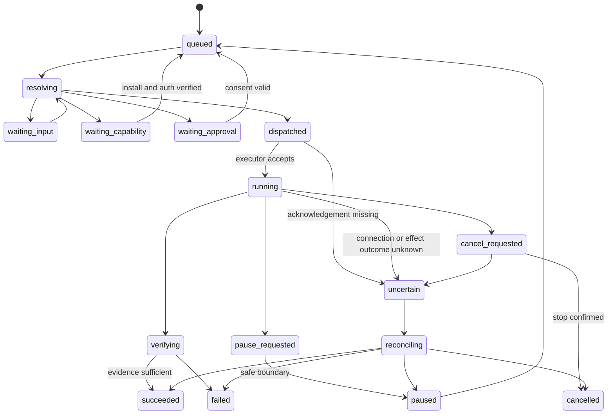

# System Architecture v2 — Conversation Platform

**Ngày:** 16/09/2026, cập nhật 17/09/2026 · **Trạng thái:** thiết kế để implement, chưa là hệ thống đã triển khai. Sơ đồ tổng quan mới nhất: [system-architecture.png](system-architecture.png); khi văn bản và sơ đồ khác nhau, sơ đồ thắng và văn bản phải được sửa theo.
**Phạm vi:** [scope-lock.md](scope-lock.md). Tất cả API/types có tên `agent.*`, NodeLink và CapabilityPack bên dưới là contract đề xuất của app, không phải API chính thức của Pi/MCP.

## 1. Thay đổi kiến trúc cốt lõi

Không còn thiết kế “desktop app có một helper, sau này đưa helper lên server”. Sản phẩm là **portable runtime với nhiều conversation clients** ngay từ đầu. Desktop là một distribution gồm runtime + Electron shell; server là cùng runtime không Electron, có web client tùy chọn. Chạy hai node không bắt buộc một cloud account của nhà phát triển app.

Core không cố biến toàn bộ mạng thành một máy tính có filesystem và database chung. Mỗi node có danh tính, quyền, credentials và tài nguyên riêng. Sự liền mạch nằm ở giao tiếp, delegation và presentation; không nằm ở việc giấu mọi sự khác biệt hay tự copy secrets.

## 2. Sơ đồ tổng quan


Media arrows không có nghĩa mọi widget được tự kết nối mọi provider. Network/media grants, SDK tokens, user gesture và quyền thiết bị đều được kiểm tra. Sơ đồ là biên chức năng; không triển khai mỗi box thành microservice.

## 3. Stack đã chọn

| Lớp | Quyết định | Căn cứ / ranh giới |
|---|---|---|
| UI chung | React + TypeScript + Vite | Cùng conversation components cho desktop và web; không phụ thuộc Node trong renderer |
| Desktop | Electron main/preload mỏng | OS dialogs, notifications, Keychain, local driver consent; không chứa scheduler |
| Runtime | Node.js LTS, TypeScript | Phù hợp Pi SDK và tool ecosystem; pin versions ở compatibility gate |
| Agent | Pi SDK qua duy nhất `pi-adapter` | Không fork agent loop; app quản lý tasks và resources riêng [R01–R04] |
| API | HTTP framework nhỏ hỗ trợ schemas + WebSocket | JSON over HTTPS, typed contracts; Fastify là implementation mặc định đề xuất |
| Local transport | Authenticated Unix socket | Không public listener mặc định trên desktop; có bridge vào cùng command handlers |
| Persistence | SQLite WAL per node + durable outbox/inbox | Mỗi DB một runtime writer; không remote/shared filesystem cho live SQLite |
| Blobs | Local content store với metadata/digest | Transfer có scope, hạn mức, retention; object storage adapter về sau |
| Contracts | Runtime schema validation + generated types | JSON Schema/Zod adapter; version negotiation, không chỉ TypeScript |
| Built-in widgets | Trusted React catalog, lazy chunks | Chart/table/form/map/calendar/editor… từ descriptors có schema |
| Mini-apps | Isolated origins/iframes, MCP Apps host adapter | UI tùy biến không ở privileged renderer; host-mediated actions [R06–R08] |
| Execution | Child processes + OS isolation khi cần | Process riêng không phải sandbox; untrusted tool services chạy container/VM phù hợp |
| Linux delivery | Non-root OCI image + optional native bundle/service | Runtime không yêu cầu display; browser/virtual desktop tách images |
| Voice | GPT-Live adapter đầu tiên, WebRTC + trusted backend | Gate real account/event/interrupt; không lấy provider voice state làm app DB [R29] |
| Connectivity | Reachable HTTPS hoặc private-network adapter | Tailscale là một lựa chọn đã có NAT traversal; không bắt buộc để dùng local [R28] |

Không đổi toàn bộ runtime sang Go/Rust chỉ vì có VPS: yêu cầu portability được giải quyết bằng headless boundary, packaging và OS adapters. Native helper chỉ dùng khi thực sự cần OS APIs, không là lần viết lại Pi thứ hai.

### 3.1 Pi Chord: thử nghiệm, không khóa dependency mù quáng

Chord trong ecosystem Pi có plugin facets, service/state/lifecycle primitives hữu ích để thử cho PackHost. Nhưng nó không thay thế NodeLink, auth, effect ledger hoặc protocol replay của app. Tài liệu hiện tại không quy định application wire envelope; không coi phần planned symmetric RPC là đã có. P0 thử Chord phía sau interface `FacetHost`; giữ implementation độc lập tối thiểu nếu compatibility chưa đạt. `node:vm` không phải sandbox bảo mật [R05, R27].

## 4. Ba mặt hoạt động

**Control plane:** commands, task revisions, approvals, capability discovery, install state, pin metadata. Durable, nhỏ, authenticated.

**Execution plane:** Pi worker, tool service, browser profile, OS driver, builds và API effects. Nằm ở node được chọn, có lease, cancel và budgets.

**Media/data plane:** audio live, video call, desktop frames, file blobs lớn. Dùng transport thích hợp, không đổ raw media vào SQLite/event replay hoặc conductor context. State có media session references, không phải từng frame.

Một remote task không có nghĩa audio phải đi vòng qua tất cả VPS. Client có thể thiết lập transport tới provider sau khi auth broker của node liên quan cấp credential tạm đúng loại.

## 5. Các entity và quyền sở hữu

| Entity | Ý nghĩa | Authority |
|---|---|---|
| Owner / Principal | Người dùng, client, node peer hoặc extension identity | Auth/policy của node nhận request |
| Node | Một runtime installation, có key identity và capability inventory | Chính node đó |
| Conversation | Timeline người dùng tương tác | Một home node tại một thời điểm |
| Task | Mục tiêu người dùng, revision, outcomes | Node tạo task; child task ở execution node có lineage |
| Run | Attempt cụ thể trên task revision | Execution node |
| Pi session | Agent context và session history | Một worker owner; không đồng thời ở nhiều nodes |
| Resource | Workspace, file, browser profile, desktop, integration account | Node nắm resource |
| Delegation | Phạm vi công việc và capabilities được ủy quyền | Sender grant + receiver policy, dùng phép giao |
| Surface snapshot | Response UI ở một thời điểm | Home conversation store |
| Widget instance | Mini-app có persistent state, actions, connections | Một instance owner node; user/account scoped |
| Pin | Tham chiếu instance và preference hiển thị | Home conversation/client preference |
| Connection | Authorized external account, scopes, health | Node giữ credentials và adapter |
| Capability install | Package/artifact versions, facets, granted resources | Node cài package |
| Effect | Tác động đã chuẩn bị/gửi/xác nhận hoặc chưa rõ | Execution node thực hiện effect |
| Artifact | Blob/dataset/evidence metadata | Node tạo; bản copy có lineage/digest |

Task, session, widget và connection có vòng đời khác nhau. Task hoàn thành không làm Spotify player hay note bị xóa. Session reload không là lệnh chạy lại action trên widget.

## 6. Process và distribution model

### Desktop distribution

- Electron renderer chạy sandboxed, `nodeIntegration: false`, `contextIsolation: true`, CSP và IPC sender validation. Main chỉ expose typed methods, không generic shell/IPC [R26].
- Runtime helper là chương trình riêng, attach/reconnect được. Đóng window giữ runtime nếu người dùng chọn keep-running; quit runtime khác với đóng UI.
- macOS integration helper thực hiện OS permissions, capture/input driver, credential store. Driver giữ identity/signature ổn định qua release để kiểm thử TCC.
- User có thể dùng desktop như thin client tới server mà không mở local code execution.

### Server distribution

- OCI image core chỉ chứa runtime/web static assets/required dependencies. Browser engine và virtual desktop là optional images/profiles.
- Chạy non-root; writable volume riêng; health/readiness; restart policy. Không mount Docker socket vào worker/tool container.
- Native Linux tarball với runtime bundled + service unit là đường khác cho operator không dùng Docker. Service account tối thiểu, explicit project roots và separate data directory.
- Không mở raw Pi RPC, CDP, VNC hay dev server ra Internet. Public exposure chỉ gateway đã có TLS/auth/rate limits.
- Web UI HTTPS là bắt buộc cho browser features yêu cầu secure context. Local loopback development khác production deployment.

Examples deploy trong implementation plan là templates cần substitute release artifact thực; không bịa registry image hoặc domain đã tồn tại.

## 7. Core services và PackHost

```text
Command Gateway
  -> Authenticate principal + validate schema/version
  -> Resolve conversation/task/widget/resource
  -> Deterministic handler OR conductor intent resolution
  -> Current-policy evaluation + required consent
  -> Durable transaction/outbox
  -> Local executor OR scoped NodeLink delegation
  -> Verify outcome / reconcile unknown effects
  -> Persist event + update conversation/widget/voice summary
```

Core giữ những bất biến mà extension không được thay: identity, permission, secret custody, task/effect state, resource locks, package generation activation, surface action ownership, install consent, budgets và emergency stop.

Pack đóng góp tools, instructions, presenters, custom widgets, drivers, auth/setup descriptors và onboarding recipes. Một pack không được tạo scheduler, global conversation store hoặc hidden root account riêng.

### 7.1 Capability registry

Mỗi capability có stable ID, package/version, execution node, input/output schema, resource kinds, compatibility, auth readiness, invocation route, cancellation, effect category và UI affordances. `installed`, `loaded`, `authenticated`, `authorized`, `healthy` là các trạng thái riêng.

Conductor mặc định chỉ thấy capability summary và search tool; khi chọn một capability mới nạp schema/skill liên quan. Không dump toàn bộ MCP tools vào mọi lượt model. Dynamic tool activation của Pi có thể được dùng qua adapter khi phù hợp [R03].

Conductor không được có tool tự accept consent, đọc secret values hoặc patch core policy. Tool discovery metadata và mô tả MCP do bên ngoài cung cấp vẫn là untrusted input.

### 7.2 Memory & Search: shared service, và Jev là lớp quyết định

Memory & Search là **service dùng chung trong runtime process**, sống qua Pi swap và không nằm trong worker. Nó gồm năm lớp theo sơ đồ: semantic retrieval (sqlite-vec, exact KNN), lexical retrieval (SQLite FTS5, BM25), structured filters (tasks, projects, source refs, thời gian, principal), local embeddings (E5-small quantized ONNX), và rank + verify (RRF, branches, live status). Corpus là Knowledge & History Store: bảng `messages`/summaries trong SQLite và Pi JSONL session của worker, đều đã qua redaction trước khi persist.

**Jev (TypeSafe System One) là lớp quyết định đặt sau retrieval.** Nó không tìm kiếm, không sinh nội dung và không cấp quyền. Hai đường dùng:

```text
Đường A — điều phối runtime:
  Main Pi cần giao việc → Session Manager liệt kê running runtimes/workers
  → structured filters (node, capability, lease, live status) → ≤N candidates
  → Jev Choice: "candidate nào phù hợp nhất cho intent này?" (+ option none)
  → host verify: lease còn sống, grant đủ, revision khớp → dispatch hoặc hỏi user

Đường B — tìm lại session/ngữ cảnh cũ:
  Main Pi/Context Builder có query → temporal parser + FTS5 + KNN (khi có)
  → RRF hợp nhất → top-K candidates (snippet + provenance)
  → Jev Choice: "kết quả nào đúng ý người dùng?" / Noul: "cần hỏi lại?"
  → host verify → đưa vào context hoặc trả câu hỏi làm rõ
```

```text
Đường C — tìm project/thư mục để mở pi session (Workspace & Project Finder):
  User: "thêm skill mới cho dự án agentkit đi"
  → Finder tra **project index cache** (SQLite): repos/folders đã quét trong approved roots,
    có tên, path, git remote, markers (.git, package.json, README, CLAUDE.md), mtime, last-used
  → cache miss/stale → quét bounded (approved roots, depth/ignore rules, incremental theo mtime)
  → lexical + structured (tên, alias, remote, recent-use) → ≤K candidates
  → Jev Choice: "project nào?" (+ none) → host verify: path tồn tại, thuộc approved roots, không leased
  → tạo WorkerBrief { goal, projectRoots:[path] } → start pi session + initial prompt
  → 0 candidate: hỏi user chọn thư mục; uncertain: một câu hỏi làm rõ (T19), không đoán
```

Finder là control extension của Main Pi theo sơ đồ. Root mặc định là **thư mục home của user**, vì app hướng đa tác vụ (tài liệu, ảnh, dự án viết, không chỉ code); ignore list hệ thống là bắt buộc và người dùng chỉnh roots/ignore qua chat. Cache là bảng `project_index` per node, làm mới incremental khi mở app và khi user nhắc tới thư mục không có trong cache; không quét ngoài roots, không theo symlink ra ngoài, không descend vào trong một project đã nhận diện, không đọc nội dung file để index (chỉ metadata và markers). Recent-use và alias do user đặt là tín hiệu xếp hạng mạnh hơn tên gần giống.

Ràng buộc bắt buộc cho lớp này:

- Jev chỉ thấy **state đã sanitize**: intent, và mỗi candidate là một mô tả ngắn có id opaque (không raw rows, không secret, không full transcript). State là object có tên trường, giới hạn kích thước; local-only mode tắt hẳn call ngoài.
- Output của Jev là **enum trong candidates host cung cấp**, luôn có `none`. Host validate `choice ∈ candidates`, áp ngưỡng confidence/margin, rồi **verify lại live status và authorization** trước khi hành động. Confidence không phải authority.
- Jev **không quyết định side effect**. Với đường A, Jev chọn target; dispatch vẫn đi qua command gateway, lease/epoch fencing và consent như mọi delegation khác. Với đường B, Jev chọn context; không có effect.
- Retrieval phải đúng trước. Jev chỉ có giá trị khi retrieval trả 2–K kết quả gần nhau; 0 hoặc 1 kết quả thì không gọi Jev. Nếu FTS/RRF thuần đã đủ tốt trên corpus thật (đo bằng calibration), lớp Jev được tắt bằng config, không gỡ code.
- Fallback khi Jev vắng/uncertain/timeout: rank thuần từ RRF; nếu vẫn mơ hồ, main Pi hỏi lại người dùng. Không trả kết quả fallback như thể Jev đã chọn.
- Deadline riêng cho Jev (đề xuất ≤2 s trong tổng ≤2.5 s cho search); 429/529/timeout là `unavailable` có reason, không retry storm.
- Telemetry: request id, model id thực tế trả về, duration, tokens, enum đã chọn, reason fallback. Không body, không prompt, không header.

Ba đường A/B/C dùng chung một adapter, một policy confidence và một fallback chain: Jev vắng/uncertain → rank thuần → một câu hỏi làm rõ. Jev cũng là selector cho rich widgets trong Conversation Host (chọn template/data candidates cho một surface); cùng adapter, cùng ràng buộc. Chi tiết ở plan mini-app.

**Trạng thái đo được (2026-09-17).** Cấu trúc trên đã có trong repo, và ba con số quyết định cấu hình đã đo thay vì suy đoán:

| Lớp | Trạng thái | Số đo / lý do |
|---|---|---|
| Lexical (FTS5 + BM25) | **Mặc định đang dùng** | 96,8% trên corpus nhãn (Phase 8) |
| Jev cho search | Tắt bằng config, code còn nguyên | Calibration live `jev-1.13.0`: `rank` 31/34 vs `jev` 31/34 — không hơn thì không trả thêm một call mỗi lần search |
| Semantic (sqlite-vec + E5-small) và RRF | Triển khai xong, **tắt mặc định** | Hybrid 31/34 ở ceiling cosine 0,1 nhưng 25/34 khi ceiling ≥0,2: KNN luôn trả hàng xóm gần nhất nên câu hỏi "không có đáp án" bị trả về kết quả gần đúng |

Deadline trong bảng ràng buộc ở trên nay là hằng số được enforce: 2 s cho một quyết định, tổng 2,5 s cho đường search (`SEARCH_DECISION_TIMEOUT_MS`, `SEARCH_TOTAL_BUDGET_MS`), và hết hạn thì trả về rank thuần kèm reason chứ không giả vờ Jev đã chọn. Extension `sqlite-vec` được probe trên cả hai platform repo chạy: `v0.1.9` trên darwin arm64 (máy dev) và linux x64 (CI), với create/insert/KNN đều chạy. Ở đường C, câu hỏi "thư mục nào?" nay trả lời được bằng path người dùng gõ: path đọc từ câu gốc (trước redaction vì redactor thay path bằng placeholder), thư mục được nêu tên vẫn phải nằm trong approved root, và thư mục dùng gần nhất được **hỏi** thay vì tự mở.

## 8. Task/session routing

Routing: explicit reference → aliases/project registry → recent tasks/instance focus → state/resource verification → answer/status/resume/new task/clarify/delegate. Khi bước "recent tasks/instance focus" hoặc "delegate" còn nhiều ứng viên gần nhau, lớp quyết định Jev (§7.2) chọn trong tập đã lọc; verification vẫn là bước sau và là bước quyết định cuối.

Node placement xét resource locality, allowed operations, connected credentials, OS/driver capability, active leases và user preference. Không chỉ chọn node có CPU rảnh. “Sửa ứng dụng trên máy này” không được gửi repo lên VPS chỉ vì network đang nhanh.

Worker context gồm bounded task brief, approved skills, selected project context và resource references. Conductor context gồm relevant history, user preferences, task summaries và semantic widget state. Không upload all transcripts, DOM, datasets hoặc screenshots theo thói quen.

Pi sessions thuộc app-managed resource tree. Nếu cần successor session sau install/model/context change, giữ task identity và handoff có evidence; không resume lại dòng tool cũ như một command mới. Một JSONL file không chứng minh worker đang sống.

## 9. Task/effect lifecycle



Sơ đồ mô tả main paths; implementation phải có reducer/transition table đầy đủ: mọi nonterminal nhận cancel, resolving failures không treo vô hạn, terminal chỉ tạo run mới rõ lineage. `waiting_capability` giữ continuation, không chiếm worker liên tục hoặc tự lặp install prompts.

Worker idle, LLM kết thúc lượt hoặc socket đóng không là success. Outcome có evidence: exit status, file/diff version, API receipt/read-after-write, observed browser state; nếu không có số tests thì không bịa số tests.

Effect ledger per executor: `prepared → submitted → confirmed | failed | unknown`. External side effect không atomic cùng DB. Duplicate commands dùng durable idempotency keys; external API không hỗ trợ dedup thì timeout phải reconcile, không hứa exactly-once.

### Leases

Một writer/worktree hoặc approved folder; Git operations tác động shared refs cần repo-common lock. Browser profile và foreground desktop có input lease riêng; voice và video có media-focus coordination. Lease/epoch fencing chặn brokered actions cũ; không chặn ngược một shell script đã được cấp OS quyền rộng. Không quảng cáo distributed lease là sandbox.

## 10. Storage

Mỗi node: SQLite WAL với migrations; app events/outbox/inbox; native Pi session history (JSONL) tách logical authority nhưng được index vào Memory & Search (§7.2); blob store có quotas. Không cố commit atomically cùng Pi JSONL; run markers và reconciliation nối hai phần.

Nhóm bảng: principals/nodes/grants; conversations/messages; tasks/runs/delegations; commands/events/outbox/inbox; resources/leases; effects/approvals; packages/install_plans/generations; connections/auth_transactions; widget_instances/snapshots/pins/action_bindings; datasets/artifacts; preferences/onboarding_checkpoints/usage.

Secrets lưu trong vault abstraction: macOS Keychain hoặc server secret store/encrypted-at-rest storage với key nằm ngoài DB backup. File permissions không thay encryption; container env cũng không là giải pháp tránh mọi leak. Bootstrap/recovery key và backup procedure phải có test; không tự sinh key rồi lưu cùng plaintext DB và gọi là bảo mật đầy đủ.

Raw audio/video không lưu mặc định. Screenshots có retention ngắn, chứa dữ liệu nhạy cảm; cấp quyền capture không đồng nghĩa được lưu vĩnh viễn hoặc gửi cho mọi model. Dữ liệu người dùng xóa khỏi app không tự xóa khỏi third-party provider đã nhận.

## 11. Unified UI/action path

Message blocks: text, surface snapshot, widget-instance reference, artifact. Built-ins và custom apps dùng một action host. Agent chọn props, định nghĩa actions theo discovered capabilities hoặc agent intents; implementation không giới hạn mỗi nút vào một handler business cố định do app viết sẵn.

Action definitions được compile thành server-owned bindings, xác nhận schema/quyền/node/account/revisions. Widget không tự gọi tùy ý tool chỉ bằng tên; host reauthorizes invocation. Voice có semantic view của instance đang focus và đi qua cùng path.

Chi tiết pin/live vs snapshot, custom app sandbox và action schema ở [widgets-and-extensions.md](widgets-and-extensions.md).

## 12. Voice/media

GPT-Live là adapter đầu, không phải dependency trong core state model. Client mic/playback ↔ provider; runtime giữ durable intent và trusted control path. Transcript fragments/delegation cần correlate/dedup; correction đổi task revision; barge-in chỉ nhường audio, không tự hủy job [R29].

Một call widget, music widget và assistant voice không được tranh microphone/speaker ngầm. `MediaFocusService` thể hiện ai đang dùng mic/camera, duck/pause chỉ theo rule được user chấp thuận. Audio trong Zoom call không tự được gửi vào voice model để “tiện phân tích”. Mute/end có local host control, không phụ thuộc remote node hoặc model.

Kết thúc voice không dừng pinned read subscriptions hay jobs. Reload Pi không restart WebRTC. Worker/node mất mạng thì UI cho tiếp tục text/local actions nhưng không giả remote tool đang chạy được.

## 13. Security baseline

1. Remote endpoints authenticated; app grants giới hạn dù transport private. Principal identity đến từ transport, không do model tự điền.
2. Model/website/package README/MCP descriptions/screenshots đều không được cấp quyền, đổi OAuth endpoint hoặc tự approve.
3. Arbitrary native Pi extensions có quyền process. Untrusted executable không load vào privileged daemon/conductor; dùng isolated service/worker hoặc báo rõ trusted-host risk [R01–R04].
4. Custom widget code không chạy trong privileged app origin. Sandbox, strict bridge, CSP, resource budgets, permission prompts do host.
5. Host-owned consent/credential surfaces không do extension dựng tự do. UI có origin/account/node badge không nằm trong iframe kiểm soát của vendor.
6. Long-lived secrets không gửi renderer/model. SDK frontend đôi khi cần short-lived/scoped token: chỉ cấp qua riêng trusted auth bridge cho đúng isolated origin, không vào widget JSON/history.
7. Browser/computer control không tự thực hiện OS consent, OAuth authorization, CAPTCHA hoặc 2FA. Human takeover là state có thật.
8. Install approvals gồm package digest, dependency plan, target node, grants. Security scan/chữ ký xác thực không chứng minh code an toàn.
9. HTTP fetch/auth discovery giới hạn redirects/private destinations/credential forwarding; user URL không là quyền truy cập internal network.
10. Emergency stop trên máy đang bị điều khiển ưu tiên hơn remote commands. Revocation chặn thao tác tương lai; không hứa rollback effect đã xảy ra.

## 14. Monorepo đề xuất

```text
apps/
  desktop/                 # Electron main/preload + client bootstrap
  web/                     # Same conversation UI without Electron
  runtime/                 # Headless node, composition root, lifecycle
  worker/                  # App-managed Pi run host
packages/
  contracts/               # Versions, commands, events, capabilities, UI
  conversation-client/     # Timeline, composer, pins, accessible system UI
  core/                    # Task/effect/policy/install state machines
  storage/                 # Node-local DB/outbox/inbox/migrations
  pi-adapter/              # Only package importing Pi SDK internals
  node-link/               # Authenticated peer protocol, replay, grants
  capability-host/         # Discovery, FacetHost, generations
  integration-sdk/         # Auth, connector, setup descriptors
  widget-sdk/              # Props/actions/state/semantic contracts
  widget-host/             # Built-ins and isolated mini-app bridge
  mcp-adapters/            # Tools/auth and MCP Apps host support
  host-adapters/           # macOS/Linux/web OS and vault capabilities
  execution-supervisor/    # Process/container/virtual desktop adapters
  voice-adapters/          # GPT-Live first, provider-neutral internal events
packs/
  project-work/
  data-canvas/
  browser-playwright/
  computer-macos/
  computer-linux-desktop/
  google-calendar/
examples/
  note-widget/
  media-widget-contract/
  mcp-app-fixture/
```

Các thư mục không buộc thành hàng chục services. Bắt đầu core modules trong một runtime process; tools/native extensions/isolated widgets ở process và origin phù hợp. Đừng tạo abstraction ngoài contracts đã cần cho những journey trong scope.

## 15. Invariants bắt buộc cho implementation

- Một conversation có một home authority; một run có một execution owner.
- Cùng command retry không tạo logical task thứ hai; unknown external effect không tự replay.
- Pack update/reload không thay quyền, tự đổi action target hoặc làm mất continuation.
- Pin không bật task/camera/music/subscription khi chưa được cho phép.
- Credential binding phải thể hiện node + account; không tự replicate refresh tokens.
- Mọi supported claim có version/platform/account evidence; blocked không thành pass.
- UI không bắt người dùng học distributed topology để hỏi trạng thái, nhưng luôn chỉ ra target khi hành động quan trọng.

Chi tiết triển khai: [distributed-runtime.md](distributed-runtime.md), [integration-onboarding.md](integration-onboarding.md), [browser-computer-use.md](browser-computer-use.md), [implementation-plan.md](implementation-plan.md).
