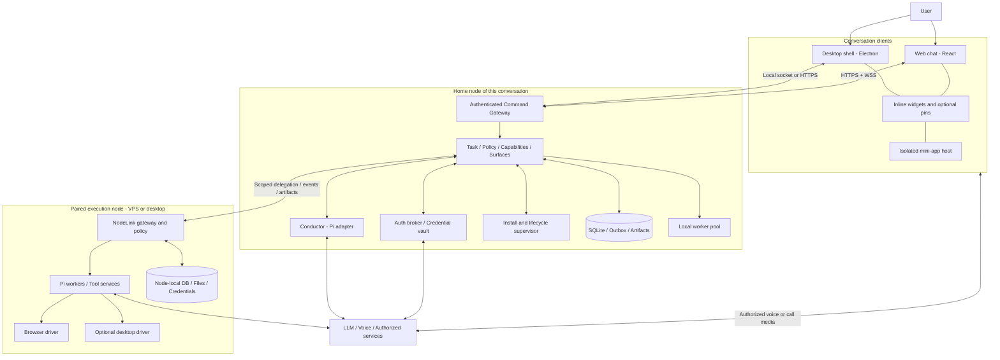
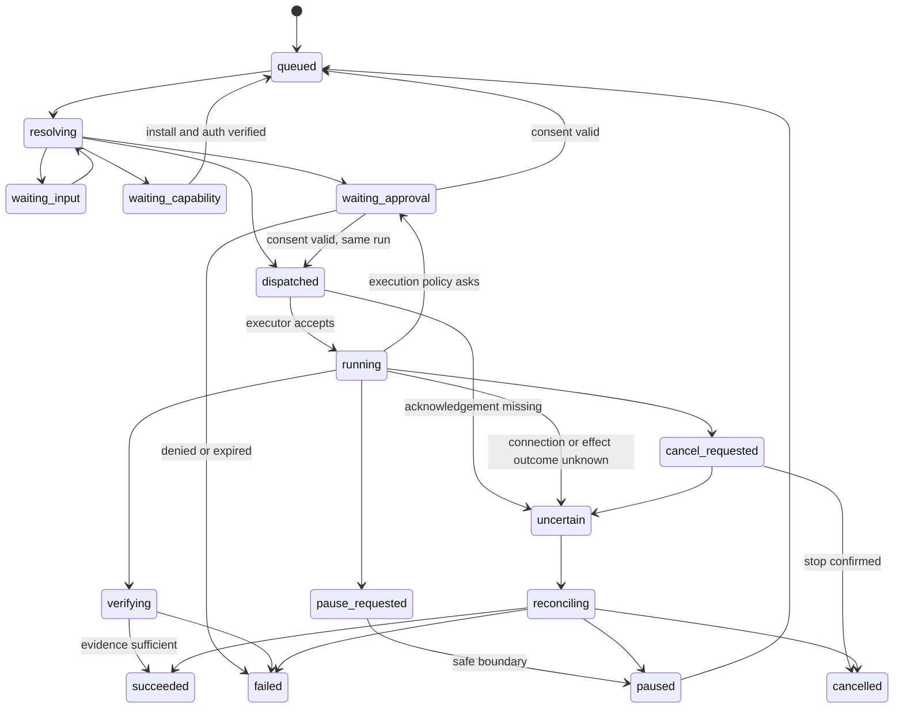

# System Architecture v2 — Conversation Platform

> English (default) · [Tiếng Việt](system-architecture.vi.md)

**Date:** 16/09/2026, updated 19/09/2026 · **Status:** design; the implemented parts live in `apps/` and `packages/` of this repo, and the code is the source of truth for behavior — this document holds the boundaries, decisions and where each part lives. Latest overview diagram: [system-architecture.png](system-architecture.png); when the text and the diagram differ, the diagram wins and the text must be fixed to match.
**Scope:** [scope-lock.md](scope-lock.md). All APIs/types named `agent.*`, NodeLink and CapabilityPack below are proposed app contracts, not official Pi/MCP APIs.

## 1. Core architecture change

There is no longer a "desktop app with a helper, and later we move the helper to a server" design. The product is a **portable runtime with many conversation clients** from the start. Desktop is a distribution made of runtime + Electron shell; server is the same runtime without Electron, with an optional web client. Running two nodes does not require a cloud account with the app developer.

The core does not try to turn the whole network into one computer with a shared filesystem and database. Each node has its own identity, permissions, credentials and resources. Seamlessness lives in communication, delegation and presentation; not in hiding every difference or copying secrets around automatically.

## 2. Overview diagram


```mermaid
flowchart TB
  USER[User]
  subgraph CLIENTS[Conversation clients]
    DESK[Desktop shell - Electron]
    WEB[Web chat - React]
    PIN[Inline widgets and optional pins]
    MINI[Isolated mini-app host]
    DESK --- PIN
    WEB --- PIN
    PIN --- MINI
  end
  USER --> DESK
  USER --> WEB
  subgraph HOME[Home node of this conversation]
    GATE[Authenticated Command Gateway]
    CON[Conductor - Pi adapter]
    CORE[Task / Policy / Capabilities / Surfaces]
    AUTH[Auth broker / Credential vault]
    LIFE[Install and lifecycle supervisor]
    STORE[(SQLite / Outbox / Artifacts)]
    LOCAL[Local worker pool]
    GATE --> CORE
    CORE <--> CON
    CORE <--> STORE
    CORE <--> AUTH
    CORE <--> LIFE
    CORE --> LOCAL
  end
  DESK <-->|Local socket or HTTPS| GATE
  WEB <-->|HTTPS + WSS| GATE
  subgraph PEER[Paired execution node - VPS or desktop]
    NG[NodeLink gateway and policy]
    WORK[Pi workers / Tool services]
    BROWSER[Browser driver]
    COMPUTER[Optional desktop driver]
    DATA[(Node-local DB / Files / Credentials)]
    NG --> WORK
    WORK --> BROWSER
    WORK --> COMPUTER
    NG <--> DATA
  end
  CORE <-->|Scoped delegation / events / artifacts| NG
  PROVIDERS[LLM / Voice / Authorized services]
  CON <--> PROVIDERS
  WORK <--> PROVIDERS
  AUTH <--> PROVIDERS
  CLIENTS <-->|Authorized voice or call media| PROVIDERS
```

Media arrows do not mean every widget may connect to every provider on its own. Network/media grants, SDK tokens, user gesture and device permissions are all checked. The diagram shows functional boundaries; do not deploy each box as a microservice.

## 3. Chosen stack

| Layer | Decision | Rationale / boundary |
|---|---|---|
| Shared UI | React + TypeScript + Vite | Same conversation components for desktop and web; no Node dependency in the renderer |
| Desktop | Thin Electron main/preload | OS dialogs, notifications, Keychain, local driver consent; no scheduler |
| Runtime | Node.js LTS, TypeScript | Fits the Pi SDK and tool ecosystem; versions pinned at the compatibility gate |
| Agent | Pi SDK only through `pi-adapter` | Do not fork the agent loop; the app manages its own tasks and resources [R01–R04] |
| API | Small HTTP framework with schemas + WebSocket | JSON over HTTPS, typed contracts; Fastify is the proposed default implementation |
| Local transport | Authenticated Unix socket | No public listener by default on desktop; bridged into the same command handlers |
| Persistence | SQLite WAL per node + durable outbox/inbox | One runtime writer per DB; no remote/shared filesystem for live SQLite |
| Blobs | Local content store with metadata/digest | Transfers are scoped, quota-limited, with retention; object storage adapter later |
| Contracts | Runtime schema validation + generated types | JSON Schema/Zod adapter; version negotiation, not TypeScript alone |
| Built-in widgets | Trusted React catalog, lazy chunks | Chart/table/form/map/calendar/editor… from descriptors with schemas |
| Mini-apps | Isolated origins/iframes, MCP Apps host adapter | Custom UI does not live in the privileged renderer; host-mediated actions [R06–R08] |
| Execution | Child processes + OS isolation when needed | A separate process is not a sandbox; untrusted tool services run in a suitable container/VM |
| Linux delivery | Non-root OCI image + optional native bundle/service | Runtime needs no display; browser/virtual desktop are separate images |
| Voice | Gemini Live (`gemini-3.8-live`) behind a node-side WebSocket proxy | The browser holds no provider credential, not even a short-lived token; [ADR-001](research/adr-001-gemini-live-provider.md) replaces the blueprint's GPT-Live choice [R29] |
| Connectivity | Reachable HTTPS or private-network adapter | Tailscale is one option that already has NAT traversal; not required for local use [R28] |

Do not rewrite the whole runtime in Go/Rust just because there is a VPS: the portability requirement is met through the headless boundary, packaging and OS adapters. A native helper is used only when OS APIs are truly needed, not as a second rewrite of Pi.

### 3.1 Pi Chord: experiment, do not lock in the dependency blindly

Chord in the Pi ecosystem has plugin facets and service/state/lifecycle primitives worth trying for PackHost. But it does not replace the app's NodeLink, auth, effect ledger or protocol replay. The current documentation does not specify an application wire envelope; do not treat the planned symmetric RPC as already available. P0 tries Chord behind a `FacetHost` interface; keep a minimal independent implementation if compatibility is not reached. `node:vm` is not a security sandbox [R05, R27].

## 4. Three planes of operation

**Control plane:** commands, task revisions, approvals, capability discovery, install state, pin metadata. Durable, small, authenticated.

**Execution plane:** Pi worker, tool service, browser profile, OS driver, builds and API effects. Lives on the chosen node, with lease, cancel and budgets.

**Media/data plane:** live audio, video calls, desktop frames, large file blobs. Uses a suitable transport; does not pour raw media into SQLite/event replay or the conductor context. State holds media session references, not individual frames.

A remote task does not mean audio has to route through every VPS. The client can set up a transport to the provider after the auth broker of the relevant node issues a temporary credential of the right kind.

## 5. Entities and ownership

| Entity | Meaning | Authority |
|---|---|---|
| Owner / Principal | User, client, peer node or extension identity | Auth/policy of the node receiving the request |
| Node | One runtime installation, with a key identity and capability inventory | The node itself |
| Conversation | Timeline the user interacts with | One home node at a time |
| Task | User goal, revisions, outcomes | The node that created the task; a child task on an execution node has lineage |
| Run | A specific attempt on a task revision | Execution node |
| Pi session | Agent context and session history | One worker owner; never on several nodes at once |
| Resource | Workspace, file, browser profile, desktop, integration account | The node holding the resource |
| Delegation | Scope of work and capabilities delegated | Sender grant + receiver policy, intersected |
| Surface snapshot | UI response at a point in time | Home conversation store |
| Widget instance | Mini-app with persistent state, actions, connections | One instance owner node; user/account scoped |
| Pin | Instance reference and display preference | Home conversation/client preference |
| Connection | Authorized external account, scopes, health | The node holding the credentials and adapter |
| Capability install | Package/artifact versions, facets, granted resources | The node that installed the package |
| Effect | An effect that is prepared/submitted/confirmed or unknown | The execution node performing the effect |
| Artifact | Blob/dataset/evidence metadata | The creating node; copies carry lineage/digest |

Tasks, sessions, widgets and connections have different lifecycles. A completed task does not delete a Spotify player or a note. A session reload is not a command to re-run an action on a widget.

## 6. Process and distribution model

### Desktop distribution

- The Electron renderer runs sandboxed, `nodeIntegration: false`, `contextIsolation: true`, with CSP and IPC sender validation. Main exposes only typed methods, no generic shell/IPC [R26].
- The runtime helper is a separate program that can attach/reconnect. Closing the window keeps the runtime if the user chose keep-running; quitting the runtime is different from closing the UI.
- The macOS integration helper handles OS permissions, the capture/input driver and the credential store. The driver keeps a stable identity/signature across releases so TCC can be tested.
- A user can use the desktop as a thin client to a server without enabling local code execution.

### Server distribution

- The core OCI image contains only the runtime/web static assets/required dependencies. The browser engine and virtual desktop are optional images/profiles.
- Runs as non-root; separate writable volume; health/readiness; restart policy. The Docker socket is not mounted into worker/tool containers.
- A native Linux tarball with a bundled runtime + service unit is the alternative path for operators who do not use Docker. Minimal service account, explicit project roots and a separate data directory.
- Raw Pi RPC, CDP, VNC or dev servers are never exposed to the Internet. Public exposure is only the gateway, with TLS/auth/rate limits.
- HTTPS for the web UI is mandatory for browser features that require a secure context. Local loopback development is different from a production deployment.

Deploy examples in the implementation plan are templates that need a real release artifact substituted in; do not invent a registry image or a domain that supposedly exists.

## 7. Core services and PackHost

```text
Command Gateway
  -> Authenticate principal + validate schema/version
  -> Resolve conversation/task/widget/resource
  -> Deterministic handler OR conductor intent resolution
  -> Current-policy evaluation + required consent
  -> Durable transaction/outbox
  -> Local executor OR scoped NodeLink delegation
  -> Verify outcome / reconcile unknown effects
  -> Persist event + update conversation/widget/voice summary
```

The core holds the invariants that extensions may not replace: identity, permission, secret custody, task/effect state, resource locks, package generation activation, surface action ownership, install consent, budgets and emergency stop.

A pack contributes tools, instructions, presenters, custom widgets, drivers, auth/setup descriptors and onboarding recipes. A pack may not create its own scheduler, global conversation store or hidden root account.

### 7.1 Capability registry

Each capability has a stable ID, package/version, execution node, input/output schema, resource kinds, compatibility, auth readiness, invocation route, cancellation, effect category and UI affordances. `installed`, `loaded`, `authenticated`, `authorized`, `healthy` are separate states.

By default the conductor sees only the capability summary and the short list of read-only tools the node registers for Main Pi (`apps/runtime/src/node-tools.ts`); only when it picks a capability are the related schema/skill loaded. Do not dump every MCP tool into every model turn. Pi's dynamic tool activation can be used through the adapter where appropriate [R03].

The conductor must not have a tool that accepts consent on its own, reads secret values or patches core policy. Tool discovery metadata and externally supplied MCP descriptions are still untrusted input.

A package's service facet is one source of capabilities: the node runs it in a container and registers only the tools its manifest declares, with the readiness the host observes (`apps/runtime/src/service-host.ts`). A widget binding, the agent's `invoke_capability` tool and voice reach it through one path, `invokeCapability`, which checks readiness, the tool's input schema and the execution policy before anything runs. The boundary and what is not built are in [widget-development.md §4](widget-development.md#4-package-manifest).

### 7.2 Memory & Search: a shared service, and Jev as the decision layer

Memory & Search is a **shared service inside the runtime process**; it survives a Pi swap and does not live in a worker. Following the diagram, it has five layers: semantic retrieval (sqlite-vec, exact KNN), lexical retrieval (SQLite FTS5, BM25), structured filters (tasks, projects, source refs, time, principal), local embeddings (quantized E5-small ONNX), and rank + verify (RRF, branches, live status). The corpus is the Knowledge & History Store: the `messages`/summaries tables in SQLite and the workers' Pi JSONL sessions, both redacted before they are persisted.

**Jev (TypeSafe System One) is the decision layer placed after retrieval.** It does not search, does not generate content and does not grant permissions. Two paths use it:

```text
Path A — runtime dispatch:
  Main Pi needs to hand off work → Session Manager lists running runtimes/workers
  → structured filters (node, capability, lease, live status) → ≤N candidates
  → Jev Choice: "which candidate best fits this intent?" (+ option none)
  → host verify: lease still alive, grant sufficient, revision matches → dispatch or ask the user

Path B — finding an old session/context:
  Main Pi/Context Builder has a query → temporal parser + FTS5 + KNN (when available)
  → RRF merge → top-K candidates (snippet + provenance)
  → Jev Choice: "which result matches what the user meant?" / Noul: "need to ask again?"
  → host verify → put into context or return a clarifying question
```

```text
Path C — finding a project/folder to open a pi session (Workspace & Project Finder):
  User: "add a new skill to the agentkit project"
  → Finder looks up the **project index cache** (SQLite): repos/folders already scanned within approved roots,
    with name, path, git remote, markers (.git, package.json, README, CLAUDE.md), mtime, last-used
  → cache miss/stale → bounded scan (approved roots, depth/ignore rules, incremental by mtime)
  → lexical + structured (name, alias, remote, recent-use) → ≤K candidates
  → Jev Choice: "which project?" (+ none) → host verify: path exists, is within approved roots, not leased
  → create WorkerBrief { goal, projectRoots:[path] } → start pi session + initial prompt
  → 0 candidates: ask the user to pick a folder; uncertain: one clarifying question (T19), no guessing
```

Following the diagram, the Finder is a control extension of Main Pi. The default root is **the user's home directory**, because the app is aimed at many kinds of work (documents, photos, writing projects, not just code); the system ignore list is mandatory, and the user adjusts roots/ignore through chat. The cache is a per-node `project_index` table, refreshed incrementally when the app opens and when the user mentions a folder that is not in the cache; it never scans outside the roots, never follows symlinks outside, never descends into an already recognized project, and never reads file contents to index them (metadata and markers only). Recent use and user-set aliases are stronger ranking signals than a similar name.

Mandatory constraints for this layer:

- Jev sees only **sanitized state**: the intent, and each candidate as a short description with an opaque id (no raw rows, no secrets, no full transcript). The state is an object with named fields and a size limit; local-only mode turns off external calls entirely.
- Jev's output is an **enum over the candidates the host supplied**, always including `none`. The host validates `choice ∈ candidates`, applies confidence/margin thresholds, then **re-verifies live status and authorization** before acting. Confidence is not authority.
- Jev **does not decide side effects**. On path A, Jev picks the target; dispatch still goes through the command gateway, lease/epoch fencing and consent like any other delegation. On path B, Jev picks context; there is no effect.
- Retrieval has to be right first. Jev only adds value when retrieval returns 2–K close results; with 0 or 1 result, Jev is not called. If plain FTS/RRF is already good enough on the real corpus (measured by calibration), the Jev layer is turned off by config, not by removing code.
- Fallback when Jev is absent/uncertain/timed out: plain RRF ranking; if still ambiguous, main Pi asks the user again. A fallback result is never returned as if Jev had chosen it.
- Jev has its own deadline (proposed ≤2 s within a total of ≤2.5 s for search); 429/529/timeout is `unavailable` with a reason, no retry storm.
- Telemetry: request id, the model id actually returned, duration, tokens, the chosen enum, fallback reason. No body, no prompt, no headers.

The three paths A/B/C share one adapter, one confidence policy and one fallback chain: Jev absent/uncertain → plain ranking → one clarifying question. The decision layer now has seven call sites, differing only in the candidate set the host has already filtered — two more call sites, `guard.operation` and `route.model`, are described in §7.4 and §7.6 along with their implementation status by phase:

| Path | Question | Owning code |
|---|---|---|
| A — runtime dispatch | which worker/instance for this intent? | `decideRuntimeTarget` |
| B — finding an old session/context | which result is right, or should we ask again? | `decideSearchResult` (+ Noul) |
| C — finding a project/folder | which folder? | `decideProject` |
| D — rich widget | which template/section for this surface? | `selectTemplate`, `selectSections` |
| E — message arriving mid-run | steer, interrupt or background? | `decideTurnAction` |
| F — focusing the recap and memory brief | which of the top 8 matches comes first? (opt-in) | `decideContextFocus` |
| G — tool family for a message with no hint | which one family of tools? (opt-in) | `decideToolFamily` |

A, B, C, E, F and G live in `apps/runtime/src/jev-decider.ts`; D in `apps/runtime/src/jev-selector.ts`, with the same adapter and the same policy. E is a decision rather than a rule because the three answers cannot stand in for each other: steer changes the work in progress, interrupt throws it away, background spends an extra call on work the user may not have meant to split off. When not confident enough, E leans toward `interrupt` — the recoverable direction, rather than the silent one. Configuration and operation: [mini-app/jev-configuration.md](mini-app/jev-configuration.md).

**Measured status (2026-09-17).** The structure above is in the repo, and the three numbers that drive the configuration were measured rather than guessed:

| Layer | Status | Measurement / reason |
|---|---|---|
| Lexical (FTS5 + BM25) | **Default in use** | 96.8% on the labelled corpus (Phase 8) |
| Jev for search | Off by config, code intact | Live calibration `jev-1.13.0`: `rank` 31/34 vs `jev` 31/34 — if it is not better, it does not get an extra call on every search |
| Semantic (sqlite-vec + E5-small) and RRF | Implemented, **off by default** | Hybrid 31/34 at cosine ceiling 0.1 but 25/34 at ceiling ≥0.2: KNN always returns the nearest neighbour, so "no answer" questions get a near-miss result |

The deadline in the constraints list above is now an enforced constant: 2 s for one decision, 2.5 s total for the search path (`SEARCH_DECISION_TIMEOUT_MS`, `SEARCH_TOTAL_BUDGET_MS`), and on expiry the plain ranking is returned with a reason rather than pretending Jev chose. The `sqlite-vec` extension was probed on both platforms the repo runs on: `v0.1.9` on darwin arm64 (dev machine) and linux x64 (CI), with create/insert/KNN all working. On path C, the "which folder?" question can now be answered by a path the user types: the path is read from the original sentence (before redaction, because the redactor replaces paths with a placeholder), a named folder must still be inside an approved root, and the most recently used folder is **asked about** instead of opened automatically.

**Context planner: what a fresh session and a turn's memory brief carry (#433).** `apps/runtime/src/context-planner.ts` is a projection over what is already stored — `memory_records`, `history_fts` and `messages` — not a new store. Two prompt parts go through it, filtered by principal and conversation before anything is ranked:

- **Recap for a fresh session.** A session created for an existing conversation (after an idle eviction, a failure or a restart) is told the newest 12 of the newest 40 messages, whether the planner is on or off. When the message it is about to answer shares terms with something, up to 4 earlier messages of the same conversation that match it (BM25, at least two shared terms, diacritics folded; only the person's and Clark's own messages, never a system or tool message) are retrieved. They are not part of the recap's guidance: they go into the turn's data section, after the caller's own data, under a header saying they are data and not instructions, each labelled with who said it. In the recap itself, older lines in the window that do not match are shortened, the last two lines stay whole, and it says how many older messages it did not repeat and that `search_history` can read them. Only the 12 lines the recap repeats are excluded from that search, so a decision made 13 to 40 messages ago is still found. When nothing matches, the recap is byte-for-byte the fixed one.
- **Memory brief per turn.** Of the newest 200 memory records the person can see, those that match the message come first; with no match the brief is the previous newest-twelve brief. A deleted record is not read, so it is gone from the next turn.

Each plan is bounded (12 recap lines, 4 earlier messages, 200 memory candidates, 24 query terms) and reported as one stderr JSON line (`context-plan`) with counts only, never text or ids. `CLARKCANT_CONTEXT_PLANNER=off` restores both fixed behaviours. Jev only reorders the top 8 when an operator sets `CLARKCANT_CONTEXT_DECIDER=jev`, the ranking gap is not already clear, and its answer could change what is sent (a match left out or shortened); it accepts only a decisive answer, never adds or removes a candidate, and grants nothing. When it is asked, the redacted text of the candidates, clipped to 200 characters each, and the message, clipped to 300, go to the Jev provider; a failure or timeout keeps the deterministic order. A turn is running — visible to Stop and to a second message — from the moment it starts reading this context, and a Stop that arrives meanwhile means the prompt is never sent.

**Shared retrieval for background runs and task workers.** A read-only background run (`runInBackground`) and a worker dispatched through `task-dispatch.ts` start without the conversation. Only work a person asked for in the conversation is given retrieved context; a task a peer delegated, an automation started or the node raised itself gets none, the same line drawn for folder access. Each is now given the planner's retrieval for its request or goal (`apps/runtime/src/context-bundle.ts`), kept as a frozen bundle of references and sha256 digests, keyed by principal, conversation, message count and query terms, so runs started from the same request at the same point share one pass (10-minute lifetime, at most 64 held, at most 6 notes and 6 messages). It is read on demand, not expanded up front: a background run gets the list of items (a short preview each) in its data section and a read-only `read_context` tool for one item in full; a task worker gets only the item count in its brief and the same tool, answered by the host over the worker's IPC channel (`clarkcant.context.request`/`reply`); the brief also lists which kinds of request the host answers there, so a worker given the channel only for context offers no command or browser tool. Every read goes back through the principal-scoped readers with the digest checked, so a note deleted or a message changed after the bundle was made is not read, even mid-run; a bundle reads nothing for any other principal, a list is capped at 3,000 characters, an item at 2,000, and one worker at 24 reads. Everything it returns sits under a header saying it is data, not instructions. Reading context is never evidence that a task was done. A failed retrieval leaves the run without it. Each bundle given out is one stderr JSON line (`context-bundle`) with counts only, including how many passes were built and reused.

**Data classes: what a model may be sent (#433).** Every block the host adds to a model's context is labelled `public`, `internal`, `confidential` or `secret` (`packages/contracts/src/data-class.ts`), from its text alone and before anything is ranked or sent. Credential shapes are `secret`: a bearer token, a JWT, a PEM private key, an AWS access key id, a GitHub or Google API token, a password in a URL, an issued-prefix token (`sk-`, `ghp_`, `xoxb-`…) or a value assigned to a secret-named field; code in that place — a schema call such as `z.string()`, a type, a member reference or a placeholder (`${…}`, `{{…}}`, `<…>`), in a field or a URL — is not a value. An email address, a phone number or a home-folder path is `confidential`. Everything else a person or Clark wrote is `internal`, including code identifiers such as `token_refresh_worker_2`, commit hashes and digests. Memory notes are redacted when written, so they read as `internal`. A model profile may say what it receives (§7.6); a profile that says nothing receives everything but `secret`, and a pool that cannot be read narrows to `public`. With the planner on, a block above the answering model's ceiling is left out of the recap, the memory brief, the earlier-messages section, a background run's or task worker's retrieved bundle and its `read_context` reads, project instructions, and the results of `search_history` (classified on the whole stored entry, not the snippet shown); each says how many were withheld, never what they said, and the recap does not point at a tool to read them back. Jev is offered only `public` and `internal` candidates; a more sensitive one keeps its deterministic place. **Scope.** The ceiling covers context the host adds, and only that. It does not cover tool results the model reads itself (a file, a command's output, a web page), attachments the person sends, or what a session that continues already holds from earlier turns; it is not a boundary against those, and a model that must never see a class of data should not be given tools that can read it. `CLARKCANT_CONTEXT_PLANNER=off` turns withholding off, `search_history` included, so secret-shaped recap, memory and history text reaches whichever model answers; routing by data class (§7.6) still applies with the planner off.

**Conditional project instructions (#433).** A project can keep instructions that apply only to part of it (`apps/runtime/src/conditional-instructions.ts`). They are read only from a project inside a root the person already granted: `.clarkcant/instructions.json` in a folder under such a root holds up to 32 rules, `{ "version": 1, "rules": [{ "when": { "path", "operation", "capability", "role", "skill", "project" }, "include": ["name"], "pin": false }] }`, and each included name is `.clarkcant/instructions/<name>.md`. The file's shape is a versioned open contract (`packages/contracts/src/project-instructions.ts`, documented in [open-interfaces.md](open-interfaces.md#project-instructions-file)). A file written now must state `version`, and `clarkcant instructions check` validates one against the same schema the node reads with. A file without `version` is still read as version 1. With links resolved, the project folder must lie inside the granted root, and the rules file, the instructions folder and each snippet inside the project; a link anywhere on that way that leads out is ignored. `path` is a glob relative to the project (`**` as a whole segment crosses folders; a pattern with no `/` matches a file name anywhere; case is folded on Windows and macOS and kept on Linux). It is matched segment by segment without regular expressions, and a glob longer than 200 characters, with more than 16 wildcards or more than 32 segments leaves its rule out. `operation` is `read`, `write`, `test`, `deploy` or `command`. A rule applies when what the work touches matches it: the files and folders a message references (read), absolute paths in the conversation's tool calls (a file tool's path, a command's `cwd`, with the operation read from the command), and for a dispatched task its granted roots, writable roots as written. When a tool call makes a rule apply, the snippet is appended to that call's result; otherwise it goes in the next turn's brief. An unpinned snippet is stated once per session; a pinned one is restated every turn it applies, so it survives a recap or a session rebuild. A task worker is given the snippets for its grant in its brief. Snippets are framed as data: a header says they come from the project's `.clarkcant` files, are neither the person's words nor the host's, and grant nothing. Each is wrapped in a tag carrying a code the host draws once per session (a rebuilt or handed-off session draws a new one) and states once, in its own turn guidance at the start of that session, as the only code that marks project guidance; a task worker's brief, itself written by the host, names its own code in its header. A snippet's own tags are defused, so it cannot close its block, and a block copied into a file or a tool's output carries a code the host did not state to that session unless the session itself echoed it. This is a signal the model reads, not an enforced boundary: what an effect may do is decided by the execution policy, and instructions grant nothing either way. There is no opt-in step: a project's instructions apply because the person granted its root, and every effect still goes through the execution policy. Snippets are classified like any other block and withheld above the model's ceiling. Bounds: 8 names per rule, 4,000 characters per snippet, 6,000 per turn, a 64 KB rules file, 64 remembered touches; a file the node cannot use is reported once on stderr (`instructions-invalid`, with the folder name and a `reason`: `too-large`, `not-json`, `shape` or `unknown-version`) and changes nothing. `CLARKCANT_CONDITIONAL_INSTRUCTIONS=off` turns it off.

### 7.3 Pi runtime: Main Pi, control extensions and workers

The diagram separates "Pi Runtime — MAIN SESSION" from "Other pi Workers". This section does not replace the diagram — it only adds where things live in the code and the boundaries a diagram cannot show, so wherever the diagram describes something differently, the diagram still wins.

**SDK seam.** `packages/pi-adapter` is the only package that imports the Pi SDK. Everything else depends on the `PiAdapter` interface (`packages/pi-adapter/src/types.ts`), so a breaking change in the SDK is an adapter change, not a core refactor. Two implementations: `RealPiAdapter` (typed against the SDK's declarations) and `FakePiAdapter` (in-process, deterministic, for tests and CI — this is what lets the whole application run without a provider account). The lifecycle steps the SDK can actually perform are recorded in [research/compatibility-lock.md](research/compatibility-lock.md), generated by `packages/pi-adapter/src/probe-cli.ts`; that file records the measured environment, so it is not edited by hand.

**Main Pi and control extensions.** Main Pi is the main session of the conversation; the control extensions below are node code, living in `apps/runtime` rather than in a worker — that is exactly what lets them survive a Pi swap.

| On the diagram | Owning code | Boundary kept |
|---|---|---|
| Task planning | conductor in `packages/core`, `apps/runtime/src/runtime-candidates.ts` | picks node/worker by resource locality, grant and a live lease, not by idle CPU |
| Session Manager | `apps/runtime/src/session-store.ts` (list/resume), `session-search.ts` (search) | listing sessions does not read transcript content |
| Process Controller | `apps/runtime/src/model-turn.ts`, `background-sessions.ts`, `work-supervisor.ts` | turn control (`running`/`interrupt`/`steer`) lives on the turn object itself, not in a side map; every other background job goes through a single supervisor |
| Workspace & Project Finder | `apps/runtime/src/project-finder.ts` | metadata and markers only; does not read file contents to index |

**Tools Main Pi sees.** The node publishes its tools **at boot** (`apps/runtime/src/tool-catalogue.ts`), not built on demand: a list that exists only inside a closure is something nothing can assert against. Read-only tools granted to Main Pi are in `apps/runtime/src/node-tools.ts`; Pi's built-in tools are listed separately. Do not dump every MCP tool into every model turn (§7.1).

**Progressive tool disclosure (off by default).** With `CLARKCANT_TOOL_DISCLOSURE=progressive`, a conversation session is offered only part of its tools (`apps/runtime/src/tool-disclosure.ts`): the core tools that let a turn recover (`ask_user`, `ask_user_question`, `request_secret`, `remember`, `search_history`, `read_attachment`, `show_view`), every tool in no family, and the families the message names by whole word in English or Vietnamese (projects, terminal, work, interface, packages, automation, inbox). A Vietnamese hint that would collide with another word once its diacritics are dropped ("tối"/"tôi", "dừng"/"dùng") matches only as written. A session's first message that names none gets every tool, unless an operator opted in to `CLARKCANT_CONTEXT_DECIDER=jev`, which may pick one family; once narrowed, a message that names nothing new leaves the set as it is. Within a session the set only grows, because each change rebuilds the system prompt, which is the prefix the provider caches; a fresh session or a handoff starts again. The adapter only activates tools the session was created with: `RealPiAdapter.setActiveTools` chooses from the session's frozen baseline and applies it only through the SDK's `setActiveToolsByName`, which rebuilds the system prompt; tools the conversation registered after creation stay active. A plan or an apply that fails leaves the tools as they were and the turn continues. Each change, and each failure, is one stderr JSON line (`tool-disclosure`).

It stays off because it was measured. `apps/runtime/test/context-economics.spec.ts` replays a labelled 38-turn EN/VI corpus against the runtime's own tool definitions (30 tools, about 8,800 schema tokens) and simulates the prompt cache, pricing cache reads, cache writes and uncached input separately. Under its labelled assumptions, `progressive` cut schema tokens per turn from about 8,800 to 5,500 but cost 7.2% more than offering everything, because each growth rewrote the cached prefix, and missed a needed tool on 1 of 38 turns; choosing an exact set on every turn cost 92% more and missed 2. The result is in-sample: the family hints were written against this corpus, so its miss rate is a best case, not a held-out result. These are offline estimates; latency, real cache behaviour and task success need a live A/B with provider credentials.

**Session reuse (off by default).** A conversation keeps one session until it fails, is evicted or changes model. `CLARKCANT_SESSION_POLICY` (`apps/runtime/src/session-policy.ts`) decides at each turn boundary whether to keep it. `observe` writes one stderr JSON line per turn (`session-policy`) with the session's age, idle time, turns, context size and window, cache read and write tokens, cost, last latency, the share of the message's terms that are new, how many brief lines changed, and the decision: counts only, no text. `rebuild` also acts on the decision. It never rebuilds a session's first turn or one with a turn running, and rebuilds only when the provider cache has gone cold (idle 5 minutes or more), the context holds at least 20,000 tokens, and at least 75% of the message's terms are absent from the session's last 6 messages. Between 50% and 75% it reuses, unless an operator set `CLARKCANT_CONTEXT_DECIDER=jev`; then Jev is shown idle seconds, context tokens, the new-term share and the turn count, never text, and only a decisive answer counts. A rebuild creates a fresh session briefed by the planned recap exactly as after an eviction, restates instructions and tools, lets the old session go, and leaves the transcript untouched; if the fresh session cannot be created, the turn continues on the old one. A message steered in while the session is being rebuilt waits for the rebuild and lands in the new session; Stop during a rebuild disposes the new session and sends nothing, and a policy step that fails leaves the turn on the old session rather than stuck running. `apps/runtime/test/session-economics.spec.ts` simulates three scripted conversations with the cache priced as in the tool-disclosure harness. Under its labelled assumptions the policy cost exactly what reuse cost on a warm conversation, where rebuilding every turn cost 25% more, and about half of reuse on a cold conversation whose subject changed. Rebuilding every turn was cheaper than reuse across a cold gap on the same subject, but only by giving up the verbatim context each turn, which the harness cannot price. The thresholds are labelled judgements; real cache lifetimes, latency and whether a recap loses something a turn needed need a live A/B with provider credentials.

**Worker.** One worker pi session per project, with its own brief (`WorkerBrief`: goal, approved `projectRoots`, capability refs, tool set, model). The tool set must be registered when the session is created: the SDK fixes it at that moment, and a tool added later both slips past the allowlist and does not appear in the system prompt. Pi runs inside the runtime process; the runtime spawns processes in only three places: `apps/runtime/src/run-command.ts` (model commands), `terminal-sessions.ts` (shell) and `worker-process.ts` (task worker). Whether a spawn needs someone's approval is decided by `ExecutionPolicy` (§7.4): the default is `guarded`, which means nobody is asked and the host preflight still enforces containment.

**What a task may touch, and whose intent it carries.** A task records where it came from (`TaskRecord.origin`, migration 28): `interactive` (a person asked in the conversation), `persistent` (an automation acting for a person, with the effect categories it was given), `delegated` (a peer's request) or `system` (the node's own work). A task created without one is `interactive`, which is what every task was before. The execution policy reads that origin as the intent (`ExecutionIntent` in `packages/core/src/execution-policy.ts`): in Autonomous mode a risky category (`external-write`, `financial`, …) is carried out without asking only when the intent covers it — always for `interactive` and `delegated`, only for the listed categories for `persistent`, never for `system`. A task may also name its resources (`TaskRecord.resources`): folders, read or write, and repositories. The dispatcher (`apps/runtime/src/task-dispatch.ts`) gives the worker exactly those, each still inside what the node owns; a task that named none keeps the node's roots only when a person asked for it, and any other origin that named none is refused before a worker exists. A repository is never worked on in place: after the policy gate, the node makes a worktree of its current commit under `<dataDir>/worktrees/<taskId>/<repository>-<digest>` on the branch `clarkcant/task-<taskId>` (`packs/project-work/src/managed-worktree.ts`) — one per repository, so a task that names several gives each its own, and the same repository gets the same path when the task is dispatched again (a task whose worktree predates this layout continues in `<dataDir>/worktrees/<taskId>`) — gives the worker those paths alone, and removes the worktree without force when the task ends — the branch stays; a worktree holding uncommitted changes is kept and the conversation is told where. A node that stopped mid-task never got to that step, so on the next boot (`apps/runtime/src/worktree-sweep.ts`, after recovery) each worktree under `<dataDir>/worktrees` whose task has ended is removed the same way when clean, or kept and reported once — in the task's conversation, with an inbox pointer — when it holds uncommitted changes; a worktree whose task is still open, or that this node has no task for, is left alone, and no branch is touched.

**Things that happen on their own: signals and standing requests.** A person says "when X happens, do Y" (or "every 30 minutes…", "at 9 tomorrow…") and Clark stores it with the `create_automation` tool as a persistent intent (`packages/contracts/src/signals.ts`, migration 29): a topic, a list of deterministic conditions on the signal (`equals`, `in`, `contains`, `exists` on a dotted path — no model runs when a signal is matched), and what to do — a reminder, or a task with the folders and repositories it may touch and the effect categories it was given (`destructive` and `financial` are never given). A signal is anything that happened, from outside (`POST /signals`) or from the node's own timer; it is recorded first, unique per `(sourceId, dedupeKey)`, so a sender that retries never starts anything twice. The automation service (`apps/runtime/src/automation-service.ts`, logic in `packages/core/src/automation.ts`) then works only from what is written down: due timers become signals keyed by their slot, each pending signal is matched in one transaction that records one run per `(automation, signal)` with the task id it will use, and each run is started — a reminder is said in the automation's conversation and left in the inbox; a task is created under the run's task id with origin `persistent`, resolved, and acknowledged in the same write that marks the run started, then handed to the dispatcher. A node that stops anywhere in between does the rest on its first tick after it starts again, and nothing twice. A task whose capability is not usable yet (the pack still loading after a start) waits, is said once, and goes on by itself on a later tick. A signal that keeps failing is retried with backoff and then kept as dead with an inbox alert. A signal Clark caused itself answers only automations that allow it.

**GitHub as the first signal source.** `packages/signal-sources` holds the source adapters; the automation core imports none of them. The GitHub adapter (`github.ts`) verifies a webhook delivery — HMAC-SHA256 over the raw body with the node's `github_webhook_secret`, compared in constant time, before any field is read — and normalizes it into a small generic signal (`github.issue.labeled`, `github.pull_request.synchronize`, `github.workflow_run.completed`, …) with the repository as `subject.refs.repository`, deduplicated on `X-GitHub-Delivery`; GitHub's full payload is not stored. `POST /signals/github` (`apps/runtime/src/routes/github-signals.ts`) answers before the bearer check, since GitHub cannot hold the node's token, and refuses any delivery whose signature does not verify with nothing recorded; the transport caps its body at 2 MiB. The sender's login travels as `provenance.actor`, and a delivery caused by one of the node's own logins (preference `signals.github.selfLogins`, set in conversation) is `selfGenerated`. Before a GitHub-triggered task is created, the automation service checks that every repository it was given is a clone whose `origin` is the repository the signal is about (`git remote get-url origin`); a mismatch fails the run and says so, naming the repository and never the remote URL. The webhook secret is asked for through `request_secret` the first time a GitHub automation is set up. A node without a public address polls instead (`apps/runtime/src/github-polling.ts`, run from the automation service's tick): the github.com repositories named by active `github.*` automations' `subject.refs.repository` conditions are read from the Events API at most every five minutes (longer when `X-Poll-Interval` says so, with `If-None-Match` so an unchanged listing is a `304`), deduplicated on the event id, with the cursor and tag stored per repository in `signal_poll_state` so a restart records each event once. A repository with a verified webhook delivery in the last 24 hours is skipped, a node with no such automation makes no request, a rate limit waits for GitHub's reset, and other failures back off (up to six hours) with one inbox notice per run of failures. A private repository is read with `github_token` through the secret broker (consumer `signals:github`), asked for only when GitHub refuses the repository.

**Signed webhooks and paired nodes as signal sources.** Two more sources feed the same core, and neither is shaped like GitHub. A signed webhook (`packages/signal-sources/src/webhook.ts`, `apps/runtime/src/routes/webhook-signals.ts`) is a source a person names in conversation: a standing request on `webhook.<source>.<what happened>` asks for the source's secret through `request_secret`, stored as `webhook_<source>_secret` with the consumer `signals:webhook:<source>`, and `POST /signals/webhook/<source>` answers before the bearer check, verifies `X-Signature-256` over the raw body with that secret through the Secret Broker (the same constant-time check as GitHub's, in `adapter.ts`) and only then reads `{ id, topic, payload?, subject?, occurredAt? }` into the signal `webhook.<source>.<topic>`, deduplicated on `id`; the transport caps the body at 256 KiB, and a source with no secret is not found. A paired node's news arrives as a NodeLink `signal` envelope (`apps/runtime/src/peer-signals.ts`): the receiver builds the signal from the channel — source `peer`, the authenticated sender's node id, topic `peer.<topic>` — and records it through the same `ingestSignal`, so what it starts is only what the receiving node's owner set up. The node's own `POST /peers/<nodeId>/signals` queues one for a confirmed peer, and a delivery pass started at boot (`startPeerDelivery`) carries the outbox to peers when something is queued and every 30 seconds. The prefix on both topics is what keeps a sender from answering another source's automations.

**A task that runs on a paired node.** A task automation may name a confirmed peer as its `executor`. Setting it up writes a task grant for exactly the automation's folders, repositories and effects and sends it in `pair.confirm`; each run marks its task dispatched to that peer, records the peer's run as a run of that task, and queues a `delegate` whose brief is the goal, resources and effects (`apps/runtime/src/delegation.ts`). The receiver (`apps/runtime/src/delegation-handlers.ts`) runs nothing its own owner has not allowed: `allow_peer_tasks` stores a per-peer allowance (`peer_allowances`), the hand-over is checked against the stored grant intersected with that allowance, the task is created under the sender's task id with origin `delegated` and the effects both sides allowed, and the execution policy asks the receiver's owner before any other effect, in every mode. Every outcome — a refusal, and a restart that leaves it unknown, included — returns as a `result` that only the node the task was handed to may send; it settles the sender's own task with the peer's receipt as evidence. A stop on the sender travels as `cancel.request`; the receiver ends the worker it runs for the task (`stopTask` in `apps/runtime/src/task-dispatch.ts`, the same stop a person gives a task running on their own node) and the run's end confirms it. A hand-over or a stop the sender gave up delivering settles the sender's task too: failed when the peer refused it, uncertain when it never answered (`settleUndelivered`). While the receiver's owner has yet to decide an approval, the receiver sends `status` and the sender tells its owner without moving its own task out of `running` (`receiveStatus`); a refusal or an expiry is answered as a `result` that never ran (`answerApprovalDecision`). Each executor automation runs under the grant recorded on its action (`grantCovering`), which pausing or removing it withdraws on both nodes (`withdrawGrant`, NodeLink `revoke`); the receiver gives the task the grant's time and token budget and counts its runs against `maxRuns`. Before a hand-over the sender can ask the peer what it can run for it (`GET /peers/capabilities`, `apps/runtime/src/peer-capabilities.ts`): a versioned summary built only from the receiver's allowance for that peer, which `list_peers` shows and `create_automation` turns into a warning, never a refusal; a hand-over the receiver allows but cannot run yet waits there in `waiting_capability`, reported to the sender as `status`, when the sender advertises `capabilities` (#264). The files a run writes come back when the sender advertises `artifacts` (#263, `apps/runtime/src/delegated-artifacts.ts`): the worker reports each file `write_project_file` wrote with its sha256, the receiver keeps only those inside the task's folders and, only when the sender's grant asks for files and its own owner's allowance lets them go back (`budget.maxArtifactBytes` on both, within the smaller), re-reads and re-hashes each one, leaves out markup and script types and anything past the budget without storing it, stores the rest as blobs and queues one `artifact.offer` per file ahead of the `result`, which names them in `evidence.artifacts`; the sender decides each offer against its own automation's grant (`budget.maxArtifactBytes`, none or 0 taking no file), records the decision in `task_artifacts` (migration 37), pulls accepted bytes from `GET /peers/artifacts/{digest}` — served only for a digest offered to that peer — and attaches each as an artifact and `file-version` evidence to its task run, shown with the result; accepted files not yet received are fetched again at boot.
**A GitHub task, from label to pull request.** The worker of an automation's task is told what started it: after the goal the person wrote comes a block of the signal's structured facts — topic, what it is about, and its subject refs, labelled as facts and not instructions — and never the payload's free text, which the worker reads through a tool as data (`triggerBrief` in `apps/runtime/src/automation-service.ts`). It works in the managed worktree, runs tests and `git` through `run_command`, and pushes and opens a draft pull request with `git push` and `gh pr create` passing `secretRef: "github_token"`: the broker injects the token into that one command's environment as `GH_TOKEN`, and `create_automation` asks for the token through `request_secret` (consumer `command:gh,command:git,signals:github`, so the same token reads a private repository's events when the node polls) when a task automation is set up without one. The task settles on the first piece of evidence that was not verified, or on the last one when everything was (`settlingEvidence`), so a failed test is the result even when a later step succeeded; the result is said in the conversation the automation was set up in, with the command's output — the pull request's address, which the interface shows as a link. `apps/runtime/test/coding-journey.spec.ts` runs the whole chain against a local bare remote and a recorded `gh`; the same journey against GitHub itself needs a public webhook or polling and a real token, and is tracked as an external gate (#250).

**A worker's commands go through the host.** The worker has no shell. Its `run_command` tool (capability `project.command.run@1`) sends the command to the host over the worker process's IPC channel (`worker-process.ts` adds `ipc` to the child's stdio only when the dispatcher gives it a command handler), and `apps/runtime/src/worker-command-broker.ts` answers it with the same path the conversation's `run_command` takes — preflight against the task's writable roots only, the execution policy with the task's intent, the guardrail, the secret broker, the effect ledger, `runCommand` and audit. Where that path would put an approval card in front of a person, the broker refuses and says why: a background task never waits on a question nobody is looking at. A command that ran and exited non-zero is a failed tool call, not evidence. Stopping the task, or its wall-clock budget running out, stops the commands it started on the host as well (`stopCommandsForTask`).

**Process management: one supervisor for all running work.** The user talks to only one Clark, so the node has no process list for them to manage; instead, all background work — background requests, `run_command` commands, task workers and terminals — registers with the same `WorkSupervisor` (`apps/runtime/src/work-supervisor.ts`, built in `bootstrap/work-bootstrap.ts`). Each job has its own `workId`, even two background jobs in the same conversation, so stopping one job does not stop the other by mistake. The same stop path serves the button in the process panel (`POST /work/:id/cancel`), Main Pi's `list_work` / `stop_work` tools (`work-tools.ts`), `POST /stop` and shutdown; terminals are listed but the agent cannot close them — the shell belongs to the user.

- **Limits.** At most 3 background jobs run at once (Settings → Control picks 1/3/5, preference `execution.backgroundLimit`, re-read each time a job is accepted), with a queue of at most 10; when full, the request is declined in words that say which jobs are running, rather than queued without limit — and the main turn that is answering is not interrupted. Raising the limit in Settings starts waiting jobs immediately; removing a job from the queue tells the conversation that nothing has run yet. Each background job has a 20-minute deadline (`CC_BACKGROUND_MAX_MS`); on expiry it is recorded as `failed`, not `stopped`. Task workers keep the dispatcher's pool of 2 and queue of 10. The conversation's main turn never counts toward the limit.
- **Stopping by process group.** Every child runs in its own process group (`detached`); stopping sends SIGTERM to the whole group, waits 1.5 seconds, then SIGKILL (`apps/runtime/src/process-tree.ts`; Windows uses `taskkill /T /F`), so a command's descendants do not survive after the command is stopped — even when the shell has exited but `sleep 60 &` still holds the pipe. Windows has no groups, and `taskkill /T` ends the tree only as it is when it runs. So once the shell has exited, the processes it left running are also ended: they are found by their parent pid and by a creation time inside the shell's lifetime (`sweepWindowsDescendants`). That lifetime runs from the shell's recorded start to its recorded exit, never to the stop, so a process that later reuses the pid, and anything it starts, is never ended; when the exit was not recorded, nothing is swept. This covers a `.cmd` shim that starts its command just after the kill. It is bounded, not airtight: a process whose own parent exited before the sweep is not found, and Node cannot create a Job Object without a native addon. Once the child has exited, only the group is signalled, never a bare pid (the pid may have been reassigned); pid ≤ 1 is refused. A worker killed by a signal has its state settled through the state machine like any other refusal, rather than leaving the task stuck at `running`.
- **Task budget.** `budget.maxWallClockMs` stops the worker through exactly the stop path above and reports that the budget ran out rather than "you stopped it"; `budget.maxTokens` stops the worker at the end of the turn that crossed it, and is checked again after the worker reports usage. That turn's tokens are already spent, so the task refuses to accept the result rather than preventing the spend. A task worked by a model that sets neither gets the node's worker budget (`workerBudgetFromEnv`: `CC_WORKER_MAX_TOKENS`, `CC_WORKER_MAX_WALL_CLOCK_MS`), not a conversation turn's. The worker process's own ceiling sits 30 s past the time budget, so running out is reported as the budget. `budget.maxDelegationDepth` is not enforced yet: no field records a task's own delegation depth.
- **Child env.** Terminals keep the inherited environment except for what the node itself injected (variables loaded from `.env`, provider keys, secrets the broker serves from the environment); `run_command` receives only a fixed allowlist (`COMMAND_ENV_ALLOWLIST`) plus exactly the secrets the broker grants to that command. Filtering is by the variable's *origin*, not by who opened the child, because the model can type into a shell the user opened (`apps/runtime/src/child-env.ts`).
- **Journal and recovery after restart.** Each job is recorded in the `work_runs` table (migration 24) along with the node's boot id, pid/pgid, the pid's start time from `/proc` and the machine's `boot_id`. On the next boot (`work-recovery.ts`), each unfinished job is reported once into the conversation that requested it; a leftover process is stopped only when both the start time and the machine boot match, so a pid the kernel has reassigned to another process is never touched. A read-only background job is re-run **once** if the policy is Autonomous, the job is less than 24 hours old and has never been re-run; every other case asks. A command with effects is never re-run automatically — its result is reported as unverified; a task that was executing moves to `uncertain` through the normal state machine. Finished rows are kept for 7 days.
- **Shutdown.** From the moment SIGINT/SIGTERM is received, the node accepts no new background jobs, commands or tasks. It then goes through exactly the emergency stop above, then `drain`s the supervisor (background jobs become `interrupted` in memory, but the journal row is *kept open* and nothing is reported into the conversation — that open row is exactly what the next boot reads in order to report), and only then closes sessions, sockets and the DB. The total time is capped at 5 seconds; a second signal exits immediately. On a hard exit (the 5-second cap or a second signal), SIGKILL is sent synchronously to the group of every still-running command and worker before `process.exit`, because the second-step timer never runs in a process that has exited.

**Session file.** Transcripts are JSONL under `<dataDir>/sessions`; if `sessionDir` is not configured, sessions are in-memory and there is nothing to search. The adapter reports the path through `onSessionFile`, and the node checks it is inside the session directory before registering it for indexing. Resume goes through `checkResumable` first: a row still in the DB whose file is gone is an error that gets returned, not a broken open deep inside the SDK.

### 7.4 Autonomy: execution policy, host preflight, guardrail and secret broker

**Status (2026-09-19):** P1–P8 and governance are fully implemented. Preflight is in `apps/runtime/src/preflight.ts`, the guardrail in `jev-decider.guardOperation`, the secret broker in `apps/runtime/src/secret-broker.ts`, the audit trail in `packages/storage/src/audit.ts` (table `audit_log`). This section does not replace the diagram — the diagram is still correct at the level of functional boundaries; what follows records where things live in the code and the boundaries a diagram cannot show.

The philosophy changes from "model proposes → user approves → host runs" to "user gives intent → agent acts on its own → host bounds → Jev judges → evidence reports". What keeps it controllable is not a permission dialog, but bounded execution, explicit resource ownership, secret isolation, Jev policy, evidence, emergency stop and an audit trail.

Mandatory order for an effect:

```text
intent (Pi tool / action)
  → Host Preflight        deterministic, no model call
  → Jev Guardrail         policy judgment, may only narrow
  → Execution Broker      runs immediately; approval is no longer the default
  → Secret Broker         injected just-in-time
  → evidence + audit
```

**Host Preflight is a hard invariant, not policy.** It runs before any model decision and cannot be overridden: the tool/action schema, the capability exists and is installed, the resource exists and is owned, budgets (timeout, output cap, number of targets), and the secret boundary. **Containment by resource ownership** belongs to this layer: every effect — a command's cwd, a write path, a tool's target — must fall within a resource the conversation/node owns; anything outside is rejected right at preflight.

**Jev is a policy judgment layer, not a security boundary.** It returns `allow` / `deny` / `constrain` / `clarify`, and **may only narrow** an operation that preflight has already determined to be technically valid. It does not grant permissions, does not widen scope and does not read secret values. `clarify` is not asking for permission: it is a clarifying question between several equally valid possibilities ("which project should be deleted?"), going through the Interaction Manager (§7.5), not "do you allow this?".

The state sent to Jev follows the same sanitizing constraints as §7.2. For a command, the state is `effect`, `commandClass`, `cwdScope`, `executable`, `recursive`, `estimatedTargets` — not the raw command, raw output or secrets. When some commands truly require seeing the command text, a redacted and bounded version is sent.

**`ExecutionPolicy` replaces the approval boolean.** `auto` | `guarded` | `confirm` | `deny`, default `guarded`: the user is not asked, and Jev may block or constrain. `confirm` reproduces the current approval behavior exactly and exists as a policy mode — the approval infrastructure is not removed. When Jev is unavailable, the default is allow (fail-open) and the user can change this in settings, but fail-open only drops the judgment layer: preflight and containment remain in force.

**Secret Broker.** Credentials are no longer a KV the model can read. Secret metadata (name, description, kind, backend, allowed_consumers, injection_policy) lives in the DB; the value lives in a backend (`os-keychain`, `encrypted-file`, `environment`, `external-vault`), and this goal implements the abstraction with the current store as the first backend, with the keychain adapter later. The agent only receives metadata. A value is resolved only at the boundary of one invocation, in one of four exposure modes: `tool-only` (default), `process-env`, `http-header`, and `agent-context` (only when explicitly specified, never the default). The secret lives in the lexical scope of that invocation and is never written to the transcript, model context or continuation. A secret typed into a credential card gets its policy from the consumers the card named (`application/credential-vault.ts`): a `command:` consumer can only receive a value in its environment, so such a secret is stored as `process-env`; every other consumer gets `tool-only`; nothing typed into a card becomes `agent-context`. A card may name several consumers, comma-separated, and the broker still hands the value only to those. A command given a secret has every injected value of eight or more characters replaced by `[redacted]` in its output before that output reaches the conversation, evidence or audit (`withoutInjectedValues` in `apps/runtime/src/run-command.ts`) — a second line behind the consumer check, not a guarantee the command cannot send the value elsewhere. `request_secret` is a host tool the agent uses to ask for a missing secret: if the host sees it already exists it returns `available`, otherwise it opens a credential card.

**Stop and audit trail.** Two controls remain, and neither is new in the interface: `POST /stop` stops the whole process group of every running child (commands, task workers, terminals), interrupts running turns, then cancels all background work through the work supervisor (§7.3) — including jobs still in the queue. A stopped command is recorded as `stopped`, not `failed`, because those are two different events, and an audit trail that cannot tell them apart will mislead whoever reads it later. Every effect goes through `appendAuditEvent`: commands (the guarded path and the confirm path), each use of a secret (by **name** and consumer, never by value), and each stop. The table is append-only, never updated or deleted, and deliberately shallow — an audit trail containing arguments, output or transcripts would be a second copy of exactly the things the rest of this design keeps in one place.

**Terminal: the second effect path for commands.** Commands the agent types into a terminal (`terminal_open` / `terminal_run` in `apps/runtime/src/terminal-tools.ts`) go through exactly the order above — preflight, execution policy, guardrail — with the cwd being the directory the shell is currently in, as reported back by the prompt through OSC 133, not the directory at open time. The only difference is what *ask* means: the command is pre-filled on the prompt and not run; the user pressing Enter is the confirmation. Commands containing control characters are rejected before preflight, because a tab or ^U in the line editor makes the line that runs differ from the line that was checked; a line the user is in the middle of typing is never overwritten. The OSC 133 markers carry a per-terminal secret, held in a shell variable rather than in the environment, so a command's output cannot fake the start/end points or the exit code. Audit is recorded when the command is actually typed. Stop and the close button send SIGHUP then SIGKILL to the terminal's whole session (`apps/runtime/src/terminal-sessions.ts`). What the user types themselves is their own action and does not go through policy.

### 7.5 Interaction Manager: one primitive for every question from the host

Approvals, clarifying questions and credential requests are the same kind of thing: the host is waiting for the user, and Pi must not hold a provider call open while waiting. `PendingInteraction` is the shared abstraction:

```ts
type PendingInteraction =
  | ApprovalInteraction
  | QuestionInteraction
  | CredentialInteraction;
```

The Interaction Manager owns `create()` / `answer()` / `cancel()` / `expire()` / `pendingForConversation()`. Text UI, voice and widgets all operate on the same interaction and call the same endpoint — there are no two code paths for the same answer.

`ask_user_question` is a host tool with four voice-first kinds: `confirm`, `single-choice`, `multi-choice`, `text`. The host generates the voice prompt from the structured options, so the agent does not have to maintain two versions. This tool **ends the current turn** and then settles: the answer is persisted, appended to the conversation as a message the user sees, and a new Pi turn is opened. Input is never awaited inside tool execution.

The boundary to keep: `ask_user_question` is not used to ask for secrets. The answer goes into the conversation and the model can read it, so the host deterministically refuses when a question asks for a secret and points to `request_secret`. Voice understands every kind of pending interaction, not only approval cards: `answerFromUtterance` matches the spoken words to the labels the card offered, then answers through exactly one path (`answerQuestionForNode`) that a click also uses.

Every host card a tool builds from model input fits its card contract, because the conductor strict-parses each host card and leaves out one that fails (the node logs `host card dropped` with the card type and the failing field paths, never a value). `ask_user` builds the same `question-card` as `ask_user_question` through one builder (`buildQuestionCard` in `apps/runtime/src/interactions.ts`). A value that is only read — an option's detail, the spoken prompt, a form's title, labels and placeholders, a secret's label, purpose and description, the label and path of a command record, the label of a question's answer, drop or ask-again record, an approval's description — is shortened between the characters a person sees (grapheme clusters, so a flag, a joined emoji or a letter with combining marks stays whole) with an ellipsis (`apps/runtime/src/card-text.ts`). A form from `ask_user` whose title, field labels or placeholders ask for a secret is refused like such a question, because a submitted form reaches the model as an ordinary message. A value that is sent back is never shortened: a question, an option label or a select choice past its bound, a secret name over 120 characters, more than ten consumers or a consumer list over 200 characters, and a command whose approval payload would exceed 4000 characters are refused at the tool with the bound, before any card or approval exists. `apps/runtime/test/host-card-bounds.spec.ts` parses each producer's output at and past every bound.

### 7.5.1 Inbox: work awaiting the user, and notifications

The inbox (`apps/runtime/src/inbox.ts`, `routes/inbox.ts`) gathers two things with different authority into one place to read:

- **Pending work** — commands needing approval, package permissions requested, approvals a running task raised, open
  questions — **is not stored**. Each read derives it again from the `approvals` table, cards in `messages` and
  `pendingForConversation`, so the inbox cannot say something is still pending after it has been decided or has
  expired. Commands and package permissions have a card and are decided through
  `POST /conversations/:id/approvals/:aid/decide` and the package-permission route the card uses. An approval a
  running task raised through the execution-policy gate (`apps/runtime/src/task-dispatch.ts`, §7.4) has no card — a
  worker process cannot write one — so it has its own route, `POST /tasks/:taskId/approvals/:approvalId/decide`
  (`decideTaskApprovalForNode`): a grant does not only record the decision, it moves the task from
  `waiting_approval` (task state machine, §9) back to `dispatched` and runs that capability again right away, this
  time let through by `approvalAuthorizes` instead of asking again; a denial (`run.approval_denied`) or an expiry
  nobody decided (`run.approval_expired`, applied when a decision lands late or by the expiry sweep) moves the task
  to `failed` — there is no resume path left, so leaving it parked forever would be a lie. The gate does not fail
  the task when it asks — it used to, which cut off any resume because `failed` is terminal — it parks the task in
  `waiting_approval` with `run.needs_approval`, the same way `resolve.need_approval` parks a task before dispatch, and
  creates the approval only once the park actually succeeded. The policy is always consulted first: a stored grant
  only lets the gate skip *asking again* when the policy says `ask`, never past a `deny` or a `prohibition`. The
  approval just granted rides with the re-dispatch it unlocks (`authorizedByApprovalId`), so queue latency does not
  turn a grant into a new question; `dispatch()` returns whether the node took the job, so the route does not say
  "running again" when the node refused. The route checks the task is still `waiting_approval` **before** writing
  the decision (`TASK_NOT_WAITING`, `TASK_NOT_FOUND`), the inbox only surfaces an approval whose task is still
  waiting, and cancelling a task that is waiting for approval retires that approval. The card route
  (`/conversations/:id/approvals/:aid/decide`) refuses an approval that belongs to a task (`APPROVAL_FORGED`) and
  requires the card to be in that same conversation for a grant and a denial alike. An approval's description and
  the park message are readable Vietnamese taken from the capability's `summary`, never a capability ref, approval
  id or digest. Cards and questions are looked up in the 2000 most recent messages (by `rowid`, because
  `created_at` has no index); the decision route reads the same end of the conversation (`latestMessages`), so an
  item the inbox surfaces is always one the route can find. Cards older than that window are not surfaced, and
  their approvals still expire by TTL.
- **Notices** — background job results, worker dispatches, approvals/questions that expired unanswered,
  Pi/package/widget updates, notices from paired nodes — are events that have already happened, **stored** in
  the `notifications` table (migration 26). Producers call `recordNodeNotice` / `tryRecordNodeNotice`
  (`apps/runtime/src/notices.ts`); recording a notice never breaks the work that produced it.
  Writes are idempotent on `(principal, dedupKey)` — the same event sent again (a retry, or via NodeLink) does not
  become two rows — text is redacted and truncated, and the table cleans itself up: each principal keeps at most 200
  **undismissed** notices (oldest first out), while dismissed notices are deleted only after 30 days, so dismissing
  does not push an unread notice out. A dispatched background task records one notice per task when it finishes
  (`workerSettledNotice`, key `worker:<taskId>`). `originNodeId` is set only on a notice a paired node sent.
  - **Notices from paired nodes** (#170, `apps/runtime/src/peer-notices.ts`). A confirmed peer sends a NodeLink
    `notice` (key, category, severity, title, body; strict and bounded, no actions), queued by
    `POST /peers/{nodeId}/notices` only to a peer that advertised the `notice` feature; nothing sends one automatically.
    The receiver records it only when its own owner decided to work with the sender (a live grant the receiver wrote
    to that peer, or a live `allow_peer_tasks` allowance), at most 30 a minute per peer, as `sourceKind` `peer` with
    `originNodeId` and subject `peer`, under `peer:<senderNodeId>:<key>`, so a replay lands once; a refusal is answered
    with a code and its reason and is final. The sender's `deliverPending` reads each answer within a 30-second deadline
    and 16 KiB, records a refused notice on its outbox row and reports it (`turnedDown`), and `tellNoticeTurnedDown`
    puts one notice per peer and reason in the sender's inbox. `recordNotification` keeps at most 20 undismissed notices per origin node, apart from
    the local cap. The sender learns a peer's `features` and `label` (storage migration 34) from pairing offers and from
    each `200` of `POST /peers/messages` (`recordPeerAdvertisement`). The sender's
    `delegation-status:<taskId>:…` waiting notice is dismissed when the task stops waiting (a `running` status, an
    accepted result, or a settlement after giving up delivery). Deciding the receiver's approval from the sender is not
    implemented (see [distributed runtime](distributed-runtime.md)).
  - **A peer that cannot be reached** (`apps/runtime/src/peer-outage.ts`). `watchPeerOutages` runs after each delivery
    pass and reads the outbox's retry state (`peerDeliveryState`). Once delivery to a confirmed peer has been failing
    for 10 minutes of time this process watched (counted from the later of the failure, the process start and the last
    wake the delivery timer noticed, and then said as "at least since"), it records a notice worded for what is wrong:
    `unreachable` (no answer), `refused` (a `4xx`), `erroring` (a `5xx`), or `given-up` (everything owed was
    dead-lettered), keyed `peer-offline:<peerNodeId>:<lastAck|never>:<step>:<situation>`. Each change of situation in
    one outage takes the next step and replaces the notice showing, so one outage has one notice showing and a situation
    that returns is said again. It names the peer by its label, falling back to the node id, shows times with the node's
    zone, and is dismissed when the peer acknowledges again or is revoked. One peer failing to reconcile does not stop the
    others.
  - **A message given up on** (`apps/runtime/src/peer-skip.ts`, `peer-transport.ts`). To a peer that advertises the
    `skip` feature, `deliverPending` sends lowest sequence first, one at a time, and when a message is dead-lettered (or
    the peer answers `409` `SEQUENCE_GAP` for one) queues a NodeLink `skip` from the outbox ledger (`outboxLedger`),
    covering only given-up messages between the highest acknowledged and the lowest still-owed sequence, at most 50.
    The receiver's `receivePeerSkip` moves its cursor (`recordInbox` `closesGap`), settles a lost `result` as uncertain
    (`settleLostResult`), audits (kind `peer`) and records `peer-lost:<peer>:in:<through>`; the sender audits and
    records `peer-lost:<peer>:out:<through>` (`tellSkipped`, called through `onSkipped` before the skip's acknowledgement
    and audit are written in one transaction). Messages waiting behind a peer that cannot be reached are charged on their
    own schedule (`markOutboxHeldBack`, which leaves `last_attempt_at` unset, so one given up on that way is reported
    `neverSent` and a hand-over among them settles as failed). A peer without the feature keeps the old behaviour and its
    owner gets `peer-stuck:<peer>:<lastAck|never>` (`tellStuck`) while a given-up message is still missing there,
    dismissed by the outage watch on the next acknowledgement; a `400` to a skip other than `SKIP_INVALID` drops the
    peer's `skip` feature. No migration: `audit_log.kind` is text.
  - **Expired approvals/questions.** An approval or question that expires without a decision drops out of the
    pending list silently — right for the list, but someone who was not looking at that moment would never find
    out. `apps/runtime/src/expiry-notices.ts` sweeps periodically (an unref'd interval, started in `wireRuntime`,
    stopped when the node closes) for approvals still `pending` past `expires_at` and questions still `waiting` past
    their deadline (reusing the existing `expireQuestions`, itself idempotent), and records exactly one notice for
    each (`dedupKey: expired:<id>`) pointing back to its conversation. Questions are only considered within the
    sweep's recent-message window, so a card weeks old is not closed or announced the first time a sweep runs over
    it; the notice is recorded *before* the question is closed, so a failed close does not lose the notice. An
    expired task approval also moves its task to `failed` (`run.approval_expired`). A capability approval (package
    install, no task, no card) has no conversation to point to and is not swept — the same reason it is not offered
    as pending work before it expires.
  - **Effects whose outcome is unknown.** The effect ledger's production writer is the worker command broker
    (`apps/runtime/src/worker-command-broker.ts`). It ledgers only a command a task's worker asks the host to run that
    changes something outside this node (`changesSomethingOutside` in `preflight.ts`): `git push`, a package publish,
    `docker push`, `ssh`/`scp`/`sftp`/`rsync`, a `curl`/`wget` that sends data, and a `gh pr|issue|release`
    subcommand other than `view`/`list`/`status`/`checks`/`diff` or a `gh api` call with a non-GET method or body
    fields. A command that
    only changes this machine — `rm -rf dist`, `git commit` — and a `gh` read are not ledgered, even when destructive
    or when they run out of time. The effect is written `prepared → submitted` in one transaction against the task and
    its run (capability `project.command.run@1`, category `destructive` for a force-push, otherwise `external-write`)
    before the command starts, then settled on what it reported: exit 0 is `confirmed`, another exit status `failed`,
    and a command that was stopped, timed out, ended without an exit status or whose runner failed is `unknown` —
    which moves the task to `uncertain` in the same write (`markEffectUnknown`). A line that joins such a command to
    others (`;`, `&&`, `||`, `|`, `&`, a newline, or command substitution, outside quotes) is refused before anything
    runs, since one exit status could not say which part took effect. The same command is refused while an earlier run
    of it is still `submitted`; once any effect of the task is `unknown`, every further ledgered command of that task
    is refused, and the refusal tells the worker to report that the earlier command may or may not have landed rather
    than try another way. Commands that stay on the node still run. At boot, `work-recovery.ts` marks this node's
    still-`submitted` effects `unknown` after the task pass. The dispatcher waits for every command a task's worker
    started to end and be written into the ledger before it settles the task (`broker.idle()`), so a task stopped
    during a push settles as `uncertain`, not `cancelled`. A task with an `unknown` effect has one notice, under the
    same key as the notice its settlement leaves (`dedupKey: worker:<taskId>`, subject `task`, pointing at the task's
    conversation): whichever of the settle report (`task-reporting.ts`) and the sweep in
    `apps/runtime/src/effect-notices.ts` writes first, it is the effect notice, so a Stop during a push is one warning,
    not a "stopped" notice and a second one about the push. It quotes the first unknown command, counts the others,
    says the person's own stop when that is why, says the task is kept uncertain and its further outward commands are
    refused, and asks to check the receiving side before running it again. The sweep runs once after recovery and then every minute
    (unref'd, stopped when the node closes), reading only `unknown` effects prepared within the 30-day dismissed-notice
    retention, so a dismissed one does not come back as new. There is no route yet that records a person's
    reconciliation of an `unknown` effect.
  - **Reminders and automations that come due** (`apps/runtime/src/automation-service.ts`). A reminder that comes due
    records one notice per occurrence (`automation:<runId>`; a run is unique per automation and signal, and a timer's
    signal per slot), subject `conversation`, so a reminder can never be quieted. A run that came due but cannot run
    records one notice under the same key: refused before a task exists, failed to start, or started. A run waiting
    for a capability uses its own key, `automation:<runId>:waiting`, so the notice that it later started is not
    swallowed. These four carry the subject `automation` (the automation's id, its summary as the label, its
    conversation, and the task once one exists), so quieting one automation quiets only that one; a run that failed
    to start after its automation was removed has no automation to name and stays unscoped. A run whose automation
    was paused or removed after it matched says nothing: the person asked it to stop.
  - **Update checks** (`apps/runtime/src/update-checks.ts`) are a periodic job, started from
    `bootstrap/runtime-bootstrap.ts` on an `unref()` timer (it does not keep the process alive) and stopped when the
    node closes. It compares the version of installed packages/widgets (`listInstalledPackages`, `packages/core`)
    with the available directory index (`readDirectoryIndex`, the same resolver the installer uses — no second
    resolver), and the Pi SDK version (`sdkVersion()`, `packages/pi-adapter`) with the npm registry through a `fetch`
    with a timeout. A directory often lists several versions of the same package: every entry for that package is
    filtered through the same preflight the installer runs (`entryFitsHost` for host API/platform, plus a non-empty
    digest), then the highest remaining version wins — it never offers a version the install would refuse. Version
    comparison is strict semver: a side that does not parse is never considered newer, prereleases compare per
    identifier, and a stable install is never offered a prerelease; the version npm returns must also pass
    `semverSchema`. `stop()` also aborts a fetch in flight (`AbortController`), so a check stopped midway ends
    silently like an offline one instead of recording a notice after the node closed. A network failure or a
    registry that does not answer **creates no error notice** — it stays silent and retries on the next run —
    because an offline node is a normal state, not an incident. The `dedupKey` is
    `update:<npm|git|local>:<packageId>@<newVersion>` (package/widget) or `update:pi:<package name>@<newVersion>`
    (Pi SDK), so a later check does not create a second row for the same version while the earlier row still exists
    (a dismissed notice is cleaned up after 30 days, and the same version may then be announced again); a newer
    version still gets its own row. The text states the current → new version and the risk lane
    (`trusted-native`/`isolated-ui`/`service`/`declarative`, named the same way as the marketplace — AGENTS.md treats
    mixing the two namings as the mistake to avoid). The inbox does not draw an "Update" button yet: the real update
    route goes through an install/rollback lifecycle that is not wired to this notice.
  - A `git`-sourced package is compared only on the `version` field its directory entry declares, so it cannot
    detect a new commit whose publisher did not bump the version — there is no way to know a git ref has a newer
    version short of cloning it, and this module does not pretend to.

  - **Subject and actions** (#196). A notice may name what it is about in a typed `subject` (migration 31: `task`,
    `background-work`, `conversation`, `package`, `pi-update`, `peer`; later `automation` — one standing request by
    intent id, with its summary as `label` and the task a run started, if any, whose conversation "Open" follows as for
    a `task` subject — and `signal-source` — one polled or listening source by `sourceKey`, such as one GitHub
    repository, with a `label` — and `question`, a question Clark asked that expired, by `questionId` and
    `conversationId`; a `package` subject may also carry the `version` an update names and its `source` (`npm`, `git`,
    `local`)); a subject of an unknown kind is refused before
    anything is written, and one stored by a later version that this node cannot read is dropped on read rather than
    failing the list. The actions a notice offers are **not stored**: `apps/runtime/src/notice-actions.ts`
    (`noticeActionsFor`) works them out on every read from the subject and the current state — the conversation a task
    now belongs to, whether that conversation still exists — from a closed list the host implements (`open`,
    `ask-clark`, `add-to-context`, `mark-read`/`mark-unread`, `dismiss`, `snooze`/`unsnooze`,
    `suppress`/`unsuppress`, `copy-details`, and the operations below: `retry`, `update`, `review-update`,
    `skip-version`, `ask-again`), each placed `primary`, `secondary` or `menu`, at most 12 per notice. An action that cannot be taken
    now may be listed under "More" with an `unavailable` reason (`conversation-gone`, `work-gone`, `package-gone`,
    `already-current`) rather than offered. A producer never contributes an action.
    "Ask Clark" and "Add to context" carry the notice as a `notice` composer reference; `composer-references.ts`
    re-reads it for the owner and quotes its text in the turn brief as data.
    "Copy details" (#349) is last under "More" on every notice; the screen writes its plain-text summary from the
    notice's own fields (`noticeDetailsText` in `inbox-model.ts`), with hidden and bidi characters as markers from
    `markHiddenCharacters`, and the node's route answers it `409 SURFACE_ACTION` like "Open".
  - **Snooze** (#196, migration 33: `notifications.snoozed_until`). The client offers four presets worked out on the
    device's clock (`snoozePresets` in `inbox-model.ts`: in one hour, this evening at 18:00 — only before 17:00 —,
    tomorrow at 08:00, next Monday at 08:00); the node accepts any `until` ahead of now and at most 30 days away
    (`NOTICE_SNOOZE_MAX_MS`), stored in the node's own `toISOString()` form because instants are compared as text.
    The client works a preset's time out when it is pressed, so a menu left open past 17:00 cannot snooze to an
    evening that has gone. While `snoozed_until` is ahead of now the notice is left out of the list, the unread count,
    "mark all read" and the cap's pruning, and `GET /inbox` returns it under `snoozed` with only an `unsnooze` action.
    Snoozing leaves `read_at` as it was. No timer runs: once the time passes, the next read lists it again, ordered by
    `COALESCE(snoozed_until, created_at)` so it comes back at the top, and unread — read off the two times (`read_at`
    missing or earlier than `snoozed_until`) until it is read again. `unsnooze` (Undo, or "bring back now") clears
    `snoozed_until`, so the notice returns exactly as it was: read or unread, in its old place. A notice of a quieted
    kind that the person snoozed comes back unread and can notify like any returning snooze: snoozing it was a request
    to be reminded of that one notice, which the kind's suppression does not override.
  - **Suppression** ("stop notifying me about this kind"; migration 33: `notification_suppressions`, one row per
    principal and key). The key is `(sourceKind, category, severity, scope)` (`noticeSuppressionKey` in the contract).
    `scope` is set only where the subject names a recurring thing — `automation:<intentId>`, `source:<sourceKey>`,
    `package:<packageId>`, `pi:<package name>`, `peer:<nodeId>`, or, for any other notice from another node except an
    automation notice, its origin node as `peer:<nodeId>` (an automation notice is scoped only by its automation or
    source, so quieting one never quiets the reminders set on that node) — and is empty for a local notice about a one-off subject (a task, a conversation, a piece
    of background work), where a narrower key would never match again. Severity is part of the key so quieting
    successes never quiets failures. The producer's `dedupKey` is deliberately not used: its shape is internal to each
    producer and changes with each version or task. **Only a narrow key can be quieted** (`noticeKindQuietable`): a
    scoped one, or an unscoped one from `background` or `worker`, whose every notice is the person's own work reporting
    back. Any other unscoped key — an automation or system notice that names no automation, source, package or node —
    would also quiet reminders the person asked for and every other automation's or source's notices at that level, so
    the menu does not offer it and the route refuses it with `409 SUPPRESSION_TOO_BROAD`. A reminder is never
    quietable: it has no automation scope. A matching notice is still recorded and listed (it stays findable, dedups,
    can be asked about) but is written already read, so it raises no unread count and no out-of-app notification. That
    keeps suppression distinct from dismiss (removes one notice) and snooze (hides one notice for a while). Each row
    keeps the words for its scope (`scope_label`: the automation's summary, the repository, the package), and the
    inbox panel's "quieted kinds" list (`GET /inbox` → `suppressions`) says what each covers — which automation,
    repository, package or node, or every notice of a source, and at which level — with one example title. It is
    reversed from that list, from the notice's menu (`unsuppress`), or with Undo right after.

  - **Operations** (#196, migration 35: `work_runs.retried_as`, `skipped_versions`). An operation on the subject
    leads, ahead of the usual "Open"/"Ask Clark" pair, only while the node can still carry it out:
    - `retry` on a `background-work` notice whose run is background work that `failed`, was `stopped` or was
      `interrupted`, still has its request text, and has not been retried. `POST /work/:id/retry` claims the run
      atomically (`claimWorkRunRetry` sets `retried_as` only while it is empty), starts the same request as new
      background work in the same conversation, appends a host reply there, and dismisses the old notice by its
      `dedupKey`. If the new work cannot start (`429 BACKGROUND_BUSY`, `409 BACKGROUND_UNAVAILABLE`) the claim is
      released. Other refusals: `404 WORK_NOT_FOUND`, `409 WORK_NOT_RETRYABLE` (a command, a run still going, a
      success, a run with no request text), `409 ALREADY_RETRIED`, `409 CONVERSATION_GONE`. Background work is
      read-only with no project root, so this needs no approval. Worker tasks are not retried: `failed` is terminal
      in the task state machine, the capability a task ran is not stored, the effect ledger of what it already did
      must be respected, and a delegated task belongs to its peer.
    - `update` and `review-update` on a `package` update notice while the package is installed below the
      notice's `version`; only `review-update` for a `local` source, since installing from a folder needs its
      digest. "Update" calls the ordinary `POST /packages/install` with the notice's version, so every install check
      applies. "Review" opens Settings → Extensions. Updated or removed since, the notice lists `update` as
      `already-current` or `package-gone`. The notice and the install question an update raises carry
      `reachChange`, computed when the inbox is read: the version's listing against the installed manifest, per origin,
      key, origin each key is sent to, token scope, account scope and endpoint, GPU request, and per resource-profile
      limit; `unknown` when the two cannot be compared. It decides nothing.
    - `skip-version` (menu) on a `package` or `pi-update` update notice. `POST /inbox/notices/:id/skip-version`
      reads the version from the stored subject — the body is ignored — writes a `skipped_versions` row for this
      principal, and dismisses the notice; `unskip-version` deletes the row and restores the notice. `checkForUpdates`
      reports nothing at or below a skipped version, and still reports anything newer. `409 NOT_AN_UPDATE` for a
      notice that names no version. `GET /inbox` → `skippedVersions` lists this principal's rows, newest first, for the
      panel's "Skipped versions" list; `DELETE /inbox/skipped-versions/:kind/:name/:version` deletes one from there,
      so a skip can be taken back after its notice is gone.
    - `ask-again` on a `question` notice (written by the expiry sweep) while the question is expired, not asked again,
      and its conversation exists. `POST /conversations/:id/questions/:qid/ask-again` creates a new question with the
      same prompt and options, records `decision: "asked-again"` (with `askedAs`) on the old one, and dismisses the
      notice. Refusals: `404 QUESTION_NOT_FOUND`, `409 QUESTION_OPEN`, `409 QUESTION_CLOSED`,
      `409 ALREADY_ASKED_AGAIN`. The client reads each question's last record to label a closed card as answered,
      cancelled, expired or asked again.
    - Not implemented: asking again for an expired approval (a task approval that expired has settled its task;
      re-issuing a command approval would bypass Jev), replying to or navigating to a peer's message (there is no peer
      message channel and peer notices carry no message id), and system-warning inspect/remediation (no surface lists
      paired nodes' delivery state and there is no retry-now route).

Routes: `GET /inbox`, `GET /inbox/summary` (two numbers for the header badge), `POST /inbox/read` (`noticeIds` or all),
`POST /inbox/unread` (`noticeIds`, required and non-empty; only this principal's undismissed notices),
`POST /inbox/notices/:id/dismiss`, `POST /inbox/notices/:id/restore` (undoes a dismissal within five minutes —
`DISMISS_UNDO_WINDOW_MS` — and answers `409 UNDO_EXPIRED` after; a restored notice comes back read),
`POST /inbox/notices/:id/snooze` (`{ until }`; `400 SNOOZE_OUT_OF_RANGE` when not ahead of now or beyond 30 days),
`POST /inbox/notices/:id/unsnooze`, `POST /inbox/notices/:id/suppress` (answers the `suppression`; idempotent;
`409 SUPPRESSION_TOO_BROAD` for a kind too wide to quiet),
`POST /inbox/notices/:id/unsuppress`, `POST /inbox/notices/:id/skip-version` and `/unskip-version`, and
`DELETE /inbox/suppressions/:id`. `POST /effects/:effectId/reconcile` (`{ outcome: "confirmed" | "failed" }`) records
the answer an unknown-outcome notice offers (`409 EFFECT_NOT_UNKNOWN` once answered) and is person-only. It settles the
task in the same write unless a run of it has yet to report (`TaskDispatcher.reportPending`), whose own settlement then
finishes it. A sentence answering one (`effect.confirmed` / `effect.failed`) never records it alone: spoken, it is asked
back and a spoken yes spends a confirmation token; typed, it opens the inbox on the notice's buttons. All of them act
only on this principal's
notices and suppressions; another principal's id answers 404. These routes are not part of the stable
open-interface description. The contract is in `packages/contracts/src/inbox.ts`. UI in
DESIGN.md §6.7; opened with the `inbox.open` intent (text, voice, `control_app`), and `inbox.ask` asks Clark about the
newest notice. The agent reads the same data through the read-only tool `read_inbox`
(`apps/runtime/src/read-inbox-tool.ts`): it does not mark anything as read (the user has not seen it yet) and cannot decide anything
(the model is not the user). Each notice it lists carries its id, the actions it can take now and the ones it cannot,
with the reason.

**One action layer for a notice's own actions.** `performNoticeOperation` (`apps/runtime/src/notice-operations.ts`)
carries out the actions in `NOTICE_OPERATION_IDS` (read, unread, dismiss, restore, snooze, unsnooze, suppress,
unsuppress, retry, update, skip-version, ask-again), and every surface reaches it: `POST /inbox/notices/:id/actions/:action`
(the inbox panel, MCP's `act_on_notice`, `clarkcant api`), the main and voice agent's `act_on_notice` tool
(`act-on-notice-tool.ts`), and the `notice.act` intent from a typed or spoken sentence. The route matches the raw
action segment, so a percent-encoded name is not decoded into another action. Each call is audited as an
`inbox.notice-action` event with the surface it came from (click, chat, voice, agent, voice-agent, mcp, relay, api)
and its result; the MCP server and the WebSocket relay set the surface themselves and their marker wins over any label
in the body, and the label only describes the call for the audit — it never allows anything. It refuses in a fixed order and changes nothing when it does: an unknown name, the person's answer
about an unknown outcome and an update asked for by an agent, MCP or the relay (`403 PERSON_ONLY`), an action that
changes what the person's screen shows (`409 SURFACE_ACTION`), a notice that is not this principal's live one
(`404`), and, for all but read, unread and restore, an action the notice does not offer now (`409 ACTION_NOT_OFFERED`)
or offers as unavailable (`409 ACTION_UNAVAILABLE`), re-read from the store at the moment of asking rather than from
what the caller last saw. `update` is the person's own decision: `isPersonOnlyRoute` lists its route, so the relay,
`clarkcant api` and MCP `call` refuse it, and the agents' tool never offers it. It goes through the ordinary
`installPackage` with its checks, answers `409 ACTION_IN_PROGRESS` while the same notice is already installing, and
reports how many requested capabilities wait for approval or were denied; under an ask-first execution mode it answers
`202 approval-required`, reuses a pending install approval for the same version and installs nothing. `restore` undoes
a dismissal for five minutes (`409 UNDO_EXPIRED` after that). The core matcher knows only which action a sentence
names; `resolveNoticeTarget` in the runtime's `app-intents.ts` picks the notice (newest for read, unread, dismiss,
snooze and suppress; the latest dismissal still inside its undo window for restore; the soonest-due snoozed notice for
unsnooze; the newest notice among the latest 50 that offers the action as available for retry, update, skip-version
and ask-again) and puts its title in the read-back, or answers that none fits. A typed "install the latest update"
opens the inbox at that notice rather than installing, and a spoken one asks first. The page runs the decision through
`host.actOnNotice`, which posts to the same route, and says the node's answer in the panel's words. `read_inbox`
marks notice text as data rather than instructions, strips control characters and newlines, and clips titles, so a
notice cannot forge a line of the listing.

**Out-of-app notifications** are the client's job, not the node's. `use-inbox-notifications.ts` polls `GET /inbox`
and the `inbox.notifications` preference (`packages/contracts/src/preferences.ts`; a stored value missing a field is
merged over the defaults), while the decision *whether to notify* lives in the pure module `inbox-notify-decide.ts`:
only when the tab is hidden, the window has lost focus or it is in orb/compact mode; by group and quiet hours; the
first poll only remembers, it does not notify a backlog. The content is only a redacted, length-capped title/body —
never a command line, capability ref or internal id. On desktop the renderer calls `desktop:notify`; the main process
keeps a reference to each `Notification` still on screen, and on click restores the shell window from orb/compact,
focuses it and sends `desktop:notificationClicked` **only to the shell window** (never to a detached widget window);
preload returns a function that unsubscribes that listener (as does `onWidgetReattached`). The renderer passes the
item's inbox target (`notice:<id>`, `question:<id>`, `command-approval:<id>`, `capability-approval:<id>`, `install-approval:<id>`,
`task-approval:<id>`) with `desktop:notify`; the main process keeps it only if it matches the grammar
(`reviewNotificationTarget` in `security.mjs`, the same pattern as `inboxTargetSchema`), sends only that string back
on click, and preload copies only a string `target` into the callback. The page checks it again (`inboxTargetOf`)
and opens the inbox with `inbox.open` carrying `inboxTarget`: the panel marks that row, scrolls it into view and
focuses its first button, or says the item is no longer in the inbox. A web notification's click does the same with
its `tag`. Buttons on the OS notification itself are not offered (#340). When `desktop:notify`
refuses (`reason`: `unsupported`, `no-window`) or fails, the renderer records the latest outcome
(`desktop-notify-status.ts`, the kind of failure only, no content) and Settings → Control shows an inline status
beside the OS notification toggle until the OS accepts a notification again. In the browser, the Web Notification API is used only
once the user has turned it on in Settings → Control and the browser granted permission; each notification carries
the item's id as its `tag`, so several tabs do not stack copies. The poll still reads `GET /inbox` when no channel
can deliver, so the set of seen ids stays current: turning notifications on midway neither floods a backlog nor
swallows an item that just arrived. The "other devices" group is still shown off in Settings with a reason; notices
from paired nodes now arrive, but the group has not been switched on for them yet.

The `notifications` table is not NodeLink's `inbox` in §10: the latter is a command queue between nodes, the former is
what the user is told.

### 7.6 Model Registry: many model profiles, and switching models is a new generation

`/model` is currently a single preference (`key: "model"`, scope `node`). The target is a per-user registry: many profiles, each with its own alias, provider, modelId, enabled, roles (foreground/background/coding/research/fast/long-context), priority and budget. The catalogue is not copied — `provider/modelId` is always re-validated against Pi's catalogue through `packages/pi-adapter` (`validateProfileAgainstCatalogue`). The pool is stored in preferences (`model-pool`), with no new table.

Pi resolves the model when the session is created, so the model-switch shortcut **does not mutate the live session**: `POST /model-pool/cycle` writes the preferred model, and `apps/runtime/src/model-turn.ts` creates a new generation with `handoff()` at a turn boundary — as soon as the session is idle, and after the running turn because `turnFor` only runs when a turn starts. One conversation holds several generations with different models; durable memory lives outside Pi, so it is unaffected. The handoff keeps the conversation's turn: the successor's tools report to it, the successor is briefed with the recap on its first prompt as a rebuilt session is, and the previous session is disposed. Preparing a turn is serialised per conversation and limited to the turn's time budget, so two messages sent during a handoff make one handoff, and a handoff that never finishes ends with an error instead of holding the conversation. A setup is reachable but not answering: `running()` includes it, so Stop and the emergency stop reach it and the session it was creating is disposed when it arrives, while `answering()` does not, so the plain `/messages` route never decides steer or interrupt against it — a message sent during a setup waits and is answered after it. A message that reaches a running turn is never prompted alongside it; bare text of the same origin is steered into it while its reply is being written, typed words never join a spoken turn, and anything else (guidance, data, attachments, references, speech) waits for its own turn, which a Stop or shutdown cancels. A turn reads the attachments and references of its own stored message by id, so a message that waited never reads a later one's. Before a turn ends it answers any steer Pi still holds queued (`continueQueued`, sent through the session so its retry and compaction apply); if that fails, the finished reply is kept and the next message starts a fresh session briefed with the recap. The model change waits for the next turn. If the handoff fails, the turn says what failed (local paths removed) in the person's language, that their message is saved and the conversation unchanged, and that they can retry or choose another model; it does not answer on the previous model instead.

Foreground respects the model the user chose. Background workers go through a deterministic filter first (`apps/runtime/src/model-router.ts`: enabled, credential, provider health, sufficient context, tool calling, budget, role), then Jev `route.model` (`decideModelRoute`) chooses within the remaining set; the host re-verifies the profile before creating the session. `role` is considered in two passes: a profile that declares exactly that role wins when there is one, and when none declares it, capability decides — refusing to run background work for a reason that shows up nowhere on screen would take away a core feature. Fallback when Jev is absent: backgroundDefault → foreground → first eligible. A dead router does not fail the task, and the worker runs the node's configured model if no profile qualifies. A route that fails, whether it rejects or throws before it returns, is handled the same way by a background run (`runInBackground`) and by a dispatched worker: the work runs on the configured model, and one stderr line (`model-route`, `fallback: "route-failed"`) records that the route failed without the error text. A dispatched task's worker process is background work too and takes its model from this same routing (`ModelTurn.workerModel`), so there is no separate setting for it; the node records the chosen model, how it was chosen and where its key came from in the audit trail (`kind: "model"`). When the worker runs the configured model because no profile may receive the task's data class, the record names the class. When it runs the configured model because the route failed, the record says so.

**What a model may be sent (#433).** A profile may carry `trustClass` (`local`, `first-party`, `approved-third-party`, `untrusted`) and `allowedDataClasses`. By trust class: `local` may receive everything, including `secret`; `first-party` and `approved-third-party` up to `confidential`; `untrusted` only `public`. With both set, the profile receives only what both permit. A list with no trust class is taken as the person wrote it, so it can add `secret` to an unlabelled profile; a trust class with no list is its default above; a profile with neither receives everything but `secret`. A model several profiles name receives only what all of them permit. Background routing leaves out a profile that may not receive the work's class (the class of the request or the task goal), before Jev and again after it, with the reason `không được nhận dữ liệu mức <class>`; this applies whether the context planner is on or off. When no profile qualifies, the work still runs on the node's configured model, as before: the request or goal text itself is sent to that model whatever its class, and only the retrieved context is narrowed to what that model may receive. When the class is what left every profile out, the fallback writes one stderr JSON line (`model-route`, `fallback: "data-class"`, the class and a count only). The run is created on that model explicitly, so the ceiling that narrowed its context is the one of the model that runs it.

## 8. Task/session routing

Routing: explicit reference → aliases/project registry → recent tasks/instance focus → state/resource verification → answer/status/resume/new task/clarify/delegate. When the "recent tasks/instance focus" or "delegate" step still has several close candidates, the Jev decision layer (§7.2) chooses within the filtered set; verification is still the next step and the final deciding step.

Node placement considers resource locality, allowed operations, connected credentials, OS/driver capability, active leases and user preference. It does not just pick the node with idle CPU. "Fix the application on this machine" must not send the repo to a VPS just because the network is fast.

Worker context consists of a bounded task brief, approved skills, selected project context and resource references. Conductor context consists of relevant history, user preferences, task summaries and semantic widget state. Do not upload all transcripts, DOM, datasets or screenshots by habit.

Pi sessions belong to an app-managed resource tree. If a successor session is needed after an install/model/context change, keep the task identity and hand off with evidence; do not resume the old tool stream as a new command. A JSONL file does not prove a worker is alive.

## 9. Task/effect lifecycle


```mermaid
stateDiagram-v2
  [*] --> queued
  queued --> resolving
  resolving --> waiting_input
  waiting_input --> resolving
  resolving --> waiting_capability
  waiting_capability --> queued: install and auth verified
  resolving --> waiting_approval
  waiting_approval --> queued: consent valid
  resolving --> dispatched
  dispatched --> running: executor accepts
  running --> waiting_approval: execution policy asks
  waiting_approval --> dispatched: consent valid, same run
  waiting_approval --> failed: denied or expired
  dispatched --> uncertain: acknowledgement missing
  running --> verifying
  verifying --> succeeded: evidence sufficient
  verifying --> failed
  running --> pause_requested
  pause_requested --> paused: safe boundary
  paused --> queued
  running --> cancel_requested
  cancel_requested --> cancelled: stop confirmed
  running --> uncertain: connection or effect outcome unknown
  cancel_requested --> uncertain
  uncertain --> reconciling
  reconciling --> paused
  reconciling --> succeeded
  reconciling --> failed
  reconciling --> cancelled
```

The diagram shows the main paths; the implementation must have a complete reducer/transition table: every nonterminal accepts cancel, resolving failures do not hang forever, and a terminal state only creates a new run with clear lineage. `waiting_capability` keeps the continuation; it does not hold a worker continuously or repeat install prompts on its own. When the capability it waits for becomes usable — most often the project-work pack finishing its load after the node starts — the node takes each task a person asked for back through resolution and dispatch once, and says so in the task's conversation first (`packages/core/src/capability-waiters.ts`, called from `apps/runtime/src/bootstrap/runtime-bootstrap.ts` after the pack load). An automation's task is resumed by the automation service on its tick instead, and a paired node's task never parks.

An idle worker, an LLM ending its turn or a closed socket is not success. An outcome has evidence: exit status, file/diff version, API receipt/read-after-write, observed browser state; if there is no test count, do not invent a test count.

Effect ledger per executor: `prepared → submitted → confirmed | failed | unknown`. External side effects are not atomic with the DB. Duplicate commands use durable idempotency keys; when an external API does not support dedup, a timeout must be reconciled, with no promise of exactly-once.

A browser task writes its consequential clicks into this ledger too. The model tool `start_browser_task` starts it on sites the person named, and stores the checked sites on the task. The tool is offered only on a node with a model, because the task's worker runs that model: the model turn's background choice (`ModelTurn.workerModel`, the same routing `runInBackground` uses), started with `--adapter real` and handed the provider key over stdin, never in its arguments or environment (`apps/runtime/src/worker-model.ts`, `apps/runtime/src/worker-process.ts`). A node with no model refuses the task before a worker starts. The dispatcher gives the browser only those stored sites and gates the task through the execution policy before a worker exists. The worker's `use_browser` requests are answered by a broker on the node (`apps/runtime/src/task-browser.ts`), and a submit goes through `actWithLedger` (`apps/runtime/src/browser-effects.ts`): the row is `submitted` before the press and settled from the page's answer. A lost answer settles it `unknown`, which turns the task `uncertain`, raises the same inbox notice the command path raises, and keeps every further click of the task from reaching the browser; only the person can reconcile the row. Details and current limits: [browser-computer-use.md §8.1](browser-computer-use.md).

### Leases

One writer per worktree or approved folder; Git operations that touch shared refs need a repo-common lock. The browser profile and the foreground desktop have their own input leases; voice and video have media-focus coordination. Lease/epoch fencing blocks stale brokered actions; it does not retroactively block a shell script that was granted broad OS permissions. Do not advertise a distributed lease as a sandbox. Expired leases are released periodically every 60 seconds (`apps/runtime/src/lease-sweeper.ts`, `sweepExpiredLeases`) and not only when someone contends for the same resource, so an uncontended resource is not read as "held" forever. Epoch fencing at the effect's `prepared → submitted` step is not wired yet, because no code performs that transition yet.

## 10. Storage

Each node: SQLite WAL with migrations; app events/outbox/inbox; native Pi session history (JSONL), a separate logical authority but indexed into Memory & Search (§7.2); a blob store with quotas. Do not try to commit atomically together with Pi JSONL; run markers and reconciliation connect the two.

The outbox to peers has backoff and dead-lettering (migration 25, `packages/storage/src/repositories/outbox.ts`): a failed send schedules the next attempt on a doubling schedule starting from 5 seconds, capped at 15 minutes; after 12 attempts the message is marked dead-letter and kept with the last error reason (with bearer tokens and credentials in URLs masked) for the operator to inspect, rather than being resent forever. Cancelling a task running on another node puts a `cancel.request` into this same outbox (`cancelTask` in `packages/core/src/task-service.ts`); the task stays in `cancel_requested` until the executor reports back. A delivery pass started at boot (`startPeerDelivery`) carries the outbox; a message to a peer whose pairing was revoked is dead-lettered at once, and each dead letter settles the task it was about.

Memory & Search holds two corpora with two different authorities: the `messages` table is the source of truth for the timeline, while a worker's JSONL transcript is what the worker actually did. Both feed the same service but are not synchronized in both directions: one `session_files` row per transcript, an ingest cursor that only moves forward, and redaction running at a boundary the adapter chooses (end of a turn, when nothing is still being written) before content enters the index. Redaction refuses a transcript with a line that does not parse, and otherwise redacts each line value by value, so a secret shape can neither break a line nor swallow a field. The concrete set of tables is owned by `packages/storage/src/migrate.ts`; do not copy it here.

Two things are deliberately **not** durable, and the reason is part of the design: the background session list lives in memory (`apps/runtime/src/background-sessions.ts`), because a session that outlives the process that spawned it is a session nobody can reach — what is durable is the `work_runs` journal (§7.3), enough for the next boot to report and handle unfinished work, not to reattach the session — and that list is bounded at both ends (entries finished more than 10 minutes ago are dropped, at most 20 finished entries are kept, running entries are never dropped), because background results live in the conversation, so an unbounded list would only re-answer questions that already have answers; and Jev telemetry is capped at 200 lines in memory and not written to the DB.

When a new session is created for a conversation that already has a thread, the first turn is primed with a brief of the 12 most recent messages, each line truncated (`apps/runtime/src/model-turn.ts`). That is how the model is placed into the ongoing thread, not a copy of the conversation: a brief that grows with the conversation is no longer a brief.

Table groups: principals/nodes/grants; conversations/messages; tasks/runs/delegations; commands/events/outbox/inbox; notifications (§7.5.1); resources/leases; effects/approvals; packages/install_plans/generations; connections/auth_transactions; widget_instances/snapshots/pins/action_bindings; datasets/artifacts; preferences/onboarding_checkpoints/usage.

Secrets are stored behind a vault abstraction: macOS Keychain or a server secret store/encrypted-at-rest storage with the key kept outside the DB backup. Secret metadata — name, description, kind, backend, allowed_consumers, injection_policy — lives in the DB; the value lives in the backend and is resolved only at the boundary of one invocation, never entering the model's context (§7.4). File permissions do not replace encryption; container env is not a solution that avoids every leak either. The bootstrap/recovery key and the backup procedure must be tested; do not generate a key and store it next to a plaintext DB and call that full security.

**`memory_records` is not a second search index.** It holds the sentences the agent chose to keep, along with the conversation where each sentence was learned. Deleting a memory deletes the **injection path** into later turns — the brief is re-read from the DB on every turn rather than cached in the process — but the user's original message is still in `messages` and still visible in the conversation. This is why it is not hidden memory: what is remembered can always be read and deleted in the Memory tab, and what gets deleted is only the path by which it returns to the prompt. For the same reason, the suggestion path does not read `history_embeddings` and does not call a model: a suggestion must be a reading of what the user can also read.

**Attachment blobs share the node's blob store** (`dataDir/blobs`, content-addressed, `mode: 0o600`), not a second store. The `attachments` table records which principal attached which file to which conversation and is where quota is counted; bytes are never addressed by a path in the prompt — the prompt carries only an opaque `att_…`, and the content is read through a host tool with **no** path parameter. A file deleted from the DB may still have bytes on disk until the next cleanup, so "deleted from the app" does not mean "deleted from disk".

Raw audio/video is not stored by default. Screenshots have short retention and contain sensitive data; granting capture permission does not mean they are kept forever or sent to every model. Data the user deletes from the app is not automatically deleted from third-party providers that already received it.

## 11. Unified UI/action path

Message blocks: text, surface snapshot, widget-instance reference, artifact. Built-ins and custom apps use one action host. The agent chooses props and defines actions from discovered capabilities or agent intents; the implementation does not limit each button to a fixed business handler written in advance by the app.

Action definitions are compiled into server-owned bindings that check schema/permissions/node/account/revisions. A widget cannot call an arbitrary tool just by name; the host reauthorizes the invocation. Voice has a semantic view of the focused instance and goes through the same path.

Details on pin/live vs snapshot, the custom app sandbox and the action schema are in [widgets-and-extensions.md](widgets-and-extensions.md).

## 12. Voice/media

Voice runs on Gemini Live (`gemini-3.8-live`) behind a node-side WebSocket proxy, not as a dependency in the core state model; [ADR-001](research/adr-001-gemini-live-provider.md) replaces the blueprint's GPT-Live choice. Client mic/playback ↔ node ↔ provider; the runtime holds the durable intent and the trusted control path. Transcript fragments/delegation need correlation/dedup; a correction changes the task revision; barge-in only yields the audio, it does not cancel the job [R29].

A call widget, a music widget and the assistant voice must not silently compete for the microphone/speaker. `MediaFocusService` shows who is using the mic/camera; duck/pause follows only rules the user has accepted. Audio in a Zoom call is not automatically sent to the voice model "for convenient analysis". Mute/end have a local host control that does not depend on a remote node or model.

Ending voice does not stop pinned read subscriptions or jobs. Reloading Pi does not restart WebRTC. When a worker/node loses the network, the UI lets text/local actions continue but does not pretend a remote tool is still running.

## 13. Security baseline

1. Remote endpoints are authenticated; app grants are limited even when the transport is private. Principal identity comes from the transport, not filled in by the model.
2. Models/websites/package READMEs/MCP descriptions/screenshots can never grant permissions, change an OAuth endpoint or approve on their own.
3. Arbitrary native Pi extensions have process permissions. Untrusted executables are not loaded into the privileged daemon/conductor; use an isolated service/worker or clearly state the trusted-host risk [R01–R04].
4. Custom widget code does not run in the privileged app origin. Sandbox, strict bridge, CSP, resource budgets, permission prompts owned by the host.
5. Host-owned consent/credential surfaces are not freely built by extensions. The UI has an origin/account/node badge that is not inside an iframe the vendor controls.
6. Long-lived secrets are not sent to the renderer/model. A frontend SDK sometimes needs a short-lived/scoped token: it is issued only through a dedicated trusted auth bridge to the exact isolated origin, never into widget JSON/history.
7. Browser/computer control does not perform OS consent, OAuth authorization, CAPTCHA or 2FA on its own. Human takeover is a real state.
8. Install approvals include the package digest, dependency plan, target node and grants. A security scan/verified signature does not prove the code is safe.
9. HTTP fetch/auth discovery limits redirects/private destinations/credential forwarding; a user URL is not permission to access the internal network.
10. Emergency stop on the machine being controlled takes priority over remote commands. Revocation blocks future operations; it does not promise to roll back effects that already happened.
11. Autonomous by default does not remove approval from the architecture: containment by resource ownership and budgets lives in host preflight and no model can override it, while Jev may only narrow. When Jev is absent, fail-open drops the judgment layer, not preflight. Secret values never enter the transcript, model context or continuation; `agent-context` exposure must be explicitly specified.

## 14. Proposed monorepo

```text
apps/
  desktop/                 # Electron main/preload + client bootstrap
  web/                     # Same conversation UI without Electron
  runtime/                 # Headless node, composition root, lifecycle
  worker/                  # App-managed Pi run host
packages/
  contracts/               # Versions, commands, events, capabilities, UI
  conversation-client/     # Timeline, composer, pins, accessible system UI
  core/                    # Task/effect/policy/install state machines
  storage/                 # Node-local DB/outbox/inbox/migrations
  pi-adapter/              # Only package importing Pi SDK internals
  node-link/               # Authenticated peer protocol, replay, grants
  capability-host/         # Discovery, FacetHost, generations
  integration-sdk/         # Auth, connector, setup descriptors
  widget-sdk/              # Props/actions/state/semantic contracts
  widget-host/             # Built-ins and isolated mini-app bridge
  mcp-adapters/            # Tools/auth and MCP Apps host support
  host-adapters/           # macOS/Linux/web OS and vault capabilities
  execution-supervisor/    # Process/container/virtual desktop adapters
  voice-adapters/          # Gemini Live first behind a node-side proxy, provider-neutral internal events
packs/
  project-work/
  data-canvas/
  browser-playwright/
  computer-macos/
  computer-linux-desktop/
  google-calendar/
examples/
  note-widget/
  media-widget-contract/
  mcp-app-fixture/
```

The directories do not force dozens of services. Start the core modules in one runtime process; tools/native extensions/isolated widgets go in the appropriate process and origin. Do not create abstractions beyond the contracts already needed for the journeys in scope.

## 15. Mandatory invariants for implementation

- A conversation has one home authority; a run has one execution owner.
- Retrying the same command does not create a second logical task; an unknown external effect is not replayed automatically.
- A pack update/reload does not change permissions, silently change an action target or lose a continuation.
- A pin does not turn on a task/camera/music/subscription without permission.
- A credential binding must show node + account; refresh tokens are not replicated automatically.
- Every supported claim has version/platform/account evidence; blocked does not become pass.
- The UI does not make the user learn the distributed topology to ask for status, but always shows the target when an action matters.

Implementation details: [distributed-runtime.md](distributed-runtime.md), [integration-onboarding.md](integration-onboarding.md), [browser-computer-use.md](browser-computer-use.md), [implementation-plan.md](implementation-plan.md).
