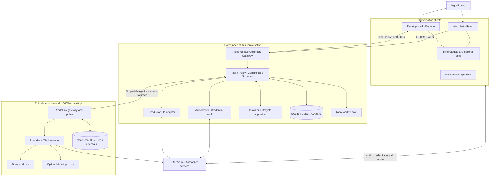
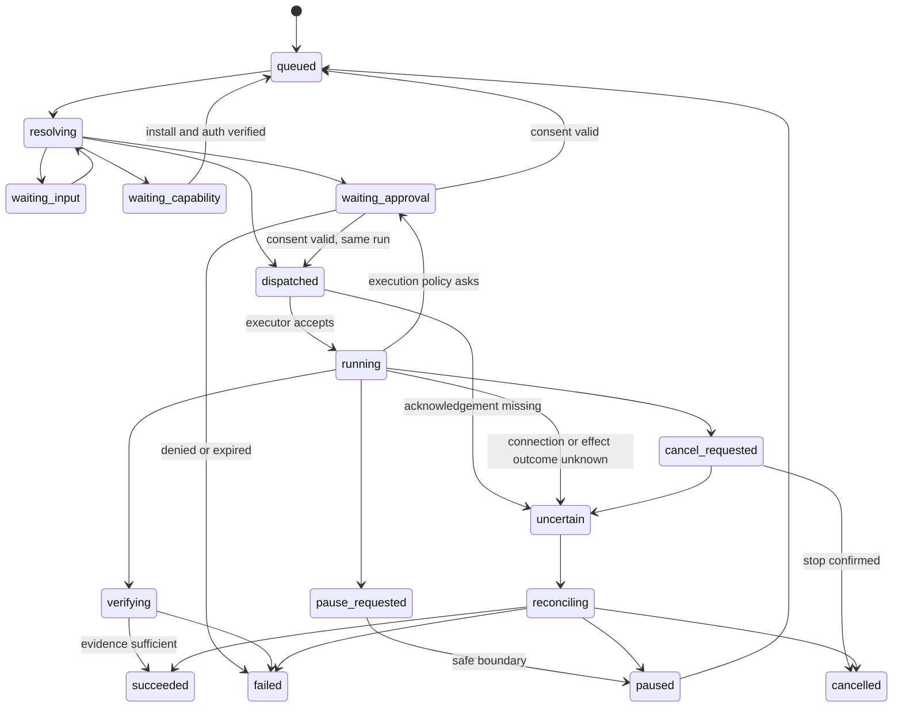

# System Architecture v2 — Conversation Platform

> [English](system-architecture.md) (mặc định) · Tiếng Việt

**Ngày:** 16/09/2026, cập nhật 19/09/2026 · **Trạng thái:** thiết kế; phần đã implement nằm trong `apps/` và `packages/` của repo này, và code là nguồn sự thật cho hành vi — tài liệu này giữ ranh giới, quyết định và nơi cư trú của từng phần. Sơ đồ tổng quan mới nhất: [system-architecture.png](system-architecture.png); khi văn bản và sơ đồ khác nhau, sơ đồ thắng và văn bản phải được sửa theo.
**Phạm vi:** [scope-lock.md](scope-lock.vi.md). Tất cả API/types có tên `agent.*`, NodeLink và CapabilityPack bên dưới là contract đề xuất của app, không phải API chính thức của Pi/MCP.

## 1. Thay đổi kiến trúc cốt lõi

Không còn thiết kế “desktop app có một helper, sau này đưa helper lên server”. Sản phẩm là **portable runtime với nhiều conversation clients** ngay từ đầu. Desktop là một distribution gồm runtime + Electron shell; server là cùng runtime không Electron, có web client tùy chọn. Chạy hai node không bắt buộc một cloud account của nhà phát triển app.

Core không cố biến toàn bộ mạng thành một máy tính có filesystem và database chung. Mỗi node có danh tính, quyền, credentials và tài nguyên riêng. Sự liền mạch nằm ở giao tiếp, delegation và presentation; không nằm ở việc giấu mọi sự khác biệt hay tự copy secrets.

## 2. Sơ đồ tổng quan



Media arrows không có nghĩa mọi widget được tự kết nối mọi provider. Network/media grants, SDK tokens, user gesture và quyền thiết bị đều được kiểm tra. Sơ đồ là biên chức năng; không triển khai mỗi box thành microservice.

## 3. Stack đã chọn

| Lớp | Quyết định | Căn cứ / ranh giới |
|---|---|---|
| UI chung | React + TypeScript + Vite | Cùng conversation components cho desktop và web; không phụ thuộc Node trong renderer |
| Desktop | Electron main/preload mỏng | OS dialogs, notifications, Keychain, local driver consent; không chứa scheduler |
| Runtime | Node.js LTS, TypeScript | Phù hợp Pi SDK và tool ecosystem; pin versions ở compatibility gate |
| Agent | Pi SDK qua duy nhất `pi-adapter` | Không fork agent loop; app quản lý tasks và resources riêng [R01–R04] |
| API | HTTP framework nhỏ hỗ trợ schemas + WebSocket | JSON over HTTPS, typed contracts; Fastify là implementation mặc định đề xuất |
| Local transport | Authenticated Unix socket | Không public listener mặc định trên desktop; có bridge vào cùng command handlers |
| Persistence | SQLite WAL per node + durable outbox/inbox | Mỗi DB một runtime writer; không remote/shared filesystem cho live SQLite |
| Blobs | Local content store với metadata/digest | Transfer có scope, hạn mức, retention; object storage adapter về sau |
| Contracts | Runtime schema validation + generated types | JSON Schema/Zod adapter; version negotiation, không chỉ TypeScript |
| Built-in widgets | Trusted React catalog, lazy chunks | Chart/table/form/map/calendar/editor… từ descriptors có schema |
| Mini-apps | Isolated origins/iframes, MCP Apps host adapter | UI tùy biến không ở privileged renderer; host-mediated actions [R06–R08] |
| Execution | Child processes + OS isolation khi cần | Process riêng không phải sandbox; untrusted tool services chạy container/VM phù hợp |
| Linux delivery | Non-root OCI image + optional native bundle/service | Runtime không yêu cầu display; browser/virtual desktop tách images |
| Voice | Gemini Live (`gemini-3.8-live`) sau proxy WebSocket phía node | Browser không giữ credential provider, kể cả token ngắn hạn; [ADR-001](research/adr-001-gemini-live-provider.md) thay lựa chọn GPT-Live của blueprint [R29] |
| Connectivity | Reachable HTTPS hoặc private-network adapter | Tailscale là một lựa chọn đã có NAT traversal; không bắt buộc để dùng local [R28] |

Không đổi toàn bộ runtime sang Go/Rust chỉ vì có VPS: yêu cầu portability được giải quyết bằng headless boundary, packaging và OS adapters. Native helper chỉ dùng khi thực sự cần OS APIs, không là lần viết lại Pi thứ hai.

### 3.1 Pi Chord: thử nghiệm, không khóa dependency mù quáng

Chord trong ecosystem Pi có plugin facets, service/state/lifecycle primitives hữu ích để thử cho PackHost. Nhưng nó không thay thế NodeLink, auth, effect ledger hoặc protocol replay của app. Tài liệu hiện tại không quy định application wire envelope; không coi phần planned symmetric RPC là đã có. P0 thử Chord phía sau interface `FacetHost`; giữ implementation độc lập tối thiểu nếu compatibility chưa đạt. `node:vm` không phải sandbox bảo mật [R05, R27].

## 4. Ba mặt hoạt động

**Control plane:** commands, task revisions, approvals, capability discovery, install state, pin metadata. Durable, nhỏ, authenticated.

**Execution plane:** Pi worker, tool service, browser profile, OS driver, builds và API effects. Nằm ở node được chọn, có lease, cancel và budgets.

**Media/data plane:** audio live, video call, desktop frames, file blobs lớn. Dùng transport thích hợp, không đổ raw media vào SQLite/event replay hoặc conductor context. State có media session references, không phải từng frame.

Một remote task không có nghĩa audio phải đi vòng qua tất cả VPS. Client có thể thiết lập transport tới provider sau khi auth broker của node liên quan cấp credential tạm đúng loại.

## 5. Các entity và quyền sở hữu

| Entity | Ý nghĩa | Authority |
|---|---|---|
| Owner / Principal | Người dùng, client, node peer hoặc extension identity | Auth/policy của node nhận request |
| Node | Một runtime installation, có key identity và capability inventory | Chính node đó |
| Conversation | Timeline người dùng tương tác | Một home node tại một thời điểm |
| Task | Mục tiêu người dùng, revision, outcomes | Node tạo task; child task ở execution node có lineage |
| Run | Attempt cụ thể trên task revision | Execution node |
| Pi session | Agent context và session history | Một worker owner; không đồng thời ở nhiều nodes |
| Resource | Workspace, file, browser profile, desktop, integration account | Node nắm resource |
| Delegation | Phạm vi công việc và capabilities được ủy quyền | Sender grant + receiver policy, dùng phép giao |
| Surface snapshot | Response UI ở một thời điểm | Home conversation store |
| Widget instance | Mini-app có persistent state, actions, connections | Một instance owner node; user/account scoped |
| Pin | Tham chiếu instance và preference hiển thị | Home conversation/client preference |
| Connection | Authorized external account, scopes, health | Node giữ credentials và adapter |
| Capability install | Package/artifact versions, facets, granted resources | Node cài package |
| Effect | Tác động đã chuẩn bị/gửi/xác nhận hoặc chưa rõ | Execution node thực hiện effect |
| Artifact | Blob/dataset/evidence metadata | Node tạo; bản copy có lineage/digest |

Task, session, widget và connection có vòng đời khác nhau. Task hoàn thành không làm Spotify player hay note bị xóa. Session reload không là lệnh chạy lại action trên widget.

## 6. Process và distribution model

### Desktop distribution

- Electron renderer chạy sandboxed, `nodeIntegration: false`, `contextIsolation: true`, CSP và IPC sender validation. Main chỉ expose typed methods, không generic shell/IPC [R26].
- Runtime helper là chương trình riêng, attach/reconnect được. Đóng window giữ runtime nếu người dùng chọn keep-running; quit runtime khác với đóng UI.
- macOS integration helper thực hiện OS permissions, capture/input driver, credential store. Driver giữ identity/signature ổn định qua release để kiểm thử TCC.
- User có thể dùng desktop như thin client tới server mà không mở local code execution.

### Server distribution

- OCI image core chỉ chứa runtime/web static assets/required dependencies. Browser engine và virtual desktop là optional images/profiles.
- Chạy non-root; writable volume riêng; health/readiness; restart policy. Không mount Docker socket vào worker/tool container.
- Native Linux tarball với runtime bundled + service unit là đường khác cho operator không dùng Docker. Service account tối thiểu, explicit project roots và separate data directory.
- Không mở raw Pi RPC, CDP, VNC hay dev server ra Internet. Public exposure chỉ gateway đã có TLS/auth/rate limits.
- Web UI HTTPS là bắt buộc cho browser features yêu cầu secure context. Local loopback development khác production deployment.

Examples deploy trong implementation plan là templates cần substitute release artifact thực; không bịa registry image hoặc domain đã tồn tại.

## 7. Core services và PackHost

```text
Command Gateway
  -> Authenticate principal + validate schema/version
  -> Resolve conversation/task/widget/resource
  -> Deterministic handler OR conductor intent resolution
  -> Current-policy evaluation + required consent
  -> Durable transaction/outbox
  -> Local executor OR scoped NodeLink delegation
  -> Verify outcome / reconcile unknown effects
  -> Persist event + update conversation/widget/voice summary
```

Core giữ những bất biến mà extension không được thay: identity, permission, secret custody, task/effect state, resource locks, package generation activation, surface action ownership, install consent, budgets và emergency stop.

Pack đóng góp tools, instructions, presenters, custom widgets, drivers, auth/setup descriptors và onboarding recipes. Một pack không được tạo scheduler, global conversation store hoặc hidden root account riêng.

### 7.1 Capability registry

Mỗi capability có stable ID, package/version, execution node, input/output schema, resource kinds, compatibility, auth readiness, invocation route, cancellation, effect category và UI affordances. `installed`, `loaded`, `authenticated`, `authorized`, `healthy` là các trạng thái riêng.

Conductor mặc định chỉ thấy capability summary và danh sách tool chỉ-đọc ngắn mà node đăng ký cho Main Pi (`apps/runtime/src/node-tools.ts`); khi chọn một capability mới nạp schema/skill liên quan. Không dump toàn bộ MCP tools vào mọi lượt model. Dynamic tool activation của Pi có thể được dùng qua adapter khi phù hợp [R03].

Conductor không được có tool tự accept consent, đọc secret values hoặc patch core policy. Tool discovery metadata và mô tả MCP do bên ngoài cung cấp vẫn là untrusted input.

Service facet của package là một nguồn capability: node chạy nó trong container và chỉ đăng ký những tool mà manifest khai báo, với readiness mà host quan sát được (`apps/runtime/src/service-host.ts`). Binding của widget, tool `invoke_capability` của agent và voice đều tới đó qua một đường duy nhất, `invokeCapability`, nơi kiểm tra readiness, input schema của tool và execution policy trước khi bất cứ thứ gì chạy. Ranh giới và những gì chưa xây nằm ở [widget-development.vi.md §4](widget-development.vi.md#4-package-manifest).

### 7.2 Memory & Search: shared service, và Jev là lớp quyết định

Memory & Search là **service dùng chung trong runtime process**, sống qua Pi swap và không nằm trong worker. Nó gồm năm lớp theo sơ đồ: semantic retrieval (sqlite-vec, exact KNN), lexical retrieval (SQLite FTS5, BM25), structured filters (tasks, projects, source refs, thời gian, principal), local embeddings (E5-small quantized ONNX), và rank + verify (RRF, branches, live status). Corpus là Knowledge & History Store: bảng `messages`/summaries trong SQLite và Pi JSONL session của worker, đều đã qua redaction trước khi persist.

**Jev (TypeSafe System One) là lớp quyết định đặt sau retrieval.** Nó không tìm kiếm, không sinh nội dung và không cấp quyền. Hai đường dùng:

```text
Đường A — điều phối runtime:
  Main Pi cần giao việc → Session Manager liệt kê running runtimes/workers
  → structured filters (node, capability, lease, live status) → ≤N candidates
  → Jev Choice: "candidate nào phù hợp nhất cho intent này?" (+ option none)
  → host verify: lease còn sống, grant đủ, revision khớp → dispatch hoặc hỏi user

Đường B — tìm lại session/ngữ cảnh cũ:
  Main Pi/Context Builder có query → temporal parser + FTS5 + KNN (khi có)
  → RRF hợp nhất → top-K candidates (snippet + provenance)
  → Jev Choice: "kết quả nào đúng ý người dùng?" / Noul: "cần hỏi lại?"
  → host verify → đưa vào context hoặc trả câu hỏi làm rõ
```

```text
Đường C — tìm project/thư mục để mở pi session (Workspace & Project Finder):
  User: "thêm skill mới cho dự án agentkit đi"
  → Finder tra **project index cache** (SQLite): repos/folders đã quét trong approved roots,
    có tên, path, git remote, markers (.git, package.json, README, CLAUDE.md), mtime, last-used
  → cache miss/stale → quét bounded (approved roots, depth/ignore rules, incremental theo mtime)
  → lexical + structured (tên, alias, remote, recent-use) → ≤K candidates
  → Jev Choice: "project nào?" (+ none) → host verify: path tồn tại, thuộc approved roots, không leased
  → tạo WorkerBrief { goal, projectRoots:[path] } → start pi session + initial prompt
  → 0 candidate: hỏi user chọn thư mục; uncertain: một câu hỏi làm rõ (T19), không đoán
```

Finder là control extension của Main Pi theo sơ đồ. Root mặc định là **thư mục home của user**, vì app hướng đa tác vụ (tài liệu, ảnh, dự án viết, không chỉ code); ignore list hệ thống là bắt buộc và người dùng chỉnh roots/ignore qua chat. Cache là bảng `project_index` per node, làm mới incremental khi mở app và khi user nhắc tới thư mục không có trong cache; không quét ngoài roots, không theo symlink ra ngoài, không descend vào trong một project đã nhận diện, không đọc nội dung file để index (chỉ metadata và markers). Recent-use và alias do user đặt là tín hiệu xếp hạng mạnh hơn tên gần giống.

Ràng buộc bắt buộc cho lớp này:

- Jev chỉ thấy **state đã sanitize**: intent, và mỗi candidate là một mô tả ngắn có id opaque (không raw rows, không secret, không full transcript). State là object có tên trường, giới hạn kích thước; local-only mode tắt hẳn call ngoài.
- Output của Jev là **enum trong candidates host cung cấp**, luôn có `none`. Host validate `choice ∈ candidates`, áp ngưỡng confidence/margin, rồi **verify lại live status và authorization** trước khi hành động. Confidence không phải authority.
- Jev **không quyết định side effect**. Với đường A, Jev chọn target; dispatch vẫn đi qua command gateway, lease/epoch fencing và consent như mọi delegation khác. Với đường B, Jev chọn context; không có effect.
- Retrieval phải đúng trước. Jev chỉ có giá trị khi retrieval trả 2–K kết quả gần nhau; 0 hoặc 1 kết quả thì không gọi Jev. Nếu FTS/RRF thuần đã đủ tốt trên corpus thật (đo bằng calibration), lớp Jev được tắt bằng config, không gỡ code.
- Fallback khi Jev vắng/uncertain/timeout: rank thuần từ RRF; nếu vẫn mơ hồ, main Pi hỏi lại người dùng. Không trả kết quả fallback như thể Jev đã chọn.
- Deadline riêng cho Jev (đề xuất ≤2 s trong tổng ≤2.5 s cho search); 429/529/timeout là `unavailable` có reason, không retry storm.
- Telemetry: request id, model id thực tế trả về, duration, tokens, enum đã chọn, reason fallback. Không body, không prompt, không header.

Ba đường A/B/C dùng chung một adapter, một policy confidence và một fallback chain: Jev vắng/uncertain → rank thuần → một câu hỏi làm rõ. Lớp quyết định nay có bảy chỗ dùng, khác nhau chỉ ở tập candidate mà host đã lọc trước — hai chỗ dùng nữa, `guard.operation` và `route.model`, được mô tả ở §7.4 và §7.6 kèm trạng thái implementation theo phase:

| Đường | Câu hỏi | Code sở hữu |
|---|---|---|
| A — điều phối runtime | worker/instance nào cho intent này? | `decideRuntimeTarget` |
| B — tìm lại session/ngữ cảnh | kết quả nào đúng ý, hay phải hỏi lại? | `decideSearchResult` (+ Noul) |
| C — tìm project/thư mục | thư mục nào? | `decideProject` |
| D — rich widget | template/section nào cho surface này? | `selectTemplate`, `selectSections` |
| E — tin đến khi đang chạy | steer, interrupt hay background? | `decideTurnAction` |
| F — tập trung phần tóm tắt và bản ghi nhớ | trong 8 kết quả khớp nhất, cái nào lên đầu? (phải bật) | `decideContextFocus` |
| G — nhóm tool cho tin không gợi ý gì | một nhóm tool nào? (phải bật) | `decideToolFamily` |

A, B, C, E, F và G nằm ở `apps/runtime/src/jev-decider.ts`; D ở `apps/runtime/src/jev-selector.ts`, cùng adapter và cùng policy. E là một quyết định chứ không phải một quy tắc vì ba câu trả lời không thay thế được cho nhau: steer đổi việc đang làm, interrupt vứt nó đi, background tiêu thêm một call cho việc người dùng có thể không định tách ra. Khi không đủ chắc, E nghiêng về `interrupt` — hướng lấy lại được, thay vì hướng im lặng. Cấu hình và vận hành: [mini-app/jev-configuration.md](mini-app/jev-configuration.vi.md).

**Trạng thái đo được (2026-09-17).** Cấu trúc trên đã có trong repo, và ba con số quyết định cấu hình đã đo thay vì suy đoán:

| Lớp | Trạng thái | Số đo / lý do |
|---|---|---|
| Lexical (FTS5 + BM25) | **Mặc định đang dùng** | 96,8% trên corpus nhãn (Phase 8) |
| Jev cho search | Tắt bằng config, code còn nguyên | Calibration live `jev-1.13.0`: `rank` 31/34 vs `jev` 31/34 — không hơn thì không trả thêm một call mỗi lần search |
| Semantic (sqlite-vec + E5-small) và RRF | Triển khai xong, **tắt mặc định** | Hybrid 31/34 ở ceiling cosine 0,1 nhưng 25/34 khi ceiling ≥0,2: KNN luôn trả hàng xóm gần nhất nên câu hỏi "không có đáp án" bị trả về kết quả gần đúng |

Deadline trong bảng ràng buộc ở trên nay là hằng số được enforce: 2 s cho một quyết định, tổng 2,5 s cho đường search (`SEARCH_DECISION_TIMEOUT_MS`, `SEARCH_TOTAL_BUDGET_MS`), và hết hạn thì trả về rank thuần kèm reason chứ không giả vờ Jev đã chọn. Extension `sqlite-vec` được probe trên cả hai platform repo chạy: `v0.1.9` trên darwin arm64 (máy dev) và linux x64 (CI), với create/insert/KNN đều chạy. Ở đường C, câu hỏi "thư mục nào?" nay trả lời được bằng path người dùng gõ: path đọc từ câu gốc (trước redaction vì redactor thay path bằng placeholder), thư mục được nêu tên vẫn phải nằm trong approved root, và thư mục dùng gần nhất được **hỏi** thay vì tự mở.

**Context planner: một session mới và bản ghi nhớ của mỗi lượt mang theo gì (#433).** `apps/runtime/src/context-planner.ts` là một phép chiếu trên những gì đã lưu — `memory_records`, `history_fts` và `messages` — không phải một kho mới. Hai phần của prompt đi qua nó, được lọc theo principal và hội thoại trước khi xếp hạng bất cứ thứ gì:

- **Phần tóm tắt cho session mới.** Một session được tạo cho hội thoại đã có (sau khi bị giải phóng vì nhàn rỗi, sau lỗi hoặc sau khi khởi động lại) được kể lại 12 tin mới nhất trong 40 tin mới nhất, dù planner bật hay tắt. Khi tin sắp trả lời có chung từ khóa với điều gì đó, tối đa 4 tin cũ hơn của cùng hội thoại khớp với nó (BM25, ít nhất hai từ chung, đã bỏ dấu; chỉ tin của người dùng và của chính Clark, không bao giờ là tin system hay tool) được truy xuất. Chúng không nằm trong phần hướng dẫn của tóm tắt: chúng vào phần dữ liệu của lượt, sau dữ liệu của chính bên gọi, dưới một tiêu đề nói rõ đây là dữ liệu chứ không phải chỉ dẫn, mỗi tin ghi rõ ai nói. Trong chính phần tóm tắt, các dòng cũ trong cửa sổ không khớp được rút ngắn, hai dòng cuối luôn giữ nguyên, và phần tóm tắt nói còn bao nhiêu tin cũ hơn không nhắc lại, kèm việc `search_history` đọc lại được chúng. Chỉ 12 dòng được nhắc lại mới bị loại khỏi lần tìm đó, nên một quyết định đưa ra cách đây 13 đến 40 tin vẫn được tìm thấy. Khi không có gì khớp, phần tóm tắt giống hệt từng byte bản cố định.
- **Bản ghi nhớ mỗi lượt.** Trong 200 bản ghi nhớ mới nhất mà người đó thấy được, những bản khớp với tin nhắn được xếp lên đầu; không có gì khớp thì bản ghi nhớ là bản 12 mục mới nhất như trước. Bản ghi đã xóa không được đọc, nên nó biến mất ngay từ lượt sau.

Mỗi kế hoạch đều có giới hạn (12 dòng tóm tắt, 4 tin cũ hơn, 200 ứng viên ghi nhớ, 24 từ khóa truy vấn) và được báo bằng một dòng JSON trên stderr (`context-plan`) chỉ gồm số đếm, không bao giờ có nội dung hay id. `CLARKCANT_CONTEXT_PLANNER=off` trả lại cả hai hành vi cố định. Jev chỉ sắp lại 8 kết quả đầu khi người vận hành đặt `CLARKCANT_CONTEXT_DECIDER=jev`, khoảng cách xếp hạng chưa đủ rõ, và câu trả lời của nó có thể đổi điều được gửi đi (một mục bị bỏ hoặc bị rút ngắn); nó chỉ nhận câu trả lời dứt khoát, không bao giờ thêm hay bớt ứng viên, và không cấp quyền gì. Khi được hỏi, nội dung đã che thông tin nhạy cảm của các ứng viên, cắt còn 200 ký tự mỗi mục, cùng tin nhắn cắt còn 300 ký tự, được gửi tới provider của Jev; lỗi hay hết giờ thì giữ thứ tự tất định. Một lượt được tính là đang chạy — Dừng thấy được và tin thứ hai cũng thấy — ngay từ lúc nó bắt đầu đọc phần ngữ cảnh này, và nếu Dừng đến trong lúc đó thì prompt không bao giờ được gửi.

**Truy xuất dùng chung cho việc chạy nền và task worker.** Một việc chạy nền chỉ-đọc (`runInBackground`) và một worker được điều phối qua `task-dispatch.ts` bắt đầu mà không có hội thoại. Chỉ việc do một người yêu cầu trong hội thoại mới được nhận ngữ cảnh đã truy xuất; task do máy khác ủy quyền, do automation khởi chạy hay do chính node tạo ra thì không, giống ranh giới đã áp cho quyền truy cập thư mục. Nay mỗi bên được nhận phần truy xuất của planner cho yêu cầu hay mục tiêu của nó (`apps/runtime/src/context-bundle.ts`), giữ thành một bundle đóng băng gồm tham chiếu và digest sha256, theo khóa principal, hội thoại, số tin nhắn và từ khóa truy vấn, nên các việc khởi chạy từ cùng một yêu cầu tại cùng một thời điểm dùng chung một lượt truy xuất (sống 10 phút, giữ tối đa 64, tối đa 6 ghi nhớ và 6 tin nhắn). Bundle được đọc khi cần, không mở hết từ đầu: việc chạy nền nhận danh sách các mục (mỗi mục một đoạn xem trước ngắn) trong phần dữ liệu và một tool chỉ-đọc `read_context` để đọc trọn một mục; task worker chỉ nhận số mục trong brief cùng tool đó, do host trả lời qua kênh IPC của worker (`clarkcant.context.request`/`reply`); brief cũng liệt kê những loại yêu cầu host trả lời trên kênh đó, nên worker chỉ được mở kênh để đọc ngữ cảnh sẽ không đưa ra tool lệnh hay trình duyệt. Mỗi lần đọc đều đi lại qua các bộ đọc giới hạn theo principal và kiểm digest, nên một ghi nhớ bị xóa hay một tin bị đổi sau khi tạo bundle sẽ không được đọc, kể cả giữa chừng; với principal khác thì bundle không đọc được gì, danh sách tối đa 3.000 ký tự, một mục 2.000 ký tự, và một worker tối đa 24 lần đọc. Mọi thứ nó trả về nằm dưới một tiêu đề nói rõ đây là dữ liệu chứ không phải chỉ dẫn. Việc đọc ngữ cảnh không bao giờ là bằng chứng rằng task đã xong. Truy xuất lỗi thì việc chạy tiếp tục mà không có nó. Mỗi bundle được cấp là một dòng JSON trên stderr (`context-bundle`) chỉ gồm số đếm, kể cả số lượt truy xuất đã dựng và đã dùng lại.

**Mức dữ liệu: model được nhận những gì (#433).** Mỗi khối mà planner có thể đặt trước một model được gắn nhãn `public`, `internal`, `confidential` hoặc `secret` (`packages/contracts/src/data-class.ts`), chỉ từ chính văn bản của nó và trước khi bất cứ thứ gì được xếp hạng hay gửi đi: một dạng credential (bearer token, JWT, secret có tiền tố hoặc có tên) là `secret`; địa chỉ email, số điện thoại hoặc đường dẫn thư mục home là `confidential`; mọi thứ khác người dùng hoặc Clark viết, kể cả định danh, mã commit và digest, là `internal`. Ghi chú bộ nhớ được che khi ghi nên được đọc là `internal`. Một model profile có thể nêu nó được nhận gì (§7.6); profile không nêu gì được nhận mọi thứ trừ `secret`, và một pool không đọc được thì thu hẹp về `public`. Khi planner bật, khối vượt trần của model đang trả lời bị bỏ khỏi recap, bản ghi nhớ, phần tin nhắn trước đó và bundle truy xuất của việc chạy nền hay task worker; lượt chỉ được báo số khối bị giữ lại, không bao giờ được báo nội dung. Jev chỉ được đưa ứng viên `public` và `internal`; ứng viên nhạy cảm hơn giữ nguyên vị trí xếp hạng tất định. Với `CLARKCANT_CONTEXT_PLANNER=off` không có gì bị giữ lại, như trước.

**Hướng dẫn dự án có điều kiện (#433).** Một dự án có thể giữ hướng dẫn chỉ áp dụng cho một phần của nó (`apps/runtime/src/conditional-instructions.ts`). `.clarkcant/instructions.json` trong một thư mục nằm trong root đã duyệt chứa tối đa 32 rule, `{ "version": 1, "rules": [{ "when": { "path", "operation", "capability", "role", "skill", "project" }, "include": ["name"], "pin": false }] }`, và mỗi tên được include là `.clarkcant/instructions/<name>.md`. `path` là glob tương đối với thư mục đó (`**` đi qua nhiều thư mục; mẫu không có `/` khớp tên tệp ở bất cứ đâu); `operation` là `read`, `write`, `test`, `deploy` hoặc `command`. Rule áp dụng khi những gì công việc chạm tới khớp với nó: tệp và thư mục tin nhắn tham chiếu (tính là đọc), đường dẫn tuyệt đối trong các tool call của hội thoại (đường dẫn của tool tệp, `cwd` của lệnh, với thao tác suy ra từ lệnh), và với task được điều phối là các root nó được cấp, root ghi được tính là ghi. Khi một tool call làm rule áp dụng, đoạn hướng dẫn được nối vào kết quả của chính call đó; nếu không thì nó vào brief của lượt kế tiếp. Đoạn không ghim được nêu một lần mỗi session; đoạn ghim được nêu lại mỗi lượt nó còn áp dụng, nên nó còn sau một recap. Task worker nhận các đoạn ứng với quyền được cấp trong brief của nó. Các đoạn nằm dưới một tiêu đề nói rằng đó là cách làm của dự án và không cấp quyền gì; chúng được phân loại như mọi khối khác và bị giữ lại khi vượt trần của model. Giới hạn: 8 tên mỗi rule, 4.000 ký tự mỗi đoạn, 6.000 mỗi lượt, tệp rule 64 KB, nhớ 64 lần chạm; đoạn trỏ ra ngoài thư mục instructions bị bỏ qua, và tệp không hợp lệ được báo một lần trên stderr (`instructions-invalid`, chỉ tên thư mục) và không thay đổi gì. `CLARKCANT_CONDITIONAL_INSTRUCTIONS=off` tắt tính năng này.

### 7.3 Pi runtime: Main Pi, control extension và worker

Sơ đồ tách "Pi Runtime — MAIN SESSION" khỏi "Other pi Workers". Mục này không thay sơ đồ — nó chỉ bổ sung nơi cư trú trong code và những ranh giới mà một sơ đồ không hiển thị được, nên chỗ nào sơ đồ mô tả khác thì sơ đồ vẫn thắng.

**Seam SDK.** `packages/pi-adapter` là package duy nhất import SDK Pi. Mọi phần khác phụ thuộc interface `PiAdapter` (`packages/pi-adapter/src/types.ts`), nên một breaking change của SDK là thay đổi adapter chứ không phải refactor core. Hai implementation: `RealPiAdapter` (typed theo declaration của SDK) và `FakePiAdapter` (in-process, tất định, cho test và CI — đây là thứ cho phép chạy cả ứng dụng mà không cần provider account). Các bước lifecycle mà SDK thực sự làm được ghi ở [research/compatibility-lock.md](research/compatibility-lock.md), sinh bởi `packages/pi-adapter/src/probe-cli.ts`; file đó ghi môi trường đã đo nên không sửa tay.

**Main Pi và control extension.** Main Pi là session chính của hội thoại; các control extension dưới đây là code của node, sống trong `apps/runtime` chứ không trong worker — đó chính là điều kiện để chúng sống qua một lần Pi swap.

| Trên sơ đồ | Code sở hữu | Ranh giới giữ nguyên |
|---|---|---|
| Task planning | conductor trong `packages/core`, `apps/runtime/src/runtime-candidates.ts` | chọn node/worker theo resource locality, grant và lease còn sống, không theo CPU rảnh |
| Session Manager | `apps/runtime/src/session-store.ts` (list/resume), `session-search.ts` (search) | liệt kê session không đọc nội dung transcript |
| Process Controller | `apps/runtime/src/model-turn.ts`, `background-sessions.ts`, `work-supervisor.ts` | turn control (`running`/`interrupt`/`steer`) nằm trên chính object turn, không ở map bên cạnh; mọi việc chạy nền khác đi qua một supervisor duy nhất |
| Workspace & Project Finder | `apps/runtime/src/project-finder.ts` | chỉ metadata và marker; không đọc nội dung file để index |

**Tool Main Pi thấy.** Node công bố tool của mình **lúc boot** (`apps/runtime/src/tool-catalogue.ts`), không dựng theo yêu cầu: một danh sách chỉ tồn tại trong closure thì không có gì khẳng định được nó. Tool chỉ-đọc cấp cho Main Pi ở `apps/runtime/src/node-tools.ts`; tool built-in của Pi được liệt kê riêng. Không dump toàn bộ MCP tools vào mọi lượt model (§7.1).

**Mở dần tool (tắt mặc định).** Với `CLARKCANT_TOOL_DISCLOSURE=progressive`, session của hội thoại chỉ được đưa một phần tool của nó (`apps/runtime/src/tool-disclosure.ts`): các tool lõi giúp một lượt tự gỡ (`ask_user`, `ask_user_question`, `request_secret`, `remember`, `search_history`, `read_attachment`, `show_view`), mọi tool không thuộc nhóm nào, và các nhóm mà tin nhắn nhắc tới bằng nguyên từ tiếng Anh hoặc tiếng Việt (projects, terminal, work, interface, packages, automation, inbox). Gợi ý tiếng Việt nào sẽ trùng với từ khác khi bỏ dấu ("tối"/"tôi", "dừng"/"dùng") chỉ khớp khi viết đúng dấu. Tin đầu tiên của session mà không nhắc nhóm nào thì được mọi tool, trừ khi người vận hành bật `CLARKCANT_CONTEXT_DECIDER=jev`, khi đó Jev có thể chọn một nhóm; khi đã thu hẹp, tin không nhắc gì mới thì giữ nguyên tập tool. Trong một session, tập tool chỉ tăng, vì mỗi lần đổi là dựng lại system prompt — chính là phần đầu prompt mà provider cache; session mới hoặc handoff thì bắt đầu lại. Adapter chỉ bật những tool session được tạo cùng: `RealPiAdapter.setActiveTools` chọn trên baseline đã đóng băng của session và chỉ áp dụng qua `setActiveToolsByName` của SDK, hàm dựng lại system prompt; các tool hội thoại đăng ký sau khi tạo vẫn được bật. Lập kế hoạch hay áp dụng mà lỗi thì tập tool giữ nguyên và lượt vẫn tiếp tục. Mỗi lần đổi, và mỗi lần lỗi, là một dòng JSON trên stderr (`tool-disclosure`).

Nó vẫn tắt vì đã được đo. `apps/runtime/test/context-economics.spec.ts` chạy lại một corpus EN/VI có nhãn gồm 38 lượt trên chính định nghĩa tool của runtime (30 tool, khoảng 8.800 token schema) và mô phỏng prompt cache, tính giá riêng cho phần đọc cache, phần ghi cache và phần input không cache. Theo các giả định đã ghi rõ, `progressive` giảm token schema mỗi lượt từ khoảng 8.800 xuống 5.500 nhưng tốn hơn 7,2% so với đưa mọi tool, vì mỗi lần mở thêm là ghi lại phần đầu đã cache, và thiếu tool cần dùng ở 1 trên 38 lượt; chọn đúng tập tool cho từng lượt tốn hơn 92% và thiếu 2 lượt. Kết quả này là trong mẫu: các gợi ý nhóm được viết dựa trên chính corpus này, nên tỉ lệ thiếu là trường hợp tốt nhất, không phải kết quả trên tập giữ riêng. Đây là ước tính offline; độ trễ, hành vi cache thật và tỉ lệ hoàn thành việc cần một A/B live với credential của provider.

**Dùng lại session (tắt mặc định).** Một hội thoại giữ một session cho tới khi nó lỗi, bị dọn hoặc đổi model. `CLARKCANT_SESSION_POLICY` (`apps/runtime/src/session-policy.ts`) quyết định ở mỗi ranh giới lượt có giữ nó hay không. `observe` ghi một dòng JSON trên stderr mỗi lượt (`session-policy`) gồm tuổi session, thời gian rảnh, số lượt, kích thước và cửa sổ context, token đọc và ghi cache, chi phí, độ trễ lượt trước, tỉ lệ từ mới trong tin nhắn, số dòng brief thay đổi và quyết định: chỉ số đếm, không có văn bản. `rebuild` thực hiện luôn quyết định đó. Nó không bao giờ dựng lại session ở lượt đầu tiên hay khi đang có lượt chạy, và chỉ dựng lại khi cache của provider đã nguội (rảnh từ 5 phút), context có ít nhất 20.000 token, và ít nhất 75% từ của tin nhắn không có trong 6 tin nhắn gần nhất của session. Từ 50% tới 75% thì dùng lại, trừ khi operator đặt `CLARKCANT_CONTEXT_DECIDER=jev`; khi đó Jev được xem số giây rảnh, số token context, tỉ lệ từ mới và số lượt, không bao giờ văn bản, và chỉ một câu trả lời dứt khoát mới được tính. Dựng lại tạo một session mới được brief bằng recap đã lập đúng như sau khi bị dọn, nêu lại hướng dẫn và tool, bỏ session cũ, và không đụng tới transcript; nếu không tạo được session mới, lượt tiếp tục trên session cũ. `apps/runtime/test/session-economics.spec.ts` mô phỏng ba hội thoại có kịch bản với cache tính giá như harness của việc mở dần tool. Theo các giả định có nhãn của nó, policy tốn đúng bằng dùng lại trên hội thoại còn nóng, nơi dựng lại mỗi lượt tốn hơn 25%, và khoảng một nửa so với dùng lại trên hội thoại đã nguội và đổi chủ đề. Dựng lại mỗi lượt rẻ hơn dùng lại qua một khoảng nguội cùng chủ đề, nhưng chỉ bằng cách bỏ context nguyên văn ở mỗi lượt, điều harness không định giá được. Các ngưỡng là phán đoán có nhãn; thời gian sống thật của cache, độ trễ và việc recap có làm mất điều một lượt cần hay không cần một A/B live với credential của provider.

**Worker.** Mỗi project một worker pi session với brief riêng (`WorkerBrief`: goal, `projectRoots` đã được duyệt, capability refs, tool set, model). Tool set phải đăng ký lúc tạo session: SDK cố định nó tại thời điểm đó, và một tool thêm sau vừa lọt allowlist vừa không xuất hiện trong system prompt. Pi chạy trong process của runtime; runtime chỉ spawn process ở ba chỗ: `apps/runtime/src/run-command.ts` (lệnh của model), `terminal-sessions.ts` (shell) và `worker-process.ts` (task worker). Một lần spawn có cần người duyệt hay không do `ExecutionPolicy` quyết định (§7.4): mặc định là `guarded`, nghĩa là không hỏi ai và preflight của host vẫn giữ containment.

**Task được chạm vào đâu, và mang ý định của ai.** Task ghi lại nó đến từ đâu (`TaskRecord.origin`, migration 28): `interactive` (người dùng yêu cầu trong hội thoại), `persistent` (một automation hành động thay người dùng, kèm các effect category đã được giao), `delegated` (yêu cầu của peer) hoặc `system` (việc riêng của node). Task tạo ra không có origin được coi là `interactive`, đúng như mọi task trước đây. Execution policy đọc origin đó làm ý định (`ExecutionIntent` trong `packages/core/src/execution-policy.ts`): ở chế độ Autonomous, một category rủi ro (`external-write`, `financial`, …) chỉ được thực hiện mà không hỏi khi ý định bao gồm nó — luôn luôn với `interactive` và `delegated`, chỉ với các category được liệt kê với `persistent`, không bao giờ với `system`. Task cũng có thể nêu resource của nó (`TaskRecord.resources`): folder (đọc hoặc ghi) và repository. Dispatcher (`apps/runtime/src/task-dispatch.ts`) giao cho worker đúng những resource đó, mỗi cái vẫn phải nằm trong vùng node sở hữu; task không nêu resource chỉ giữ root của node khi do người dùng yêu cầu, còn mọi origin khác không nêu resource đều bị từ chối trước khi worker tồn tại. Repository không bao giờ được sửa tại chỗ: sau policy gate, node tạo một worktree của commit hiện tại dưới `<dataDir>/worktrees/<taskId>/<repository>-<digest>` trên nhánh `clarkcant/task-<taskId>` (`packs/project-work/src/managed-worktree.ts`) — mỗi repository một worktree, nên task nêu nhiều repository thì mỗi cái có worktree riêng, và cùng một repository nhận lại đúng đường dẫn đó khi task được dispatch lại (task có worktree từ trước layout này thì tiếp tục ở `<dataDir>/worktrees/<taskId>`) — chỉ giao các đường dẫn đó cho worker, và gỡ worktree (không dùng force) khi task kết thúc — nhánh vẫn còn; worktree còn thay đổi chưa commit thì được giữ lại và hội thoại được báo nó nằm ở đâu. Node dừng giữa chừng thì chưa kịp làm bước đó, nên ở lần khởi động sau (`apps/runtime/src/worktree-sweep.ts`, chạy sau recovery), mỗi worktree dưới `<dataDir>/worktrees` có task đã kết thúc sẽ được gỡ theo cùng cách nếu sạch. Nếu còn thay đổi chưa commit, worktree được giữ lại và báo đúng một lần — trong hội thoại của task, kèm một thông báo trong inbox trỏ tới đó. Worktree có task vẫn đang mở, hoặc không thuộc task nào mà node biết, được để nguyên; không nhánh nào bị động tới.

**Những việc tự xảy ra: signal và yêu cầu lâu dài.** Người dùng nói "khi X xảy ra thì làm Y" (hoặc "cứ 30 phút…", "9 giờ sáng mai…") và Clark lưu lại bằng tool `create_automation` thành một persistent intent (`packages/contracts/src/signals.ts`, migration 29): một topic, một danh sách điều kiện tất định trên signal (`equals`, `in`, `contains`, `exists` trên một đường dẫn có dấu chấm — không có model nào chạy khi đối chiếu signal), và việc cần làm — một lời nhắc, hoặc một task kèm các folder và repository nó được chạm vào cùng các effect category đã được giao (`destructive` và `financial` không bao giờ được giao). Signal là bất cứ việc gì đã xảy ra, từ bên ngoài (`POST /signals`) hoặc từ timer của chính node; nó được ghi lại trước tiên, duy nhất theo `(sourceId, dedupeKey)`, nên bên gửi có thử lại cũng không bao giờ khởi động thứ gì hai lần. Sau đó automation service (`apps/runtime/src/automation-service.ts`, logic ở `packages/core/src/automation.ts`) chỉ làm việc từ những gì đã được ghi: timer đến hạn thành signal có khoá theo khung giờ của nó, mỗi signal đang chờ được đối chiếu trong một transaction ghi lại đúng một run cho mỗi `(automation, signal)` cùng task id mà run sẽ dùng, rồi từng run được bắt đầu — lời nhắc được nói trong hội thoại của automation và để lại trong inbox; task được tạo dưới task id của run với origin `persistent`, được resolve, và được acknowledge trong cùng lần ghi đánh dấu run đã bắt đầu, rồi mới giao cho dispatcher. Node dừng ở bất kỳ đâu giữa chừng thì làm nốt phần còn lại ở tick đầu tiên sau khi khởi động lại, và không làm gì hai lần. Task mà capability chưa dùng được (pack vẫn đang nạp sau khi khởi động) thì chờ, được báo một lần, rồi tự tiếp tục ở một tick sau. Signal liên tục lỗi được thử lại với backoff, rồi được giữ lại ở trạng thái dead kèm cảnh báo trong inbox. Signal do chính Clark gây ra chỉ đáp ứng những automation cho phép điều đó.

**GitHub là nguồn signal đầu tiên.** `packages/signal-sources` chứa các adapter nguồn; lõi automation không import adapter nào. Adapter GitHub (`github.ts`) xác minh một lần giao webhook — HMAC-SHA256 trên body thô với `github_webhook_secret` của node, so sánh thời gian hằng, trước khi đọc bất kỳ trường nào — rồi chuẩn hoá nó thành một signal chung, gọn (`github.issue.labeled`, `github.pull_request.synchronize`, `github.workflow_run.completed`, …) với repository ở `subject.refs.repository`, khử trùng theo `X-GitHub-Delivery`; payload đầy đủ của GitHub không được lưu. `POST /signals/github` (`apps/runtime/src/routes/github-signals.ts`) trả lời trước bước kiểm tra bearer, vì GitHub không thể giữ token của node, và từ chối mọi lần giao có chữ ký không khớp mà không ghi gì; tầng transport giới hạn body ở 2 MiB. Login của bên gửi đi theo `provenance.actor`, và lần giao do một trong các login của chính node gây ra (preference `signals.github.selfLogins`, đặt trong hội thoại) là `selfGenerated`. Trước khi tạo task do GitHub kích hoạt, automation service kiểm tra rằng mọi repository nó được giao đều là bản clone có `origin` đúng là repository mà signal nói tới (`git remote get-url origin`); không khớp thì run thất bại và nói rõ, nêu tên repository chứ không bao giờ nêu URL remote. Webhook secret được xin qua `request_secret` vào lần đầu một việc tự động GitHub được thiết lập. Node không có địa chỉ công khai sẽ poll thay vào đó (`apps/runtime/src/github-polling.ts`, chạy từ tick của automation service): các repository trên github.com mà điều kiện `subject.refs.repository` của những việc tự động `github.*` đang hoạt động nêu tên được đọc từ Events API nhiều nhất năm phút một lần (lâu hơn khi `X-Poll-Interval` yêu cầu, kèm `If-None-Match` để danh sách không đổi chỉ là một `304`), khử trùng theo id của event, với cursor và tag được lưu theo từng repository trong `signal_poll_state` để sau khi khởi động lại mỗi event chỉ được ghi một lần. Repository có webhook delivery được xác minh trong 24 giờ qua thì bị bỏ qua, node không có việc tự động nào như vậy thì không gửi request nào, giới hạn tốc độ thì chờ tới lúc GitHub reset, và các lỗi khác thì lùi dần (tối đa sáu giờ) với một thông báo inbox cho mỗi chuỗi lỗi. Repository riêng tư được đọc bằng `github_token` qua secret broker (consumer `signals:github`), chỉ xin khi GitHub từ chối repository đó.

**Webhook đã ký và node đã ghép cặp là nguồn signal.** Thêm hai nguồn nữa đổ vào cùng một lõi, và không nguồn nào có hình dạng giống GitHub. Webhook đã ký (`packages/signal-sources/src/webhook.ts`, `apps/runtime/src/routes/webhook-signals.ts`) là một nguồn mà người dùng đặt tên trong hội thoại: một yêu cầu lâu dài trên `webhook.<source>.<việc đã xảy ra>` xin secret của nguồn qua `request_secret`, lưu dưới tên `webhook_<source>_secret` với consumer `signals:webhook:<source>`, và `POST /signals/webhook/<source>` trả lời trước bước kiểm tra bearer, xác minh `X-Signature-256` trên body thô bằng secret đó qua Secret Broker (cùng phép so sánh thời gian hằng như của GitHub, ở `adapter.ts`), rồi mới đọc `{ id, topic, payload?, subject?, occurredAt? }` thành signal `webhook.<source>.<topic>`, khử trùng theo `id`; tầng transport giới hạn body ở 256 KiB, và nguồn chưa có secret thì không tìm thấy. Tin từ một node đã ghép cặp đến dưới dạng envelope NodeLink `signal` (`apps/runtime/src/peer-signals.ts`): bên nhận dựng signal từ kênh — nguồn `peer`, node id của bên gửi đã xác thực, topic `peer.<topic>` — và ghi nó qua cùng `ingestSignal`, nên thứ nó khởi động chỉ là những gì chủ của node nhận đã đặt. `POST /peers/<nodeId>/signals` của chính node xếp một signal cho peer đã xác nhận, và một lượt chuyển khởi động cùng node (`startPeerDelivery`) mang outbox tới các peer khi có gì được xếp hàng và cứ 30 giây một lần. Tiền tố trên cả hai loại topic là thứ ngăn bên gửi đáp ứng việc tự động của một nguồn khác.

**Task chạy trên một node đã ghép cặp.** Một automation dạng task có thể nêu một peer đã xác nhận làm `executor`. Việc đặt nó viết một task grant đúng cho các thư mục, repository và effect của automation và gửi grant đó bằng `pair.confirm`; mỗi lần chạy đánh dấu task đã giao cho peer đó, ghi run của peer như một run của task ấy, và xếp một `delegate` có brief là mục tiêu, tài nguyên và effect (`apps/runtime/src/delegation.ts`). Bên nhận (`apps/runtime/src/delegation-handlers.ts`) không chạy gì mà chủ của chính nó chưa cho phép: `allow_peer_tasks` lưu allowance theo từng peer (`peer_allowances`), lần giao được kiểm tra với grant đã lưu giao với allowance đó, task được tạo dưới task id của bên gửi với origin `delegated` và các effect mà cả hai bên cho phép, và execution policy hỏi chủ node nhận trước mọi effect khác, ở mọi chế độ. Mọi kết quả — kể cả bị từ chối, và khởi động lại khiến kết quả chưa rõ — quay về bằng một `result` mà chỉ node đã được giao task mới được gửi; nó chốt task của chính bên gửi với biên nhận của peer làm evidence. Lệnh dừng ở bên gửi đi sang bằng `cancel.request`; bên nhận dừng worker đang chạy task đó (`stopTask` trong `apps/runtime/src/task-dispatch.ts`, cũng là lệnh dừng một người dùng cho task chạy trên chính node của mình) và việc worker kết thúc là xác nhận đã dừng. Một lần giao việc hoặc lệnh dừng mà bên gửi đã bỏ cuộc không gửi được cũng chốt task của bên gửi: thất bại khi peer từ chối, chưa rõ khi peer không hề trả lời (`settleUndelivered`). Khi chủ node nhận chưa quyết định một yêu cầu duyệt, bên nhận gửi `status` và bên gửi báo cho chủ của mình mà không đưa task của chính nó ra khỏi `running` (`receiveStatus`); một lần từ chối hoặc hết hạn được trả lời bằng một `result` chưa hề chạy (`answerApprovalDecision`). Mỗi automation có executor chạy dưới grant ghi trên action của nó (`grantCovering`), và tạm dừng hoặc gỡ automation sẽ rút grant đó ở cả hai node (`withdrawGrant`, NodeLink `revoke`); bên nhận gán cho task budget thời gian và token của grant, và đếm số lần chạy theo `maxRuns`. Trước khi giao, bên gửi có thể hỏi peer chạy được gì cho mình (`GET /peers/capabilities`, `apps/runtime/src/peer-capabilities.ts`): một bản tóm tắt có phiên bản chỉ dựng từ allowance của bên nhận cho peer đó, được `list_peers` hiển thị và được `create_automation` biến thành cảnh báo, không bao giờ thành từ chối; một lần giao mà bên nhận cho phép nhưng chưa chạy được thì chờ ở đó trong `waiting_capability`, được báo về bên gửi bằng `status`, khi bên gửi có quảng bá `capabilities` (#264). Các tệp một lần chạy ghi ra được mang về khi bên gửi có quảng bá `artifacts` (#263, `apps/runtime/src/delegated-artifacts.ts`): worker báo từng tệp mà `write_project_file` đã ghi kèm sha256 của nó, bên nhận chỉ giữ các tệp nằm trong thư mục của task và, chỉ khi grant của bên gửi xin tệp và allowance của chính chủ nó cho phép gửi về (`budget.maxArtifactBytes` ở cả hai, trong phạm vi hạn mức nhỏ hơn), đọc lại và băm lại từng tệp, bỏ ra các loại markup và script cùng mọi thứ vượt hạn mức mà không lưu, lưu phần còn lại thành blob và xếp một `artifact.offer` cho mỗi tệp trước `result`, và result nêu tên chúng trong `evidence.artifacts`; bên gửi quyết định từng lời đề nghị dựa trên grant của chính automation của nó (`budget.maxArtifactBytes`, không đặt hoặc bằng 0 thì không nhận tệp nào), ghi quyết định vào `task_artifacts` (migration 37), kéo byte đã nhận từ `GET /peers/artifacts/{digest}` — chỉ được phục vụ cho digest đã đề nghị gửi tới đúng peer đó — và gắn từng tệp làm artifact và bằng chứng `file-version` vào lần chạy task của nó, hiện cùng với result; các tệp đã nhận mà chưa về được tải lại khi khởi động.
**Một task GitHub, từ nhãn tới pull request.** Worker của task do automation tạo được cho biết điều gì đã khởi động nó. Sau mục tiêu người dùng viết là một khối gồm các dữ kiện có cấu trúc của signal: topic, đối tượng, và các subject ref, được ghi rõ là dữ kiện chứ không phải chỉ dẫn. Khối này không bao giờ chứa văn bản tự do trong payload; worker đọc phần đó qua tool, như dữ liệu (`triggerBrief` trong `apps/runtime/src/automation-service.ts`).

Worker làm việc trong worktree do node quản lý, chạy test và `git` qua `run_command`. Để push và mở draft pull request, nó chạy `git push` và `gh pr create` với `secretRef: "github_token"`: broker tiêm token vào môi trường của đúng lệnh đó dưới tên `GH_TOKEN`. Khi một automation dạng task được thiết lập mà chưa có token, `create_automation` xin token qua `request_secret` (consumer `command:gh,command:git,signals:github`, để cùng token đó đọc được event của repository riêng tư khi node poll).

Task chốt kết quả theo bằng chứng đầu tiên không được xác minh, hoặc theo bằng chứng cuối cùng nếu mọi thứ đều được xác minh (`settlingEvidence`). Vì vậy một test hỏng vẫn là kết quả, kể cả khi bước sau đó thành công. Kết quả được báo trong hội thoại nơi automation được thiết lập, kèm output của lệnh, tức địa chỉ pull request, mà giao diện hiển thị thành link.

`apps/runtime/test/coding-journey.spec.ts` chạy toàn bộ chuỗi với một bare remote local và một `gh` được ghi lại. Cùng hành trình đó với GitHub thật cần webhook công khai hoặc polling cùng một token thật, và được theo dõi như một external gate (#250).

**Lệnh của worker đi qua host.** Worker không có shell. Tool `run_command` của nó (capability `project.command.run@1`) gửi lệnh lên host qua kênh IPC của worker process (`worker-process.ts` chỉ thêm `ipc` vào stdio của process con khi dispatcher đưa cho nó một handler lệnh), và `apps/runtime/src/worker-command-broker.ts` xử lý bằng đúng đường mà `run_command` của hội thoại đi qua — preflight chỉ trong các root ghi được của task, execution policy với ý định của task, guardrail, secret broker, effect ledger, `runCommand` và audit. Ở chỗ đường đó sẽ đặt một thẻ duyệt trước mặt người dùng, broker từ chối và nói rõ lý do: task nền không bao giờ chờ một câu hỏi không ai nhìn thấy. Lệnh đã chạy mà thoát với mã khác 0 là một tool call thất bại, không phải evidence. Dừng task, hoặc khi task hết wall-clock budget, cũng dừng các lệnh nó đã khởi chạy trên host (`stopCommandsForTask`).

**Quản lý tiến trình: một supervisor cho mọi việc đang chạy.** Người dùng chỉ nói chuyện với một Clark, nên node không có danh sách process để họ quản lý; thay vào đó mọi việc chạy nền — việc nền (background request), lệnh `run_command`, task worker và terminal — đăng ký với cùng một `WorkSupervisor` (`apps/runtime/src/work-supervisor.ts`, dựng ở `bootstrap/work-bootstrap.ts`). Mỗi việc có một `workId` riêng, kể cả hai việc nền trong cùng một hội thoại, nên dừng một việc không dừng nhầm việc kia. Cùng một đường dừng phục vụ nút trong panel tiến trình (`POST /work/:id/cancel`), tool `list_work` / `stop_work` của Main Pi (`work-tools.ts`), `POST /stop` và shutdown; terminal được liệt kê nhưng agent không đóng được — shell là của người dùng.

- **Giới hạn.** Việc nền chạy tối đa 3 cùng lúc (Settings → Control chọn 1/3/5, preference `execution.backgroundLimit`, đọc lại ở mỗi lần nhận việc), hàng chờ tối đa 10; đầy thì từ chối bằng lời và nói việc nào đang chạy, không xếp hàng vô hạn — và không ngắt lượt chính đang trả lời. Nâng giới hạn trong Settings thì việc đang chờ được chạy ngay; bỏ một việc khỏi hàng chờ thì hội thoại được báo là chưa có gì chạy. Mỗi việc nền có deadline 20 phút (`CC_BACKGROUND_MAX_MS`); hết giờ ghi là `failed`, không phải `stopped`. Task worker giữ pool 2 và hàng chờ 10 của dispatcher. Lượt chính của hội thoại không bao giờ bị tính vào giới hạn.
- **Dừng theo process group.** Mọi child chạy trong process group riêng (`detached`); dừng là SIGTERM cho cả group, chờ 1,5 giây, rồi SIGKILL (`apps/runtime/src/process-tree.ts`; Windows dùng `taskkill /T /F`), nên con cháu của một lệnh không sống sót sau khi lệnh bị dừng — kể cả khi shell đã thoát mà `sleep 60 &` vẫn giữ pipe. Windows không có group, và `taskkill /T` chỉ kết thúc cây tiến trình như nó đang có lúc chạy. Vì vậy khi shell đã thoát, những tiến trình nó để lại vẫn còn chạy cũng bị kết thúc: chúng được tìm theo pid cha và theo thời điểm tạo nằm trong khoảng shell còn sống (`sweepWindowsDescendants`). Khoảng đó tính từ lúc shell được ghi nhận là bắt đầu đến lúc nó được ghi nhận là thoát, không bao giờ kéo tới lúc dừng, nên một tiến trình về sau dùng lại pid, cùng mọi thứ nó khởi chạy, không bao giờ bị kết thúc; khi lúc thoát không được ghi nhận thì không quét gì cả. Cách này bao được trường hợp một shim `.cmd` khởi chạy lệnh của nó ngay sau lần kill. Cách này có giới hạn, không kín tuyệt đối: một tiến trình mà chính tiến trình cha của nó đã thoát trước lần quét thì không được tìm thấy, và Node không tạo được Job Object nếu không có native addon. Sau khi child đã thoát, chỉ group được gửi tín hiệu, không bao giờ pid trần (pid có thể đã được cấp lại); pid ≤ 1 bị từ chối. Worker bị giết bằng tín hiệu được chốt trạng thái qua state machine như mọi lần từ chối khác, không để task treo ở `running`.
- **Budget của task.** `budget.maxWallClockMs` dừng worker bằng đúng đường dừng trên và báo là hết budget chứ không phải "bạn đã dừng"; `budget.maxTokens` dừng worker ở cuối lượt vượt qua nó, và được kiểm lại sau khi worker báo usage. Token của lượt đó đã tiêu rồi, nên task từ chối nhận kết quả chứ không ngăn được việc tiêu. Một task do model làm mà không đặt hai giới hạn này sẽ nhận budget worker của node (`workerBudgetFromEnv`: `CC_WORKER_MAX_TOKENS`, `CC_WORKER_MAX_WALL_CLOCK_MS`), không phải budget của một lượt trò chuyện. Trần riêng của tiến trình worker nằm sau budget thời gian 30 giây, nên khi hết thời gian thì được báo là hết budget. `budget.maxDelegationDepth` chưa được thực thi: chưa có trường nào ghi độ sâu uỷ quyền của chính một task.
- **Env của child.** Terminal giữ environment vốn có trừ những gì node tự đưa vào (biến do `.env` nạp, provider key, secret mà broker phục vụ từ environment); `run_command` chỉ nhận allowlist cố định (`COMMAND_ENV_ALLOWLIST`) cộng đúng secret broker cấp cho lệnh đó. Lọc theo *nguồn gốc* biến chứ không theo ai mở child, vì model gõ được vào shell người dùng mở (`apps/runtime/src/child-env.ts`).
- **Journal và phục hồi sau restart.** Mỗi việc được ghi vào bảng `work_runs` (migration 24) cùng boot id của node, pid/pgid, start time của pid trong `/proc` và `boot_id` của máy. Lần boot sau (`work-recovery.ts`) báo mỗi việc dở dang một lần vào đúng hội thoại đã yêu cầu nó; chỉ dừng process còn sót khi cả start time lẫn boot của máy khớp, nên pid đã được kernel cấp lại cho process khác không bao giờ bị đụng. Việc nền chỉ-đọc được chạy lại **một lần** nếu policy là Autonomous, việc còn dưới 24 giờ và chưa từng chạy lại; mọi trường hợp khác thì hỏi. Lệnh có effect không bao giờ tự chạy lại — kết quả được báo là chưa kiểm chứng; task đang thực thi chuyển sang `uncertain` qua state machine thông thường. Row đã kết thúc giữ 7 ngày.
- **Shutdown.** Từ lúc nhận SIGINT/SIGTERM, node không nhận việc nền, lệnh hay task mới. Sau đó đi qua đúng emergency stop ở trên, rồi `drain` supervisor (việc nền thành `interrupted` trong bộ nhớ nhưng row journal được *giữ mở* và không báo gì vào hội thoại — chính row mở đó là thứ lần boot sau đọc để báo), rồi mới đóng session, socket và DB. Tổng thời gian có trần 5 giây; tín hiệu thứ hai thoát ngay. Khi thoát cứng (trần 5 giây hoặc tín hiệu thứ hai), SIGKILL được gửi đồng bộ tới group của mọi lệnh và worker còn sống trước `process.exit`, vì timer của bước hai không bao giờ chạy trong process đã thoát.

**Session file.** Transcript là JSONL dưới `<dataDir>/sessions`; không cấu hình `sessionDir` thì session là in-memory và không có gì để search. Adapter báo đường dẫn qua `onSessionFile`, node kiểm tra nó nằm trong thư mục session rồi mới đăng ký index. Resume đi qua `checkResumable` trước: một row còn trong DB mà file đã mất là lỗi được trả về, không phải một lần mở hỏng sâu trong SDK.

### 7.4 Autonomy: execution policy, host preflight, guardrail và secret broker

**Trạng thái (2026-09-19):** đã triển khai trọn P1–P8 và governance. Preflight ở `apps/runtime/src/preflight.ts`, guardrail ở `jev-decider.guardOperation`, secret broker ở `apps/runtime/src/secret-broker.ts`, hồ sơ vết ở `packages/storage/src/audit.ts` (bảng `audit_log`). Mục này không thay sơ đồ — sơ đồ vẫn đúng ở mức biên chức năng; phần dưới ghi nơi cư trú trong code và những ranh giới mà một sơ đồ không hiển thị được.

Triết lý đổi từ “model đề xuất → user duyệt → host chạy” sang “user cho intent → agent tự hành động → host giới hạn → Jev phán đoán → evidence báo cáo”. Thứ giữ nó kiểm soát được không phải hộp thoại xin phép, mà là bounded execution, resource ownership tường minh, secret isolation, Jev policy, evidence, emergency stop và audit trail.

Thứ tự bắt buộc của một effect:

```text
intent (Pi tool / action)
  → Host Preflight        deterministic, không gọi model
  → Jev Guardrail         policy judgment, chỉ được thu hẹp
  → Execution Broker      chạy ngay; approval không còn là mặc định
  → Secret Broker         inject just-in-time
  → evidence + audit
```

**Host Preflight là invariant cứng, không phải policy.** Nó chạy trước mọi quyết định của model và không bị ghi đè: schema của tool/action, capability có thật và đã cài, resource có thật và thuộc quyền sở hữu, budget (timeout, output cap, số target), và ranh giới secret. **Containment theo resource ownership** thuộc tầng này: mọi effect — cwd của command, đường dẫn ghi, target của tool — phải nằm trong resource mà conversation/node sở hữu; ra ngoài bị từ chối ngay ở preflight.

**Jev là policy judgment layer, không phải security boundary.** Nó trả `allow` / `deny` / `constrain` / `clarify`, và **chỉ có quyền thu hẹp** một operation mà preflight đã xác định là technically valid. Nó không cấp quyền, không mở rộng scope, không đọc secret value. `clarify` không phải xin phép: đó là câu hỏi làm rõ giữa nhiều khả năng đều hợp lệ (“xoá project nào?”), đi qua Interaction Manager (§7.5), không phải “bạn có cho phép không?”.

State gửi cho Jev tuân cùng ràng buộc sanitize ở §7.2. Với command, state là `effect`, `commandClass`, `cwdScope`, `executable`, `recursive`, `estimatedTargets` — không phải raw command, raw output hay secret. Khi một số command buộc phải xem đúng command text thì gửi bản redacted và bounded.

**`ExecutionPolicy` thay cho boolean approval.** `auto` | `guarded` | `confirm` | `deny`, mặc định `guarded`: không hỏi user, Jev được phép block hoặc constrain. `confirm` tái tạo đúng hành vi approval hiện tại và tồn tại như một policy mode — approval infrastructure không bị xoá. Khi Jev không khả dụng, mặc định là allow (fail-open) và user đổi được trong settings, nhưng fail-open chỉ bỏ lớp judgment: preflight và containment vẫn hiệu lực.

**Secret Broker.** Credential không còn là một KV mà model đọc được. Metadata của secret (name, description, kind, backend, allowed_consumers, injection_policy) nằm trong DB; value nằm ở backend (`os-keychain`, `encrypted-file`, `environment`, `external-vault`) và goal này implement abstraction với store hiện tại là backend đầu tiên, keychain adapter để sau. Agent chỉ nhận metadata. Value chỉ được resolve ở boundary của một invocation, theo bốn exposure mode: `tool-only` (mặc định), `process-env`, `http-header`, và `agent-context` (chỉ khi được chỉ định tường minh, không bao giờ là default). Secret sống trong lexical scope của invocation đó và không được ghi vào transcript, model context hay continuation.

Secret được nhập vào credential card nhận policy từ các consumer mà card nêu (`application/credential-vault.ts`):
- consumer `command:` chỉ có thể nhận value qua môi trường của nó, nên secret như vậy được lưu với policy `process-env`;
- mọi consumer khác nhận `tool-only`;
- không gì nhập qua card trở thành `agent-context`.

Card có thể nêu nhiều consumer, ngăn cách bằng dấu phẩy, và broker vẫn chỉ giao value cho đúng những consumer đó.

Lệnh được giao secret sẽ có mọi value được tiêm (dài từ tám ký tự trở lên) thay bằng `[redacted]` trong output, trước khi output đó tới hội thoại, evidence hay audit (`withoutInjectedValues` trong `apps/runtime/src/run-command.ts`). Đây là lớp chặn thứ hai, đứng sau bước kiểm tra consumer, chứ không bảo đảm lệnh không gửi value đi nơi khác. `request_secret` là host tool để agent xin một secret đang thiếu: host thấy đã có thì trả `available`, chưa có thì mở credential-card.

**Stop và audit trail.** Hai control còn lại, và cả hai đều không mới về giao diện: `POST /stop` dừng cả process group của mọi child đang chạy (lệnh, task worker, terminal), ngắt các turn đang chạy, rồi huỷ mọi việc nền qua work supervisor (§7.3) — kể cả việc còn trong hàng chờ. Command bị dừng được ghi nhận là `stopped` chứ không phải `failed`, vì đó là hai sự việc khác nhau và một hồ sơ vết không phân biệt được thì sẽ đánh lừa người đọc sau. Mọi effect đi qua `appendAuditEvent`: command (đường guarded và đường confirm), mỗi lần dùng secret (theo **tên** và consumer, không bao giờ theo giá trị), và mỗi lần stop. Bảng chỉ ghi thêm, không sửa không xoá, và cố tình nông — một hồ sơ vết chứa đối số, output hay transcript sẽ là bản sao thứ hai của đúng những thứ phần còn lại của thiết kế này giữ ở một chỗ.

**Terminal: đường effect thứ hai cho command.** Agent gõ lệnh vào terminal (`terminal_open` / `terminal_run` trong `apps/runtime/src/terminal-tools.ts`) đi qua đúng thứ tự trên — preflight, execution policy, guardrail — với cwd là thư mục shell đang đứng do prompt báo lại qua OSC 133, không phải thư mục lúc mở. Khác biệt duy nhất là nghĩa của *ask*: lệnh được điền sẵn trên prompt và không chạy; người dùng nhấn Enter là xác nhận. Lệnh chứa ký tự điều khiển bị từ chối trước preflight, vì một phím tab hay ^U trong line editor làm dòng chạy khác dòng được xét; dòng người dùng đang gõ dở không bao giờ bị gõ đè. Marker OSC 133 mang một bí mật riêng cho từng terminal, giữ trong biến shell chứ không nằm trong environment, nên output của một lệnh không giả được điểm bắt đầu/kết thúc hay exit code. Audit được ghi khi lệnh thật sự được gõ. Stop và nút đóng gửi SIGHUP rồi SIGKILL cả session của terminal (`apps/runtime/src/terminal-sessions.ts`). Những gì người dùng tự gõ là hành động của chính họ và không đi qua policy.

### 7.5 Interaction Manager: một primitive cho mọi câu hỏi từ host

Approval, câu hỏi làm rõ và yêu cầu credential là cùng một loại việc: host đang chờ người dùng, và Pi không được giữ một provider call mở để chờ. `PendingInteraction` là abstraction chung:

```ts
type PendingInteraction =
  | ApprovalInteraction
  | QuestionInteraction
  | CredentialInteraction;
```

Interaction Manager sở hữu `create()` / `answer()` / `cancel()` / `expire()` / `pendingForConversation()`. Text UI, voice và widget cùng thao tác trên một interaction và gọi cùng một endpoint — không có hai code path cho cùng một câu trả lời.

`ask_user_question` là host tool với bốn kind ưu tiên voice: `confirm`, `single-choice`, `multi-choice`, `text`. Host tự sinh voice prompt từ structured options nên agent không phải bảo trì hai bản. Tool này **kết thúc lượt hiện tại** rồi settle: câu trả lời được persist, append vào conversation như một message người dùng thấy, và mở một lượt Pi mới. Không await input bên trong tool execution.

Ranh giới phải giữ: `ask_user_question` không dùng để hỏi secret. Câu trả lời đi vào conversation và model đọc được, nên host từ chối deterministic khi câu hỏi đòi secret và trỏ sang `request_secret`. Voice hiểu mọi dạng interaction đang pending, không chỉ thẻ duyệt: `answerFromUtterance` khớp lời nói với nhãn mà card đã đưa, rồi trả lời qua đúng một đường (`answerQuestionForNode`) mà một cú bấm cũng dùng.

Mọi host card mà một tool dựng từ input của model đều vừa contract của card đó, vì conductor parse chặt từng host card và bỏ card không khớp (node ghi log `host card dropped` kèm loại card và đường dẫn các trường lỗi, không bao giờ kèm giá trị). `ask_user` dựng cùng một `question-card` như `ask_user_question` qua một builder duy nhất (`buildQuestionCard` trong `apps/runtime/src/interactions.ts`). Giá trị chỉ để đọc — phần mô tả của một lựa chọn, câu nói bằng giọng, tiêu đề, nhãn và placeholder của form, nhãn, mục đích và mô tả của một secret, nhãn và đường dẫn trong bản ghi một lệnh, nhãn của bản ghi trả lời, bỏ qua hay hỏi lại một câu hỏi, mô tả của một yêu cầu duyệt — được rút ngắn giữa hai ký tự mà người dùng nhìn thấy (grapheme cluster, nên một lá cờ, một emoji ghép hay một chữ cái kèm dấu tổ hợp vẫn nguyên vẹn) kèm dấu ba chấm (`apps/runtime/src/card-text.ts`). Một form của `ask_user` có tiêu đề, nhãn trường hay placeholder hỏi xin secret bị từ chối giống như một câu hỏi như vậy, vì form đã gửi đến model dưới dạng một tin nhắn bình thường. Giá trị được gửi ngược lại thì không bao giờ bị rút ngắn: câu hỏi, nhãn lựa chọn hay lựa chọn của select vượt giới hạn, tên secret dài hơn 120 ký tự, hơn mười consumer hoặc danh sách consumer dài hơn 200 ký tự, và lệnh có payload duyệt vượt 4000 ký tự đều bị tool từ chối kèm giới hạn, trước khi có card hay yêu cầu duyệt nào. `apps/runtime/test/host-card-bounds.spec.ts` parse output của từng producer tại và vượt mỗi giới hạn.

### 7.5.1 Hộp thư: việc chờ user và thông báo

Hộp thư (`apps/runtime/src/inbox.ts`, `routes/inbox.ts`) gom hai thứ khác authority về một chỗ đọc:

- **Việc chờ** — lệnh cần duyệt, quyền gói xin cấp, approval một task đang chạy raise ra, câu hỏi đang mở — **không
  được lưu**. Mỗi lần đọc suy ra lại từ bảng `approvals`, thẻ trong `messages` và `pendingForConversation`, nên hộp
  thư không thể nói một việc còn chờ sau khi nó đã được quyết định hoặc đã hết hạn. Lệnh/quyền gói có thẻ quyết định
  qua `POST /conversations/:id/approvals/:aid/decide` và route quyền gói mà thẻ dùng. Approval một task đang chạy
  raise ra qua execution-policy gate (`apps/runtime/src/task-dispatch.ts`, §7.4) không có thẻ — worker process không
  viết được thẻ — nên có route riêng, `POST /tasks/:taskId/approvals/:approvalId/decide`
  (`decideTaskApprovalForNode`): duyệt không chỉ ghi quyết định, nó đưa task từ `waiting_approval` (task state
  machine, §9) trở lại `dispatched` rồi chạy lại capability đó ngay, lần này được `approvalAuthorizes` cho qua chứ
  không hỏi lại; từ chối (`run.approval_denied`) hoặc hết hạn không ai quyết định (`run.approval_expired`, áp ở lúc
  quyết định muộn hoặc ở quét hết hạn) đưa task sang `failed` — không còn đường resume nào, nên để nó park mãi là nói
  sai. Gate không fail task khi hỏi — trước đây từng fail nó, cắt luôn khả năng resume vì `failed` là terminal — nó
  park task vào `waiting_approval` bằng `run.needs_approval` đúng cách `resolve.need_approval` đã park task trước khi
  dispatch, và chỉ tạo approval khi park thật sự thành công. Policy luôn được hỏi trước: một grant đã lưu chỉ cho
  phép bỏ qua *câu hỏi lại* khi policy nói `ask`, không bao giờ vượt qua `deny` hay `prohibition`. Approval vừa
  được duyệt đi kèm lượt re-dispatch nó mở khoá (`authorizedByApprovalId`), nên độ trễ hàng đợi không biến grant
  thành một câu hỏi mới; `dispatch()` trả về việc node có nhận job hay không, nên route không nói "đang chạy lại"
  khi node đã từ chối. Route kiểm tra task còn `waiting_approval` **trước** khi ghi quyết định (`TASK_NOT_WAITING`,
  `TASK_NOT_FOUND`), hộp thư chỉ đưa ra approval mà task của nó còn chờ, và huỷ một task đang chờ duyệt thì rút
  luôn approval đó. Route của thẻ (`/conversations/:id/approvals/:aid/decide`) từ chối approval thuộc một task
  (`APPROVAL_FORGED`) và đòi thẻ nằm trong đúng hội thoại cho cả duyệt lẫn từ chối. Mô tả approval và câu park là
  tiếng Việt đọc được từ `summary` của capability, không bao giờ chứa capability ref, approval id hay digest.
  Thẻ và câu hỏi được tìm trong 2000 tin nhắn mới nhất (theo `rowid`, vì `created_at` không có index); route quyết
  định đọc cùng đầu đó của hội thoại (`latestMessages`), nên một mục hộp thư đưa ra luôn là mục route tìm được. Thẻ
  cũ hơn cửa sổ đó không được đưa ra, và approval của nó vẫn hết hạn theo TTL.
- **Thông báo** — kết quả việc nền, dispatch của worker, approval/câu hỏi hết hạn không ai trả lời, cập nhật
  Pi/gói/widget, thông báo từ node đã ghép cặp — là sự kiện đã xảy ra, **được lưu** trong bảng `notifications`
  (migration 26). Producer gọi `recordNodeNotice` / `tryRecordNodeNotice` (`apps/runtime/src/notices.ts`); ghi thông
  báo không bao giờ làm hỏng việc đã sinh ra nó.
  Ghi là idempotent theo `(principal, dedupKey)` — cùng một sự kiện gửi lại (retry, hoặc qua NodeLink) không thành
  hai dòng — text được redact và cắt ngắn, và bảng tự dọn: mỗi principal giữ tối đa 200 thông báo **chưa bỏ** (cũ
  nhất đi trước), còn thông báo đã bỏ chỉ bị xoá khi quá 30 ngày, nên việc bỏ không đẩy một thông báo chưa đọc ra
  ngoài. Việc nền được điều phối khi xong ghi một thông báo mỗi task (`workerSettledNotice`, khoá `worker:<taskId>`).
  `originNodeId` chỉ được đặt trên thông báo do một node đã ghép cặp gửi tới.
  - **Thông báo từ node đã ghép cặp** (#170, `apps/runtime/src/peer-notices.ts`). Một peer đã xác nhận gửi message
    NodeLink `notice` (key, category, severity, title, body; strict và có giới hạn, không có action), được
    `POST /peers/{nodeId}/notices` xếp hàng chỉ tới peer đã công bố feature `notice`; không có gì tự động gửi nó. Bên
    nhận chỉ ghi nó khi chính chủ của mình đã quyết định làm việc với bên gửi (một grant còn hiệu lực do bên nhận viết
    cho peer đó, hoặc một allowance `allow_peer_tasks` còn hiệu lực), tối đa 30 thông báo mỗi phút mỗi peer, với
    `sourceKind` `peer`, `originNodeId` và subject `peer`, dưới khóa `peer:<senderNodeId>:<key>`, nên replay chỉ thành
    một dòng; khi từ chối thì trả kèm một mã và lý do, và lời từ chối là cuối cùng. `deliverPending` của bên gửi đọc
    mỗi câu trả lời trong hạn 30 giây và tối đa 16 KiB, ghi thông báo bị từ chối lên dòng outbox của nó và báo lại
    (`turnedDown`), và `tellNoticeTurnedDown` đặt vào inbox bên gửi mỗi peer và mỗi lý do một thông báo. `recordNotification` giữ tối đa 20 thông báo
    chưa bỏ qua cho mỗi node gốc, tách khỏi giới hạn của thông báo cục bộ. Bên gửi biết `features` và `label` của peer
    (migration lưu trữ 34) từ lời mời ghép cặp và từ mỗi phản hồi `200` của `POST /peers/messages`
    (`recordPeerAdvertisement`). Thông báo đang chờ `delegation-status:<taskId>:…` ở bên gửi được đóng khi task thôi chờ (status `running`, một
    result được chấp nhận, hoặc việc chốt task sau khi bỏ cuộc không gửi được). Việc quyết định yêu cầu duyệt của bên
    nhận từ bên gửi chưa được làm (xem [runtime phân tán](distributed-runtime.vi.md)).
  - **Một peer không liên lạc được** (`apps/runtime/src/peer-outage.ts`). `watchPeerOutages` chạy sau mỗi lượt gửi và
    đọc trạng thái thử lại của outbox (`peerDeliveryState`). Khi việc gửi tới một peer đã xác nhận thất bại suốt 10 phút
    trong thời gian tiến trình này theo dõi (tính từ thời điểm muộn nhất trong lần thất bại, lúc tiến trình khởi động và
    lần thức dậy gần nhất mà bộ hẹn giờ gửi nhận ra, và khi đó nói là "ít nhất từ lúc"), nó ghi một thông báo với lời
    theo điều đang sai: `unreachable` (không trả lời), `refused` (một mã `4xx`), `erroring` (một mã `5xx`), hoặc
    `given-up` (mọi thứ cần gửi đã bị dead-letter), khóa `peer-offline:<peerNodeId>:<lastAck|never>:<step>:<situation>`.
    Mỗi lần tình huống thay đổi trong một lần mất liên lạc lấy bước kế tiếp và thay thông báo đang hiện, nên mỗi lần mất
    liên lạc chỉ có một thông báo đang hiện và một tình huống quay lại được báo lại. Thông báo gọi peer bằng label của
    nó, nếu không có thì bằng node id, hiển thị thời gian kèm múi giờ của node, và được đóng khi peer xác nhận lại hoặc
    bị thu hồi. Một peer lỗi khi đối chiếu không
    làm dừng các peer khác.
  - **Một message bị bỏ** (`apps/runtime/src/peer-skip.ts`, `peer-transport.ts`). Với peer có quảng bá feature `skip`,
    `deliverPending` gửi theo số thứ tự thấp nhất trước, từng cái một, và khi một message bị dead-letter (hoặc peer trả
    lời `409` `SEQUENCE_GAP` cho một message) thì xếp một NodeLink `skip` từ sổ outbox (`outboxLedger`), chỉ bao các
    message đã bị bỏ nằm giữa số thứ tự cao nhất đã được xác nhận và số thấp nhất còn đang nợ, tối đa 50. Hàm
    `receivePeerSkip` của bên nhận dời cursor (`recordInbox` `closesGap`), chốt một `result` bị mất là chưa rõ
    (`settleLostResult`), ghi audit (kind `peer`) và ghi `peer-lost:<peer>:in:<through>`; bên gửi ghi audit và ghi
    `peer-lost:<peer>:out:<through>` (`tellSkipped`, được gọi qua `onSkipped` trước khi xác nhận và audit của skip được
    ghi trong cùng một transaction). Các message chờ sau một peer không liên lạc được bị tính theo lịch của chính chúng
    (`markOutboxHeldBack`, vốn để trống `last_attempt_at`, nên một message bị bỏ theo cách đó được báo `neverSent` và
    một lần giao việc trong số đó được chốt là thất bại). Một peer không có feature này giữ hành vi cũ và chủ của bên gửi
    nhận `peer-stuck:<peer>:<lastAck|never>` (`tellStuck`) khi một message đã bỏ vẫn còn thiếu ở đó, được outage watch
    đóng ở lần xác nhận kế tiếp; một phản hồi `400` cho skip với mã khác `SKIP_INVALID` gỡ feature `skip` của peer đó.
    Không cần migration: `audit_log.kind` là text.
  - **Approval/câu hỏi hết hạn.** Một approval/câu hỏi hết hạn mà không ai quyết định thì rơi khỏi danh sách việc
    chờ trong im lặng — đúng thiết kế cho danh sách, nhưng người không nhìn vào lúc đó sẽ không bao giờ biết. `apps/runtime/src/expiry-notices.ts` quét định kỳ (interval
    unref, khởi động trong `wireRuntime`, dừng khi node đóng) những approval còn `pending` đã qua `expires_at` và câu
    hỏi còn `waiting` đã qua hạn (tái dùng `expireQuestions` đã có, tự idempotent), ghi đúng một thông báo mỗi cái
    (`dedupKey: expired:<id>`) trỏ về hội thoại của nó. Câu hỏi chỉ được xét trong cửa sổ tin nhắn gần của lượt quét,
    nên một thẻ cũ hàng tuần không bị đóng hay báo lần đầu quét chạy qua; thông báo được ghi *trước* khi đóng câu hỏi,
    nên một lần ghi đóng lỗi không làm mất thông báo. Approval của task hết hạn còn đưa task sang `failed`
    (`run.approval_expired`). Capability approval (install gói, không task, không thẻ) không
    có hội thoại để trỏ về nên không được quét — cùng lý do nó không được offer như việc chờ khi chưa hết hạn.
  - **Effect chưa rõ kết quả.** Nơi ghi effect ledger ở production là worker command broker
    (`apps/runtime/src/worker-command-broker.ts`). Nó chỉ ghi ledger cho một lệnh mà worker của task nhờ host chạy và
    lệnh đó thay đổi thứ gì đó bên ngoài node này (`changesSomethingOutside` trong `preflight.ts`): `git push`, publish
    một gói, `docker push`, `ssh`/`scp`/`sftp`/`rsync`, một lệnh `curl`/`wget` gửi dữ liệu đi, và một subcommand
    `gh pr|issue|release` không phải `view`/`list`/`status`/`checks`/`diff` hoặc một lời gọi `gh api` có method khác
    GET hay có field body. Một lệnh chỉ
    thay đổi máy này — `rm -rf dist`, `git commit` — và một lệnh đọc của `gh` không được ghi ledger, kể cả khi nó mang
    tính phá huỷ hay khi nó hết giờ. Effect được ghi `prepared → submitted` trong một transaction theo task và run của
    nó (capability `project.command.run@1`, category `destructive` cho một force-push, còn lại là `external-write`)
    trước khi lệnh chạy, rồi được chốt theo những gì lệnh báo lại: exit 0 là `confirmed`, exit status khác là `failed`,
    còn lệnh bị dừng, hết giờ, kết thúc không có exit status hoặc runner lỗi là `unknown` — đưa task sang `uncertain`
    trong cùng lần ghi (`markEffectUnknown`). Một dòng nối lệnh như vậy với lệnh khác (`;`, `&&`, `||`, `|`, `&`, xuống
    dòng, hoặc command substitution, ngoài dấu nháy) bị từ chối trước khi chạy bất cứ thứ gì, vì một exit status không
    thể cho biết phần nào đã có hiệu lực. Cùng một lệnh bị từ chối khi một lần chạy trước của nó còn `submitted`; khi
    đã có một effect của task là `unknown`, mọi lệnh cần ghi ledger tiếp theo của task đó đều bị từ chối, và lời từ
    chối bảo worker báo lại rằng lệnh trước có thể đã hoặc chưa có hiệu lực thay vì thử cách khác. Các lệnh chỉ ở trong
    node vẫn chạy. Khi khởi động, `work-recovery.ts` đánh dấu `unknown` các effect còn `submitted` của node này, sau
    lượt xử lý task. Dispatcher đợi mọi lệnh mà worker của task đã bắt đầu kết thúc và được ghi vào ledger rồi mới chốt
    task (`broker.idle()`), nên một task bị dừng giữa lúc push được chốt là `uncertain`, không phải `cancelled`. Một
    task có effect `unknown` có một thông báo, dùng chung khoá với thông báo mà việc chốt task để lại
    (`dedupKey: worker:<taskId>`, subject `task`, trỏ về hội thoại của task): dù báo cáo khi chốt (`task-reporting.ts`)
    hay lượt quét trong `apps/runtime/src/effect-notices.ts` ghi trước, đó đều là thông báo về effect, nên một lần
    Dừng giữa lúc push là một cảnh báo, không phải một thông báo "đã dừng" cộng thêm một thông báo nữa về lần push. Nó
    trích lệnh `unknown` đầu tiên, đếm các lệnh còn lại, nói rõ khi lý do là chính người dùng đã dừng, nói rằng task
    được giữ ở trạng thái chưa rõ kết quả và các lệnh ra bên ngoài tiếp theo của nó bị từ chối, và đề nghị kiểm tra
    ở phía nhận trước khi chạy lại. Lượt quét chạy một lần sau recovery rồi mỗi phút (unref, dừng khi node đóng), chỉ đọc các effect `unknown`
    được chuẩn bị trong thời gian giữ thông báo đã bỏ (30 ngày), nên một thông báo đã bỏ không quay lại như mới. Hiện
    chưa có route ghi lại việc một người đã đối soát một effect `unknown`.
  - **Nhắc việc và automation đến hạn** (`apps/runtime/src/automation-service.ts`). Một lời nhắc đến hạn ghi một thông
    báo cho mỗi lần đến hạn (`automation:<runId>`; một run là duy nhất theo automation và tín hiệu, và tín hiệu của
    timer là duy nhất theo từng mốc giờ), subject `conversation`, nên một lời nhắc không bao giờ bị tắt thông báo. Một
    run đến hạn nhưng không chạy được ghi một thông báo cùng khoá đó: bị từ chối trước khi có task, không bắt đầu được,
    hoặc đã bắt đầu. Một run đang chờ capability dùng khoá riêng, `automation:<runId>:waiting`, để thông báo rằng nó
    bắt đầu sau đó không bị nuốt mất. Bốn thông báo này mang subject `automation` (id của automation, phần tóm tắt của
    nó làm nhãn, hội thoại của nó, và task khi đã có), nên tắt thông báo một automation chỉ tắt đúng automation đó; một
    run không bắt đầu được sau khi automation của nó đã bị xoá thì không có automation nào để nêu tên và không có phạm
    vi. Một run có automation đã bị tạm dừng hoặc xoá sau khi khớp thì không nói gì: người dùng đã yêu cầu nó dừng.
  - **Kiểm tra cập nhật** (`apps/runtime/src/update-checks.ts`) là một job định kỳ, khởi động từ
    `bootstrap/runtime-bootstrap.ts` bằng timer `unref()` (không giữ tiến trình sống), dừng lại khi node đóng. So
    version gói/widget đã cài (`listInstalledPackages`, `packages/core`) với directory index hiện có
    (`readDirectoryIndex`, cùng resolver dùng khi cài — không viết resolver thứ hai), và so version SDK Pi
    (`sdkVersion()`, `packages/pi-adapter`) với npm registry qua `fetch` có timeout. Directory thường liệt kê nhiều
    version của cùng một gói: mọi entry của gói đó được lọc qua đúng preflight mà installer chạy (`entryFitsHost`
    cho host API/platform, cộng digest không rỗng), rồi version cao nhất còn lại thắng — không bao giờ báo một bản
    mà lệnh cài sẽ từ chối. So version là semver chặt: một phía không parse được thì không coi là mới hơn, prerelease
    so theo từng identifier, và một bản cài stable không bao giờ được mời lên prerelease; version npm trả về cũng
    phải qua `semverSchema`. `stop()` huỷ cả fetch đang bay (`AbortController`), nên một lượt bị dừng giữa chừng
    kết thúc im lặng như khi offline chứ không ghi thông báo sau khi node đã đóng. Lỗi mạng hoặc registry không
    trả lời **không tạo thông báo lỗi** — im lặng và thử lại ở lượt sau — vì một node offline là trạng thái bình
    thường, không phải sự cố. `dedupKey` là `update:<npm|git|local>:<packageId>@<newVersion>` (gói/widget) hoặc
    `update:pi:<tên gói>@<newVersion>` (Pi SDK), nên lượt kiểm tra sau không tạo dòng thứ hai cho cùng version
    khi dòng cũ còn đó (một thông báo đã bỏ bị dọn sau 30 ngày, và lúc đó cùng version có thể được báo lại); một
    version mới hơn nữa thì có dòng riêng. Nội dung nói rõ version hiện tại → mới và risk lane
    (`trusted-native`/`isolated-ui`/`service`/`declarative`, cùng cách gọi tên với marketplace — AGENTS.md coi việc
    lẫn lộn hai cách gọi là lỗi cần tránh). Hộp thư chưa vẽ nút "Cập nhật": route cập nhật thật đi qua lifecycle
    cài/rollback chưa nối tới thông báo này.
  - Gói nguồn `git` chỉ so trên `version` field mà directory entry khai báo, không phát hiện được một commit mới mà
    publisher không tự bump version — không có cách nào biết bản mới hơn của một git ref ngoài việc clone và xem,
    và module này không giả vờ làm được điều đó.
  - **Subject và thao tác** (#196). Một thông báo có thể nêu nó nói về cái gì qua `subject` có kiểu (migration 31:
    `task`, `background-work`, `conversation`, `package`, `pi-update`, `peer`; sau đó thêm `automation` — một yêu cầu
    thường trực theo intent id, kèm tóm tắt của nó trong `label` và task mà lần chạy đã tạo, nếu có, để "Mở" đi theo
    hội thoại của task đó như với subject `task` — và `signal-source` — một nguồn được poll hoặc lắng nghe theo
    `sourceKey`, chẳng hạn một repository GitHub, kèm `label` — và `question`, một câu hỏi Clark đã hỏi mà hết hạn,
    theo `questionId` và `conversationId`; subject `package` còn có thể mang `version` mà bản cập nhật nêu và `source`
    của nó (`npm`, `git`, `local`)); subject thuộc loại không biết bị từ chối
    trước khi ghi bất cứ gì, còn subject do một phiên bản sau lưu mà node này không đọc được thì bị bỏ khi đọc thay vì
    làm hỏng cả danh sách. Thao tác của một thông báo **không được lưu**: `apps/runtime/src/notice-actions.ts`
    (`noticeActionsFor`) tính lại ở mỗi lần đọc từ subject và trạng thái hiện tại — hội thoại mà task giờ thuộc về, hội
    thoại đó còn tồn tại không — trong một danh sách đóng do host cài đặt (`open`, `ask-clark`, `add-to-context`,
    `mark-read`/`mark-unread`, `dismiss`, `snooze`/`unsnooze`, `suppress`/`unsuppress`, `copy-details`, và các thao
    tác bên dưới:
    `retry`, `update`, `review-update`, `skip-version`, `ask-again`), mỗi thao tác đặt ở `primary`, `secondary` hoặc
    `menu`, tối đa 12 thao tác mỗi thông báo. Thao tác không làm được lúc này có thể được liệt kê trong "Khác" kèm lý
    do `unavailable` (`conversation-gone`, `work-gone`, `package-gone`, `already-current`) thay vì được đưa ra để bấm.
    Nơi tạo thông báo không bao giờ góp thêm thao tác. "Hỏi Clark" và "Thêm vào
    ngữ cảnh" mang thông báo dưới dạng tham chiếu `notice` của ô soạn; `composer-references.ts` đọc lại nó cho chủ sở
    hữu và trích nội dung vào brief của lượt dưới dạng dữ liệu. "Sao chép chi tiết" (#349) nằm cuối trong "Khác" ở mọi
    thông báo; màn hình viết bản tóm tắt dạng chữ thuần từ chính các trường của thông báo (`noticeDetailsText` trong
    `inbox-model.ts`), với ký tự ẩn và ký tự bidi thành dấu từ `markHiddenCharacters`, và route của node trả
    `409 SURFACE_ACTION` cho nó giống như "Mở".
  - **Hoãn** (#196, migration 33: `notifications.snoozed_until`). Client đưa ra bốn mốc tính theo đồng hồ của thiết bị
    (`snoozePresets` trong `inbox-model.ts`: một giờ nữa, tối nay lúc 18:00 — chỉ khi chưa đến 17:00 —, sáng mai lúc
    08:00, thứ Hai tuần sau lúc 08:00); node nhận mọi `until` nằm sau hiện tại và không xa quá 30 ngày
    (`NOTICE_SNOOZE_MAX_MS`), và lưu ở dạng `toISOString()` của chính node vì các thời điểm được so sánh như chuỗi.
    Client tính thời điểm của một mốc lúc người dùng bấm, nên một menu để mở quá 17:00 không thể hoãn đến một buổi tối
    đã qua. Khi `snoozed_until` còn nằm sau hiện tại, thông báo không có trong danh sách, không tính vào số chưa đọc,
    không bị "đánh dấu tất cả đã đọc" và không bị cắt khi vượt giới hạn; `GET /inbox` trả nó trong `snoozed` với duy
    nhất thao tác `unsnooze`. Hoãn giữ nguyên `read_at`. Không có bộ hẹn giờ nào chạy: khi đến giờ, lần đọc kế tiếp
    liệt kê lại nó, sắp theo `COALESCE(snoozed_until, created_at)` nên nó trở về ở đầu danh sách, và ở trạng thái chưa
    đọc — suy ra từ hai thời điểm (`read_at` trống hoặc sớm hơn `snoozed_until`) cho đến khi được đọc lại. `unsnooze`
    (Hoàn tác, hoặc "Đưa trở lại ngay") xoá `snoozed_until`, nên thông báo trở về đúng như trước: đã đọc hay chưa đọc,
    ở chỗ cũ. Một thông báo thuộc loại đang tắt báo mà người dùng đã hoãn vẫn quay lại ở trạng thái chưa đọc và có thể
    hiện thông báo như mọi thông báo hoãn quay lại: hoãn nó là nhờ được nhắc lại đúng thông báo đó, và việc tắt báo
    theo loại không ghi đè lên yêu cầu ấy.
  - **Tắt báo theo loại** ("không báo về loại này nữa"; migration 33: `notification_suppressions`, mỗi principal và
    khoá một dòng). Khoá là `(sourceKind, category, severity, scope)` (`noticeSuppressionKey` trong contract). `scope`
    chỉ có khi subject nêu một thứ lặp lại — `automation:<intentId>`, `source:<sourceKey>`, `package:<packageId>`,
    `pi:<tên gói>`, `peer:<nodeId>`, hoặc, với mọi thông báo khác đến từ node khác trừ thông báo tự động, node gốc
    của nó dưới dạng `peer:<nodeId>` (thông báo tự động chỉ được giới hạn theo việc tự động hay nguồn của nó, nên tắt
    báo nó không bao giờ tắt luôn các lời nhắc đặt ở node đó) — và để trống với thông báo cục bộ về một subject chỉ xảy ra một lần (một task, một hội thoại, một
    việc nền), vì khoá hẹp hơn sẽ không bao giờ khớp lại. Severity nằm trong khoá để tắt báo thành công không bao giờ
    tắt luôn báo lỗi. `dedupKey` của nơi tạo thông báo cố ý không được dùng: dạng của nó là chuyện nội bộ của từng nơi
    tạo và đổi theo từng phiên bản hay từng task. **Chỉ khoá đủ hẹp mới tắt báo được** (`noticeKindQuietable`): khoá có
    scope, hoặc khoá không scope từ `background` hay `worker`, vì mọi thông báo của hai nguồn này đều là việc của chính
    người dùng báo lại. Mọi khoá không scope khác — thông báo tự động hay hệ thống không gắn với việc tự động, nguồn,
    gói hay node nào — sẽ tắt luôn cả lời nhắc người dùng đã đặt và thông báo cùng mức của mọi việc tự động hay nguồn
    khác, nên menu không đưa ra và route từ chối bằng `409 SUPPRESSION_TOO_BROAD`. Lời nhắc không bao giờ tắt báo được:
    nó không có scope việc tự động. Thông báo khớp khoá vẫn được ghi và liệt kê (vẫn tìm được, vẫn khử trùng, vẫn hỏi
    Clark được) nhưng được ghi ở trạng thái đã đọc, nên không làm tăng số chưa đọc và không hiện thông báo ngoài ứng
    dụng. Nhờ vậy tắt báo khác với bỏ (xoá một thông báo) và hoãn (giấu một thông báo trong một lúc). Mỗi dòng giữ
    lời mô tả scope của nó (`scope_label`: tóm tắt của việc tự động, tên repository, tên gói), và danh sách "loại không
    báo" trong bảng hộp thư (`GET /inbox` → `suppressions`) nói rõ mỗi dòng bao gồm gì — việc tự động, repository, gói
    hay node nào, hoặc mọi thông báo của một nguồn, và ở mức nào — kèm một tiêu đề ví dụ. Có thể đảo lại từ danh sách
    đó, từ menu của thông báo (`unsuppress`), hoặc bằng Hoàn tác ngay sau đó.

  - **Thao tác trên chính thứ được nói tới** (#196, migration 35: `work_runs.retried_as`, `skipped_versions`). Một
    thao tác trên subject đứng đầu, trước cặp "Mở"/"Hỏi Clark" thường lệ, chỉ khi node còn thực hiện được nó:
    - `retry` ở thông báo `background-work` mà lần chạy là việc nền `failed`, bị `stopped` hoặc bị
      `interrupted`, vẫn còn nội dung yêu cầu, và chưa được chạy lại. `POST /work/:id/retry` giành lần chạy một cách
      nguyên tử (`claimWorkRunRetry` chỉ đặt `retried_as` khi cột còn trống), chạy lại đúng yêu cầu đó thành việc nền
      mới trong cùng hội thoại, thêm một câu trả lời của host vào đó, và bỏ thông báo cũ theo `dedupKey` của nó. Nếu
      việc mới không bắt đầu được (`429 BACKGROUND_BUSY`, `409 BACKGROUND_UNAVAILABLE`) thì lần giành được trả lại. Các
      lần từ chối khác: `404 WORK_NOT_FOUND`, `409 WORK_NOT_RETRYABLE` (một lệnh, một lần chạy chưa xong, một lần
      thành công, một lần chạy không có nội dung yêu cầu), `409 ALREADY_RETRIED`, `409 CONVERSATION_GONE`. Việc nền
      chỉ đọc và không có thư mục dự án, nên việc này không cần phê duyệt. Task của worker không được chạy lại:
      `failed` là trạng thái cuối trong máy trạng thái của task, capability mà task đã chạy không được lưu, sổ ghi hiệu
      ứng về những gì task đã làm phải được tôn trọng, và task được uỷ quyền thuộc về peer của nó.
    - `update` và `review-update` ở thông báo cập nhật `package` khi gói đang cài ở bản thấp hơn `version` của thông
      báo; chỉ có `review-update` với nguồn `local`, vì cài từ một thư mục cần digest của nó. "Cập nhật" gọi
      `POST /packages/install` thông thường với bản mà thông báo nêu, nên mọi bước kiểm tra khi cài đều áp dụng. "Xem"
      mở Cài đặt → Tiện ích. Nếu gói đã được cập nhật hoặc gỡ từ đó, thông báo liệt kê `update` với lý do
      `already-current` hoặc `package-gone`. Thông báo và câu hỏi cài đặt mà bản cập nhật tạo ra mang
      `reachChange`, tính lúc đọc hộp thư: listing của phiên bản đó so với manifest đang cài, theo từng origin, key,
      origin mà mỗi key được gửi tới, scope token, scope và endpoint tài khoản, yêu cầu GPU, và từng giới hạn của
      resource profile; là `unknown` khi không so sánh được hai bản. Nó không quyết định gì.
    - `skip-version` (trong menu) ở thông báo cập nhật `package` hoặc `pi-update`.
      `POST /inbox/notices/:id/skip-version` đọc phiên bản từ subject đã lưu — bỏ qua body —, ghi một dòng
      `skipped_versions` cho principal này và bỏ thông báo; `unskip-version` xoá dòng đó và đưa thông báo trở lại.
      `checkForUpdates` không báo gì bằng hoặc thấp hơn một bản đã bỏ qua, và vẫn báo mọi bản mới hơn.
      `409 NOT_AN_UPDATE` với thông báo không nêu phiên bản nào. `GET /inbox` → `skippedVersions` liệt kê các dòng của
      principal này, mới nhất trước, cho danh sách "Phiên bản đã bỏ qua" của panel;
      `DELETE /inbox/skipped-versions/:kind/:name/:version` xoá một dòng từ đó, nên việc bỏ qua rút lại được kể cả khi
      thông báo đã không còn.
    - `ask-again` ở thông báo `question` (do vòng quét hết hạn ghi) khi câu hỏi đã hết hạn, chưa được hỏi lại, và hội
      thoại của nó còn. `POST /conversations/:id/questions/:qid/ask-again` tạo một câu hỏi mới với cùng nội dung và
      lựa chọn, ghi `decision: "asked-again"` (kèm `askedAs`) lên câu hỏi cũ, và bỏ thông báo. Từ chối:
      `404 QUESTION_NOT_FOUND`, `409 QUESTION_OPEN`, `409 QUESTION_CLOSED`, `409 ALREADY_ASKED_AGAIN`. Client đọc bản
      ghi cuối của mỗi câu hỏi để ghi nhãn cho thẻ đã đóng: đã trả lời, đã huỷ, đã hết hạn hay đã được hỏi lại.
    - Chưa làm: hỏi lại một approval đã hết hạn (approval hết hạn của một task đã khép lại task đó; đưa lại một
      approval lệnh sẽ đi vòng qua Jev), trả lời hoặc đi tới tin nhắn của một peer (chưa có kênh tin nhắn giữa các peer
      và thông báo từ peer không mang id tin nhắn), và xem/khắc phục cảnh báo hệ thống (chưa có bề mặt nào liệt kê
      trạng thái chuyển tin của các node đã ghép và chưa có route thử lại ngay).

Route: `GET /inbox`, `GET /inbox/summary` (hai số cho dấu trên header), `POST /inbox/read` (`noticeIds` hoặc tất cả),
`POST /inbox/unread` (`noticeIds`, bắt buộc và không rỗng; chỉ các thông báo chưa bỏ của principal này),
`POST /inbox/notices/:id/dismiss`, `POST /inbox/notices/:id/restore` (hoàn tác việc bỏ trong năm phút —
`DISMISS_UNDO_WINDOW_MS` — quá hạn thì trả `409 UNDO_EXPIRED`; thông báo được đưa lại trở về ở trạng thái đã đọc),
`POST /inbox/notices/:id/snooze` (`{ until }`; `400 SNOOZE_OUT_OF_RANGE` khi không nằm sau hiện tại hoặc xa quá 30
ngày), `POST /inbox/notices/:id/unsnooze`, `POST /inbox/notices/:id/suppress` (trả về `suppression`; gọi lại không
đổi gì; `409 SUPPRESSION_TOO_BROAD` với loại quá rộng để tắt báo), `POST /inbox/notices/:id/unsuppress`,
`POST /inbox/notices/:id/skip-version` và `/unskip-version`, và `DELETE /inbox/suppressions/:id`.
`POST /effects/:effectId/reconcile` (`{ outcome: "confirmed" | "failed" }`) ghi câu trả lời mà thông báo chưa rõ kết
quả đưa ra (`409 EFFECT_NOT_UNKNOWN` khi đã được trả lời) và chỉ dành cho người dùng. Nó kết thúc task trong cùng lần
ghi, trừ khi một lần chạy của task còn chưa báo lại (`TaskDispatcher.reportPending`), khi đó chính lần báo lại đó kết
thúc task. Một câu trả lời bằng lời (`effect.confirmed` / `effect.failed`) không bao giờ tự ghi: nếu nói, Clark hỏi lại
và một lời đồng ý bằng giọng nói dùng một confirmation token; nếu gõ, Clark mở hộp thư ở các nút của thông báo. Tất cả
chỉ tác động lên thông
báo và mục tắt báo của principal này; id của principal khác trả 404. Các route này không thuộc mô tả open-interface
ổn định. Contract ở `packages/contracts/src/inbox.ts`. UI ở DESIGN.vi.md
§6.7; mở bằng intent `inbox.open` (text, voice, `control_app`), còn `inbox.ask` hỏi Clark về thông báo mới nhất. Agent đọc cùng dữ liệu đó qua tool chỉ đọc `read_inbox`
(`apps/runtime/src/read-inbox-tool.ts`): không đánh dấu đã đọc (người dùng chưa nhìn thấy) và không quyết định được gì
(model không phải người dùng). Mỗi thông báo được liệt kê kèm id, các thao tác làm được ngay lúc đó và những thao tác
chưa làm được, kèm lý do.

**Một lớp thao tác cho các thao tác của chính thông báo.** `performNoticeOperation`
(`apps/runtime/src/notice-operations.ts`) thực hiện các thao tác trong `NOTICE_OPERATION_IDS` (đã đọc, chưa đọc, bỏ,
hoàn tác bỏ, hoãn, đưa trở lại, tắt báo, báo lại, chạy lại, cập nhật, bỏ qua phiên bản, hỏi lại), và mọi bề mặt đều
đi tới nó: `POST /inbox/notices/:id/actions/:action` (hộp thư, `act_on_notice` của MCP, `clarkcant api`), tool
`act_on_notice` của agent chính và voice agent (`act-on-notice-tool.ts`), và intent `notice.act` từ một câu gõ hoặc
nói. Route so khớp nguyên văn đoạn tên thao tác trong đường dẫn, nên một tên được mã hoá phần trăm không bị giải mã
thành thao tác khác. Mỗi lần gọi được ghi nhật ký thành một sự kiện `inbox.notice-action` kèm bề mặt nó đến từ đó
(click, chat, voice, agent, voice-agent, mcp, relay, api) và kết quả; máy chủ MCP và relay WebSocket tự đặt bề mặt, dấu
của chúng thắng mọi nhãn trong body, và nhãn chỉ mô tả lần gọi cho nhật ký — nó không bao giờ cho phép điều gì. Nó từ
chối theo một thứ tự cố định và không đổi gì khi từ chối: tên lạ, câu trả lời của người dùng về một thao tác chưa rõ
kết quả và một yêu cầu cập nhật đến từ agent, MCP hoặc relay (`403 PERSON_ONLY`), thao tác đổi thứ đang hiện trên màn
hình của người dùng (`409 SURFACE_ACTION`), thông báo không phải thông báo còn sống của principal này (`404`), và, với
mọi thao tác trừ đã đọc, chưa đọc và hoàn tác bỏ, thao tác mà thông báo lúc này không đưa ra (`409 ACTION_NOT_OFFERED`)
hoặc đưa ra nhưng chưa làm được (`409 ACTION_UNAVAILABLE`), được đọc lại từ kho ngay lúc yêu cầu chứ không theo những
gì bên gọi thấy lần trước. `update` là quyết định của riêng người dùng: `isPersonOnlyRoute` liệt kê route của nó, nên
relay, `clarkcant api` và `call` của MCP từ chối nó, còn tool của agent không bao giờ đưa ra nó. Nó đi qua
`installPackage` thông thường với đủ các bước kiểm tra, trả `409 ACTION_IN_PROGRESS` khi chính thông báo đó đang được
cài, và cho biết bao nhiêu quyền đã yêu cầu đang chờ duyệt hoặc bị từ chối; dưới chế độ thực thi hỏi trước, nó trả
`202 approval-required`, dùng lại yêu cầu duyệt cài đặt đang chờ cho cùng phiên bản và không cài gì. `restore` hoàn tác
việc bỏ trong năm phút (sau đó là `409 UNDO_EXPIRED`). Bộ so khớp ở core chỉ biết câu nói nêu thao tác nào;
`resolveNoticeTarget` trong `app-intents.ts` của runtime chọn thông báo (mới nhất cho đã đọc, chưa đọc, bỏ, hoãn và tắt
báo; lần bỏ gần nhất còn trong thời hạn hoàn tác cho hoàn tác bỏ; thông báo đã hoãn sắp quay lại sớm nhất cho đưa trở
lại; thông báo mới nhất trong 50 thông báo gần nhất đang đưa ra thao tác đó và làm được cho chạy lại, cập nhật, bỏ qua
phiên bản và hỏi lại) và đưa tiêu đề của nó vào câu đọc lại, hoặc trả lời rằng không có thông báo nào phù hợp. Câu gõ
"cài bản cập nhật mới nhất" mở hộp thư tại thông báo đó thay vì cài, còn câu nói thì hỏi lại trước. Trang thực hiện
quyết định qua `host.actOnNotice`, gửi tới cùng route đó, và nói câu trả lời của node bằng lời của hộp thư.
`read_inbox` đánh dấu nội dung thông báo là dữ liệu chứ không phải chỉ dẫn, bỏ ký tự điều khiển và xuống dòng, và cắt
ngắn tiêu đề, để một thông báo không thể giả một dòng của danh sách.

**Thông báo ngoài ứng dụng** là việc của client, không phải node. `use-inbox-notifications.ts` poll `GET /inbox`
và preference `inbox.notifications` (`packages/contracts/src/preferences.ts`; giá trị lưu thiếu trường được trộn
lên mặc định), còn quyết định *có báo hay không* nằm trong module thuần `inbox-notify-decide.ts`: chỉ khi tab ẩn,
cửa sổ mất focus hoặc đang ở orb/compact; theo nhóm và giờ yên lặng; lượt poll đầu chỉ ghi nhớ, không báo dồn. Nội
dung chỉ gồm tiêu đề/nội dung đã redact và bị giới hạn độ dài — không bao giờ có dòng lệnh, capability ref hay mã
nội bộ. Trên desktop, renderer gọi `desktop:notify`; main process giữ tham chiếu tới từng `Notification` còn trên
màn hình, và khi click thì khôi phục cửa sổ shell khỏi orb/compact, focus nó rồi gửi `desktop:notificationClicked`
**chỉ tới cửa sổ shell** (không bao giờ tới cửa sổ widget tách rời); preload trả về hàm huỷ đăng ký listener đó
(`onWidgetReattached` cũng vậy). Renderer gửi kèm `desktop:notify` đích trong hộp thư của mục (`notice:<id>`,
`question:<id>`, `command-approval:<id>`, `capability-approval:<id>`, `install-approval:<id>`, `task-approval:<id>`); main process chỉ giữ nó
khi khớp ngữ pháp (`reviewNotificationTarget` trong `security.mjs`, cùng pattern với `inboxTargetSchema`), khi click
chỉ gửi lại đúng chuỗi đó, và preload chỉ chép một `target` kiểu chuỗi vào callback. Trang kiểm tra lại lần nữa
(`inboxTargetOf`) và mở hộp thư bằng `inbox.open` mang `inboxTarget`: hộp thư đánh dấu hàng đó, cuộn nó vào tầm nhìn
và focus vào nút đầu tiên của nó, hoặc nói rằng mục đó không còn trong hộp thư. Click vào web notification cũng làm
như vậy với `tag` của nó. Nút ngay trên thông báo của hệ điều hành chưa được đưa ra (#340). Khi `desktop:notify` từ chối (`reason`: `unsupported`, `no-window`) hoặc lỗi,
renderer ghi lại kết quả gần nhất (`desktop-notify-status.ts`, chỉ loại lỗi, không có nội dung) và Settings → Control
hiện trạng thái inline cạnh công tắc thông báo hệ điều hành cho tới khi hệ điều hành nhận lại một thông báo.
Trên trình duyệt, Web Notification API chỉ được dùng khi người dùng đã bấm bật trong Settings → Control và trình
duyệt cấp quyền; mỗi thông báo mang `tag` là id của mục nên nhiều tab không chồng bản sao. Lượt poll vẫn đọc `GET /inbox` khi
chưa kênh nào giao được, để tập id đã thấy luôn theo kịp: bật thông báo giữa chừng không báo dồn, cũng không nuốt
mục vừa tới. Nhóm "thiết bị khác" vẫn hiện là tắt trong Settings kèm lý do; thông báo từ node đã ghép cặp nay đã tới
được, nhưng nhóm này chưa được bật cho chúng.

Bảng `notifications` không phải `inbox` của NodeLink trong §10: cái sau là hàng đợi lệnh giữa các node, cái trước là
những gì user được báo.

### 7.6 Model Registry: nhiều model profile, và đổi model là một generation mới

`/model` hiện là một preference đơn (`key: "model"`, scope `node`). Đích là một registry của user: nhiều profile, mỗi profile có alias, provider, modelId, enabled, roles (foreground/background/coding/research/fast/long-context), priority và budget riêng. Catalogue không được copy — `provider/modelId` luôn validate lại với catalogue của Pi qua `packages/pi-adapter` (`validateProfileAgainstCatalogue`). Pool lưu trong preferences (`model-pool`), không thêm bảng.

Pi resolve model lúc session được tạo, nên shortcut đổi model **không mutate session đang sống**: `POST /model-pool/cycle` ghi preferred model, và `apps/runtime/src/model-turn.ts` tạo generation mới bằng `handoff()` ở ranh giới lượt — ngay khi session rảnh, và sau lượt đang chạy vì `turnFor` chỉ chạy khi một lượt bắt đầu. Một conversation giữ nhiều generation với model khác nhau; durable memory nằm ngoài Pi nên không bị ảnh hưởng.

Foreground tôn trọng model user chọn. Background worker đi qua deterministic filter trước (`apps/runtime/src/model-router.ts`: enabled, credential, provider health, context đủ, tool calling, budget, role), rồi Jev `route.model` (`decideModelRoute`) chọn trong tập còn lại; host verify lại profile trước khi tạo session. `role` xét hai lượt: profile khai báo đúng role thắng khi có, còn khi không ai khai báo thì capability quyết — từ chối chạy việc nền vì một lý do không hiện ra ở đâu trên màn hình là rút mất một tính năng cốt lõi. Fallback khi Jev vắng: backgroundDefault → foreground → first eligible. Router chết không làm task fail, và worker chạy model node đã cấu hình nếu không có profile nào đủ điều kiện. Tiến trình worker của một việc được giao cũng là việc nền và lấy model từ chính cách định tuyến này (`ModelTurn.workerModel`), nên không có thiết lập riêng cho nó; node ghi vào nhật ký kiểm tra model được chọn, cách chọn và nguồn của khóa (`kind: "model"`).

**Model được nhận những gì (#433).** Một profile có thể mang `trustClass` (`local`, `first-party`, `approved-third-party`, `untrusted`) và `allowedDataClasses`; mỗi cái chỉ thu hẹp cái kia. Theo trust class: `local` được nhận mọi thứ, kể cả `secret`; `first-party` và `approved-third-party` tới `confidential`; `untrusted` chỉ `public`. Profile không có cả hai được nhận mọi thứ trừ `secret`, và một model được nhiều profile nêu chỉ nhận những gì tất cả cho phép. Định tuyến nền bỏ profile không được nhận mức dữ liệu của công việc (mức của yêu cầu hoặc mục tiêu task), trước Jev và kiểm lại sau Jev, với lý do `không được nhận dữ liệu mức <class>`. Khi không profile nào đạt, công việc vẫn chạy trên model đã cấu hình của node như trước, và chỉ context truy xuất của nó bị thu hẹp về những gì model đó được nhận.

## 8. Task/session routing

Routing: explicit reference → aliases/project registry → recent tasks/instance focus → state/resource verification → answer/status/resume/new task/clarify/delegate. Khi bước "recent tasks/instance focus" hoặc "delegate" còn nhiều ứng viên gần nhau, lớp quyết định Jev (§7.2) chọn trong tập đã lọc; verification vẫn là bước sau và là bước quyết định cuối.

Node placement xét resource locality, allowed operations, connected credentials, OS/driver capability, active leases và user preference. Không chỉ chọn node có CPU rảnh. “Sửa ứng dụng trên máy này” không được gửi repo lên VPS chỉ vì network đang nhanh.

Worker context gồm bounded task brief, approved skills, selected project context và resource references. Conductor context gồm relevant history, user preferences, task summaries và semantic widget state. Không upload all transcripts, DOM, datasets hoặc screenshots theo thói quen.

Pi sessions thuộc app-managed resource tree. Nếu cần successor session sau install/model/context change, giữ task identity và handoff có evidence; không resume lại dòng tool cũ như một command mới. Một JSONL file không chứng minh worker đang sống.

## 9. Task/effect lifecycle



Sơ đồ mô tả main paths; implementation phải có reducer/transition table đầy đủ: mọi nonterminal nhận cancel, resolving failures không treo vô hạn, terminal chỉ tạo run mới rõ lineage. `waiting_capability` giữ continuation, không chiếm worker liên tục hoặc tự lặp install prompts. Khi capability mà task chờ trở nên dùng được — thường nhất là lúc project-work pack tải xong sau khi node khởi động — node đưa mỗi task do người dùng yêu cầu qua resolution và dispatch lại đúng một lần, và báo trước trong hội thoại của task (`packages/core/src/capability-waiters.ts`, được gọi từ `apps/runtime/src/bootstrap/runtime-bootstrap.ts` sau khi pack tải xong). Task của automation thì do automation service tiếp tục ở tick của nó, còn task của node đã ghép cặp thì không bao giờ phải chờ.

Worker idle, LLM kết thúc lượt hoặc socket đóng không là success. Outcome có evidence: exit status, file/diff version, API receipt/read-after-write, observed browser state; nếu không có số tests thì không bịa số tests.

Effect ledger per executor: `prepared → submitted → confirmed | failed | unknown`. External side effect không atomic cùng DB. Duplicate commands dùng durable idempotency keys; external API không hỗ trợ dedup thì timeout phải reconcile, không hứa exactly-once.

Việc trên trình duyệt cũng ghi các lần bấm có hệ quả của nó vào sổ này. Công cụ model `start_browser_task` khởi động việc trên những trang người dùng đã nêu, và lưu các trang đã kiểm tra ngay trên việc. Công cụ chỉ được cung cấp trên node có model, vì worker của việc chạy chính model đó: lựa chọn cho việc nền của lượt model (`ModelTurn.workerModel`, cùng cách định tuyến mà `runInBackground` dùng), được khởi động với `--adapter real` và nhận khóa của nhà cung cấp qua stdin, không bao giờ qua tham số hay biến môi trường (`apps/runtime/src/worker-model.ts`, `apps/runtime/src/worker-process.ts`). Node chưa có model sẽ từ chối việc trước khi có worker. Dispatcher chỉ trao cho trình duyệt đúng các trang đã lưu đó và kiểm tra việc qua chính sách thực thi trước khi có worker. Yêu cầu `use_browser` của worker được một broker trên node trả lời (`apps/runtime/src/task-browser.ts`), và một lần gửi đi qua `actWithLedger` (`apps/runtime/src/browser-effects.ts`): dòng ghi ở trạng thái `submitted` trước khi bấm và được chốt theo câu trả lời của trang. Câu trả lời bị mất thì dòng được chốt `unknown`, việc chuyển sang `uncertain`, hộp thư nhận đúng thông báo mà đường chạy lệnh tạo ra, và không lần bấm nào tiếp theo của việc đó đến được trình duyệt; chỉ người dùng mới ghi nhận được kết quả của dòng này. Chi tiết và giới hạn hiện nay: [browser-computer-use.vi.md §8.1](browser-computer-use.vi.md).

### Leases

Một writer/worktree hoặc approved folder; Git operations tác động shared refs cần repo-common lock. Browser profile và foreground desktop có input lease riêng; voice và video có media-focus coordination. Lease/epoch fencing chặn brokered actions cũ; không chặn ngược một shell script đã được cấp OS quyền rộng. Không quảng cáo distributed lease là sandbox. Lease hết hạn được giải phóng định kỳ mỗi 60 giây (`apps/runtime/src/lease-sweeper.ts`, `sweepExpiredLeases`) chứ không chỉ khi có người tranh cùng resource, nên một resource không ai tranh không bị đọc là "đang giữ" mãi. Fencing theo epoch tại bước `prepared → submitted` của effect chưa được nối, vì chưa có code nào thực hiện bước chuyển đó.

## 10. Storage

Mỗi node: SQLite WAL với migrations; app events/outbox/inbox; native Pi session history (JSONL) tách logical authority nhưng được index vào Memory & Search (§7.2); blob store có quotas. Không cố commit atomically cùng Pi JSONL; run markers và reconciliation nối hai phần.

Outbox tới peer có backoff và dead-letter (migration 25, `packages/storage/src/repositories/outbox.ts`): lần gửi thất bại hẹn lần sau theo lịch tăng gấp đôi từ 5 giây, trần 15 phút; sau 12 lần thì message được đánh dấu dead-letter, giữ lại cùng lý do lỗi cuối (đã che bearer token và credential trong URL) để người vận hành xem chứ không gửi lại mãi. Huỷ một task đang chạy trên node khác đưa một `cancel.request` vào chính outbox này (`cancelTask` trong `packages/core/src/task-service.ts`); task ở lại `cancel_requested` cho tới khi executor báo về. Một vòng gửi khởi động cùng node (`startPeerDelivery`) mang outbox đi; message tới peer đã bị thu hồi ghép cặp thành dead-letter ngay, và mỗi dead-letter chốt task mà nó liên quan.

Memory & Search giữ hai corpus với hai authority khác nhau: bảng `messages` là nguồn sự thật của timeline, còn JSONL transcript của worker là thứ worker đã thực sự làm. Hai nguồn vào cùng một service nhưng không đồng bộ hai chiều: một row `session_files` cho mỗi transcript, con trỏ ingest chỉ tiến, và redaction chạy ở boundary do adapter chọn (cuối một lượt, khi không còn gì đang ghi) trước khi nội dung vào index. Tập bảng cụ thể do `packages/storage/src/migrate.ts` sở hữu; đừng chép lại ở đây.

Hai thứ cố ý **không** bền vững, và lý do là một phần của thiết kế: danh sách background session sống trong bộ nhớ (`apps/runtime/src/background-sessions.ts`), vì một session sống lâu hơn process đã sinh ra nó là session không ai với tới — thứ bền vững là journal `work_runs` (§7.3), đủ để lần boot sau báo và xử lý việc dở dang chứ không để nối lại session — và danh sách đó bị chặn hai đầu (mục đã xong quá 10 phút thì bỏ, giữ tối đa 20 mục đã xong, không bao giờ bỏ mục đang chạy), vì kết quả của việc nền nằm ở hội thoại nên một danh sách dài vô hạn chỉ trả lời lại câu đã có câu trả lời; và telemetry của Jev bị chặn ở 200 dòng trong bộ nhớ, không ghi xuống DB.

Khi một session mới được tạo cho hội thoại đã có mạch, lượt đầu được nhắc bằng brief của 12 message gần nhất, mỗi dòng cắt ngắn (`apps/runtime/src/model-turn.ts`). Đó là cách đặt model vào mạch đang làm, không phải chép lại hội thoại: một brief dài theo hội thoại thì không còn là brief.

Nhóm bảng: principals/nodes/grants; conversations/messages; tasks/runs/delegations; commands/events/outbox/inbox; notifications (§7.5.1); resources/leases; effects/approvals; packages/install_plans/generations; connections/auth_transactions; widget_instances/snapshots/pins/action_bindings; datasets/artifacts; preferences/onboarding_checkpoints/usage.

Secrets lưu trong vault abstraction: macOS Keychain hoặc server secret store/encrypted-at-rest storage với key nằm ngoài DB backup. Metadata của secret — name, description, kind, backend, allowed_consumers, injection_policy — nằm trong DB; value nằm ở backend và chỉ được resolve ở boundary của một invocation, không đi vào context của model (§7.4). File permissions không thay encryption; container env cũng không là giải pháp tránh mọi leak. Bootstrap/recovery key và backup procedure phải có test; không tự sinh key rồi lưu cùng plaintext DB và gọi là bảo mật đầy đủ.

**`memory_records` không phải index tìm kiếm thứ hai.** Nó là những câu agent chọn giữ, kèm conversation đã học được câu đó. Xoá một memory xoá **đường inject** vào các lượt sau — brief được đọc lại mỗi lượt từ DB chứ không cache trong tiến trình — nhưng tin nhắn gốc của người dùng vẫn nằm trong `messages` và vẫn nhìn thấy được trong hội thoại. Đây là lý do nó không phải hidden memory: thứ được nhớ luôn đọc được và xoá được ở tab Memory, và thứ bị xoá chỉ là đường nó quay lại prompt. Cùng lý do đó, đường sinh gợi ý không đọc `history_embeddings` và không gọi model: một gợi ý phải là cách đọc những gì người dùng cũng đọc được.

**Blob của tệp đính kèm dùng chung blob store của node** (`dataDir/blobs`, content-addressed, `mode: 0o600`), không phải một kho thứ hai. Bảng `attachments` giữ việc principal nào đính tệp nào vào conversation nào và là chỗ cộng quota; bytes không bao giờ được địa chỉ hoá bằng path trong prompt — prompt chỉ mang `att_…` opaque, và nội dung được đọc qua tool của host với **không** tham số path. Một tệp bị xoá khỏi DB vẫn có thể còn bytes trên đĩa cho tới lần dọn sau, nên "đã xoá khỏi app" không đồng nghĩa "đã xoá khỏi đĩa".

Raw audio/video không lưu mặc định. Screenshots có retention ngắn, chứa dữ liệu nhạy cảm; cấp quyền capture không đồng nghĩa được lưu vĩnh viễn hoặc gửi cho mọi model. Dữ liệu người dùng xóa khỏi app không tự xóa khỏi third-party provider đã nhận.

## 11. Unified UI/action path

Message blocks: text, surface snapshot, widget-instance reference, artifact. Built-ins và custom apps dùng một action host. Agent chọn props, định nghĩa actions theo discovered capabilities hoặc agent intents; implementation không giới hạn mỗi nút vào một handler business cố định do app viết sẵn.

Action definitions được compile thành server-owned bindings, xác nhận schema/quyền/node/account/revisions. Widget không tự gọi tùy ý tool chỉ bằng tên; host reauthorizes invocation. Voice có semantic view của instance đang focus và đi qua cùng path.

Chi tiết pin/live vs snapshot, custom app sandbox và action schema ở [widgets-and-extensions.md](widgets-and-extensions.vi.md).

## 12. Voice/media

Voice chạy trên Gemini Live (`gemini-3.8-live`) sau proxy WebSocket phía node, không phải dependency trong core state model; [ADR-001](research/adr-001-gemini-live-provider.md) thay lựa chọn GPT-Live của blueprint. Client mic/playback ↔ node ↔ provider; runtime giữ durable intent và trusted control path. Transcript fragments/delegation cần correlate/dedup; correction đổi task revision; barge-in chỉ nhường audio, không tự hủy job [R29].

Một call widget, music widget và assistant voice không được tranh microphone/speaker ngầm. `MediaFocusService` thể hiện ai đang dùng mic/camera, duck/pause chỉ theo rule được user chấp thuận. Audio trong Zoom call không tự được gửi vào voice model để “tiện phân tích”. Mute/end có local host control, không phụ thuộc remote node hoặc model.

Kết thúc voice không dừng pinned read subscriptions hay jobs. Reload Pi không restart WebRTC. Worker/node mất mạng thì UI cho tiếp tục text/local actions nhưng không giả remote tool đang chạy được.

## 13. Security baseline

1. Remote endpoints authenticated; app grants giới hạn dù transport private. Principal identity đến từ transport, không do model tự điền.
2. Model/website/package README/MCP descriptions/screenshots đều không được cấp quyền, đổi OAuth endpoint hoặc tự approve.
3. Arbitrary native Pi extensions có quyền process. Untrusted executable không load vào privileged daemon/conductor; dùng isolated service/worker hoặc báo rõ trusted-host risk [R01–R04].
4. Custom widget code không chạy trong privileged app origin. Sandbox, strict bridge, CSP, resource budgets, permission prompts do host.
5. Host-owned consent/credential surfaces không do extension dựng tự do. UI có origin/account/node badge không nằm trong iframe kiểm soát của vendor.
6. Long-lived secrets không gửi renderer/model. SDK frontend đôi khi cần short-lived/scoped token: chỉ cấp qua riêng trusted auth bridge cho đúng isolated origin, không vào widget JSON/history.
7. Browser/computer control không tự thực hiện OS consent, OAuth authorization, CAPTCHA hoặc 2FA. Human takeover là state có thật.
8. Install approvals gồm package digest, dependency plan, target node, grants. Security scan/chữ ký xác thực không chứng minh code an toàn.
9. HTTP fetch/auth discovery giới hạn redirects/private destinations/credential forwarding; user URL không là quyền truy cập internal network.
10. Emergency stop trên máy đang bị điều khiển ưu tiên hơn remote commands. Revocation chặn thao tác tương lai; không hứa rollback effect đã xảy ra.
11. Autonomous mặc định không xoá approval khỏi kiến trúc: containment theo resource ownership và budgets nằm ở host preflight và không model nào ghi đè được, còn Jev chỉ được thu hẹp. Khi Jev vắng, fail-open bỏ lớp judgment chứ không bỏ preflight. Secret value không bao giờ vào transcript, model context hay continuation; `agent-context` exposure phải được chỉ định tường minh.

## 14. Monorepo đề xuất

```text
apps/
  desktop/                 # Electron main/preload + client bootstrap
  web/                     # Same conversation UI without Electron
  runtime/                 # Headless node, composition root, lifecycle
  worker/                  # App-managed Pi run host
packages/
  contracts/               # Versions, commands, events, capabilities, UI
  conversation-client/     # Timeline, composer, pins, accessible system UI
  core/                    # Task/effect/policy/install state machines
  storage/                 # Node-local DB/outbox/inbox/migrations
  pi-adapter/              # Only package importing Pi SDK internals
  node-link/               # Authenticated peer protocol, replay, grants
  capability-host/         # Discovery, FacetHost, generations
  integration-sdk/         # Auth, connector, setup descriptors
  widget-sdk/              # Props/actions/state/semantic contracts
  widget-host/             # Built-ins and isolated mini-app bridge
  mcp-adapters/            # Tools/auth and MCP Apps host support
  host-adapters/           # macOS/Linux/web OS and vault capabilities
  execution-supervisor/    # Process/container/virtual desktop adapters
  voice-adapters/          # Gemini Live first behind a node-side proxy, provider-neutral internal events
packs/
  project-work/
  data-canvas/
  browser-playwright/
  computer-macos/
  computer-linux-desktop/
  google-calendar/
examples/
  note-widget/
  media-widget-contract/
  mcp-app-fixture/
```

Các thư mục không buộc thành hàng chục services. Bắt đầu core modules trong một runtime process; tools/native extensions/isolated widgets ở process và origin phù hợp. Đừng tạo abstraction ngoài contracts đã cần cho những journey trong scope.

## 15. Invariants bắt buộc cho implementation

- Một conversation có một home authority; một run có một execution owner.
- Cùng command retry không tạo logical task thứ hai; unknown external effect không tự replay.
- Pack update/reload không thay quyền, tự đổi action target hoặc làm mất continuation.
- Pin không bật task/camera/music/subscription khi chưa được cho phép.
- Credential binding phải thể hiện node + account; không tự replicate refresh tokens.
- Mọi supported claim có version/platform/account evidence; blocked không thành pass.
- UI không bắt người dùng học distributed topology để hỏi trạng thái, nhưng luôn chỉ ra target khi hành động quan trọng.

Chi tiết triển khai: [distributed-runtime.md](distributed-runtime.vi.md), [integration-onboarding.md](integration-onboarding.vi.md), [browser-computer-use.md](browser-computer-use.vi.md), [implementation-plan.md](implementation-plan.vi.md).
