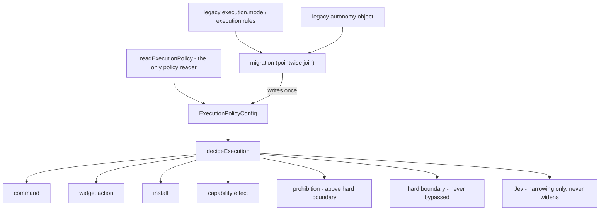

## Outcome

One canonical execution policy now governs every effect surface. `ExecutionPolicyConfig` is the single model, `readExecutionPolicy` is the single reader, and the migration joins the legacy `execution.*` and `autonomy` families without loosening a stricter stored setting.

This is **part of #125** (Phase 1 of 6). It does not close this or any issue.

## This is a declared behavior change, not a refactor

The legacy command path consulted the guardrail and **never opened an approval card** (`node-tools.ts`: *"`guarded` and `auto` differ only in whether the policy layer is consulted. Neither asks a person."*). Canonical `Guarded` asks on every `RISKY_CATEGORIES` entry regardless of `explicitUserIntent`. So command behavior changes for `destructive` / `external-write` / `financial` / `communication` / `media-capture`.

That is the intended behavior already written in `DESIGN.md` §1.3 (Autonomous is the default; Guarded asks before irreversible/external/destructive acts) and restated in `AGENTS.md`. The legacy `guarded` defaults (`DEFAULT_EXECUTION_POLICY`, `DEFAULT_AUTONOMY_SETTINGS.executionPolicy`) and the previous e2e default assertion encoded the drift, not the intended behavior. The behavioral assertion that a command still runs without an approval card under the default policy is preserved.

## How It Works

- **One model, one reader.** `ExecutionPolicyConfig = { mode, rules, guardrails, prohibition }`. `readExecutionPolicy` is the only module that reads policy preferences; widget actions, installs, capability effects and commands all resolve through `decideExecution`.
- **Migration joins the two legacy families pointwise**, not as a merged scalar: mode = most restrictive, denies = union, executes = intersection, `guardrail.enabled` = AND, guardrail classes = union. The falsifiable property is that no tuple is strictly looser than either legacy family.
- **Legacy `deny` becomes a structural prohibition** (`prohibition: "all"`) evaluated **above** `hardBoundary`, rather than an enumerated set of deny rules. An enumerable denial fails open when a new effect category is added, and `hardBoundary` is checked before rules — so a rule-based denial could have been overridden by an app-initiated consent screen. `mode` keeps one meaning: who is asked when the effect is permitted at all.

Precedence, asserted in the parity spec: `prohibition > hard boundary > rules > mode`, with Jev consulted iff `guardrail.enabled && guardClass(effect) ∈ guardrail.classes`.

`AC-6 (stated explicitly, as required):` the command path **does** call `decideExecution`; `policyForEffect` is removed; `decideGuardrailForCommand` is retained only as the narrowing-only Jev judgment stage — a stage inside the canonical policy, not a second authority.

## Architecture / Flow

## Advisor Scope Lock

`--advice` active. kongming returned GO with corrections; 11 of 12 findings were adopted into `plans/260921-1322-125-architecture-consolidation/phase-01-unify-execution-policy.md` ("Advisory corrections", AC-0 to AC-9).

- **Locked in:** canonical policy unification; pointwise migration; structural prohibition above the hard boundary; one reader; host preflight ordering preserved; Jev narrowing-only.
- **Locked out:** a fourth user-facing mode; deleting approval infrastructure; proving external gates by probe or fixture.

## Implementation metadata

- Branch: `architecture-consolidation-unify-policy-confine`
- Plan: `plans/260921-1322-125-architecture-consolidation/plan.md` (phase 01)
- Route: feature (`/ak:cook --tdd`)
- Ship mode: official (stable, default branch `main`)
- Behavior-change ledger: `plans/260921-1322-125-architecture-consolidation/evidence.md`

## Verification

- `pnpm verify` — **PASSED** on this tree by the author: `Test Files 167 passed | 1 skipped (168)`, `Tests 2047 passed | 7 skipped (2054)`. Covers `pnpm invariants`, typecheck, lint and tests.
- Focused policy suites: `execution-policy`, `execution-policy-migration`, `execution-policy-parity`, `command-policy`, `preflight`, `autonomy-settings` — 106 tests green (pre-change baseline: 65).
- Browser e2e is delegated to this PR's CI job; it has not been reproduced locally on this exact commit.

## Acceptance criteria (Phase 1)

- [x] One canonical execution policy governs command, widget, install and capability effects.
- [x] User-facing modes are one coherent set: Autonomous / Guarded / Ask every time (no fourth mode added).
- [x] Legacy `execution.*` and `autonomy` settings migrate without silently loosening a stricter user policy.
- [x] Equivalent effect categories have parity tests across surfaces, plus legacy-vs-canonical cases.
- [x] Host preflight and hard boundaries remain non-bypassable.
- [ ] Task 1.6 (a single settings surface) — **partial**: the "two policies" note is gone and the legacy keys remain only as the compatibility readers the plan permits.

## Pipeline State

- [x] Program plan validated (`ak plan validate` exit 0); red-team resolved
- [x] Advisory checkpoint recorded
- [x] Phase 1 implemented and locally verified (`pnpm verify` green)
- [ ] Phase 1 reviewed and merged
- [ ] Phases 2-6

## Scope guard

This PR **does not** close #93, #2, #3, #4 or #5, and contains no closing keyword for them. Those external gates stay open and are not proven by fixture.
