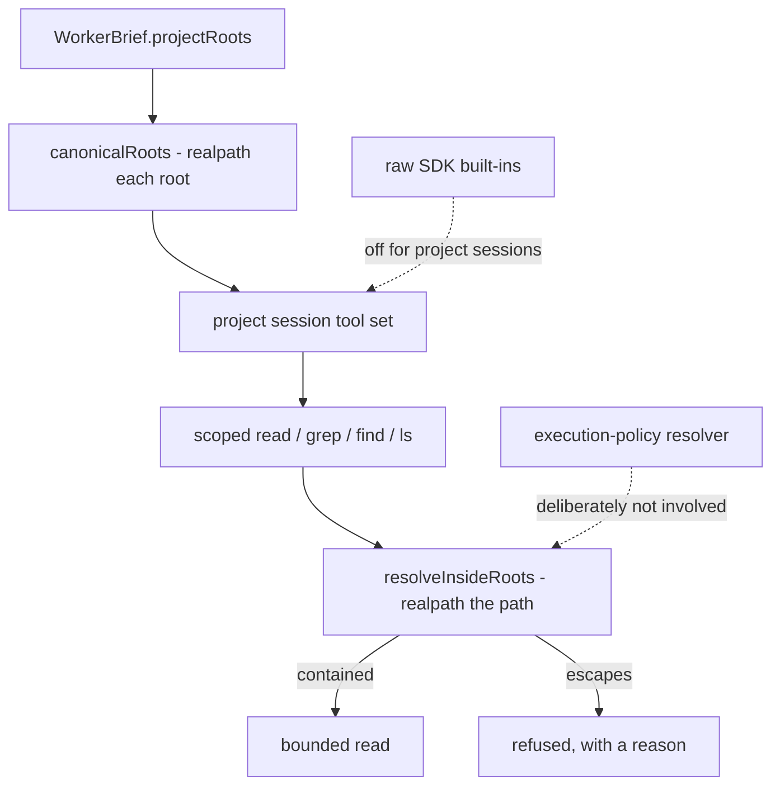

## Outcome

`WorkerBrief.projectRoots` is now a host-enforced filesystem boundary instead of metadata a system prompt was asked to respect. A project session's filesystem surface is ClarkCant's own scoped tools, and every path they touch is canonicalised and checked for containment before anything is read.

Phase 2 of #125. **Does not close this or any related issue.**

## How It Works

- **Canonicalise both sides, then compare.** `scoped-fs.ts` resolves every approved root and every candidate path with `fs.realpath` and tests containment on the *canonical* result. A path that is inside a root until a symlink resolves elsewhere is therefore refused, not followed.
- **The built-ins are replaced for project sessions.** The raw `read`/`grep`/`find`/`ls` built-ins are off on the project-worker route, replaced by ClarkCant-owned scoped equivalents that check containment first, with explicit file-count, output-size and traversal bounds.
- **Containment is not a policy decision.** Path escape is a violation of the host's capability boundary, so it is enforced where the act happens and deliberately does **not** route through the execution-policy resolver.

## The SDK assumption this rests on, now verified rather than assumed

The phase's largest unknown was whether the installed Pi SDK actually lets its built-ins be turned off. The spike settled it: **yes** — `tools` is a hard allowlist consulted when the tool *registry* is built, not a prompt hint, so an omitted built-in is genuinely absent from `session.agent.state.tools` (`sdk.d.ts:43`, `agent-session.js:2110-2158`).

That produced one trap worth stating, because it looks like a simplification: the allowlist gates custom and extension tools too, so passing an empty built-in list on its own would drop the scoped tools along with the built-ins. The concatenation at `real.ts:426` is load-bearing and now carries a comment explaining why.

## Architecture / Flow

## Verification

- `pnpm verify` — **PASSED** on this commit: `Test Files 180 passed | 1 skipped (181)`, `Tests 2192 passed | 7 skipped (2199)`. Covers `pnpm invariants`, typecheck, lint and tests.
- `packages/pi-adapter/test/scoped-fs.spec.ts` — 19 tests on real temporary directories: inside allowed; `..` escape, outside absolute path and outside-resolving symlink refused; symlink resolving *inside* still allowed; multiple roots all honoured.
- `apps/runtime/test/project-session.confinement.spec.ts` — 4 tests: a worker reads a file inside its selected project and **cannot** read a sibling file outside it.
- The adapter's note disclaiming confinement is gone, replaced by a statement these tests make true; `projectRoots[0]` is no longer the only root honoured.
- Browser e2e is delegated to this PR's CI job.

## Acceptance criteria (Phase 2)

- [x] `projectRoots` is an enforced filesystem boundary, not metadata.
- [x] `read`/`grep`/`find`/`ls` equivalents cannot escape via `..`, absolute paths or outside-resolving symlinks.
- [x] Multiple approved roots work.
- [x] Real temporary-filesystem tests prove allow-inside / deny-outside.
- [x] Traversal and output stay bounded; no raw unrestricted Node `fs` primitives are exposed to Pi tools.

## Scope guard

This PR **does not** close #93, #2, #3, #4 or #5, and contains no closing keyword for them. Those external gates stay open and are not proven by fixture.
