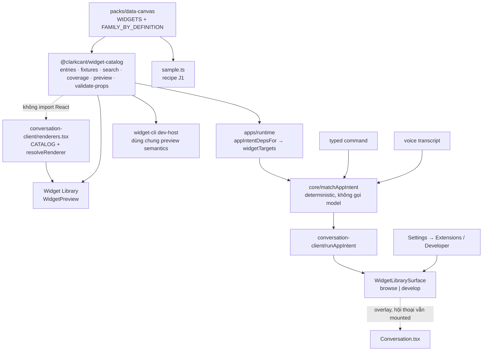

# Widget Library và Widget Lab - thư viện widget trực tiếp

Nguồn: issue [#128](https://github.com/digitopvn/clarkcant/issues/128). Nhánh `feat-ui-add-widget-library-widget-lab-as-a-live`, worktree hiện tại, sạch, `0` commit trên `origin/main` (`e6894c4`), không có plan cũ cho issue này.

Pull request: [#131](https://github.com/digitopvn/clarkcant/pull/131).

## Kết quả cần đạt

ClarkCant có một **Widget Library** mở được từ Settings, chat và voice, cho người dùng xem đúng những widget mà hội thoại thật sự render được, và một **Widget Lab** cho developer soi definition, props, state, events, actions, semantic, sizing, capabilities, fallback cùng viewport/theme/reduced-motion - tất cả trên **cùng một catalog chuẩn** và **cùng renderer production**, không ảnh hưởng vòng đời hội thoại.

## Ràng buộc không thương lượng

1. Giữ mô hình "một hội thoại": không sidebar, không dashboard, không session picker, không thêm điểm điều hướng cấp cao thường trực.
2. Opening/closing library **không** unmount hay reset hội thoại, composer, widget đã ghim, quyền sở hữu live-effect, media, cấu hình model/session, hay voice.
3. Preview built-in **bắt buộc** dùng `resolveRenderer(definitionId)` của catalog production. Không screenshot, không mock, không renderer thứ hai.
4. Không nới lỏng sandbox/trust lane; host sở hữu credential/trust/OS consent.
5. Fixture không được vô tình gọi effect thật, phá huỷ hay ra ngoài.
6. Click, typed command và voice hội tụ qua **cùng** app-intent path; không có nhánh xử lý chuỗi riêng cho voice.
7. Không tạo registry thứ hai có thể lệch khỏi catalog thật.
8. Không có control giả, không placeholder, không hiển thị widget chưa implement như thể chạy được.
9. Motion dùng token/helper sẵn có; reduced-motion luôn thắng; focus hiển thị và được trả lại khi đóng.
10. Nếu đổi invariant UX thì cập nhật DESIGN.md trong cùng thay đổi.

## Phạm vi

Trong phạm vi: Phase 1-6 của issue - canonical catalog + fixture, browse surface, Widget Lab, app intents, hội tụ với `clark widget dev`, provenance installed/local trong giới hạn metadata hiện có, unit test + browser E2E, cập nhật docs, review, ship, merge và theo dõi CI.

Ngoài phạm vi (non-goals của issue): dashboard, sidebar, session picker, Storybook/renderer riêng, chạy React/JS sinh tự động trong tiến trình, nới sandbox custom widget, entry marketplace giả, control không có backend. Thêm nữa: duyệt directory từ xa (remote directory browsing) chỉ được thiết kế chỗ nối, không implement; widget isolated/MCP App không có preview giả.

## Sơ đồ kiến trúc và luồng

## Các bước

1. [Catalog chuẩn và fixture xác định](phase-01-canonical-catalog.md) - một nguồn sự thật cho discovery, fixture, coverage.
2. [Widget Library browse surface](phase-02-browse-surface.md) - overlay trên hội thoại, preview live, search/filter, entry từ Settings.
3. [Widget Lab developer mode](phase-03-widget-lab.md) - detail layout, viewport/theme/reduced-motion, inspector.
4. [App intents widgets.open / widgets.show](phase-04-app-intents.md) - click, typed và voice cùng đường.
5. [Hội tụ dev-host và provenance installed/local](phase-05-devhost-and-provenance.md) - dùng chung ngữ nghĩa preview, nhãn nguồn gốc.
6. [Kiểm chứng, review, ship và merge](phase-06-verify-ship.md) - test, docs, review, PR, CI.

## Ma trận test tổng

| Lớp | Phạm vi | Lệnh |
| --- | --- | --- |
| Unit catalog | registry, fixture, search, coverage | `pnpm exec vitest run packages/widget-catalog/test packages/conversation-client/test/catalog-coverage.spec.ts` |
| Unit contracts/core | schema và matcher app intent | `pnpm exec vitest run packages/contracts/test packages/core/test` |
| Unit client | surface, lifecycle, preview, lab | `pnpm exec vitest run packages/conversation-client/test` |
| Unit cli/host/sdk | dev-host, sandbox, bridge | `pnpm exec vitest run packages/widget-cli/test packages/widget-host/test packages/widget-sdk/test` |
| Browser E2E | journey thật trong Chromium | `pnpm test:e2e` |
| Toàn bộ | định nghĩa done của repo | `pnpm verify` rồi `pnpm verify:full` |

## Tiêu chí chấp nhận

- [ ] ClarkCant có Widget Library tìm thấy được, không thành điểm điều hướng cấp cao thường trực.
- [ ] Mở library không unmount/reset hội thoại.
- [ ] Settings → Extensions mở browse mode; Settings → Developer mở developer mode.
- [ ] Click, typed command và voice hội tụ qua app intents.
- [ ] Preview built-in dùng renderer production; không screenshot/mock.
- [ ] Definition/metadata có nguồn chuẩn rõ ràng; không registry lệch.
- [ ] Mọi widget built-in hiển thị có ít nhất một fixture xác định.
- [ ] Developer mode soi được props/state/events/actions/semantic/fallback.
- [ ] Preview được viewport/theme/reduced-motion.
- [ ] Fixture không thể gây effect thật/ra ngoài/phá huỷ.
- [ ] Bàn phím và layout 320 px dùng được, focus được trả lại.
- [ ] Catalog completeness được test ép buộc.
- [ ] Có browser E2E cho các journey đại diện.
- [ ] `docs/widget-development.md` và tài liệu liên quan được cập nhật.
- [ ] `pnpm verify:full` đạt trên revision cuối; PR review xong; merge vào `main` và CI merge commit xanh.

Phụ thuộc: `gh` có quyền tạo label/PR/merge; Node 22.19+ và pnpm 12 qua Corepack; Chromium đã cài cho Playwright; port 8876/4273 tự do trước `pnpm test:e2e`. Không cần credential provider thật: E2E dùng recipe scripted và fixture, không gọi provider trả phí.

Rollback: mọi thay đổi nằm sau feature branch và một PR; rollback bằng revert PR. Không có migration DB, không ghi đè dữ liệu người dùng.

## Kiểm chứng plan

- `ak plan validate plans/260921-1432-128-widget-library-widget-lab` → `[OK] plans/260921-1432-128-widget-library-widget-lab is a valid plan directory` (exit 0).
- `ak plan parse` → 6 phase, frontmatter `status: pending`.
- Kiểm tra link: mọi link `phase-*.md` trong `plan.md` và mọi link tương đối giữa các file plan đều resolve.
- Đối chiếu codebase cho các giả định chịu lực: `packages/core` không import `data-canvas`, nhưng `packs/data-canvas/src/sample.ts` import `@clarkcant/core` ⇒ **không** được để `core` import `widget-catalog` (vòng phụ thuộc); do đó target của `widgets.show` phải được inject từ `apps/runtime/src/main.ts`. `matchAppIntent(text)` hiện không có tham số deps ⇒ cần thêm tham số options tường minh. `packages/widget-cli` đã phụ thuộc `@clarkcant/core` nên `widget-cli → widget-catalog` không tạo vòng. Không có chỗ nào truy cập `WIDGETS[...]` theo index.
- Đăng ký package mới cần **bốn** chỗ: `vitest.config.ts` (alias), `tsconfig.json` (paths), `tsconfig.web.json` (paths), và `package.json` của consumer. `packages/*/test/**/*.spec.ts` tự nhận test của package mới.

## Red Team Review

### Session — 2026-09-21 (fresh-context, 4 adversarial lenses)

**Phương pháp:** 4 reviewer fresh-context (`code-reviewer`) chạy song song theo `references/red-team-workflow.md`: Security Adversary (Fact Checker), Failure Mode Analyst (Flow Tracer), Assumption Destroyer (Scope Auditor), Scope & Complexity Critic (Contract Verifier). Mỗi reviewer đọc đủ 7 file plan và kiểm chứng bằng `grep`/`read` trên repo tại `e6894c4`. Báo cáo đầy đủ:

- `plans/reports/code-review-260921-1518-widget-library-plan-redteam.md` (Failure Mode)
- `plans/reports/code-review-260921-1518-widget-library-plan-hostile-review.md` (Scope & Complexity)
- `plans/reports/code-review-260921-1518-widget-library-plan-scope-audit.md` (Assumption Destroyer)
- artifact `680bc5ca-..._code-reviewer_output.md` (Security Adversary)

**Ghi chú trung thực về quy trình:** một bản review do tác giả thực hiện trong context (8 finding, 1 Critical) đã được viết vào plan trước đó và **đã bị thay thế** bởi mục này. Bản in-context đó bị dừng quá sớm: fanout fresh-context thực tế **đã hoàn tất** và trả về 30 finding, trong đó có 5 Critical mà bản in-context bỏ sót. Bài học: không được kết luận một lane review "không hội tụ" chỉ vì nó chậm.

**Findings:** 30 (dedupe còn 20 nhóm) — **12 accepted**, 6 accepted-with-modification, 2 rejected.

**Severity breakdown (sau dedupe):** 5 Critical, 9 High, 6 Medium.

| # | Finding (dedupe) | Severity | Lenses | Disposition | Applied To |
| --- | --- | --- | --- | --- | --- |
| R1 | `widgets.show` examples không thể command-shaped: `APP_NOUNS` không có `widget` nên `"hiện widget lịch"`/`"show the calendar widget"` ⇒ `none`; test phase 4 và E2E parity bất khả thi | Critical | Failure, Scope | Accept | Phase 4 |
| R2 | Mở library từ Settings khi `Modal` đang mở: `Modal` gắn listener Escape cấp document + trap Tab, không có kiểm tra lồng nhau ⇒ Escape đóng cả hai, Tab bị trap, 2 dialog `aria-modal`, focus trả về nhầm nút | Critical | Failure | Accept | Phase 2, Phase 6 |
| R3 | Subpath `@clarkcant/widget-catalog/preview` không có trong `exports`; alias vitest là prefix-match nên sẽ rewrite sai subpath | Critical | Assumption | Accept | Phase 1, Phase 3, Phase 5 |
| R4 | Installed/local provenance bất khả thi: `InstalledPackageView` không có definition/fixture/renderer/display name; `packageVersion`/`sourceRef`/`trustLane` không tồn tại (thật là `version`, `source.sourceTier`, `digest`, `lane`); không route nào expose widget definition của package | Critical | Security, Scope | Accept (thu hẹp scope) | Phase 1, Phase 5 |
| R5 | Ma trận test phase 3 không chạy được: repo không có môi trường DOM; AGENTS.md đặt React/a11y assertion ở E2E | Critical | Scope, Failure | Accept | Phase 3 |
| R6 | Đưa `canvas.note@1` vào `WIDGETS` làm tăng vocab tool của model một cách âm thầm (`apps/runtime/src/services.ts` dựng view model-callable từ `CATALOG_WIDGETS`) | High | Scope | Accept | Phase 1 |
| R7 | `coverage.ts` không được issue yêu cầu, không surface nào dùng, và trùng cơ chế coverage sẵn có | High | Scope, Failure | Accept (cắt) | Phase 1 |
| R8 | `clark widget dev --builtin <id>` không chạy được: dev host render facet entry của package, không phải catalog renderer; CLI biến giá trị flag thành package dir | High | Failure, Assumption | Accept (cắt `--builtin`) | Phase 5 |
| R9 | Preview bỏ qua đường resolve dataset của production; E2E gallery/media có thể "đạt" nhờ trạng thái lỗi | High | Failure | Accept | Phase 1, Phase 2, Phase 6 |
| R10 | `client.packages()` không có hợp đồng async (cancel/error/retry/test) | High | Failure | Accept | Phase 5 |
| R11 | Seam `widgetTargets` nằm ở `apps/runtime/src/app-intents.ts` (`AppIntentDeps`), không phải `main.ts` — file không nằm trong ownership; `appIntentRequestSchema`/audit doc không mang được target | High | Assumption | Accept | Phase 4 |
| R12 | Executor: `openWidgetLibrary` phải optional + vào `hostHasCapability` với câu nói tên lý do | Medium | Failure | Accept | Phase 4 |
| R13 | Hợp đồng fixture: `dataset.source` phải khớp union với `RendererDataset.freshness`; map state bắt buộc theo `docs/widget-development.md`; bỏ `narrow` khỏi data state | High | Assumption | Accept | Phase 1 |
| R14 | Theme/reduced-motion của Lab chưa có cơ chế "thật" | High | Failure | Accept | Phase 3 |
| R15 | Container `canvas.overview@1` làm luật fixture và luật "browse chỉ hiện renderable" mâu thuẫn | Medium | Failure | Accept | Phase 1, Phase 2 |
| R16 | Copy `SAMPLE_DATASET` tạo nguồn dataset thứ hai; import không trùng thì vướng invariant | Medium | Scope | Accept (sửa hướng: dùng subpath browser-safe) | Phase 1 |
| R17 | `"exact-pinned dependency"` cho workspace package mâu thuẫn mọi manifest; phải là `workspace:*` + `--frozen-lockfile` | Medium | Assumption | Accept | Phase 1 |
| R18 | Phase 4 mở rộng parameter space bằng regex id mới, lỏng hơn chuẩn; nên tái dùng `capabilityRefSchema` | Medium | Assumption | Accept | Phase 4 |
| R19 | Test `missingRenderer` (phase 2) không viết được theo state contract đã khai; test "lifecycle invariant" không chứng minh được điều nó tên | Medium | Assumption | Accept | Phase 2 |
| R20 | `browser-safety.spec.ts` là bản thay thế yếu cho gate graph đã có | Medium | Assumption | Accept-with-modification (giữ như check phụ, ghi rõ scope) | Phase 1 |

#### Quyết định lớn (decision delta)

1. **R1** — luật shape được nêu tường minh: thêm noun `"widget"` (bare) vào `APP_NOUNS` **và** thêm opener `"hien widget"`/`"show widget"`/`"show me the"` để `COMMAND_OPENERS` chở được câu; test cả hai chiều, gồm negative control `"cho tôi xem widget biểu đồ"` ⇒ `none`.
2. **R2** — chọn **đóng Settings trước khi library mở**. Library là dialog duy nhất đang hoạt động; focus-return target là nút đã mở library (nút `Browse` trong Settings **không** còn tồn tại), nên target là nút gear/entry đã mở Settings. Test phải assert sự hiện diện/vắng mặt của Settings, không chỉ `data-widget-library-mode`.
3. **R3** — `packages/widget-catalog/package.json` khai `"./preview": "./src/preview.ts"`; đăng ký bằng alias **exact-match regex** cho subpath (theo mẫu `data-canvas`/`widget-host/session`), không dùng alias prefix; thêm test mọi specifier `@clarkcant/widget-catalog/*` resolve qua `exports`.
4. **R4** — **cắt installed/local catalog entries khỏi scope**, ghi rõ lý do (không có route expose definition/fixture của package). Phase 5 chỉ còn: (a) hội tụ từ vựng preview + schema fixture, (b) provenance hiển thị trên **danh sách riêng** dựng từ `client.packages()` với đúng field thật (`version`, `source.sourceTier`, `digest`, `lane`), không phải `WidgetCatalogEntry`. Đây là thu hẹp so với issue nhưng đúng tinh thần issue ("initial implementation may focus on built-ins plus already-installed packages") và tránh bịa trust model.
5. **R5** — ma trận test phase 3 tách: Vitest chỉ giữ assertion thuần (reducer/selector: `visibleEntries`, `previewWidthFor`, `themeAttributeFor`, `isControlAvailable`); mọi assertion DOM/a11y chuyển sang Playwright.
6. **R6** — **revert**: `canvas.note@1` **không** vào `WIDGETS`; `widget-catalog` import `NOTE` từ `@clarkcant/data-canvas/sample` (một nguồn sự thật, không đổi vocab tool của model). Family của note do metadata của `widget-catalog` cung cấp, không thêm vào `FAMILY_BY_DEFINITION` (sẽ làm stale-family test fail).
7. **R7** — cắt `src/coverage.ts` và `coverage.spec.ts`. Coverage gia đình là việc của cơ chế sẵn có; issue chỉ nói developer mode *có thể* hiển thị.
8. **R8** — bỏ `--builtin`/`--fixture` khỏi `clark widget dev`; hội tụ giới hạn ở preview reducer + schema fixture, và ghi rõ khác biệt sandbox.

#### Findings bị từ chối

- **"Chuyển hẳn Phase 3 sang DOM-test dependency"** — Reject: AGENTS.md cấm React rendering trong Vitest (`packages/*/test` là node, không DOM) và E2E đã là chỗ đúng. Chọn restate assertion thuần thay vì thêm dependency (đã gộp vào R5).
- **"Cắt luôn browse grid preview cho media để tránh request bên thứ ba"** — Reject một phần: issue yêu cầu preview dùng renderer production, nên media vẫn phải preview được; giữ giải pháp "không mount trong grid, mount ở detail view" (đã có ở phase 2) thay vì cắt hẳn.

### Whole-Plan Consistency Sweep

**Delta đã quét và áp dụng:**

- `phase-01`: revert `canvas.note@1` (không vào `WIDGETS`/`FAMILY_BY_DEFINITION`, import từ `data-canvas/sample`); cắt `coverage.ts`; `exports` có `"./preview"`; alias exact-match; `workspace:*` + `pnpm install --frozen-lockfile`; `dataset.source` khớp `RendererDataset.freshness`; bỏ `narrow` khỏi data state; container ngoài browse; `browser-safety.spec.ts` ghi rõ là check phụ.
- `phase-02`: quyết định đóng Settings trước khi mở library; `missingRenderer` là check lúc render (không phải field state); bằng chứng cho constraint "hội thoại vẫn mounted" là E2E, không phải reducer test; preview truyền dataset map + `imageUrl` resolver theo fixture.
- `phase-03`: tách ma trận test (Vitest thuần + Playwright DOM); cơ chế theme/reduced-motion phải nêu rõ (attribute scoped trên subtree preview) và assert giá trị computed/hành vi.
- `phase-04`: ownership thêm `apps/runtime/src/app-intents.ts`; luật shape tường minh + positive/negative control; tái dùng `capabilityRefSchema`; `openWidgetLibrary?` optional + `hostHasCapability` + câu nói tên lý do; nêu rõ `appIntentRequestSchema`/audit doc cần mang target.
- `phase-05`: cắt `--builtin`; installed provenance thành danh sách riêng từ `client.packages()` với field thật; hợp đồng async (cancel/error/retry/test).
- `phase-06`: E2E assert per-entry (`data-widget-preview="<id>"` và vắng `data-widget-unavailable`); assert Settings mở/đóng khi mở library; journey media/embed ở detail view.

**Mâu thuẫn còn lại:** không còn mâu thuẫn chưa xử lý sau các sửa trên. Hai điểm cần người dùng biết: (1) scope installed/local **bị thu hẹp** so với câu chữ issue (R4) — cần xác nhận khi review PR; (2) `canvas.note@1` vẫn có một nguồn định nghĩa duy nhất nhưng nằm ở `data-canvas/sample.ts` chứ không phải `index.ts`, nên tiêu chí "every built-in has one canonical definition source" đạt theo nghĩa "một nguồn", không theo nghĩa "mọi định nghĩa nằm trong `WIDGETS`".

## Tiến độ triển khai (checkpoint)

Trạng thái: Phase 1-4 (task 1-6) **đã triển khai và kiểm chứng**; Phase 5-6 cùng E2E/docs/review/ship/merge còn lại.

### Đã xong

| Phase | Nội dung | Bằng chứng |
| --- | --- | --- |
| 1 | `packages/widget-catalog/` là lớp discovery chuẩn (registry/fixtures/search/preview/validate-props); `canvas.note@1` có một nguồn định nghĩa duy nhất và **không** vào `WIDGETS` | 40 test catalog + `packs/data-canvas` + `catalog-coverage.spec.ts` PASS |
| 2 | `WidgetLibrarySurface` + gallery + preview dùng `resolveRenderer` production; entry Settings → Extensions; Settings tự đóng trước khi library mở | 13 test reducer + 351 test conversation-client PASS |
| 3 | Widget Lab: props form theo schema, inspector 8 panel, controls fixture/viewport/theme/reduced-motion, pane tiến trên màn hẹp | 13 test `widget-lab.spec.ts` PASS |
| 4 | `widgets.open`/`widgets.show` qua đúng app-intent path; matcher có noun `widget`; runtime inject `widgetTargets`; audit ghi được target | 779 test contracts+core+conversation-client PASS |

**Checkpoint gate:** `pnpm verify` PASS — 172 test file, **2087 test PASS / 7 skip**, 8/8 invariant (gồm `browser-entries-avoid-node-builtins`, 111 module), typecheck và lint sạch.

### Sự cố đã gặp và cách xử lý

- **Invariant `browser-entries-avoid-node-builtins` FAIL** sau khi `widget-catalog` import `@clarkcant/data-canvas/sample` (kéo `@clarkcant/core` → `packages/storage` → `node:sqlite`/`node:crypto` vào bundle browser). Đây đúng là rủi ro R16 mà red-team đã cảnh báo. Đã sửa: `NOTE` được export từ `packs/data-canvas/src/index.ts` (không nằm trong `WIDGETS`), `sample.ts` và `widget-catalog` cùng import từ barrel.
- Ba test có sẵn đã bắt lỗi thật do thay đổi gây ra: read-back của `widgets.show` trùng `widgets.open`; bảng `DOCUMENTED` thiếu hai kind mới; một entry `DOCUMENTED` sai (`"mở widget gallery"` khớp phrase `widget gallery` ⇒ `widgets.open`).

### Cần người dùng quyết định trước task-8

Red-team chứng minh bằng `file:line` rằng **installed/local provenance như issue mô tả là bất khả thi** (R4): `InstalledPackageView` (`packages/conversation-client/src/api.ts:352-363`) không có definition, fixture, renderer hay display name; các field `packageVersion`/`sourceRef`/`trustLane` **không tồn tại** trong repo (thật là `version`, `source.sourceTier`, `digest`, `lane`); và không có route nào expose widget definition của package.

Vì vậy plan đã thu hẹp: Phase 5 chỉ còn (a) hội tụ từ vựng preview + schema fixture với `clark widget dev`, và (b) provenance hiển thị trên **danh sách riêng** dựng từ `client.packages()`, không phải `WidgetCatalogEntry`. Tương ứng task-8 cần được điều chỉnh lại contract, và issue #128 cần một dòng ghi rõ phần installed/local bị hoãn (kèm lý do) thay vì đánh dấu đạt.

Ngoài ra R8: `clark widget dev --builtin <id>` không chạy được (dev host render facet entry của package, không phải catalog renderer), nên task-7 cũng cần điều chỉnh thành "chỉ hội tụ preview reducer + fixture schema".

## Regression do chính phase 4 gây ra, đã tìm và sửa

`pnpm verify:full` bắt được một lỗi thật mà review tay đã bỏ sót: `apps/web/e2e/widget.spec.ts:194`
("a gallery widget draws pictures the node actually holds") fail, và error-context cho thấy câu trả lời là
**"Tôi chưa hiểu câu lệnh đó"** — tức app-intent từ chối, không phải model trả lời.

**Nguyên nhân.** `COMMAND_OPENERS` trong `packages/core/src/app-intents.ts` được suy ra từ **mọi** phrase:
`PHRASES.map((entry) => entry.phrase.split(" ").slice(0, 2).join(" "))`. Phase 4 thêm phrase
`"thu vien widget"`, và nó đóng góp opener `"thu vien"`; `"mo thu vien widget"` đóng góp `"mo thu"`.
`isAppCommandShaped` chấp nhận mọi câu bắt đầu bằng opener đó, nên `"thư viện ảnh"` và `"mở thư viện ảnh"`
— yêu cầu công việc, phải tới agent — trở thành command-shaped, không khớp phrase nào, và bị từ chối.

**Sửa.** `COMMAND_OPENERS` chỉ suy ra từ phrase không thuộc `widgets.open`/`widgets.show`; bỏ phrase
`"thu vien widget"` (không có động từ mở đầu thì nó không command-shaped, giữ lại là một dòng sai trong bảng).
Câu về widget vẫn được shape bằng luật "control verb + noun" vì `"widget"` đã ở `APP_NOUNS` và
`"mở"`/`"hiện"`/`"show"` ở `CONTROL_VERBS`. Kèm 4 test đơn vị ghim đúng nguyên nhân (không phải triệu chứng).

**Kiểm chứng.** 31 test app-intent PASS; `playwright test apps/web/e2e/widget.spec.ts apps/web/e2e/widget-library.spec.ts`
→ **12 passed** (gallery 2.9s, hết timeout).

**Bài học.** Một bảng suy ra từ dữ liệu khác sẽ âm thầm nới phạm vi khi thêm dữ liệu. Test E2E có sẵn của repo
là thứ bắt được nó; đây cũng là lý do task-11 bắt buộc chạy `verify:full` chứ không chỉ unit test.
