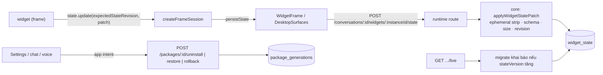

# State bền cho widget bên thứ ba và vòng đời package

Nguồn: phân tích trong phiên làm việc về cách kiến trúc quản lý state widget (không có issue riêng). Nhánh `claude/widget-state-management-analysis-xb9zp6`.

## Kết quả cần đạt

Một widget cách ly (isolated-app) do bên thứ ba viết có **state bền thật** trong SQLite của node: ghi qua bridge được host kiểm schema, giới hạn kích thước, kiểm revision lạc quan và chỉ báo thành công khi node đã commit. State cũ được **migrate khai báo, do host chạy** khi `stateVersion` tăng; migrate hỏng thì giữ nguyên dữ liệu, khoá ghi và nói ra lựa chọn phục hồi. Người dùng **gỡ, khôi phục và quay về bản trước** của một package từ Settings, chat và voice qua cùng một đường app-intent; gỡ không xoá dữ liệu. Capability đang chờ duyệt có UI do host sở hữu. `clark widget publish` từ chối phiên bản vi phạm quy tắc §20.

## Quyết định cho các câu hỏi còn mở

1. **State bền vs state xem (view state).** Definition khai báo `ephemeralStateKeys`: các key xem cục bộ (filter, zoom, lựa chọn) không bao giờ được ghi xuống node, host bỏ chúng trước khi validate/persist; mọi key khác là state bền. Mặc định (không khai báo) là mọi key bền — an toàn cho dữ liệu người dùng hơn là mất dữ liệu vì quên khai báo.
2. **Migration khai báo, host chạy.** `stateMigrations` là danh sách bước `{from, to, ops}` với tập op đóng (`rename`, `default`, `remove`, `map`). Không có mã migrate chạy trong frame: host là nơi duy nhất có dữ liệu và transaction, và code của widget không được chạm vào state chưa kiểm schema.
3. **Gỡ giữ dữ liệu.** Gỡ = supersede generation đang chạy (row giữ lại), instance chuyển `offline`, `widget_state` và snapshot giữ nguyên. **Không** có nút "xoá dữ liệu" vì chưa có action xoá thật đã thiết kế (không thêm control giả). "Tắt" (disable) không tách thành control riêng: gỡ đã khả hồi — **Khôi phục** kích hoạt lại đúng generation vừa gỡ, không tải lại gì.
4. **Quay về (rollback) do người dùng chọn.** Kích hoạt lại generation bị thay gần nhất. State đã migrate lên version cao hơn định nghĩa cũ thì widget mở ở chế độ chỉ đọc kèm lý do — không có migrate xuống.
5. **Grant và `invocationPreflight`.** Grant của một widget package là quyền cho *frame* xin host một capability, không phải một executor. Đăng ký nó vào registry sẽ khiến task dispatch tin rằng có thứ chạy được trong khi không có gì chạy — tức là bịa trạng thái quyền. Vì vậy host chạy `invocationPreflight` trên từng capability đã cấp khi mount và **chỉ broker capability đã cấp và sẵn sàng**; capability đã cấp nhưng chưa sẵn sàng được báo ra kèm lý do. V08 vẫn nêu đúng phần còn thiếu.
6. **Cửa sổ tách rời.** Cửa sổ detached hiện chỉ vẽ composition; frame cách ly chưa detach được, nên relay state qua cửa sổ tách rời không có bề mặt để nối và được ghi là khoảng trống, không giả vờ.

## Ràng buộc không thương lượng

1. Migration đã áp dụng không sửa; thêm migration mới nếu cần.
2. Frame không có token, không có route riêng: mọi lần ghi đi qua host (`WidgetFrame`) và route của node.
3. Không báo state đã lưu trước khi node commit; xung đột trả STALE và giữ bản nháp của widget.
4. Revision instance và revision state là hai con số khác nhau, không dùng lẫn.
5. Không control giả; lỗi nói cái gì hỏng, cái gì được giữ, người dùng làm được gì.
6. Settings là bề mặt phụ; đóng/mở giữ nguyên hội thoại; focus trả về khi đóng.
7. Click, câu gõ và voice đi cùng một app-intent path.
8. Nhãn lane native Pi và widget cách ly khác nhau.

## Phạm vi

Trong phạm vi: phase 1–5 dưới đây, unit test, e2e cho bề mặt Settings, cập nhật `docs/widget-development.md`, `docs/conformance-traceability.md` (chỉ nâng trạng thái khi có test), `docs/manifest.json`.

Ngoài phạm vi: registry từ xa / nộp directory thật, runtime MCP Apps, xoá dữ liệu widget, migrate xuống, detach frame cách ly.

## Sơ đồ

## Các bước

| Phase | Nội dung | Trạng thái |
|---|---|---|
| [phase-01](phase-01-durable-widget-state.md) | State bền qua bridge, tách revision | đang làm |
| [phase-02](phase-02-declarative-state-migration.md) | Migration khai báo do host chạy, conformance chạy thật | chờ |
| [phase-03](phase-03-package-uninstall-restore-rollback.md) | Gỡ / khôi phục / quay về: route, Settings, app intent | chờ |
| [phase-04](phase-04-capability-approvals-ui.md) | UI duyệt capability đang chờ, grant ∩ preflight | chờ |
| [phase-05](phase-05-publish-version-rules-and-ship.md) | Publish áp quy tắc §20, docs, verify, PR | chờ |

## Ma trận test tổng

| Hành vi | Test |
|---|---|
| Ghi state sau init với instance revision ≠ 0 không bị STALE | `packages/widget-sdk/test/runtime.spec.ts`, `packages/widget-host/test/session.spec.ts` |
| State chỉ tăng revision khi node xác nhận; xung đột giữ nháp | `packages/widget-host/test/session.spec.ts` |
| Schema, kích thước, ephemeral key, revision ở core | `packages/core/test/widget-state-patch.spec.ts` |
| Route ghi state: owner, instance offline, migrate hỏng | `apps/runtime/test/widget-state-route.spec.ts` |
| Migration khai báo chạy/hỏng/không đủ bước | `packages/core/test/widget-state-migration.spec.ts` |
| Conformance chạy migration trên fixture | `packages/widget-cli/test/conformance.spec.ts` |
| Gỡ giữ state, instance offline; khôi phục; quay về | `packages/core/test/package-uninstall.spec.ts`, `apps/runtime/test/package-lifecycle-route.spec.ts` |
| Settings: gỡ/khôi phục/quay về, approval đang chờ | `apps/web/e2e/package-lifecycle.spec.ts` |
| Publish từ chối đổi stateSchema/definition không bump major | `packages/widget-cli/test/conformance.spec.ts` |
